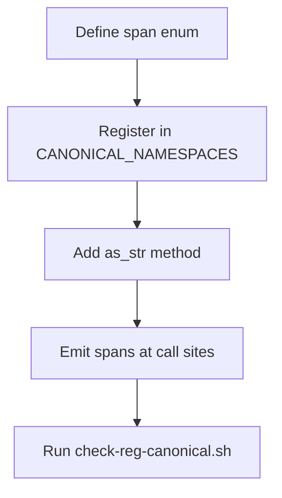

# hkask-regulation — How-to: Add a New Span Namespace

This guide shows how to add a new `reg.*` span namespace for a new
subsystem. Every span namespace must be registered in
`CANONICAL_NAMESPACES` to pass the CI check.

## Source citations

| Symbol | Location |
|--------|----------|
| `QaSpan` enum (reference pattern) | `kask/crates/hkask-regulation/src/qa_span.rs:13` |
| `CANONICAL_NAMESPACES` check | `kask/crates/hkask-regulation/src/qa_span.rs:85` |
| `RegulationLedger` | `kask/crates/hkask-regulation/src/runtime.rs:405` |
| CI check script | `scripts/check-reg-canonical.sh` |

## Procedure

<!-- DIAGRAM_ALIGNMENT
id: DIAG-DIA-REG-004
verified_date: 2026-07-27
verified_against: kask/crates/hkask-regulation/src/qa_span.rs:13,85; kask/crates/hkask-regulation/src/runtime.rs:405
status: VERIFIED
-->

### Step 1: Define the span enum

Create a new file `src/<subsystem>_span.rs` with an enum whose variants
represent the span types. Follow the pattern in `qa_span.rs:13`.

### Step 2: Register in CANONICAL_NAMESPACES

Add the namespace string to the `CANONICAL_NAMESPACES` set. The
`as_str()` method must return a string that matches a
`CANONICAL_NAMESPACES` entry, enforced by a debug assertion at
`qa_span.rs:85`.

### Step 3: Emit spans at call sites

Call the span emission at the points where the subsystem performs
observable actions. The `RegulationLedger` (`runtime.rs:405`) records the
spans.

### Step 4: Run the CI check

Run `scripts/check-reg-canonical.sh` to verify the namespace is registered.

## See also

- [hkask-regulation Reference](./reference.md): class diagram of the ledger.
- [hkask-regulation Tutorial](./tutorial.md): reading a Regulation span.

---

[^conant-ashby]: Conant, R. C., & Ashby, W. R. (1970). *Every good regulator of a control system must be a model of that system.* International Journal of Systems Science, 1(2), 89-97. <https://www.tandfonline.com/doi/abs/10.1080/00207727008902020>.
