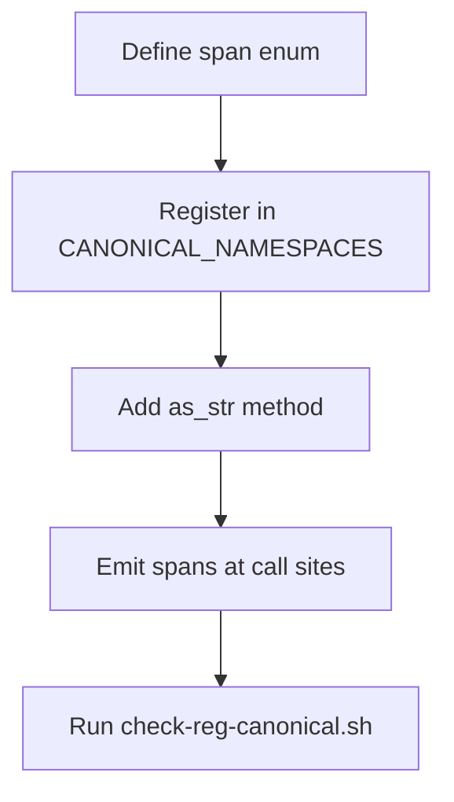

# hkask-regulation — How-to: Add a New Span Namespace

This guide shows how to add a new `reg.*` span namespace for a new
subsystem. Every span namespace must be registered in
`CANONICAL_NAMESPACES` (in `hkask-types/src/event.rs`) to pass the CI check
enforced by `scripts/check-reg-canonical.sh`.

## Source citations

| Symbol | Location |
|--------|----------|
| `QaSpan` enum (reference pattern) | `kask/crates/hkask-regulation/src/qa_span.rs:13` |
| `CANONICAL_NAMESPACES` registry | `kask/crates/hkask-types/src/event.rs` |
| `RegulationLedger` | `kask/crates/hkask-regulation/src/runtime.rs:405` |
| CI check script | `kask/scripts/check-reg-canonical.sh` |

## Procedure

<!-- DIAGRAM_ALIGNMENT
id: DIAG-DIA-REG-004
verified_date: 2026-07-29
verified_against: kask/crates/hkask-regulation/src/qa_span.rs:13; kask/crates/hkask-types/src/event.rs; kask/crates/hkask-regulation/src/runtime.rs:405; kask/scripts/check-reg-canonical.sh
status: VERIFIED
-->

### Step 1: Define the span enum

Create a new file `src/<subsystem>_span.rs` with an enum whose variants
represent the span types. Follow the pattern in `qa_span.rs:13` — each
variant maps to a `reg.<subsystem>.<event>` string via `as_str()`, and the
enum implements `ObservableSpan`.

### Step 2: Register in CANONICAL_NAMESPACES

Add the namespace string to the `CANONICAL_NAMESPACES` set in
`kask/crates/hkask-types/src/event.rs`. The `as_str()` method must return a
string that is canonical (registered directly or via an ancestor by
dot-trimming). The `qa_span_namespaces_are_canonical` test
(`qa_span.rs:80`) asserts this invariant for `QaSpan`; replicate the test
for the new enum.

### Step 3: Emit spans at call sites

Call the span emission at the points where the subsystem performs
observable actions. The `RegulationLedger` (`runtime.rs:405`) records the
spans via `publish_event`, which fans out to `LedgerObserver`s whose
`interest_mask` matches the span's namespace.

### Step 4: Run the CI check

Run `bash scripts/check-reg-canonical.sh` from the `kask/` directory. The
script scans both Rust code (`.rs`) and Jinja2 templates (`.j2`) for
`reg.*` tracing targets and verifies each is canonical. Exit code 0 means
every reference is canonical; exit code 1 means a non-canonical reference
was found.

## See also

- [hkask-regulation Reference](./reference.md): class diagram of the ledger.
- [hkask-regulation Tutorial](./tutorial.md): reading a Regulation span.

---

[^conant-ashby]: Conant, R. C., & Ashby, W. R. (1970). *Every good regulator of a control system must be a model of that system.* International Journal of Systems Science, 1(2), 89-97. <https://www.tandfonline.com/doi/abs/10.1080/00207727008902020>.
