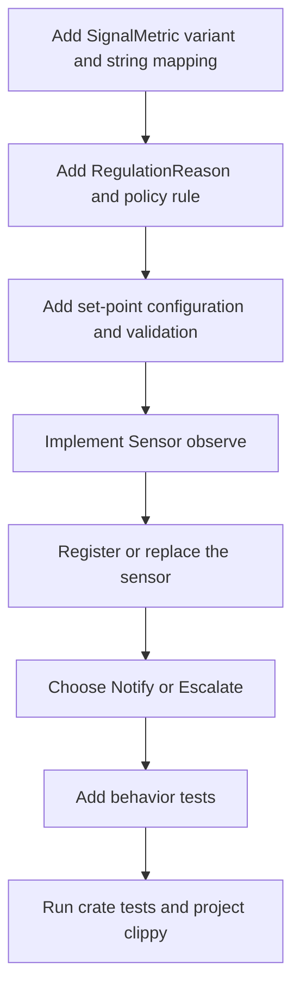

# hkask-regulation — How-to: Add a Regulation Sensor

Use this guide to add one observable metric to the Cybernetics Loop. A sensor
produces a current `Signal`; policy compares that signal with a set-point and
chooses one truthful central disposition: `Notify` or `Escalate`. The sensor
interface separates domain observation from the fitting loop, following the
extractor separation associated here with Fermi's measurement practice.[^fermi]

## Current extension points

| Extension point | Current location |
|---|---|
| `Sensor` trait | `kask/crates/hkask-regulation/src/sensor_provider.rs:27-35` |
| `SensorBus` registry | `kask/crates/hkask-regulation/src/sensor_provider.rs:39-71` |
| `SignalMetric` | `kask/crates/hkask-regulation/src/loops/signals.rs:14-99` |
| `Signal` and `Deviation` | `kask/crates/hkask-regulation/src/loops/signals.rs:227-293` |
| `RegulationPolicy` | `kask/crates/hkask-regulation/src/regulation_policy.rs:66-102` |
| `SetPoints` | `kask/crates/hkask-regulation/src/set_points.rs:186-330` |
| Sensor wiring | `kask/crates/hkask-regulation/src/cybernetics_loop.rs:231-279` |
| Central dispositions | `kask/crates/hkask-regulation/src/loops/actions.rs:141-160` |

## Procedure



<!-- DIAGRAM_ALIGNMENT
id: DIAG-REG-002
verified_date: 2026-09-15
verified_against: kask/crates/hkask-regulation/src/sensor_provider.rs:27-71; kask/crates/hkask-regulation/src/cybernetics_loop.rs:231-279; kask/crates/hkask-regulation/src/loops/signals.rs:14-99,227-293; kask/crates/hkask-regulation/src/regulation_policy.rs:66-102; kask/crates/hkask-regulation/src/loops/actions.rs:141-160; kask/crates/hkask-regulation/src/set_points.rs:186-330
status: VERIFIED
-->

### 1. Add the metric identity

Add a variant to `SignalMetric` and its stable snake-case mapping in `as_str()`
(`kask/crates/hkask-regulation/src/loops/signals.rs:14-112`). If the metric can
arrive by name, update `from_str_name()` in the same file. The stable identity is
used by observations, policy matching, and impact checks.

### 2. Add the reason and policy rule

Add a `RegulationReason` variant and its wire string
(`kask/crates/hkask-regulation/src/regulation_policy.rs:12-63`). Add one
`RegulationRule` to `RegulationPolicy::default()` with the metric, deviation
direction, target, reason, and an `ActionType`
(`kask/crates/hkask-regulation/src/regulation_policy.rs:66-102,112-349`).

Choose only:

- `Notify` for an informational observation that requires no intervention.
- `Escalate` for an evidence-bearing condition requiring Curation or human review.

Do not add an action label without an implemented handler. Automatic control
belongs in a target-local controller with a typed observation or receipt seam back
to Regulation. The implemented central action enum is exactly
`Escalate | Notify` (`kask/crates/hkask-regulation/src/loops/actions.rs:141-148`).

### 3. Add the set-point

Add the field to `SetPoints` and `SetPointsConfig`, declare its default once as a
`DEFAULT_*` constant, map it in `from_config`, and add range or ordering checks in
`validate()` when applicable
(`kask/crates/hkask-regulation/src/set_points.rs:10-114,122-227,245-459`).

### 4. Implement `Sensor::observe`

Implement `Sensor` in `kask/crates/hkask-regulation/src/sensor_provider.rs`.
Return healthy and degraded current observations; return `None` only when no
current observation is available. Healthy readings are required so durable
conditions can later be reconciled as recovered. `Signal::new` stamps the
observation time (`kask/crates/hkask-regulation/src/loops/signals.rs:227-247`).

For a source exposing several independent conditions, use one sensor identity per
metric so one deficit cannot hide another metric's recovery.

### 5. Wire the sensor

For a startup-stable source, register the sensor in `CyberneticsLoop::build`
(`kask/crates/hkask-regulation/src/cybernetics_loop.rs:231-279`). For a source
that can be rewired after startup, replace the provider by metric identity through
`SensorBus::replace` rather than registering a duplicate
(`kask/crates/hkask-regulation/src/sensor_provider.rs:52-71`).

### 6. Pin the behavior

Add tests that prove:

1. healthy and deviating values produce the expected signal/deviation behavior;
2. the policy emits exactly one intended `Notify` or `Escalate` disposition; and
3. the disposition reaches its implemented observation or review path.

Run from the repository root:

```sh
cargo test -p hkask-regulation
./script/clippy
```

## Wiring checklist

- [ ] Metric variant and stable string mappings
- [ ] Reason variant and policy rule
- [ ] Set-point default, config mapping, and validation
- [ ] Healthy and degraded `observe()` results
- [ ] Static registration or metric-keyed replacement
- [ ] `Notify` or Curation-targeted `Escalate`
- [ ] Behavior tests and validation commands

## See also

- [Why Regulation separates observation, advice, and local control](./explanation.md)
- [hkask-regulation reference](./reference.md)

---

[^fermi]: Fermi, E. (1946). *Lectures on neutrons.* In J. Orear, A. H. Rosenfeld, & R. A. Schluter (Eds.), *Nuclear Physics* (1950 ed.). University of Chicago Press.
