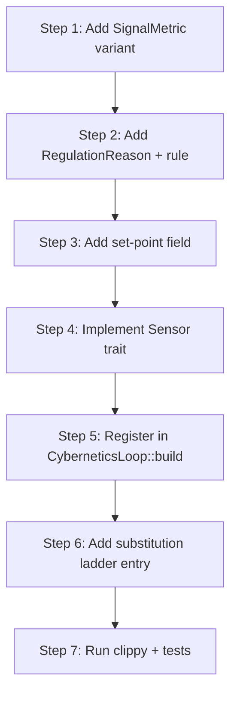

# hkask-regulation — How-to: Add a Regulation Sensor

This guide shows how to add a new metric sensor to the Cybernetics Loop.
Sensors are the afferent side of the homeostatic loop: each `Sensor`
implementation produces one `SignalMetric` per tick, which `compute()`
matches against `RegulationPolicy` rules to produce `RegulatoryAction`s.

The `Sensor` trait (`sensor_provider.rs:27`) follows the Fermi Extractor
pattern — domain extraction is separated from the fitting loop, so each
metric gets its own implementation registered with a `SensorBus`
(`sensor_provider.rs:39`).

## Source citations

| Symbol | Location |
|--------|----------|
| `Sensor` trait | `kask/crates/hkask-regulation/src/sensor_provider.rs:27-30` |
| `SensorBus` (per-loop registry) | `kask/crates/hkask-regulation/src/sensor_provider.rs:39` |
| `SensorBus::register` | `kask/crates/hkask-regulation/src/sensor_provider.rs:52` |
| `SensorBus::sense_all` | `kask/crates/hkask-regulation/src/sensor_provider.rs:57` |
| `EnergyBudgetSensor` (reference impl) | `kask/crates/hkask-regulation/src/sensor_provider.rs:79` |
| `VarietySensor` (reference impl) | `kask/crates/hkask-regulation/src/sensor_provider.rs:126` |
| `CyberneticsLoop::build` (sensor wiring) | `kask/crates/hkask-regulation/src/cybernetics_loop.rs:231,248-279` |
| `SignalMetric` enum | `kask/crates/hkask-regulation/src/loops/signals.rs:14` |
| `Signal` struct | `kask/crates/hkask-regulation/src/loops/signals.rs:227` |
| `RegulationPolicy::default` (rules) | `kask/crates/hkask-regulation/src/regulation_policy.rs:119` |
| `SetPoints` (set-point values) | `kask/crates/hkask-regulation/src/set_points.rs:186` |

## Procedure



<!-- DIAGRAM_ALIGNMENT
id: DIAG-REG-002
verified_date: 2026-08-31
verified_against: kask/crates/hkask-regulation/src/sensor_provider.rs:27,39,52,57,79,126; kask/crates/hkask-regulation/src/cybernetics_loop.rs:231,248-279; kask/crates/hkask-regulation/src/loops/signals.rs:14,227; kask/crates/hkask-regulation/src/regulation_policy.rs:119; kask/crates/hkask-regulation/src/set_points.rs:186
status: VERIFIED
-->

### Step 1: Add a `SignalMetric` variant

Add the new metric to `SignalMetric` (`loops/signals.rs:14`) and its
snake_case string to `as_str()` (`loops/signals.rs:100`). The string is used
as the stagnation-detector key and in `LoopMetrics::from_cycle` fidelity
matching (`loops/core.rs:241`).

### Step 2: Add a `RegulationReason` and rule

Add a variant to `RegulationReason` (`regulation_policy.rs:18`) and its
`as_str()` mapping (`regulation_policy.rs:49`). Then add a `RegulationRule`
to `RegulationPolicy::default()` (`regulation_policy.rs:119`) that matches
the new metric and direction, with a `ProposedAction`
(`regulation_policy.rs:85`) naming the `ActionType` to propose. The
compiler verifies that every policy-table entry has a corresponding dispatch
arm — see the test `build_regulation_action_produces_action_for_all_new_reasons`
(`cybernetics_loop/cycle.rs:1553`).

### Step 3: Add a set-point field

Add the set-point to `SetPoints` (`set_points.rs:186`), its `Default`
(`set_points.rs:349`), the `SetPointsConfig` mirror (`set_points.rs:298`),
the `from_config` mapping (`set_points.rs:389`), and a `validate()` check
(`set_points.rs:482`) if the value has range constraints. Add a
`DEFAULT_*` constant near the top of the file (`set_points.rs:13` onward)
so the default is declared once.

### Step 4: Implement the `Sensor` trait

Create the sensor in `sensor_provider.rs`, following `EnergyBudgetSensor`
(`sensor_provider.rs:79`) or `VarietySensor` (`sensor_provider.rs:126`).
The trait requires:

- `async fn sense(&self) -> Option<Signal>` — return `None` when the metric
  is healthy; return `Some(Signal::new(source, metric, value, set_point))`
  when it deviates.
- `fn metric(&self) -> Option<SignalMetric>` — return `Some(...)` for
  catalog indexing.
- `fn name(&self) -> &str` — override only if the type name is unclear.
- `fn loop_id(&self) -> Option<LoopId>` — return `Some(LoopId::Cybernetics)`.

The `Signal::new` constructor (`loops/signals.rs:236`) stamps the signal
with `chrono::Utc::now()`.

### Step 5: Register in `CyberneticsLoop::build`

In `CyberneticsLoop::build()` (`cybernetics_loop.rs:231`), inside the
`sensor_registry` block (`cybernetics_loop.rs:248-279`), add:

```rust
registry.register(Arc::new(YourSensor::new(/* set_point */)));
```

The registry is wrapped in `Arc<SensorBus>` and stored on the loop
(`cybernetics_loop.rs:193`). `sense()` calls
`self.sensor_registry.sense_all(LoopId::Cybernetics)`
(`cybernetics_loop/cycle.rs:264`).

Also add the metric to the `SENSED` list in the blind-metric warn block
(`cybernetics_loop.rs:281-309`): the loop warns at startup about policy
rules whose metrics have no sensor — a variety deficit on the sensing side
per Ashby's Law. Leaving your metric out of `SENSED` after registering it
makes the warn lie.

### Step 6: Add a substitution ladder entry

Add the metric to `default_substitution_ladder` (`regulation_policy.rs:589`).
For regulated metrics, return an ordered `&[ActionType]` slice (e.g.,
`&[Throttle, Calibrate, Escalate]`). For observational metrics (Notify
only), return `&[]`.

### Step 7: Run clippy and tests

From the `kask/` directory:

```sh
./script/clippy
cargo test -p hkask-regulation
```

Per the project `.rules`, use `./script/clippy` instead of `cargo clippy`.
Add a unit test in `sensor_provider.rs` that constructs the sensor, calls
`sense()`, and asserts the returned `Signal` carries the expected metric
and a value that crosses the set-point.

## Wiring checklist

- [ ] `SignalMetric` variant + `as_str()` entry
- [ ] `RegulationReason` variant + `as_str()` entry
- [ ] `RegulationRule` in `RegulationPolicy::default()`
- [ ] `SetPoints` field + `Default` + `SetPointsConfig` + `from_config` + `validate()`
- [ ] `Sensor` impl with `sense()`, `metric()`, `loop_id()`
- [ ] `register()` call in `CyberneticsLoop::build`
- [ ] `SENSED` list entry in the blind-metric warn block
- [ ] `default_substitution_ladder` entry
- [ ] Unit test in `sensor_provider.rs`

## See also

- [hkask-regulation Reference](./reference.md): class diagram of the
  sensor bus and loop.
- [hkask-regulation Tutorial](./tutorial.md): reading a regulation cycle.
- [hkask-regulation Explanation](./explanation.md): why sensors are
  pluggable.

---

[^fermi]: Fermi, E. (1946). *Lectures on neutrons.* In J. Orear, A. H. Rosenfeld, & R. A. Schluter (Eds.), *Nuclear Physics* (1950 ed.). University of Chicago Press. The "Fermi Extractor" pattern is named after Fermi's separation of data extraction from the fitting loop in his neutron-diffusion work.
