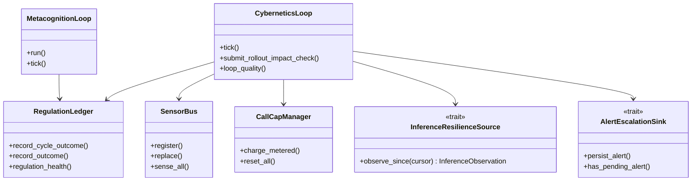
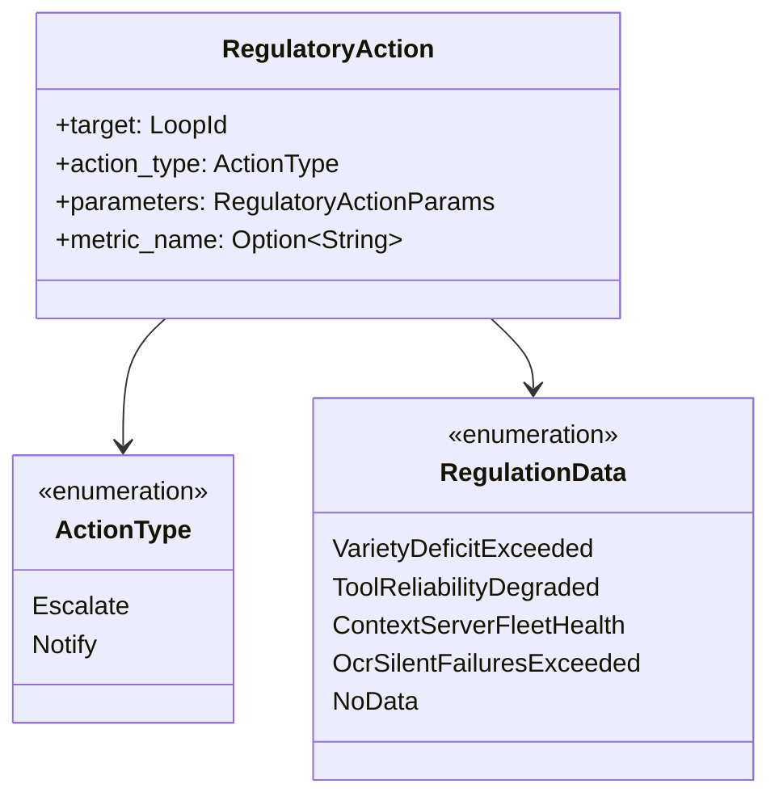

# hkask-regulation — Reference

`hkask-regulation` provides the central homeostatic loop, process-global ledger,
per-agent call caps, algedonic escalation, metacognition, sensors, policy, and the
typed inference-resilience observation seam. Its design is constrained by Ashby's
Law of Requisite Variety.[^ashby]

## Module inventory

The crate root declares the current inventory at
`kask/crates/hkask-regulation/src/hkask_regulation.rs:9-24`.

| Module | Responsibility | Evidence |
|---|---|---|
| `algedonic` | runtime alerts and escalation/email sink traits | `kask/crates/hkask-regulation/src/algedonic.rs:22-102` |
| `cybernetics_loop` | sense→compare→compute→act→verify orchestration | `kask/crates/hkask-regulation/src/cybernetics_loop.rs:142-202,646-703` |
| `dampener` | directive deduplication and stagnation detection | `kask/crates/hkask-regulation/src/dampener.rs:100-110,231-263` |
| `energy` | per-agent governed-call caps | `kask/crates/hkask-regulation/src/energy.rs:26-134` |
| `inference_resilience` | typed snapshots, receipts, and observation source | `kask/crates/hkask-regulation/src/inference_resilience.rs:8-80` |
| `metacognition` | health observation of the regulator itself | `kask/crates/hkask-regulation/src/metacognition.rs:88-205` |
| `regulation_policy` | metric-to-disposition rules | `kask/crates/hkask-regulation/src/regulation_policy.rs:12-102` |
| `set_points` | defaults, configuration, loading, and validation | `kask/crates/hkask-regulation/src/set_points.rs:10-114,122-227,245-504` |
| `loops` | shared loop, signal, deviation, and action types | `kask/crates/hkask-regulation/src/loops.rs:9-18` |
| `sensor_provider` | sensor trait, registry, and built-in sensors | `kask/crates/hkask-regulation/src/sensor_provider.rs:27-71` |
| `strategy_evaluator` | evidence-based strategy scoring | `kask/crates/hkask-regulation/src/strategy_evaluator.rs:16-104` |
| `system_simulator` | moving-average metric prediction | `kask/crates/hkask-regulation/src/system_simulator.rs:16-66` |
| `runtime` | ledger, variety/outcome trackers, and event sink | `kask/crates/hkask-regulation/src/runtime.rs:52-124,140-302,380-609` |

## Public surface

The crate root re-exports its supported cross-crate surface at
`kask/crates/hkask-regulation/src/hkask_regulation.rs:25-50`.

| Cluster | Public items |
|---|---|
| Alerts | `AlertEmailSink`, `AlertEscalationSink`, `AlertPersistError`, `AlertQueueOutcome`, `RuntimeAlert` |
| Loop | `CyberneticsLoop`, `RolloutEventError`, `RolloutEventSource`, `CurationInput`, `Signal` |
| Loop views | `DistinctionState`, `LivenessTrust`, `LoopFailureDistinctions`, `LoopModel`, `LoopView`, `OutcomeTrust`, `Reading`, `SenseReading`, `StageActions`, `TriggerOrigin` |
| Call caps | `CallMeterOutcome`, `DEFAULT_RUNAWAY_CALL_CEILING` |
| Inference resilience | `InferenceCircuitState`, `InferenceInterventionKind`, `InferenceInterventionReceipt`, `InferenceObservation`, `InferenceObservationError`, `InferencePermanentFailureKind`, `InferencePermanentFailureReceipt`, `InferenceResilienceSource`, `InferenceSnapshot` |
| Metacognition | `AlertEvent`, `AlertSink`, `HealthSnapshot`, `MetacognitionLoop` |
| Runtime | `NoopEventSink`, `OBSERVATION_WINDOW_SECS`, `RegulationLedger` |
| Sensor seams | `ContextServerHealthSource`, `MemoryHealthSource`, `OcrHealthError`, `OcrHealthSource` |
| Set-points and alert identity | `SetPoints`, `load_set_points`, `DEFAULT_VARIETY_MAX_DEFICIT`, `alert_condition` |

## Responsibility map

<!-- DIAGRAM_ALIGNMENT
id: DIAG-REG-003
verified_date: 2026-09-15
verified_against: kask/crates/hkask-regulation/src/cybernetics_loop.rs:142-202,609-703; kask/crates/hkask-regulation/src/runtime.rs:498-609; kask/crates/hkask-regulation/src/sensor_provider.rs:27-71; kask/crates/hkask-regulation/src/energy.rs:131-267; kask/crates/hkask-regulation/src/inference_resilience.rs:59-80; kask/crates/hkask-regulation/src/metacognition.rs:172-342; kask/crates/hkask-regulation/src/algedonic.rs:84-102
status: VERIFIED
-->

## Central dispositions

`ActionType` is exactly:

<!-- DIAGRAM_ALIGNMENT
id: DIAG-REG-004
verified_date: 2026-09-15
verified_against: kask/crates/hkask-regulation/src/loops/actions.rs:12-43,76-148
status: VERIFIED
-->

| Disposition | Implemented behavior | Evidence |
|---|---|---|
| `Notify` | Logs an informational observation and returns without incident routing | `kask/crates/hkask-regulation/src/cybernetics_loop/cycle.rs:542-550` |
| `Escalate` | Requires target `LoopId::Curation`; otherwise rejects the disposition | `kask/crates/hkask-regulation/src/cybernetics_loop/cycle.rs:551-558` |
| `Escalate` to Curation | Deduplicates pending conditions, persists to the review queue, attempts live Curation delivery, then uses archive/email fallbacks | `kask/crates/hkask-regulation/src/cybernetics_loop/cycle.rs:560-680` |

No other central disposition or generic automatic-control extension point is
implemented.

## Inference-resilience contract

The bridge owns enforcement; Regulation consumes observations.

| Surface | Contract | Evidence |
|---|---|---|
| Circuit states | `Closed`, `Open`, `HalfOpen` | `kask/crates/hkask-regulation/src/inference_resilience.rs:8-14` |
| Intervention receipts | opened, half-opened, closed, reopened with shared monotonic IDs | `kask/crates/hkask-regulation/src/inference_resilience.rs:16-30` |
| Permanent failures | authorization, configuration, model, provider | `kask/crates/hkask-regulation/src/inference_resilience.rs:32-47` |
| Snapshot | observation time, in-flight count, maximum concurrency, timeout count, circuit state | `kask/crates/hkask-regulation/src/inference_resilience.rs:49-56` |
| Observation | snapshot, both receipt streams, and `next_cursor` | `kask/crates/hkask-regulation/src/inference_resilience.rs:58-64` |
| Source | `observe_since(cursor)` returns coherent later receipts | `kask/crates/hkask-regulation/src/inference_resilience.rs:66-80` |
| Reconciliation | merge, sort, reject sequence gaps, acknowledge only handled events | `kask/crates/hkask-regulation/src/cybernetics_loop/cycle.rs:178-210,213-296` |

Initial open and half-open receipts persist as circuit transitions. A close persists
`reg.inference.observed_recovery` with unverified causal attribution. A reopen or
permanent failure escalates to Curation
(`kask/crates/hkask-regulation/src/cybernetics_loop/cycle.rs:213-285`).

## Call-cap contract

`CallCapManager` provides a per-agent hard ceiling. `charge_metered` registers an
unknown agent at `DEFAULT_RUNAWAY_CALL_CEILING`, charges one unit, and returns a
`CallMeterOutcome` (`kask/crates/hkask-regulation/src/energy.rs:26-41,131-194`).
Overrides survive `reset_all` until cleared
(`kask/crates/hkask-regulation/src/energy.rs:198-267`). The central loop observes
exhaustion before resetting caps each tick
(`kask/crates/hkask-regulation/src/cybernetics_loop/cycle.rs:450-509`).

## See also

- [Why Regulation separates observation, advice, and local control](./explanation.md)
- [How to add a Regulation sensor](./how-to.md)

---

[^ashby]: Ashby, W. R. (1956). *An Introduction to Cybernetics.* Chapman & Hall. <https://archive.org/details/introductiontocy00ashb>.
[^conant-ashby]: Conant, R. C., & Ashby, W. R. (1970). *Every good regulator of a control system must be a model of that system.* International Journal of Systems Science, 1(2), 89–97. <https://www.tandfonline.com/doi/abs/10.1080/00207727008902020>.
