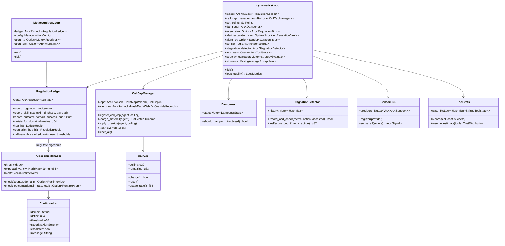
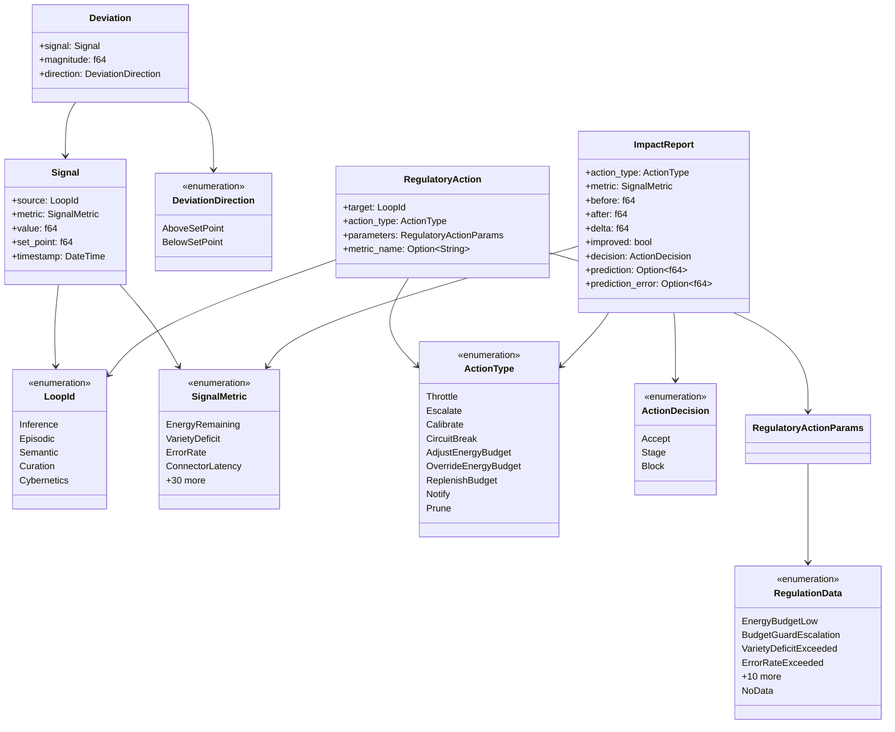

# hkask-regulation — Reference

`hkask-regulation` is hKask's cybernetic nervous system. It implements the
homeostatic self-regulation loop (sense→compare→compute→act→verify), the
per-agent call cap, the algedonic alert path, and the metacognition loop
that observes the regulator itself. Per Ashby's Law of Requisite Variety,
the regulator's variety must match the system's variety.

The crate lives at `kask/crates/hkask-regulation/`. Its public surface is
re-exported from `kask/crates/hkask-regulation/src/hkask_regulation.rs`.

## Source citations

| Symbol | Location |
|--------|----------|
| `CyberneticsLoop` struct | `kask/crates/hkask-regulation/src/cybernetics_loop.rs:72` |
| `CyberneticsLoop::tick` | `kask/crates/hkask-regulation/src/cybernetics_loop.rs:1343` |
| `CyberneticsLoop::build` (sensor wiring) | `kask/crates/hkask-regulation/src/cybernetics_loop.rs:130` |
| `RegulationLedger` struct | `kask/crates/hkask-regulation/src/runtime.rs:418` |
| `RegulationCycleEntry` struct | `kask/crates/hkask-regulation/src/runtime.rs:359` |
| `VarietyMonitor` struct | `kask/crates/hkask-regulation/src/runtime.rs:273` |
| `VarietyTracker` struct | `kask/crates/hkask-regulation/src/runtime.rs:111` |
| `OutcomeTracker` struct | `kask/crates/hkask-regulation/src/runtime.rs:193` |
| `StoredSkillSpan` struct | `kask/crates/hkask-regulation/src/runtime.rs:54` |
| `SkillSpanStore` struct | `kask/crates/hkask-regulation/src/runtime.rs:70` |
| `NoopEventSink` | `kask/crates/hkask-regulation/src/runtime.rs:848` |
| `CallCapManager` | `kask/crates/hkask-regulation/src/energy.rs:163` |
| `CallCap` struct | `kask/crates/hkask-regulation/src/energy.rs:50` |
| `AgentCallCapStatus` | `kask/crates/hkask-regulation/src/energy.rs:124` |
| `CallMeterOutcome` enum | `kask/crates/hkask-regulation/src/energy.rs:35` |
| `CallCapError` enum | `kask/crates/hkask-regulation/src/energy.rs:141` |
| `DEFAULT_RUNAWAY_CALL_CEILING` | `kask/crates/hkask-regulation/src/energy.rs:31` |
| `DEFAULT_CALL_CAP_ALERT_THRESHOLD` | `kask/crates/hkask-regulation/src/energy.rs:21` |
| `Dampener` struct | `kask/crates/hkask-regulation/src/dampener.rs:91` |
| `StagnationDetector` struct | `kask/crates/hkask-regulation/src/dampener.rs:222` |
| `DEFAULT_DAMPEN_WINDOW` | `kask/crates/hkask-regulation/src/dampener.rs:43` |
| `DEFAULT_OVERRIDE_COOLDOWN` | `kask/crates/hkask-regulation/src/dampener.rs:58` |
| `RuntimeAlert` struct | `kask/crates/hkask-regulation/src/algedonic.rs:37` |
| `AlertSeverity` enum | `kask/crates/hkask-regulation/src/algedonic.rs:26` |
| `AlertEscalationSink` trait | `kask/crates/hkask-regulation/src/algedonic.rs:80` |
| `AlertEmailSink` trait | `kask/crates/hkask-regulation/src/algedonic.rs:54` |
| `AlgedonicManager` struct | `kask/crates/hkask-regulation/src/algedonic.rs:187` |
| `MetacognitionLoop` struct | `kask/crates/hkask-regulation/src/metacognition.rs:150` |
| `MetacognitionConfig` | `kask/crates/hkask-regulation/src/metacognition.rs:121` |
| `HealthSnapshot` | `kask/crates/hkask-regulation/src/metacognition.rs:88` |
| `EscalationAlert` | `kask/crates/hkask-regulation/src/metacognition.rs:103` |
| `EscalationTrigger` enum | `kask/crates/hkask-regulation/src/metacognition.rs:113` |
| `AlertSink` trait | `kask/crates/hkask-regulation/src/metacognition.rs:78` |
| `AlertEvent` | `kask/crates/hkask-regulation/src/metacognition.rs:61` |
| `Sensor` trait | `kask/crates/hkask-regulation/src/sensor_provider.rs:37` |
| `SensorBus` | `kask/crates/hkask-regulation/src/sensor_provider.rs:69` |
| `SensorRegistry` | `kask/crates/hkask-regulation/src/sensor_provider.rs:151` |
| `EnergyBudgetSensor` | `kask/crates/hkask-regulation/src/sensor_provider.rs:251` |
| `VarietySensor` | `kask/crates/hkask-regulation/src/sensor_provider.rs:293` |
| `ToolReliabilitySensor` | `kask/crates/hkask-regulation/src/sensor_provider.rs:331` |
| `TestCoverageSensor` | `kask/crates/hkask-regulation/src/sensor_provider.rs:454` |
| `MutationScoreSensor` | `kask/crates/hkask-regulation/src/sensor_provider.rs:530` |
| `ToolStats` struct | `kask/crates/hkask-regulation/src/tool_stats.rs:73` |
| `CostDistribution` | `kask/crates/hkask-regulation/src/tool_stats.rs:50` |
| `ToolReliabilityAlert` | `kask/crates/hkask-regulation/src/tool_stats.rs:61` |
| `StrategyEvaluator` | `kask/crates/hkask-regulation/src/strategy_evaluator.rs:71` |
| `MovingAverageExtrapolator` | `kask/crates/hkask-regulation/src/system_simulator.rs:29` |
| `MetricPrediction` | `kask/crates/hkask-regulation/src/system_simulator.rs:16` |
| `SetPoints` struct | `kask/crates/hkask-regulation/src/set_points.rs:138` |
| `SetPointsConfig` | `kask/crates/hkask-regulation/src/set_points.rs:217` |
| `InferenceThrottleMode` enum | `kask/crates/hkask-regulation/src/set_points.rs:60` |
| `load_set_points` | `kask/crates/hkask-regulation/src/set_points.rs:407` |
| `RegulationPolicy` | `kask/crates/hkask-regulation/src/regulation_policy.rs:118` |
| `ProposedAction` | `kask/crates/hkask-regulation/src/regulation_policy.rs:96` |
| `RegulationReason` enum | `kask/crates/hkask-regulation/src/regulation_policy.rs:18` |
| `RegulationRule` | `kask/crates/hkask-regulation/src/regulation_policy.rs:104` |
| `classify_decision` | `kask/crates/hkask-regulation/src/regulation_policy.rs:466` |
| `default_substitution_ladder` | `kask/crates/hkask-regulation/src/regulation_policy.rs:489` |
| `LoopId` enum | `kask/crates/hkask-regulation/src/types/loops/core.rs:24` |
| `LoopMetrics` | `kask/crates/hkask-regulation/src/types/loops/core.rs:182` |
| `ImpactReport` | `kask/crates/hkask-regulation/src/types/loops/core.rs:73` |
| `ActionDecision` enum | `kask/crates/hkask-regulation/src/types/loops/core.rs:166` |
| `TriggerOrigin` enum | `kask/crates/hkask-regulation/src/types/loops/core.rs:50` |
| `SignalMetric` enum | `kask/crates/hkask-regulation/src/types/loops/signals.rs:14` |
| `Signal` struct | `kask/crates/hkask-regulation/src/types/loops/signals.rs:144` |
| `Deviation` struct | `kask/crates/hkask-regulation/src/types/loops/signals.rs:166` |
| `DeviationDirection` enum | `kask/crates/hkask-regulation/src/types/loops/signals.rs:192` |
| `RegulatoryAction` | `kask/crates/hkask-regulation/src/types/loops/actions.rs:201` |
| `RegulatoryActionParams` | `kask/crates/hkask-regulation/src/types/loops/actions.rs:133` |
| `RegulationData` enum | `kask/crates/hkask-regulation/src/types/loops/actions.rs:19` |
| `ActionType` enum | `kask/crates/hkask-regulation/src/types/loops/actions.rs:243` |
| `BudgetOption` | `kask/crates/hkask-regulation/src/types/loops/actions.rs:7` |
| `CurationInput` enum | `kask/crates/hkask-regulation/src/types/loops/channels.rs:95` |
| `ToolConsumptionEvent` | `kask/crates/hkask-regulation/src/types/loops/channels.rs:21` |
| `GoalTransitionEvent` | `kask/crates/hkask-regulation/src/types/loops/channels.rs:35` |
| `CommunicationEvent` | `kask/crates/hkask-regulation/src/types/loops/channels.rs:78` |
| `QaSpan` enum | `kask/crates/hkask-regulation/src/qa_span.rs:13` |
| `SkillFeedbackSpan` enum | `kask/crates/hkask-regulation/src/skill_span.rs:34` |
| `InfraSpan` enum | `kask/crates/hkask-regulation/src/infra_span.rs:5` |

## Class diagram

The crate has six responsibility clusters: the cybernetic loop, the
regulation ledger, the per-agent call cap, the algedonic alert path, the
metacognition loop, and the sensor registry. The class diagram below
shows the key types and their relationships.

<!-- DIAGRAM_ALIGNMENT
id: DIAG-REG-003
verified_date: 2026-08-13
verified_against: kask/crates/hkask-regulation/src/cybernetics_loop.rs:72; kask/crates/hkask-regulation/src/runtime.rs:418; kask/crates/hkask-regulation/src/energy.rs:163,50; kask/crates/hkask-regulation/src/dampener.rs:91,222; kask/crates/hkask-regulation/src/algedonic.rs:187,37; kask/crates/hkask-regulation/src/metacognition.rs:150; kask/crates/hkask-regulation/src/sensor_provider.rs:69; kask/crates/hkask-regulation/src/tool_stats.rs:73
status: VERIFIED
-->

## Loop type system

The loop type system lives in `types/loops/` and is re-exported from
`hkask_regulation.rs`. The `LoopId` enum (`types/loops/core.rs:24`)
identifies the five loops; there is no Loop 3 (Control is absorbed into
Cybernetics) and no Loop 4 (VSM S4 = Curation).

<!-- DIAGRAM_ALIGNMENT
id: DIAG-REG-004
verified_date: 2026-08-13
verified_against: kask/crates/hkask-regulation/src/types/loops/core.rs:24,73,166; kask/crates/hkask-regulation/src/types/loops/signals.rs:14,144,166,192; kask/crates/hkask-regulation/src/types/loops/actions.rs:19,133,201,243
status: VERIFIED
-->

## Efferent action dispatch

The Cybernetics Loop is a sensor+advisor, not an actuator. Every computed
`RegulatoryAction` is converted to an `Escalate` alert by
`route_action_as_alert` (`cybernetics_loop.rs:1009`) and routed through a
three-tier path. This preserves user sovereignty: the human (via the
Curator) decides whether to apply the recommended action; the loop does
not act autonomously.

The `efferent_action` field in the alert's `error_context` JSON carries
the original `ActionType` (e.g., `Throttle`, `CircuitBreak`) so the
Curator sees what the loop would have done. Native `Escalate` actions
(variety deficit, wallet balance) carry `efferent_action: None`.

`Notify` actions are skipped — they are observational ("no action
required, positive signal" per `ActionType::Notify`'s doc at
`types/loops/actions.rs:268`). Converting them to Critical alerts would
be a variety inversion.

## Set-points

`SetPoints` (`set_points.rs:138`) holds the homeostatic reference values.
Defaults are declared once as `DEFAULT_*` constants
(`set_points.rs:13`–`130`) and reused in the `Default` impl
(`set_points.rs:256`), `SetPointsConfig` (`set_points.rs:217`), and
`from_config` (`set_points.rs:286`). `validate()` (`set_points.rs:350`)
checks range and ordering invariants.

`load_set_points()` (`set_points.rs:407`) reads `HKASK_REG_CONFIG` env
var, parses the YAML file, validates, and falls back to defaults on any
error with a `tracing::warn!`.

`InferenceThrottleMode` (`set_points.rs:60`) controls how low energy
budget is handled: `Off` (user manages), `Autonomous` (direct throttle),
or `CuratorMediated { curator_timeout_secs }` (escalate with fallback).

## Dampener and stagnation

`Dampener` (`dampener.rs:91`) prevents feedback oscillation in the
Curation→Cybernetics→Curation cycle. Two layers:

1. **Per-fingerprint dedup** — same (variant, target) within the standard
   window (default 60s, `DEFAULT_DAMPEN_WINDOW` at `dampener.rs:43`) is
   suppressed.
2. **Override cooldown** — after any metacognitive override passes dedup,
   ALL subsequent overrides are suppressed for `override_cooldown` (default
   120s, `DEFAULT_OVERRIDE_COOLDOWN` at `dampener.rs:58`).

`StagnationDetector` (`dampener.rs:222`) tracks (metric, action) pairs.
When the same pair is rejected for `substitution_after` cycles (default
2), `try_substitute` walks the substitution ladder. When it hits the
per-metric stagnation threshold (default 5, `DEFAULT_STAGNATION_THRESHOLD`
at `set_points.rs:99`), a `RegulatoryPlateau` alert fires.

## Alert sinks

Three sinks, wired by the composition root:

| Sink | Trait | Purpose |
|------|-------|---------|
| Escalation queue | `AlertEscalationSink` (`algedonic.rs:80`) | Primary durable path — `EscalationQueue` on `curator.db` |
| Regulation archive | `RegulationSink` (in `hkask-types`) | Secondary fallback — `RegulationArchive` on `curator.db` |
| Email | `AlertEmailSink` (`algedonic.rs:54`) | Last resort — fires when live channel is down |

All sinks are best-effort: a failing or missing sink never breaks the
regulation loop. The escalation queue is the primary review path; the
Curator/user reviews pending alerts via the `curator_escalations` MCP
tool and resolves/dismisses them with an audit trail.

## See also

- [hkask-regulation Tutorial](./tutorial.md): reading a regulation cycle.
- [hkask-regulation How-to](./how-to.md): adding a new sensor.
- [hkask-regulation Explanation](./explanation.md): why the loop is a
  sensor+advisor.

---

[^ashby]: Ashby, W. R. (1956). *An Introduction to Cybernetics.* Chapman & Hall. <https://archive.org/details/introductiontocy00ashb>.
[^conant-ashby]: Conant, R. C., & Ashby, W. R. (1970). *Every good regulator of a control system must be a model of that system.* International Journal of Systems Science, 1(2), 89–97. <https://www.tandfonline.com/doi/abs/10.1080/00207727008902020>.
