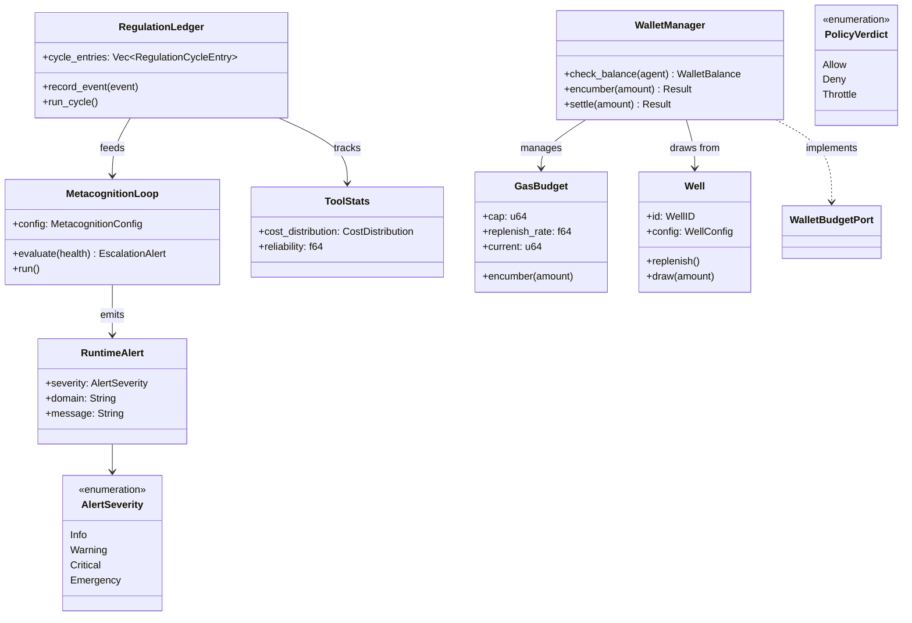

# hkask-regulation — Reference

`hkask-regulation` implements the Regulation nervous system for hKask. It
provides the cybernetic loop that monitors agent behavior, enforces gas
budgets, detects variety deficits, and escalates algedonic alerts. The crate
defines the `RegulationLedger`, `MetacognitionLoop`, `WalletManager`, `Well`,
`GasBudget`, and the span enums that emit `reg.*` observable events.

## Source citations

| Symbol | Location |
|--------|----------|
| `RegulationLedger` struct | `kask/crates/hkask-regulation/src/runtime.rs:405` |
| `RegulationCycleEntry` struct | `kask/crates/hkask-regulation/src/runtime.rs:343` |
| `VarietyMonitor` struct | `kask/crates/hkask-regulation/src/runtime.rs:276` |
| `StoredSkillSpan` struct | `kask/crates/hkask-regulation/src/runtime.rs:57` |
| `NoopEventSink` | `kask/crates/hkask-regulation/src/runtime.rs:1047` |
| `LedgerSink` | `kask/crates/hkask-regulation/src/runtime.rs:1067` |
| `MetacognitionLoop` struct | `kask/crates/hkask-regulation/src/metacognition.rs:150` |
| `MetacognitionConfig` | `kask/crates/hkask-regulation/src/metacognition.rs:121` |
| `HealthSnapshot` | `kask/crates/hkask-regulation/src/metacognition.rs:88` |
| `EscalationAlert` | `kask/crates/hkask-regulation/src/metacognition.rs:103` |
| `EscalationTrigger` enum | `kask/crates/hkask-regulation/src/metacognition.rs:113` |
| `AlertSink` trait | `kask/crates/hkask-regulation/src/metacognition.rs:78` |
| `AlertEvent` | `kask/crates/hkask-regulation/src/metacognition.rs:61` |
| `WalletManager` struct | `kask/crates/hkask-regulation/src/wallet_manager.rs:36` |
| `WalletBalance` | `kask/crates/hkask-regulation/src/wallet_manager.rs:26` |
| `Well` struct | `kask/crates/hkask-regulation/src/well.rs:28` |
| `WellID` newtype | `kask/crates/hkask-regulation/src/well.rs:24` |
| `WellManager` | `kask/crates/hkask-regulation/src/well.rs:73` |
| `WellConfig` | `kask/crates/hkask-regulation/src/well.rs:13` |
| `GasBudget` struct | `kask/crates/hkask-regulation/src/energy.rs:99` |
| `GasCost` newtype | `kask/crates/hkask-regulation/src/energy.rs:13` |
| `AgentGasStatus` | `kask/crates/hkask-regulation/src/energy.rs:323` |
| `RuntimeAlert` | `kask/crates/hkask-regulation/src/algedonic.rs:37` |
| `AlertSeverity` enum | `kask/crates/hkask-regulation/src/algedonic.rs:26` |
| `AlertEmailSink` trait | `kask/crates/hkask-regulation/src/algedonic.rs:54` |
| `RuntimePolicy` trait | `kask/crates/hkask-regulation/src/runtime_policy.rs:47` |
| `PolicyVerdict` enum | `kask/crates/hkask-regulation/src/runtime_policy.rs:14` |
| `DefaultPolicy` | `kask/crates/hkask-regulation/src/runtime_policy.rs:66` |
| `ToolStats` | `kask/crates/hkask-regulation/src/tool_stats.rs:71` |
| `CostDistribution` | `kask/crates/hkask-regulation/src/tool_stats.rs:48` |
| `QaSpan` enum | `kask/crates/hkask-regulation/src/qa_span.rs:13` |

## Regulation architecture

The crate has four responsibility clusters: the ledger and event sink, the
metacognition loop, the wallet and gas budget, and the algedonic alert path.
The class diagram below shows the key types and their relationships.

<!-- DIAGRAM_ALIGNMENT
id: DIAG-DIA-REG-001
verified_date: 2026-07-27
verified_against: kask/crates/hkask-regulation/src/runtime.rs:405,343,276; kask/crates/hkask-regulation/src/metacognition.rs:150,103,113; kask/crates/hkask-regulation/src/wallet_manager.rs:36; kask/crates/hkask-regulation/src/well.rs:28; kask/crates/hkask-regulation/src/energy.rs:99; kask/crates/hkask-regulation/src/algedonic.rs:26,37; kask/crates/hkask-regulation/src/runtime_policy.rs:14,47
status: VERIFIED
-->

## Ledger and event sink

The `RegulationLedger` (`runtime.rs:405`) is the central record store. It
holds `RegulationCycleEntry` records (`runtime.rs:343`) and a
`VarietyMonitor` (`runtime.rs:276`) that tracks tool and template diversity.
The ledger implements `LedgerObserver` from `hkask-types` to receive
Regulation events.

Two event sinks are provided: `NoopEventSink` (`runtime.rs:1047`) for tests
and `LedgerSink` (`runtime.rs:1067`) for production. The sink forwards events
to the ledger for recording.

The `RuntimePolicy` trait (`runtime_policy.rs:47`) decides whether to allow,
deny, or throttle an action. The `PolicyVerdict` enum
(`runtime_policy.rs:14`) has three variants: `Allow`, `Deny`, and `Throttle`.
The `DefaultPolicy` (`runtime_policy.rs:66`) is the default implementation.

The `ToolStats` (`tool_stats.rs:71`) tracks per-tool cost distributions and
reliability. The `CostDistribution` (`tool_stats.rs:48`) holds the cost
histogram. The `ToolReliabilityAlert` (`tool_stats.rs:59`) fires when a tool's
reliability drops below threshold.

## Metacognition and alerts

The `MetacognitionLoop` (`metacognition.rs:150`) evaluates system health and
emits `EscalationAlert` (`metacognition.rs:103`) when thresholds are breached.
The `EscalationTrigger` enum (`metacognition.rs:113`) defines the conditions
that trigger escalation. The loop uses a `HealthSnapshot`
(`metacognition.rs:88`) as input and an `AlertSink` trait
(`metacognition.rs:78`) as output.

The `RuntimeAlert` (`algedonic.rs:37`) carries an `AlertSeverity`
(`algedonic.rs:26`) and a domain string. The `AlertEmailSink` trait
(`algedonic.rs:54`) forwards critical alerts to an email recipient. The
severity levels are `Info`, `Warning`, `Critical`, and `Emergency`.

## Wallet and gas budget

The `WalletManager` (`wallet_manager.rs:36`) implements the `WalletBudgetPort`
trait from `hkask-types`. It manages per-agent rJoule balances, encumbrances,
and settlements. The `WalletBalance` struct (`wallet_manager.rs:26`) holds the
current balance.

The `Well` struct (`well.rs:28`) is a replenishment source. Each well has a
`WellID` (`well.rs:24`) and a `WellConfig` (`well.rs:13`). The `WellManager`
(`well.rs:73`) manages multiple wells. The `GasBudget` (`energy.rs:99`) holds
the cap, replenish rate, and current balance for an agent's gas allocation.

## See also

- [hkask-regulation Explanation](./explanation.md): state diagram of the
  homeostatic loop.
- [hkask-types Reference](../hkask-types/reference.md): the
  `WalletBudgetPort`, `LedgerObserver`, and `LedgerStoragePort` traits this
  crate implements.
- [`kask/docs/reference/regulation-spans.md`](../../reference/regulation-spans.md):
  cross-cutting Regulation span catalog (stale; this document supersedes it
  for per-crate detail).
- [`kask/docs/architecture/core/PRINCIPLES.md`](../../architecture/core/PRINCIPLES.md):
  P9 (feedback loops) and P12 (authenticated host mandate).

---

[^conant-ashby]: Conant, R. C., & Ashby, W. R. (1970). *Every good regulator of a control system must be a model of that system.* International Journal of Systems Science, 1(2), 89-97. <https://www.tandfonline.com/doi/abs/10.1080/00207727008902020>. The Good Regulator theorem: the Regulation system must model the system it regulates.

[^beer-vsm]: Beer, S. (1979). *The Heart of Enterprise.* John Wiley & Sons. The Viable System Model (S1–S5) that the metacognition loop and algedonic path implement.
