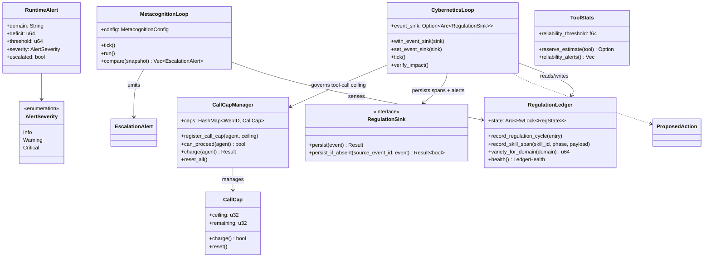

# hkask-regulation — Reference

`hkask-regulation` implements the Regulation nervous system for hKask. It
provides the cybernetic loop that monitors agent behavior, bounds governed
tool calls via a per-agent call cap, detects variety deficits, and escalates
algedonic alerts. The crate defines the `RegulationLedger`, `CyberneticsLoop`,
`MetacognitionLoop`, `CallCapManager`, and the span enums that emit `reg.*`
observable events.

## Source citations

| Symbol                                      | Location                                                  |
| ------------------------------------------- | --------------------------------------------------------- |
| `RegulationLedger` struct                   | `kask/crates/hkask-regulation/src/runtime.rs:418`         |
| `RegulationCycleEntry` struct               | `kask/crates/hkask-regulation/src/runtime.rs:359`         |
| `VarietyMonitor` struct                     | `kask/crates/hkask-regulation/src/runtime.rs:273`         |
| `StoredSkillSpan` struct                    | `kask/crates/hkask-regulation/src/runtime.rs:54`          |
| `NoopEventSink`                             | `kask/crates/hkask-regulation/src/runtime.rs:848`         |
| `RegulationArchive` (`RegulationSink` impl) | `kask/crates/hkask-storage/src/regulation_store.rs:508`   |
| `MetacognitionLoop` struct                  | `kask/crates/hkask-regulation/src/metacognition.rs:150`   |
| `MetacognitionConfig`                       | `kask/crates/hkask-regulation/src/metacognition.rs:121`   |
| `HealthSnapshot`                            | `kask/crates/hkask-regulation/src/metacognition.rs:88`    |
| `EscalationAlert`                           | `kask/crates/hkask-regulation/src/metacognition.rs:103`   |
| `EscalationTrigger` enum                    | `kask/crates/hkask-regulation/src/metacognition.rs:113`   |
| `AlertSink` trait                           | `kask/crates/hkask-regulation/src/metacognition.rs:78`    |
| `AlertEvent`                                | `kask/crates/hkask-regulation/src/metacognition.rs:61`    |
| `EscalationSeverity` enum                   | `kask/crates/hkask-types/src/curator.rs:68`               |
| `CyberneticsLoop` struct                    | `kask/crates/hkask-regulation/src/cybernetics_loop.rs:72` |
| `ProposedAction` struct                     | `kask/crates/hkask-regulation/src/regulation_policy.rs`   |
| `CallCapManager`                            | `kask/crates/hkask-regulation/src/energy.rs`              |
| `CallCap`                                   | `kask/crates/hkask-regulation/src/energy.rs`              |
| `AgentCallCapStatus`                        | `kask/crates/hkask-regulation/src/energy.rs`              |
| `RuntimeAlert`                              | `kask/crates/hkask-regulation/src/algedonic.rs:37`        |
| `AlertSeverity` enum                        | `kask/crates/hkask-regulation/src/algedonic.rs:26`        |
| `AlertEmailSink` trait                      | `kask/crates/hkask-regulation/src/algedonic.rs:54`        |
| `ToolStats`                                 | `kask/crates/hkask-regulation/src/tool_stats.rs:73`       |
| `CostDistribution`                          | `kask/crates/hkask-regulation/src/tool_stats.rs:50`       |
| `ToolReliabilityAlert`                      | `kask/crates/hkask-regulation/src/tool_stats.rs:61`       |
| `QaSpan` enum                               | `kask/crates/hkask-regulation/src/qa_span.rs:13`          |
| `CANONICAL_NAMESPACES`                      | `kask/crates/hkask-types/src/event.rs`                    |

## Regulation architecture

The crate has five responsibility clusters: the ledger, the cybernetic loop,
the metacognition loop, the per-agent call cap, and the algedonic alert path.
The class diagram below shows the key types and their relationships.

<!-- DIAGRAM_ALIGNMENT
id: DIAG-DIA-REG-001
verified_date: 2026-08-05
verified_against: kask/crates/hkask-regulation/src/runtime.rs; kask/crates/hkask-regulation/src/metacognition.rs; kask/crates/hkask-regulation/src/cybernetics_loop.rs; kask/crates/hkask-regulation/src/regulation_policy.rs; kask/crates/hkask-regulation/src/energy.rs; kask/crates/hkask-regulation/src/algedonic.rs; kask/crates/hkask-regulation/src/tool_stats.rs; kask/crates/hkask-types/src/curator.rs
status: VERIFIED
-->

## Ledger and event sink

The `RegulationLedger` (`runtime.rs:418`) is the central in-memory record
store — a cheaply clonable `Arc<RwLock<RegState>>` (`runtime.rs:419`) holding
the `VarietyMonitor` (`runtime.rs:273`), the
`regulation_history: VecDeque<RegulationCycleEntry>` (`runtime.rs:383`), the
`ToolStats`, and the `SkillSpanStore`. It is write-only state: there is no
`subscribe`/`subscribe_async` observer API and no `publish_event` fan-out
(`LedgerObserver` does not exist in `hkask-types`). Consumers read the ledger
through direct async accessors: `health()` (`runtime.rs:459`),
`variety_for_domain()` (`runtime.rs:621`), `record_regulation_cycle()`
(`runtime.rs:483`), and `record_skill_span()` (`runtime.rs:670`).

Durability is separate from the ledger. Regulation events are persisted
through the `RegulationSink` trait (`hkask-types`), which has two
implementations:

- `NoopEventSink` (`runtime.rs:848`) — for tests and pre-login bootstrap
  contexts where persistence is not needed (e.g. seam watcher unit tests).
- `RegulationArchive` (`kask/crates/hkask-storage/src/regulation_store.rs:508`)
  — the durable store on the curator's `curator.db` (the same DB the curator MCP
  server's `reg_query` / `curator_algedonic_log` tools read). `persist`
  delegates to `insert`; `persist_if_absent` to `insert_if_absent`
  (`regulation_store.rs:513`).

The sink is wired on the `CyberneticsLoop`, not the ledger:
`CyberneticsLoop::with_event_sink` (`cybernetics_loop.rs:190`) and
`set_event_sink` (`cybernetics_loop.rs:236`) attach it. Every
`emit_regulation_span` (`cybernetics_loop.rs:387`) persists through the sink
when present and `tracing::warn!`s "Regulation span dropped — no event_sink
configured" (`cybernetics_loop.rs:400`) when absent — the `.rules`
startup-failure-signal pattern. The same sink is the algedonic fallback: when
the live `CurationInput::Alert` channel has no receiver, the alert is
persisted to the archive (`cybernetics_loop.rs:921`); if neither live channel
nor sink nor email sink delivers, an error is logged
(`cybernetics_loop.rs:960` — "Algedonic alert LOST").

The composition root (`crates/zed/src/main.rs`) starts with `NoopEventSink`
and upgrades to `RegulationArchive` in the post-login deferred task, because
the archive needs the curator DB passphrase, which only resolves after the
user logs in (`main.rs:663`, `main.rs:1166`). `McpRuntime::set_event_sink`
(`kask/crates/hkask-mcp/src/runtime.rs:196`) performs the same upgrade for
the governed MCP dispatch path.

The `ToolStats` (`tool_stats.rs:73`) tracks per-tool cost distributions and
reliability via a Beta posterior over success/failure outcomes. The
`CostDistribution` (`tool_stats.rs:50`) holds the p90 reserve point and
observation count. The `ToolReliabilityAlert` (`tool_stats.rs:61`) fires when
a tool's success probability falls below `reliability_threshold`.

## Removed: the per-tool-invocation runtime policy

A `runtime_policy` module (`DefaultPolicy`, `PolicyVerdict`, `PolicyConfig`) once
sat in this crate and decided whether an individual tool call was allowed,
blocked, escalated to a human, or logged. The whole module was **deleted on
2026-08-12**: its `Source`→`Sink` prohibition read two constants — every tool was
labelled `Pure` at its only construction site, and the untrusted-input flag read
cascade-context markers the write path had stopped emitting — so it could not deny
anything. The FIDES taint labels it consumed were deleted with it, and the
`hkask-capability` dependency this crate carried solely for them was dropped from
`Cargo.toml`.

Defense **Layer 5 (information flow control) is therefore absent by decision**,
in the same register as Layer 3 (instruction hierarchy, RR-0010). The governing
entry is `kask/security/regressions/RR-0053.yaml`, rewritten as an absence check
that forbids re-introducing an inert gate; it also states the bar a real one must
clear. Rationale:
[`guard-taint-pipeline.md`](../../architecture/guard-taint-pipeline.md).

## Cybernetics and metacognition loops

The `CyberneticsLoop` (`cybernetics_loop.rs:72`) drives the five-phase
sense→compare→compute→act→verify cycle. It implements the `RegulationLoop`
trait and consumes `ProposedAction` records (`regulation_policy.rs`)
produced by matching `RegulationRule`s against `Deviation`s. Each phase
produces data that the `RegulationCycleEntry` (`runtime.rs:359`) captures:
afferent signal count, deviation count, action count, verified count, and
decision counts (`accepted`/`staged`/`blocked`).

The `MetacognitionLoop` (`metacognition.rs:150`) is a separate, slower loop
that senses `HealthSnapshot`s from the ledger, compares them against
`MetacognitionConfig` thresholds, and emits `EscalationAlert`s
(`metacognition.rs:103`). The `EscalationTrigger` enum
(`metacognition.rs:113`) has three variants: `VarietyDeficit`,
`CriticalAlerts`, and `LowEffectiveness`. The loop uses an `AlertSink` trait
(`metacognition.rs:78`) for user-facing dispatch; only `Critical`-severity
alerts are forwarded to the sink.

## Efferent action dispatch

The `CyberneticsLoop::act()` method converts computed `RegulatoryAction`s
into `Escalate` alerts routed to the Curator/human via the existing
three-tier alert path (live channel → archive → email). The loop is a
**sensor+advisor**, not an actuator.

### Design rationale

The loop computes actions of type `Throttle`, `CircuitBreak`,
`AdjustEnergyBudget`, `OverrideEnergyBudget`, `ReplenishBudget`, `Prune`,
and `Calibrate` in addition to `Escalate` and `Notify`. These are _efferent
signals_ — they would modify system behavior if dispatched (reduce inference
rate, stop a loop, change a gas cap, etc.). The design decision is that the
loop does not dispatch them autonomously. Instead:

1. Efferent actions (all types except `Escalate` and `Notify`) are converted
   to a `RuntimeAlert` with `AlertSeverity::Critical`.
2. `Notify` actions are **skipped** — they are observational ("no action
   required, positive signal" per `ActionType::Notify`'s doc). Converting
   them to Critical alerts would be a variety inversion (positive signal →
   critical alert) and would pollute the escalation queue with non-actionable
   noise.
3. Actions that would have been direct efferent signals carry an
   `efferent_action` field in the persisted alert data (the `ActionType::as_str()`
   of the original action, e.g. `"Throttle"`, `"CircuitBreak"`). This field
   is included in both the primary escalation queue (`persist_alert_to_queue`)
   and the archive fallback JSON, so the Curator's `curator_escalations` tool
   sees the recommended action as structured data.
4. The alert's `domain` is set to `efferent:{action_type}` for converted
   actions (empty string for native `Escalate` actions, preserving the
   prior behavior).
5. The alert's `message` explains what the loop would have done and why:
   `"Efferent action Throttle (target: Inference) recommended but not wired —
reason: energy_budget_low"`.
6. The alert flows through the standard three-tier path: live channel
   (`alerts_tx` → `MetacognitionLoop` → `ToastAlertSink`), archive
   (`RegulationSink::persist`), and email (`AlertEmailSink`).

### Why not wire the actuators?

Two reasons:

1. **User sovereignty.** The cybernetics loop runs on a 30-second tick and
   computes actions from pattern-based sensors. Giving it actuator power over
   inference rate, circuit breakers, and gas caps would allow a rapidly
   evolving piece of remote infrastructure to silently throttle or shut down
   the user's agent. The user is the final filter on their own system. The
   loop advises; the human decides.

2. **The Curator already has the authority.** `CuratorDirective::OverrideEnergyBudget`,
   `ClearOverride`, `ReplenishBudget`, and `CalibrateThreshold` are the
   Curator's actuator methods (`apply_directive` in `cybernetics_loop.rs`).
   The Curator (human-in-the-loop) can apply any efferent action the loop
   recommends, with full visibility and consent. Wiring the loop directly to
   the actuators would bypass the Curator's authority DAG
   (Curation → Cybernetics → {Inference, Episodic, Semantic}).

### Impact on `verify_impact`

`verify_impact()` classifies each action as Accept/Stage/Block based on
whether the target metric improved. Since efferent actions are not executed
(the actuator is not wired), the metric does not change.

**Important:** `verify_impact` only handles four `RegulationData` variants
(`EnergyBudgetLow`, `BudgetGuardEscalation`, `EnergyDepletionAutoAdjust`,
`VarietyDeficitExceeded`). All other variants hit `_ => continue` and are
**not classified** — they don't feed the `StagnationDetector` or
`StrategyEvaluator`. This is a pre-existing gap, not introduced by the
efferent dispatch refactor.

For the four handled variants: a non-executed action produces zero metric
change, which `classify_decision` treats as **Accept** (zero worsening is in
the Accept band, not Stage/Block — those require worsening above
`stage_worsening_ratio`). This means the loop records the non-action as
"effective," and `try_substitute` does **not** fire for zero-worsening
cases. Substitution only triggers when the underlying metric **worsens**
despite the non-action — at which point the ladder cycles through
alternative action types, each producing a new efferent alert. This can
produce multiple Critical alerts for a persistent deviation (alert flood
risk). The `StagnationDetector`'s `RegulatoryPlateauDetected` span is the
signal that the loop has exhausted its substitution ladder.

### Future: wiring the actuators

If the operator decides to wire specific efferent actions (e.g.
`AdjustEnergyBudget` — which has a clear mechanism via
`CallCapManager::apply_override`), the dispatch point is `act()` in
`cybernetics_loop.rs`. The conversion to Escalate is the current behavior;
adding an `apply_*` method for a specific action type and dispatching it
before the Escalate conversion would close that specific loop. The
`apply_directive` pattern (used for Curator-initiated directives) is the
template: each `apply_*` method modifies state directly and emits a
`reg.cybernetics` span recording the change.

## Algedonic alert path

The `RuntimeAlert` (`algedonic.rs:37`) carries a `domain`, `deficit`,
`threshold`, `severity`, `escalated` flag, and `message`. The `AlertSeverity`
enum (`algedonic.rs:26`) has three levels: `Info`, `Warning`, and `Critical`.
Severity is computed by binary thresholds: `deficit > threshold` → `Critical`,
`deficit > threshold/2` → `Warning`, otherwise `Info`. The `AlertEmailSink`
trait (`algedonic.rs:54`) forwards critical alerts to an email recipient.

The `EscalationSeverity` enum (re-exported from `hkask_types::curator`,
`kask/crates/hkask-types/src/curator.rs:68`) is used by `EscalationAlert` and
also has three levels: `Info`, `Warning`, `Critical`.

## Per-agent call cap

The `CallCapManager` (in `energy.rs`) is the honest replacement for the former
gas hold-settle ritual. Each agent has a hard `CallCap` ceiling on governed tool
calls per regulation tick; `McpRuntime::invoke` charges one call per invocation
via `can_proceed` + `charge`, and the cap resets to its ceiling each tick
(`reset_all`). The `EnergyBudgetSensor` reads the worst remaining ratio across
agents and emits an `EnergyRemaining` signal, which the regulation policy turns
into an `EnergyBudgetLow` throttle action when it drops below
`SetPoints.gas_min_remaining`.

Curation can override an agent's ceiling (`CuratorDirective::OverrideEnergyBudget`),
clear the override (`ClearOverride`, restoring the original ceiling), or credit
calls (`ReplenishBudget`). Overrides survive per-tick resets until explicitly
cleared. Agents without a registered cap are denied fail-closed — the composition
root seeds a cap for every agent that makes governed tool calls (e.g. the
`swarm-panel` persona in `crates/zed/src/main.rs`).

## See also

- [hkask-regulation Explanation](./explanation.md): state diagram of the
  homeostatic loop.
- [hkask-types Reference](../hkask-types/reference.md): the
  `RegulationSink` trait this crate consumes, and the `EscalationSeverity` type from `hkask-types`.
- [guard-taint-pipeline](../../architecture/guard-taint-pipeline.md): the removed
  FIDES taint pipeline, why it was deleted rather than repaired, and the bar a
  replacement must clear.
- [`kask/docs/architecture/core/PRINCIPLES.md`](../../architecture/core/PRINCIPLES.md):
  P9 (feedback loops) and P12 (authenticated host mandate).

---

[^conant-ashby]: Conant, R. C., & Ashby, W. R. (1970). _Every good regulator of a control system must be a model of that system._ International Journal of Systems Science, 1(2), 89-97. <https://www.tandfonline.com/doi/abs/10.1080/00207727008902020>. The Good Regulator theorem: the Regulation system must model the system it regulates.

[^beer-vsm]: Beer, S. (1979). _The Heart of Enterprise._ John Wiley & Sons. The Viable System Model (S1–S5) that the metacognition loop and algedonic path implement.
