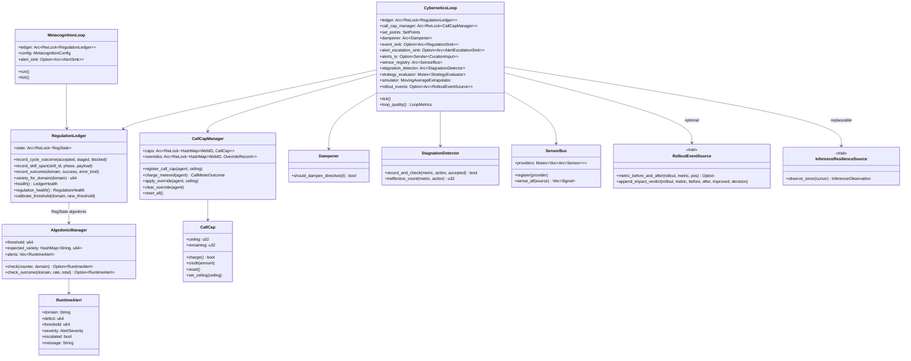
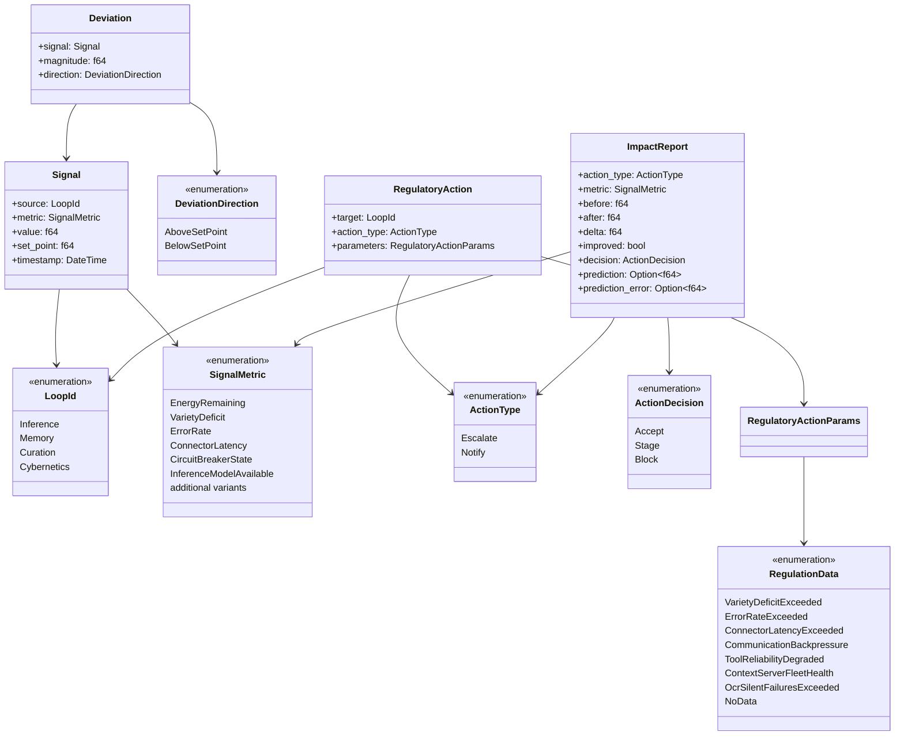

# hkask-regulation — Reference

`hkask-regulation` is hKask's cybernetic nervous system. It implements the
homeostatic self-regulation loop (sense→compare→compute→act→verify), the
per-agent call cap, the algedonic alert path, and the metacognition loop
that observes the regulator itself. Per Ashby's Law of Requisite Variety,
the regulator's variety must match the system's variety[^ashby].

The crate lives at `kask/crates/hkask-regulation/`. Its public surface is
re-exported from `kask/crates/hkask-regulation/src/hkask_regulation.rs:24-39`.
The crate is dependency-light: it depends on `hkask-types` and tokio, but
not on any storage crate — durable sinks are injected as traits
(`RegulationSink`, `AlertEscalationSink`) implemented elsewhere. The editor
composition root creates one process-global ledger/loop graph and passes it to
the managed MCP runtime; MCP servers themselves remain child processes
(`crates/zed/src/main.rs:772-896`; `kask/crates/hkask-mcp/src/runtime.rs:4-12`).

## Source citations

| Symbol | Location |
|--------|----------|
| Crate root (re-exports) | `kask/crates/hkask-regulation/src/hkask_regulation.rs:24-39` |
| `CyberneticsLoop` struct | `kask/crates/hkask-regulation/src/cybernetics_loop.rs:142-202` |
| `CyberneticsLoop::tick` | `kask/crates/hkask-regulation/src/cybernetics_loop.rs:646-656` |
| `CyberneticsLoop::build` (sensor wiring) | `kask/crates/hkask-regulation/src/cybernetics_loop.rs:231,248-279` |
| `CyberneticsLoop::reset_all_caps` | `kask/crates/hkask-regulation/src/cybernetics_loop.rs:689` |
| `CyberneticsLoop::process_inbox` | `kask/crates/hkask-regulation/src/cybernetics_loop.rs:697` |
| `CyberneticsLoop::loop_quality` | `kask/crates/hkask-regulation/src/cybernetics_loop.rs:903` |
| `CyberneticsLoop::submit_rollout_impact_check` | `kask/crates/hkask-regulation/src/cybernetics_loop.rs:609` |
| `RolloutEventSource` trait | `kask/crates/hkask-regulation/src/cybernetics_loop.rs:73-110` |
| `RolloutEventError` enum | `kask/crates/hkask-regulation/src/cybernetics_loop.rs:47-57` |
| `sense` / `compare` / `compute` / `act` / `verify_impact` | `kask/crates/hkask-regulation/src/cybernetics_loop/cycle.rs:305-309,140-144,409-413,448-452,686-690` |
| `route_action_as_alert` | `kask/crates/hkask-regulation/src/cybernetics_loop/cycle.rs:540-544` |
| `persist_alert_to_queue` | `kask/crates/hkask-regulation/src/cybernetics_loop/cycle.rs:63-67` |

| `build_regulation_action` | `kask/crates/hkask-regulation/src/cybernetics_loop/cycle.rs:1080` |
| `handle_curation_directive` | `kask/crates/hkask-regulation/src/cybernetics_loop/directive.rs:14` |
| `RegulationLedger` struct | `kask/crates/hkask-regulation/src/runtime.rs:498-500` |
| `RegulationLedger::record_cycle_outcome` | `kask/crates/hkask-regulation/src/runtime.rs:576-580` |
| `VarietyMonitor` struct | `kask/crates/hkask-regulation/src/runtime.rs:380-382` |
| `VarietyTracker` struct | `kask/crates/hkask-regulation/src/runtime.rs:140-208` |
| `OutcomeTracker` struct | `kask/crates/hkask-regulation/src/runtime.rs:222-302` |
| `StoredSkillSpan` / `SkillSpanStore` | `kask/crates/hkask-regulation/src/runtime.rs:52-124` |
| `NoopEventSink` | `kask/crates/hkask-regulation/src/runtime.rs:980` |
| `CallCapManager` | `kask/crates/hkask-regulation/src/energy.rs:131-134` |
| `CallCap` struct | `kask/crates/hkask-regulation/src/energy.rs:45-48` |
| `AgentCallCapStatus` | `kask/crates/hkask-regulation/src/energy.rs:102-105` |
| `CallMeterOutcome` enum | `kask/crates/hkask-regulation/src/energy.rs:30-41` |
| `DEFAULT_RUNAWAY_CALL_CEILING` (10,000) | `kask/crates/hkask-regulation/src/energy.rs:26` |
| `Dampener` struct | `kask/crates/hkask-regulation/src/dampener.rs:100` |
| `StagnationDetector` struct | `kask/crates/hkask-regulation/src/dampener.rs:231` |
| `DEFAULT_DAMPEN_WINDOW` / `DEFAULT_OVERRIDE_COOLDOWN` | `kask/crates/hkask-regulation/src/dampener.rs:48,66` |
| `RuntimeAlert` struct | `kask/crates/hkask-regulation/src/algedonic.rs:41` |
| `AlertSeverity` enum | `kask/crates/hkask-regulation/src/algedonic.rs:30` |
| `AlertEscalationSink` trait | `kask/crates/hkask-regulation/src/algedonic.rs:84` |
| `AlertEmailSink` trait | `kask/crates/hkask-regulation/src/algedonic.rs:58` |
| `AlgedonicManager` struct | `kask/crates/hkask-regulation/src/algedonic.rs:230` |
| `DEFAULT_EXPECTED_VARIETY` (3) | `kask/crates/hkask-regulation/src/algedonic.rs:22` |
| `MetacognitionLoop` struct | `kask/crates/hkask-regulation/src/metacognition.rs:172` |
| `MetacognitionConfig` | `kask/crates/hkask-regulation/src/metacognition.rs:130` |
| `HealthSnapshot` | `kask/crates/hkask-regulation/src/metacognition.rs:88` |
| `EscalationAlert` / `EscalationTrigger` | `kask/crates/hkask-regulation/src/metacognition.rs:107,117` |
| `AlertSink` trait / `AlertEvent` | `kask/crates/hkask-regulation/src/metacognition.rs:78,61` |
| `DEFAULT_TICK_INTERVAL` (30s) | `kask/crates/hkask-regulation/src/metacognition.rs:42` |
| `Sensor` trait | `kask/crates/hkask-regulation/src/sensor_provider.rs:27` |
| `SensorBus` | `kask/crates/hkask-regulation/src/sensor_provider.rs:39` |
| `VarietySensor` | `kask/crates/hkask-regulation/src/sensor_provider.rs` |
| `TestCoverageSensor` / `MutationScoreSensor` | `kask/crates/hkask-regulation/src/sensor_provider.rs:251,382` |
| `ToolReliabilitySensor` | `kask/crates/hkask-regulation/src/sensor_provider.rs:331` |
| `InferenceResilienceSource` / observation types | `kask/crates/hkask-regulation/src/inference_resilience.rs:8-80` |
| Local circuit state machine | `kask/crates/kask_bridge/src/inference_resilience.rs:10-58,73-199,202-275` |
| Live port observation adapter | `kask/crates/kask_bridge/src/inference_chat.rs:1065-1088` |
| Resilience defaults and wiring | `kask/crates/kask_bridge/src/settings.rs:121-136`; `crates/zed/src/main.rs:3169-3192` |
| `ContextServerHealthSource` / sensor | `kask/crates/hkask-regulation/src/sensor_provider.rs:572,593` |
| `MemoryHealthSource` / `MemoryHealthSensor` | `kask/crates/hkask-regulation/src/sensor_provider.rs:649,677` |
| `StrategyEvaluator` | `kask/crates/hkask-regulation/src/strategy_evaluator.rs:66` |
| `MovingAverageExtrapolator` | `kask/crates/hkask-regulation/src/system_simulator.rs:29` |
| `MetricPrediction` | `kask/crates/hkask-regulation/src/system_simulator.rs:16` |
| `SetPoints` struct | `kask/crates/hkask-regulation/src/set_points.rs:186-293` |
| `SetPointsConfig` | `kask/crates/hkask-regulation/src/set_points.rs:298-330` |

| `SetPoints::validate` | `kask/crates/hkask-regulation/src/set_points.rs:482-541` |
| `load_set_points` | `kask/crates/hkask-regulation/src/set_points.rs:585-619` |
| `RegulationPolicy` | `kask/crates/hkask-regulation/src/regulation_policy.rs:107` |
| `ProposedAction` | `kask/crates/hkask-regulation/src/regulation_policy.rs:85` |
| `RegulationReason` enum | `kask/crates/hkask-regulation/src/regulation_policy.rs:18` |
| `RegulationRule` | `kask/crates/hkask-regulation/src/regulation_policy.rs:93` |
| `RegulationPolicy::decide` | `kask/crates/hkask-regulation/src/regulation_policy.rs:379` |
| `classify_decision` | `kask/crates/hkask-regulation/src/regulation_policy.rs:566` |

| `LoopId` enum | `kask/crates/hkask-regulation/src/loops/core.rs:24-29` |
| `LoopMetrics` / `LoopMetrics::from_cycle` | `kask/crates/hkask-regulation/src/loops/core.rs:189,241` |
| `ImpactReport` | `kask/crates/hkask-regulation/src/loops/core.rs:80` |
| `ActionDecision` enum | `kask/crates/hkask-regulation/src/loops/core.rs:173` |
| `TriggerOrigin` enum | `kask/crates/hkask-regulation/src/loops/core.rs:48` |
| `StageActions` | `kask/crates/hkask-regulation/src/loops/core.rs:555` |
| `CurationInput` enum | `kask/crates/hkask-regulation/src/loops/core.rs:789` |
| `SignalMetric` enum | `kask/crates/hkask-regulation/src/loops/signals.rs:14` |
| `Signal` struct | `kask/crates/hkask-regulation/src/loops/signals.rs:227` |
| `Deviation` struct / `Deviation::from_signal` | `kask/crates/hkask-regulation/src/loops/signals.rs:249,256` |
| `DeviationDirection` enum | `kask/crates/hkask-regulation/src/loops/signals.rs:275` |
| `RegulatoryAction` | `kask/crates/hkask-regulation/src/loops/actions.rs:236` |
| `RegulatoryActionParams` | `kask/crates/hkask-regulation/src/loops/actions.rs:168` |
| `RegulationData` enum | `kask/crates/hkask-regulation/src/loops/actions.rs:19` |
| `ActionType` enum | `kask/crates/hkask-regulation/src/loops/actions.rs:278` |

## Class diagram

The crate has seven responsibility clusters: the cybernetic loop, regulation
ledger, per-agent call cap, algedonic alert path, metacognition loop, sensor bus,
and the typed inference-resilience observation seam. The class diagram shows
the key types and their relationships.

<!-- DIAGRAM_ALIGNMENT
id: DIAG-REG-003
verified_date: 2026-09-15
verified_against: kask/crates/hkask-regulation/src/cybernetics_loop.rs:142-202; kask/crates/hkask-regulation/src/runtime.rs:498-500; kask/crates/hkask-regulation/src/energy.rs:131-178; kask/crates/hkask-regulation/src/dampener.rs:100-110,231-238; kask/crates/hkask-regulation/src/algedonic.rs:34-54; kask/crates/hkask-regulation/src/metacognition.rs:195-205; kask/crates/hkask-regulation/src/inference_resilience.rs:59-80
status: VERIFIED
-->

## Loop type system

The loop type system lives in `loops/` and is re-exported from
`hkask_regulation.rs:30-33`. The `LoopId` enum (`loops/core.rs:24-29`)
identifies the four loops; there is no Loop 3 (Control is absorbed into
Cybernetics) and no Loop 4 (VSM S4 = Curation). StorageGuard and
McpServerGuard loops were folded into Cybernetics (`loops/core.rs:17-19`).

<!-- DIAGRAM_ALIGNMENT
id: DIAG-REG-004
verified_date: 2026-09-15
verified_against: kask/crates/hkask-regulation/src/loops/core.rs; kask/crates/hkask-regulation/src/loops/signals.rs; kask/crates/hkask-regulation/src/loops/actions.rs
status: VERIFIED
status: VERIFIED
-->

## Regulation dispositions and inference resilience

### Central dispositions

`ActionType` has two live central dispositions: `Notify` and `Escalate`
(`kask/crates/hkask-regulation/src/loops/actions.rs`). `Notify` records an
observation. `Escalate` routes evidence through the pending queue and available
notification sinks. There is no central throttle, circuit-break, calibration,
energy-adjustment, prune, or generic action-dispatch implementation.

### Local circuit contract

| Item | Contract | Evidence |
|---|---|---|
| Configuration | `transient_failure_threshold` defaults to 3; `open_duration` defaults to 30 seconds | `kask/crates/kask_bridge/src/settings.rs:121-136`; wired at `crates/zed/src/main.rs:3169-3174` |
| States | `Closed`, `Open { until }`, `HalfOpen { probe_in_flight }` | `kask/crates/kask_bridge/src/inference_resilience.rs:16-21` |
| Admission | Closed admits; open rejects with retry delay; elapsed open admits one half-open probe; concurrent probes reject | `inference_resilience.rs:73-104`; `inference_chat.rs:623-628` |
| Transient failure | Timeout/connection and provider errors marked transient count toward opening; a failed half-open probe reopens | `inference_chat.rs:206-218`; `inference_resilience.rs:107-127` |
| Permanent failure | Authorization, configuration, model, and non-transient provider failures become typed receipts | `inference_chat.rs:220-239`; `inference_resilience.rs:175-188` |
| Success | Resets the consecutive count; a successful half-open probe closes the circuit | `inference_resilience.rs:130-135` |
| Cancelled probe | Clears `probe_in_flight`; `Drop` also releases an incomplete probe | `inference_resilience.rs:138-149,270-275` |

The bridge exposes one coherent `InferenceObservation`: snapshot, transition
receipts, permanent-failure receipts, and `next_cursor`
(`kask/crates/hkask-regulation/src/inference_resilience.rs:49-80`). Both receipt
kinds share one monotonically increasing event id; `observe_since` prunes events
already acknowledged by the supplied cursor and returns only later events
(`kask/crates/kask_bridge/src/inference_resilience.rs:151-188`).

### Central reconciliation

`CyberneticsLoop::sense_inference_resilience` merges and sorts both receipt kinds.
It requires a contiguous id sequence and advances its atomic cursor only after
each event is handled (`kask/crates/hkask-regulation/src/cybernetics_loop/cycle.rs:178-210,289-296`).

| Event | Durable path | Escalation |
|---|---|---|
| `CircuitOpened` | `reg.inference.circuit_transition` Regulation record | No; initial protection stays local |
| `CircuitHalfOpened` | `reg.inference.circuit_transition` Regulation record | No |
| `CircuitClosed` | `reg.inference.observed_recovery`, `observed_recovery: true`, `causal_attribution: unverified` | No |
| `CircuitReopened` | transition record after alert routing succeeds | Yes; reason `circuit_breaker_open` |
| Permanent failure | acknowledgement after alert routing succeeds | Yes; reason includes typed failure kind and detail |

The implementation is at
`kask/crates/hkask-regulation/src/cybernetics_loop/cycle.rs:213-285`.
Persistence or escalation failure stops cursor advancement, so the event remains
available for a later tick. Full concurrency with successful completions does not
create a circuit event. Per-agent call-cap depletion remains a separate local
meter and never changes global inference capacity.

### Event substrates

- `reg.inference.circuit_transition` and
  `reg.inference.observed_recovery` are typed Regulation records persisted by the
  injected sink (`cycle.rs:230-264`).
- `reg.tool` is child-process tracing from `ToolSpanGuard`, not a consumed
  Regulation record (`kask/crates/hkask-mcp-server/src/server/tool_span.rs:117-131`).
- Governed tool completion creates `SpanKind::ToolCompleted`; `reg.mcp` is the
  warning target if that record cannot be persisted
  (`kask/crates/hkask-mcp/src/runtime.rs:1534-1543`).

## Set-points

`SetPoints` (`set_points.rs:186-293`) holds the homeostatic reference
values. Defaults are declared once as `DEFAULT_*` constants
(`set_points.rs:13-178`) and reused in the `Default` impl
(`set_points.rs:348-384`), `SetPointsConfig` (`set_points.rs:298-330`), and
`from_config` (`set_points.rs:389-478`). `validate()` (`set_points.rs:482-541`)
checks range and ordering invariants (e.g., warning threshold > critical
threshold, stage ratio < block ratio, tool reliability floor in
(0.0, 1.0] so the sensor can never be silently disabled).

`load_set_points()` (`set_points.rs:585-619`) reads the `HKASK_REG_CONFIG`
env var, parses the YAML file, validates, and falls back to defaults on any
error with a `tracing::warn!`.

## Dampener and stagnation

`Dampener` (`dampener.rs:100`) prevents feedback oscillation in the
Curation→Cybernetics→Curation cycle. Two layers:

1. **Per-fingerprint dedup** — same (variant, target) within the standard
   window (default 60s, `DEFAULT_DAMPEN_WINDOW` at `dampener.rs:48`,
   sourced from `DEFAULT_DAMPEN_WINDOW_SECS` at `set_points.rs:72`) is
   suppressed.
2. **Override cooldown** — after any metacognitive override passes dedup,
   ALL subsequent overrides are suppressed for the cooldown (default
   120s, `DEFAULT_OVERRIDE_COOLDOWN` at `dampener.rs:66`, sourced from
   `set_points.rs:83`).

`StagnationDetector` tracks evidence-bearing rollout impact checks. It may
raise a latched regulatory-plateau escalation after repeated observations
without progress, but it no longer substitutes unsupported action labels.
While a matching escalation remains pending, source-level dedup suppresses
repeat queue, live-channel, and archive delivery.

## Tool-reliability sensing and diagnosis

`ToolReliabilitySensor` (`sensor_provider.rs`) aggregates per-domain
success rates from `RegulationLedger::outcome_breakdown`, equal-weighted,
with a **minimum-sample floor** (`TOOL_RELIABILITY_MIN_DOMAIN_SAMPLES` = 5,
matching `check_outcome`'s alert minimum): a domain below the floor is
excluded — the live-observed 0.5/0.6667/0.75 deviations all came from
quiet windows where a couple of failures were the entire sample. The
aggregation lives in `aggregate_tool_reliability`. Advisory sensing uses
that single aggregation path; routing the resulting recommendation does not
immediately re-sense it as though an intervention occurred.

Failures whose error kind is **not the tool's fault**
(`hkask_types::tool_response::is_not_tool_fault_kind`: environment gaps
`unavailable`/`permission_denied`, and caller-caused `invalid_argument`
rejections — including model-caused unparseable tool-call arguments,
classified at the agent dispatch seam) are excluded from the success-rate
math but kept in the per-kind breakdown.

The **per-domain breakdown** (`DomainOutcomeSnapshot`: success rate,
operation counts, per-error-kind tallies) is the surface that names the
failing domain. It is emitted as the `reg.outcome.tool_domains` span when
a tool-reliability alert fires (degradation or plateau) and on the hourly
heartbeat, and carried in the escalation row's `error_context`
(`outcome_breakdown` field) — retrievable via the `curator_algedonic_log`
and `curator_escalations` MCP tools.

## Alert sinks

Three sinks, wired by the composition root:

| Sink | Trait | Purpose |
|------|-------|---------|
| Escalation queue | `AlertEscalationSink` (`algedonic.rs:84`) | Primary durable path — `EscalationQueue` on `curator.db` |
| Regulation archive | `RegulationSink` (in `hkask-types`) | Secondary fallback — `RegulationArchive` on `curator.db` |
| Email | `AlertEmailSink` (`algedonic.rs:58`) | Last resort — fires when the archive path also fails |

All sinks are best-effort: a failing or missing sink never breaks the
regulation loop. The escalation queue is the primary review path; the
Curator/user reviews pending alerts via the `curator_escalations` MCP tool
and resolves/dismisses them with an audit trail.

## See also

- [hkask-regulation Tutorial](./tutorial.md): reading a regulation cycle.
- [hkask-regulation How-to](./how-to.md): adding a new sensor.
- [hkask-regulation Explanation](./explanation.md): why the loop is a
  sensor+advisor.

---

[^ashby]: Ashby, W. R. (1956). *An Introduction to Cybernetics.* Chapman & Hall. <https://archive.org/details/introductiontocy00ashb>.

[^conant-ashby]: Conant, R. C., & Ashby, W. R. (1970). *Every good regulator of a control system must be a model of that system.* International Journal of Systems Science, 1(2), 89–97. <https://www.tandfonline.com/doi/abs/10.1080/00207727008902020>.
