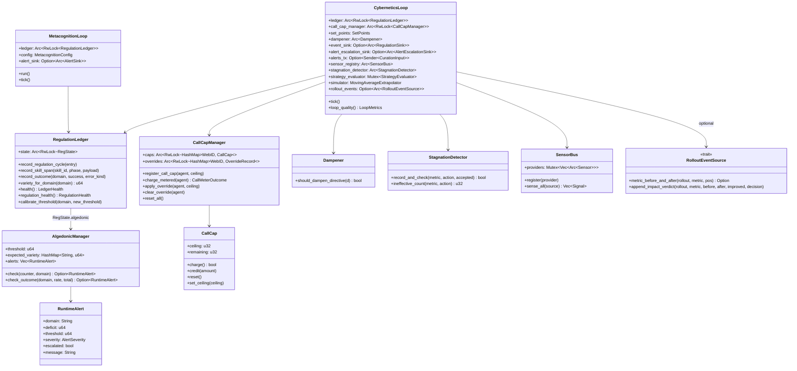
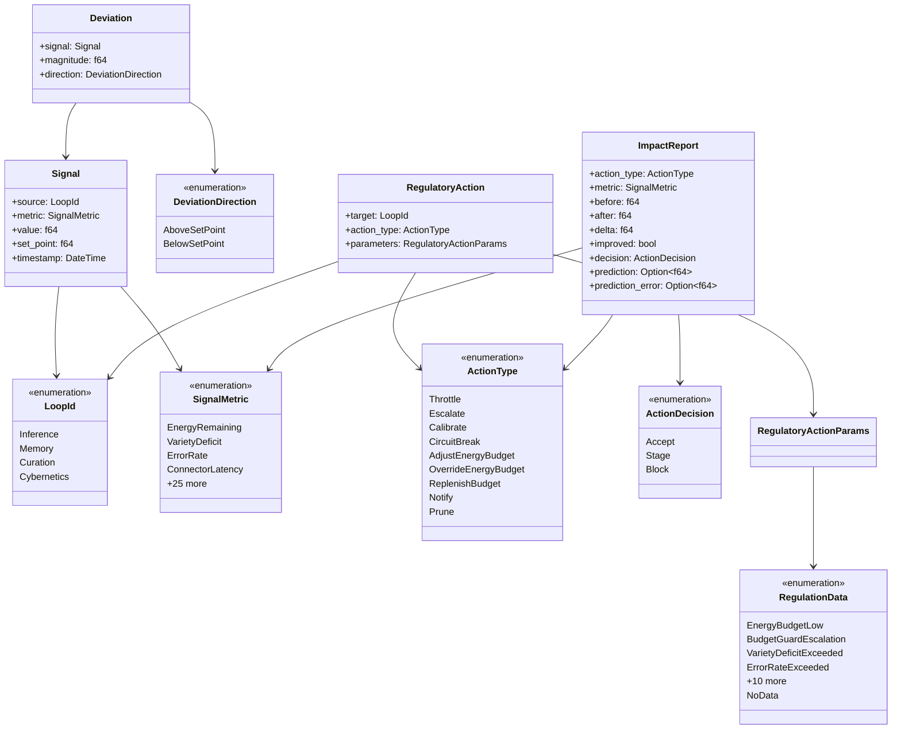

# hkask-regulation — Reference

`hkask-regulation` is hKask's cybernetic nervous system. It implements the
homeostatic self-regulation loop (sense→compare→compute→act→verify), the
per-agent call cap, the algedonic alert path, and the metacognition loop
that observes the regulator itself. Per Ashby's Law of Requisite Variety,
the regulator's variety must match the system's variety[^ashby].

The crate lives at `kask/crates/hkask-regulation/`. Its public surface is
re-exported from `kask/crates/hkask-regulation/src/hkask_regulation.rs:24-39`.
The crate is dependency-light: it depends on `hkask-types` and tokio, but
not on any storage crate — durable sinks are injected as traits
(`RegulationSink`, `AlertEscalationSink`) implemented elsewhere.

## Source citations

| Symbol | Location |
|--------|----------|
| Crate root (re-exports) | `kask/crates/hkask-regulation/src/hkask_regulation.rs:24-39` |
| `CyberneticsLoop` struct | `kask/crates/hkask-regulation/src/cybernetics_loop.rs:146-213` |
| `CyberneticsLoop::tick` | `kask/crates/hkask-regulation/src/cybernetics_loop.rs:721` |
| `CyberneticsLoop::build` (sensor wiring) | `kask/crates/hkask-regulation/src/cybernetics_loop.rs:231,248-279` |
| `CyberneticsLoop::reset_all_caps` | `kask/crates/hkask-regulation/src/cybernetics_loop.rs:689` |
| `CyberneticsLoop::process_inbox` | `kask/crates/hkask-regulation/src/cybernetics_loop.rs:697` |
| `CyberneticsLoop::loop_quality` | `kask/crates/hkask-regulation/src/cybernetics_loop.rs:903` |
| `CyberneticsLoop::submit_rollout_impact_check` | `kask/crates/hkask-regulation/src/cybernetics_loop.rs:609` |
| `RolloutEventSource` trait | `kask/crates/hkask-regulation/src/cybernetics_loop.rs:73-110` |
| `RolloutEventError` enum | `kask/crates/hkask-regulation/src/cybernetics_loop.rs:47-57` |
| `sense` / `compare` / `compute` / `act` / `verify_impact` | `kask/crates/hkask-regulation/src/cybernetics_loop/cycle.rs:253,248,350,408,684` |
| `route_action_as_alert` | `kask/crates/hkask-regulation/src/cybernetics_loop/cycle.rs:510` |
| `persist_alert_to_queue` | `kask/crates/hkask-regulation/src/cybernetics_loop/cycle.rs:147` |
| `try_substitute` | `kask/crates/hkask-regulation/src/cybernetics_loop/cycle.rs:31` |
| `build_regulation_action` | `kask/crates/hkask-regulation/src/cybernetics_loop/cycle.rs:1080` |
| `handle_curation_directive` | `kask/crates/hkask-regulation/src/cybernetics_loop/directive.rs:14` |
| `RegulationLedger` struct | `kask/crates/hkask-regulation/src/runtime.rs:480-482` |
| `RegulationCycleEntry` struct | `kask/crates/hkask-regulation/src/runtime.rs:406-422` |
| `VarietyMonitor` struct | `kask/crates/hkask-regulation/src/runtime.rs:319-391` |
| `VarietyTracker` struct | `kask/crates/hkask-regulation/src/runtime.rs:140-208` |
| `OutcomeTracker` struct | `kask/crates/hkask-regulation/src/runtime.rs:222-302` |
| `StoredSkillSpan` / `SkillSpanStore` | `kask/crates/hkask-regulation/src/runtime.rs:52-124` |
| `NoopEventSink` | `kask/crates/hkask-regulation/src/runtime.rs:980` |
| `CallCapManager` | `kask/crates/hkask-regulation/src/energy.rs:131-134` |
| `CallCap` struct | `kask/crates/hkask-regulation/src/energy.rs:45-48` |
| `AgentCallCapStatus` | `kask/crates/hkask-regulation/src/energy.rs:102-105` |
| `CallMeterOutcome` enum | `kask/crates/hkask-regulation/src/energy.rs:30-41` |
| `DEFAULT_RUNAWAY_CALL_CEILING` (10,000) | `kask/crates/hkask-regulation/src/energy.rs:26` |
| `Dampener` struct | `kask/crates/hkask-regulation/src/dampener.rs:100` |
| `StagnationDetector` struct | `kask/crates/hkask-regulation/src/dampener.rs:231` |
| `DEFAULT_DAMPEN_WINDOW` / `DEFAULT_OVERRIDE_COOLDOWN` | `kask/crates/hkask-regulation/src/dampener.rs:48,66` |
| `RuntimeAlert` struct | `kask/crates/hkask-regulation/src/algedonic.rs:41` |
| `AlertSeverity` enum | `kask/crates/hkask-regulation/src/algedonic.rs:30` |
| `AlertEscalationSink` trait | `kask/crates/hkask-regulation/src/algedonic.rs:84` |
| `AlertEmailSink` trait | `kask/crates/hkask-regulation/src/algedonic.rs:58` |
| `AlgedonicManager` struct | `kask/crates/hkask-regulation/src/algedonic.rs:230` |
| `DEFAULT_EXPECTED_VARIETY` (3) | `kask/crates/hkask-regulation/src/algedonic.rs:22` |
| `MetacognitionLoop` struct | `kask/crates/hkask-regulation/src/metacognition.rs:172` |
| `MetacognitionConfig` | `kask/crates/hkask-regulation/src/metacognition.rs:130` |
| `HealthSnapshot` | `kask/crates/hkask-regulation/src/metacognition.rs:88` |
| `EscalationAlert` / `EscalationTrigger` | `kask/crates/hkask-regulation/src/metacognition.rs:107,117` |
| `AlertSink` trait / `AlertEvent` | `kask/crates/hkask-regulation/src/metacognition.rs:78,61` |
| `DEFAULT_TICK_INTERVAL` (30s) | `kask/crates/hkask-regulation/src/metacognition.rs:42` |
| `Sensor` trait | `kask/crates/hkask-regulation/src/sensor_provider.rs:27` |
| `SensorBus` | `kask/crates/hkask-regulation/src/sensor_provider.rs:39` |
| `EnergyBudgetSensor` / `VarietySensor` | `kask/crates/hkask-regulation/src/sensor_provider.rs:79,126` |
| `TestCoverageSensor` / `MutationScoreSensor` | `kask/crates/hkask-regulation/src/sensor_provider.rs:251,382` |
| `ToolReliabilitySensor` | `kask/crates/hkask-regulation/src/sensor_provider.rs:331` |
| `InferenceHealthSource` / `InferenceHealthSensor` | `kask/crates/hkask-regulation/src/sensor_provider.rs:470,494` |
| `ContextServerHealthSource` / sensor | `kask/crates/hkask-regulation/src/sensor_provider.rs:572,593` |
| `MemoryHealthSource` / `MemoryHealthSensor` | `kask/crates/hkask-regulation/src/sensor_provider.rs:649,677` |
| `StrategyEvaluator` | `kask/crates/hkask-regulation/src/strategy_evaluator.rs:66` |
| `MovingAverageExtrapolator` | `kask/crates/hkask-regulation/src/system_simulator.rs:29` |
| `MetricPrediction` | `kask/crates/hkask-regulation/src/system_simulator.rs:16` |
| `SetPoints` struct | `kask/crates/hkask-regulation/src/set_points.rs:186-293` |
| `SetPointsConfig` | `kask/crates/hkask-regulation/src/set_points.rs:298-330` |
| `InferenceThrottleMode` enum | `kask/crates/hkask-regulation/src/set_points.rs:60-67` |
| `SetPoints::validate` | `kask/crates/hkask-regulation/src/set_points.rs:482-541` |
| `load_set_points` | `kask/crates/hkask-regulation/src/set_points.rs:585-619` |
| `RegulationPolicy` | `kask/crates/hkask-regulation/src/regulation_policy.rs:107` |
| `ProposedAction` | `kask/crates/hkask-regulation/src/regulation_policy.rs:85` |
| `RegulationReason` enum | `kask/crates/hkask-regulation/src/regulation_policy.rs:18` |
| `RegulationRule` | `kask/crates/hkask-regulation/src/regulation_policy.rs:93` |
| `RegulationPolicy::decide` | `kask/crates/hkask-regulation/src/regulation_policy.rs:379` |
| `classify_decision` | `kask/crates/hkask-regulation/src/regulation_policy.rs:566` |
| `default_substitution_ladder` | `kask/crates/hkask-regulation/src/regulation_policy.rs:589` |
| `LoopId` enum | `kask/crates/hkask-regulation/src/loops/core.rs:24-29` |
| `LoopMetrics` / `LoopMetrics::from_cycle` | `kask/crates/hkask-regulation/src/loops/core.rs:189,241` |
| `ImpactReport` | `kask/crates/hkask-regulation/src/loops/core.rs:80` |
| `ActionDecision` enum | `kask/crates/hkask-regulation/src/loops/core.rs:173` |
| `TriggerOrigin` enum | `kask/crates/hkask-regulation/src/loops/core.rs:48` |
| `StageActions` | `kask/crates/hkask-regulation/src/loops/core.rs:555` |
| `CurationInput` enum | `kask/crates/hkask-regulation/src/loops/core.rs:789` |
| `SignalMetric` enum | `kask/crates/hkask-regulation/src/loops/signals.rs:14` |
| `Signal` struct | `kask/crates/hkask-regulation/src/loops/signals.rs:227` |
| `Deviation` struct / `Deviation::from_signal` | `kask/crates/hkask-regulation/src/loops/signals.rs:249,256` |
| `DeviationDirection` enum | `kask/crates/hkask-regulation/src/loops/signals.rs:275` |
| `RegulatoryAction` | `kask/crates/hkask-regulation/src/loops/actions.rs:236` |
| `RegulatoryActionParams` | `kask/crates/hkask-regulation/src/loops/actions.rs:168` |
| `RegulationData` enum | `kask/crates/hkask-regulation/src/loops/actions.rs:19` |
| `ActionType` enum | `kask/crates/hkask-regulation/src/loops/actions.rs:278` |
| `BudgetOption` | `kask/crates/hkask-regulation/src/loops/actions.rs:7` |

## Class diagram

The crate has six responsibility clusters: the cybernetic loop, the
regulation ledger, the per-agent call cap, the algedonic alert path, the
metacognition loop, and the sensor bus. The class diagram below shows the
key types and their relationships.

<!-- DIAGRAM_ALIGNMENT
id: DIAG-REG-003
verified_date: 2026-08-31
verified_against: kask/crates/hkask-regulation/src/cybernetics_loop.rs:146-213,73-110; kask/crates/hkask-regulation/src/runtime.rs:480; kask/crates/hkask-regulation/src/energy.rs:131; kask/crates/hkask-regulation/src/dampener.rs:100,231; kask/crates/hkask-regulation/src/algedonic.rs:230,41; kask/crates/hkask-regulation/src/metacognition.rs:172; kask/crates/hkask-regulation/src/sensor_provider.rs:39
status: VERIFIED
-->

## Loop type system

The loop type system lives in `loops/` and is re-exported from
`hkask_regulation.rs:30-33`. The `LoopId` enum (`loops/core.rs:24-29`)
identifies the four loops; there is no Loop 3 (Control is absorbed into
Cybernetics) and no Loop 4 (VSM S4 = Curation). StorageGuard and
McpServerGuard loops were folded into Cybernetics (`loops/core.rs:17-19`).

<!-- DIAGRAM_ALIGNMENT
id: DIAG-REG-004
verified_date: 2026-08-31
verified_against: kask/crates/hkask-regulation/src/loops/core.rs:24,80,173; kask/crates/hkask-regulation/src/loops/signals.rs:14,227,249,275; kask/crates/hkask-regulation/src/loops/actions.rs:19,168,236,278
status: VERIFIED
-->

## Efferent action dispatch

The Cybernetics Loop is a sensor+advisor, not an actuator. Every computed
`RegulatoryAction` is converted to an `Escalate` alert by
`route_action_as_alert` (`cybernetics_loop/cycle.rs:510`) and routed
through a three-tier path. This preserves user sovereignty: the human (via
the Curator) decides whether to apply the recommended action; the loop does
not act autonomously.

The `efferent_action` field in the alert's `error_context` JSON carries
the original `ActionType` (e.g., `Throttle`, `CircuitBreak`) so the Curator
sees what the loop would have done. Native `Escalate` actions (variety
deficit) carry `efferent_action: None` (`cycle.rs:523-529`).

`Notify` actions are skipped (`cycle.rs:513-521`) — they are observational
("no action required, positive signal"). Converting them to Critical
alerts would be a variety inversion.

## Set-points

`SetPoints` (`set_points.rs:186-293`) holds the homeostatic reference
values. Defaults are declared once as `DEFAULT_*` constants
(`set_points.rs:13-178`) and reused in the `Default` impl
(`set_points.rs:348-384`), `SetPointsConfig` (`set_points.rs:298-330`), and
`from_config` (`set_points.rs:389-478`). `validate()` (`set_points.rs:482-541`)
checks range and ordering invariants (e.g., warning threshold > critical
threshold, stage ratio < block ratio, tool reliability floor in
(0.0, 1.0] so the sensor can never be silently disabled).

`load_set_points()` (`set_points.rs:585-619`) reads the `HKASK_REG_CONFIG`
env var, parses the YAML file, validates, and falls back to defaults on any
error with a `tracing::warn!`.

`InferenceThrottleMode` (`set_points.rs:60-67`) controls how low energy
budget is handled: `Off` (user manages; the default), `Autonomous` (direct
throttle), or `CuratorMediated { curator_timeout_secs }` (escalate with
fallback).

## Dampener and stagnation

`Dampener` (`dampener.rs:100`) prevents feedback oscillation in the
Curation→Cybernetics→Curation cycle. Two layers:

1. **Per-fingerprint dedup** — same (variant, target) within the standard
   window (default 60s, `DEFAULT_DAMPEN_WINDOW` at `dampener.rs:48`,
   sourced from `DEFAULT_DAMPEN_WINDOW_SECS` at `set_points.rs:72`) is
   suppressed.
2. **Override cooldown** — after any metacognitive override passes dedup,
   ALL subsequent overrides are suppressed for the cooldown (default
   120s, `DEFAULT_OVERRIDE_COOLDOWN` at `dampener.rs:66`, sourced from
   `set_points.rs:83`).

`StagnationDetector` (`dampener.rs:231`) tracks (metric, action) pairs.
When the same pair shows no observed improvement for `substitution_after` cycles (default 2,
`set_points.rs:120`), `try_substitute` (`cycle.rs:31`) walks the
substitution ladder. When it hits the per-metric stagnation threshold
(default 5, `DEFAULT_STAGNATION_THRESHOLD` at `set_points.rs:101`), a
regulatory-plateau alert fires.

## Alert sinks

Three sinks, wired by the composition root:

| Sink | Trait | Purpose |
|------|-------|---------|
| Escalation queue | `AlertEscalationSink` (`algedonic.rs:84`) | Primary durable path — `EscalationQueue` on `curator.db` |
| Regulation archive | `RegulationSink` (in `hkask-types`) | Secondary fallback — `RegulationArchive` on `curator.db` |
| Email | `AlertEmailSink` (`algedonic.rs:58`) | Last resort — fires when the archive path also fails |

All sinks are best-effort: a failing or missing sink never breaks the
regulation loop. The escalation queue is the primary review path; the
Curator/user reviews pending alerts via the `curator_escalations` MCP tool
and resolves/dismisses them with an audit trail.

## See also

- [hkask-regulation Tutorial](./tutorial.md): reading a regulation cycle.
- [hkask-regulation How-to](./how-to.md): adding a new sensor.
- [hkask-regulation Explanation](./explanation.md): why the loop is a
  sensor+advisor.

---

[^ashby]: Ashby, W. R. (1956). *An Introduction to Cybernetics.* Chapman & Hall. <https://archive.org/details/introductiontocy00ashb>.

[^conant-ashby]: Conant, R. C., & Ashby, W. R. (1970). *Every good regulator of a control system must be a model of that system.* International Journal of Systems Science, 1(2), 89–97. <https://www.tandfonline.com/doi/abs/10.1080/00207727008902020>.
