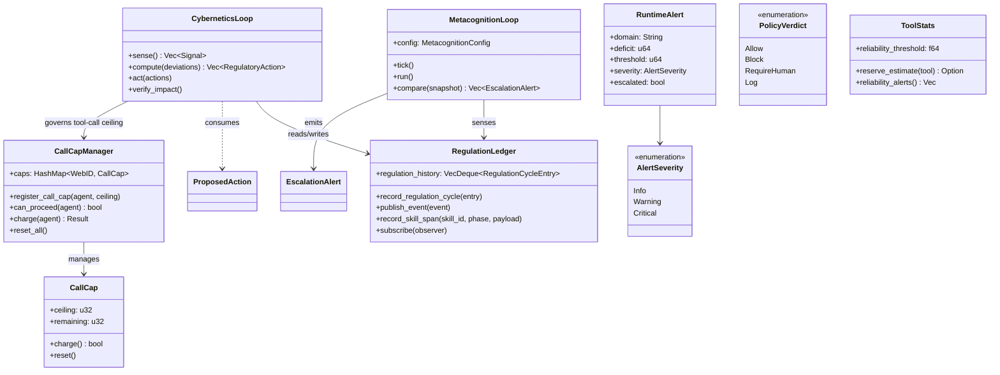

# hkask-regulation — Reference

`hkask-regulation` implements the Regulation nervous system for hKask. It
provides the cybernetic loop that monitors agent behavior, bounds governed
tool calls via a per-agent call cap, detects variety deficits, and escalates
algedonic alerts. The crate defines the `RegulationLedger`, `CyberneticsLoop`,
`MetacognitionLoop`, `CallCapManager`, and the span enums that emit `reg.*`
observable events.

## Source citations

| Symbol | Location |
|--------|----------|
| `RegulationLedger` struct | `kask/crates/hkask-regulation/src/runtime.rs:405` |
| `RegulationCycleEntry` struct | `kask/crates/hkask-regulation/src/runtime.rs:343` |
| `VarietyMonitor` struct | `kask/crates/hkask-regulation/src/runtime.rs:276` |
| `StoredSkillSpan` struct | `kask/crates/hkask-regulation/src/runtime.rs:57` |
| `NoopEventSink` | `kask/crates/hkask-regulation/src/runtime.rs:1045` |
| `LedgerSink` | `kask/crates/hkask-regulation/src/runtime.rs:1067` |
| `MetacognitionLoop` struct | `kask/crates/hkask-regulation/src/metacognition.rs:150` |
| `MetacognitionConfig` | `kask/crates/hkask-regulation/src/metacognition.rs:121` |
| `HealthSnapshot` | `kask/crates/hkask-regulation/src/metacognition.rs:88` |
| `EscalationAlert` | `kask/crates/hkask-regulation/src/metacognition.rs:103` |
| `EscalationTrigger` enum | `kask/crates/hkask-regulation/src/metacognition.rs:113` |
| `AlertSink` trait | `kask/crates/hkask-regulation/src/metacognition.rs:78` |
| `AlertEvent` | `kask/crates/hkask-regulation/src/metacognition.rs:61` |
| `EscalationSeverity` enum | `kask/crates/hkask-types/src/curator.rs:68` |
| `CyberneticsLoop` struct | `kask/crates/hkask-regulation/src/cybernetics_loop.rs` |
| `ProposedAction` struct | `kask/crates/hkask-regulation/src/regulation_policy.rs` |
| `CallCapManager` | `kask/crates/hkask-regulation/src/energy.rs` |
| `CallCap` | `kask/crates/hkask-regulation/src/energy.rs` |
| `AgentCallCapStatus` | `kask/crates/hkask-regulation/src/energy.rs` |
| `RuntimeAlert` | `kask/crates/hkask-regulation/src/algedonic.rs:37` |
| `AlertSeverity` enum | `kask/crates/hkask-regulation/src/algedonic.rs:26` |
| `AlertEmailSink` trait | `kask/crates/hkask-regulation/src/algedonic.rs:54` |
| `PolicyVerdict` enum | `kask/crates/hkask-regulation/src/runtime_policy.rs:14` |
| `DefaultPolicy` | `kask/crates/hkask-regulation/src/runtime_policy.rs:66` |
| `ToolStats` | `kask/crates/hkask-regulation/src/tool_stats.rs:73` |
| `CostDistribution` | `kask/crates/hkask-regulation/src/tool_stats.rs:49` |
| `ToolReliabilityAlert` | `kask/crates/hkask-regulation/src/tool_stats.rs:60` |
| `QaSpan` enum | `kask/crates/hkask-regulation/src/qa_span.rs:13` |
| `CANONICAL_NAMESPACES` | `kask/crates/hkask-types/src/event.rs` |

## Regulation architecture

The crate has five responsibility clusters: the ledger and event sink, the
cybernetic loop, the metacognition loop, the per-agent call cap, and the
algedonic alert path. The class diagram below shows the key types and their
relationships.

<!-- DIAGRAM_ALIGNMENT
id: DIAG-DIA-REG-001
verified_date: 2026-08-03
verified_against: kask/crates/hkask-regulation/src/runtime.rs; kask/crates/hkask-regulation/src/metacognition.rs; kask/crates/hkask-regulation/src/cybernetics_loop.rs; kask/crates/hkask-regulation/src/regulation_policy.rs; kask/crates/hkask-regulation/src/energy.rs; kask/crates/hkask-regulation/src/algedonic.rs; kask/crates/hkask-regulation/src/runtime_policy.rs; kask/crates/hkask-regulation/src/tool_stats.rs; kask/crates/hkask-types/src/curator.rs
status: STALE — diagram updated for the call-cap refactor (2026-08-03); the WalletManager/Well/GasBudget classes and the deleted wallet_manager.rs/well.rs files were removed. Per-symbol line numbers pending re-verification.
-->

## Ledger and event sink

The `RegulationLedger` (`runtime.rs:405`) is the central record store. It
holds a `RegState` containing a `regulation_history: VecDeque<RegulationCycleEntry>`
and a `VarietyMonitor` (`runtime.rs:276`) that tracks tool and template
diversity. The ledger implements `LedgerObserver` from `hkask-types` to
receive Regulation events, and exposes `subscribe` / `subscribe_async` to
register `LedgerObserver`s whose `interest_mask` matches a span namespace.

Two event sinks are provided: `NoopEventSink` (`runtime.rs:1045`) for tests
and `LedgerSink` (`runtime.rs:1067`) for production. `LedgerSink::persist`
spawns `publish_event` on a caller-supplied tokio handle so emitters on
threads without a reactor context (e.g. the GPUI foreground thread) can
forward spans without panicking.

The `DefaultPolicy` (`runtime_policy.rs:66`) decides whether to allow,
block, require human confirmation, or log an action. The `PolicyVerdict`
enum (`runtime_policy.rs:14`) has four variants: `Allow`, `Block(String)`,
`RequireHuman(String)`, and `Log(String)`. `DefaultPolicy` implements four rules: human-in-loop tools require
confirmation, untrusted data flowing to `Sink`-tainted tools is blocked,
sessions exceeding `max_actions_per_session` are blocked, and `Source`-tainted
tools are logged.

The `ToolStats` (`tool_stats.rs:73`) tracks per-tool cost distributions and
reliability via a Beta posterior over success/failure outcomes. The
`CostDistribution` (`tool_stats.rs:49`) holds the p90 reserve point and
observation count. The `ToolReliabilityAlert` (`tool_stats.rs:60`) fires when
a tool's success probability falls below `reliability_threshold`.

## Cybernetics and metacognition loops

The `CyberneticsLoop` (`cybernetics_loop.rs:79`) drives the five-phase
sense→compare→compute→act→verify cycle. It implements the `RegulationLoop`
trait and consumes `ProposedAction` records (`regulation_policy.rs:27`)
produced by matching `RegulationRule`s against `Deviation`s. Each phase
produces data that the `RegulationCycleEntry` (`runtime.rs:343`) captures:
afferent signal count, deviation count, action count, verified count, and
decision counts (`accepted`/`staged`/`blocked`).

The `MetacognitionLoop` (`metacognition.rs:150`) is a separate, slower loop
that senses `HealthSnapshot`s from the ledger, compares them against
`MetacognitionConfig` thresholds, and emits `EscalationAlert`s
(`metacognition.rs:103`). The `EscalationTrigger` enum
(`metacognition.rs:113`) has three variants: `VarietyDeficit`,
`CriticalAlerts`, and `LowEffectiveness`. The loop uses an `AlertSink` trait
(`metacognition.rs:78`) for user-facing dispatch; only `Critical`-severity
alerts are forwarded to the sink.

## Algedonic alert path

The `RuntimeAlert` (`algedonic.rs:37`) carries a `domain`, `deficit`,
`threshold`, `severity`, `escalated` flag, and `message`. The `AlertSeverity`
enum (`algedonic.rs:26`) has three levels: `Info`, `Warning`, and `Critical`.
Severity is computed by binary thresholds: `deficit > threshold` → `Critical`,
`deficit > threshold/2` → `Warning`, otherwise `Info`. The `AlertEmailSink`
trait (`algedonic.rs:54`) forwards critical alerts to an email recipient.

The `EscalationSeverity` enum (re-exported from `hkask_types::curator`,
`kask/crates/hkask-types/src/curator.rs:68`) is used by `EscalationAlert` and
also has three levels: `Info`, `Warning`, `Critical`.

## Per-agent call cap

The `CallCapManager` (in `energy.rs`) is the honest replacement for the former
gas hold-settle ritual. Each agent has a hard `CallCap` ceiling on governed tool
calls per regulation tick; `McpRuntime::invoke` charges one call per invocation
via `can_proceed` + `charge`, and the cap resets to its ceiling each tick
(`reset_all`). The `EnergyBudgetSensor` reads the worst remaining ratio across
agents and emits an `EnergyRemaining` signal, which the regulation policy turns
into an `EnergyBudgetLow` throttle action when it drops below
`SetPoints.gas_min_remaining`.

Curation can override an agent's ceiling (`CuratorDirective::OverrideEnergyBudget`),
clear the override (`ClearOverride`, restoring the original ceiling), or credit
calls (`ReplenishBudget`). Overrides survive per-tick resets until explicitly
cleared. Agents without a registered cap are denied fail-closed — the composition
root seeds a cap for every agent that makes governed tool calls (e.g. the
`swarm-panel` persona in `crates/zed/src/main.rs`).

## See also

- [hkask-regulation Explanation](./explanation.md): state diagram of the
  homeostatic loop.
- [hkask-types Reference](../hkask-types/reference.md): the
  `LedgerObserver` type this crate consumes, and the `EscalationSeverity` type from `hkask-storage`.
- [`kask/docs/architecture/core/PRINCIPLES.md`](../../architecture/core/PRINCIPLES.md):
  P9 (feedback loops) and P12 (authenticated host mandate).

---

[^conant-ashby]: Conant, R. C., & Ashby, W. R. (1970). *Every good regulator of a control system must be a model of that system.* International Journal of Systems Science, 1(2), 89-97. <https://www.tandfonline.com/doi/abs/10.1080/00207727008902020>. The Good Regulator theorem: the Regulation system must model the system it regulates.

[^beer-vsm]: Beer, S. (1979). *The Heart of Enterprise.* John Wiley & Sons. The Viable System Model (S1–S5) that the metacognition loop and algedonic path implement.
