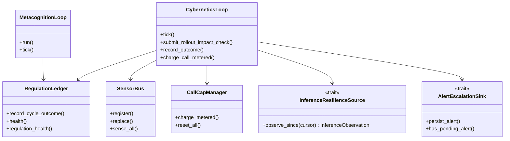
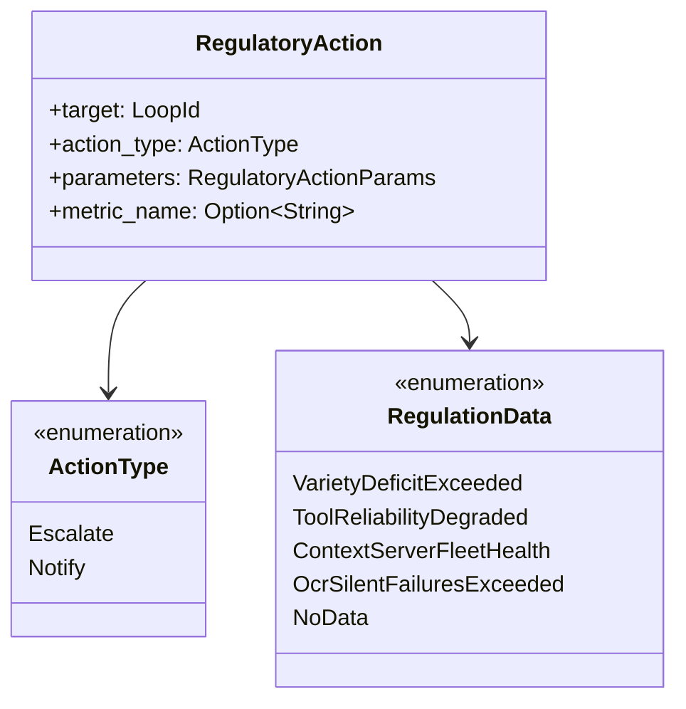
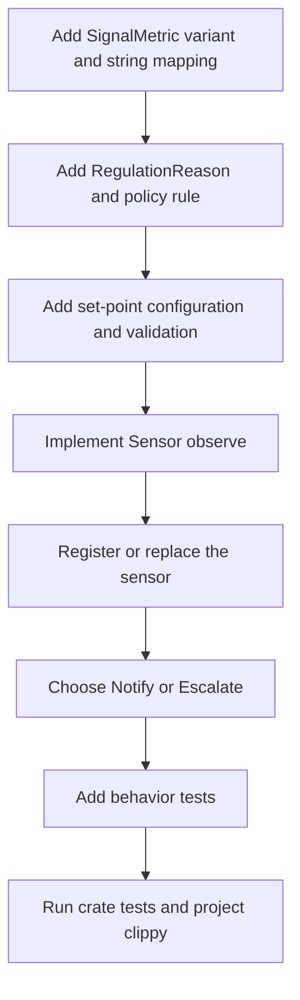

# hkask-regulation — Reference

`hkask-regulation` provides the central homeostatic loop, process-global ledger,
per-agent call caps, algedonic escalation, metacognition, sensors, policy, and the
typed inference-resilience observation seam. Its design is constrained by Ashby's
Law of Requisite Variety.[^ashby]

## Module inventory

The crate root declares the current inventory at
`kask/crates/hkask-regulation/src/hkask_regulation.rs:9-24`.

| Module | Responsibility | Evidence |
|---|---|---|
| `algedonic` | runtime alerts and escalation/email sink traits | `kask/crates/hkask-regulation/src/algedonic.rs:22-119` |
| `cybernetics_loop` | sense→compare→compute→act→verify orchestration | `kask/crates/hkask-regulation/src/cybernetics_loop.rs:197-202,653-664,780-850` |
| `dampener` | directive deduplication and stagnation detection | `kask/crates/hkask-regulation/src/dampener.rs:100-110,231-263` |
| `energy` | per-agent governed-call caps | `kask/crates/hkask-regulation/src/energy.rs:26-134` |
| `inference_resilience` | typed snapshots, receipts, and observation source | `kask/crates/hkask-regulation/src/inference_resilience.rs:8-80` |
| `metacognition` | health observation of the regulator itself | `kask/crates/hkask-regulation/src/metacognition.rs:167-260,410-447` |
| `regulation_policy` | metric-to-disposition rules | `kask/crates/hkask-regulation/src/regulation_policy.rs:18-102` |
| `set_points` | defaults, configuration, loading, and validation | `kask/crates/hkask-regulation/src/set_points.rs:10-114,182-253,315-459` |
| `loops` | shared loop, signal, deviation, and action types | `kask/crates/hkask-regulation/src/loops.rs:9-18` |
| `sensor_provider` | sensor trait, registry, and built-in sensors | `kask/crates/hkask-regulation/src/sensor_provider.rs:27-71` |
| `strategy_evaluator` | evidence-based strategy scoring | `kask/crates/hkask-regulation/src/strategy_evaluator.rs:16-119` |
| `extrapolation` | moving-average metric prediction | `kask/crates/hkask-regulation/src/extrapolation.rs:12-117` |
| `runtime` | ledger, variety/outcome trackers, and event sink | `kask/crates/hkask-regulation/src/runtime.rs:51-153,509-617` |

## Public surface

The crate root re-exports its supported cross-crate surface at
`kask/crates/hkask-regulation/src/hkask_regulation.rs:25-53`.

| Cluster | Public items |
|---|---|
| Alerts | `AlertDeliveryOutcome`, `AlertEmailSink`, `AlertEscalationSink`, `AlertPersistError`, `RuntimeAlert` |
| Loop | `CyberneticsLoop`, `RolloutEventError`, `RolloutEventSource`, `RolloutImpactSubmission`, `RolloutMetricObservation` |
| Loop views | `LivenessTrust`, `LoopModel`, `LoopView`, `OutcomeTrust`, `Reading`, `SenseReading`, `StageActions`, `TriggerOrigin` |
| Call caps | `CallMeterOutcome`, `DEFAULT_RUNAWAY_CALL_CEILING` |
| Inference resilience | `InferenceCircuitState`, `InferenceInterventionKind`, `InferenceInterventionReceipt`, `InferenceObservation`, `InferenceObservationError`, `InferencePermanentFailureKind`, `InferencePermanentFailureReceipt`, `InferenceResilienceSource`, `InferenceSnapshot` |
| Metacognition | `AlertEvent`, `AlertSink`, `HealthSnapshot`, `MetacognitionLoop` |
| Runtime | `NoopEventSink`, `OBSERVATION_WINDOW_SECS`, `OperatorFeedbackObservation`, `RegulationLedger` |
| Sensor seams | `ContextServerHealthSource`, `MemoryHealthSource`, `OcrHealthError`, `OcrHealthSource` |
| Set-points and alert identity | `SetPoints`, `load_set_points`, `DEFAULT_VARIETY_MAX_DEFICIT`, `alert_condition` |

## Responsibility map


```mermaid
classDiagram
    class CyberneticsLoop {
        +tick()
        +submit_rollout_impact_check()
        +record_outcome()
        +charge_call_metered()
    }
    class RegulationLedger {
        +record_cycle_outcome()
        +health()
        +regulation_health()
    }
    class SensorBus {
        +register()
        +replace()
        +sense_all()
    }
    class CallCapManager {
        +charge_metered()
        +reset_all()
    }
    class InferenceResilienceSource {
        <<trait>>
        +observe_since(cursor) InferenceObservation
    }
    class MetacognitionLoop {
        +run()
        +tick()
    }
    class AlertEscalationSink {
        <<trait>>
        +persist_alert()
        +has_pending_alert()
    }
    CyberneticsLoop --> RegulationLedger
    CyberneticsLoop --> SensorBus
    CyberneticsLoop --> CallCapManager
    CyberneticsLoop --> InferenceResilienceSource
    CyberneticsLoop --> AlertEscalationSink
    MetacognitionLoop --> RegulationLedger
```

<!-- DIAGRAM_ALIGNMENT
id: DIAG-REG-003
verified_date: 2026-09-28
verified_against: kask/crates/hkask-regulation/src/cybernetics_loop.rs:197-202,566-664,780-850; kask/crates/hkask-regulation/src/runtime.rs:509-617; kask/crates/hkask-regulation/src/sensor_provider.rs:45-80; kask/crates/hkask-regulation/src/energy.rs:131-230; kask/crates/hkask-regulation/src/inference_resilience.rs:68-80; kask/crates/hkask-regulation/src/metacognition.rs:260-447; kask/crates/hkask-regulation/src/algedonic.rs:97-119
status: VERIFIED
-->

## Central dispositions

`ActionType` is exactly:


```mermaid
classDiagram
    class ActionType {
        <<enumeration>>
        Escalate
        Notify
    }
    class RegulatoryAction {
        +target: LoopId
        +action_type: ActionType
        +parameters: RegulatoryActionParams
        +metric_name: Option~String~
    }
    class RegulationData {
        <<enumeration>>
        VarietyDeficitExceeded
        ToolReliabilityDegraded
        ContextServerFleetHealth
        OcrSilentFailuresExceeded
        NoData
    }
    RegulatoryAction --> ActionType
    RegulatoryAction --> RegulationData
```

<!-- DIAGRAM_ALIGNMENT
id: DIAG-REG-004
verified_date: 2026-09-28
verified_against: kask/crates/hkask-regulation/src/loops/actions.rs:12-43,77-148
status: VERIFIED
-->

| Disposition | Implemented behavior | Evidence |
|---|---|---|
| `Notify` | Logs an informational observation and returns without incident routing | `kask/crates/hkask-regulation/src/cybernetics_loop/cycle.rs:570-577` |
| `Escalate` | Requires target `LoopId::Curation`; otherwise rejects the disposition | `kask/crates/hkask-regulation/src/cybernetics_loop/cycle.rs:578-585` |
| `Escalate` to Curation | Delivers to the review board first (repeat observations on an open card are suppressed), attempts live Curation delivery, then uses archive/email fallbacks | `kask/crates/hkask-regulation/src/cybernetics_loop/cycle.rs:587-720` |

No other central disposition or generic automatic-control extension point is
implemented.

## Inference-resilience contract

The bridge owns enforcement; Regulation consumes observations.

| Surface | Contract | Evidence |
|---|---|---|
| Circuit states | `Closed`, `Open`, `HalfOpen` | `kask/crates/hkask-regulation/src/inference_resilience.rs:10-16` |
| Intervention receipts | opened, half-opened, closed, reopened with shared monotonic IDs | `kask/crates/hkask-regulation/src/inference_resilience.rs:18-32` |
| Permanent failures | authorization, configuration, model, provider | `kask/crates/hkask-regulation/src/inference_resilience.rs:34-48` |
| Snapshot | observation time, in-flight count, maximum concurrency, timeout count, circuit state | `kask/crates/hkask-regulation/src/inference_resilience.rs:50-57` |
| Observation | snapshot, both receipt streams, and `next_cursor` | `kask/crates/hkask-regulation/src/inference_resilience.rs:59-66` |
| Source | `observe_since(cursor)` returns coherent later receipts | `kask/crates/hkask-regulation/src/inference_resilience.rs:68-80` |
| Reconciliation | merge, sort, reject sequence gaps, acknowledge only handled events | `kask/crates/hkask-regulation/src/cybernetics_loop/cycle.rs:189-206,291` |

Initial open and half-open receipts persist as circuit transitions. A close persists
`reg.inference.observed_recovery` with unverified causal attribution. A reopen or
permanent failure escalates to Curation
(`kask/crates/hkask-regulation/src/cybernetics_loop/cycle.rs:213-285`).

## Call-cap contract

`CallCapManager` provides a per-agent hard ceiling. `charge_metered` registers an
unknown agent at `DEFAULT_RUNAWAY_CALL_CEILING`, charges one unit, and returns a
`CallMeterOutcome` (`kask/crates/hkask-regulation/src/energy.rs:26-41,131-194`).
Curation overrides survive `reset_all` until cleared
(`kask/crates/hkask-regulation/src/energy.rs:124-133,216-230`). The central loop observes
exhaustion before resetting caps each tick
(`kask/crates/hkask-regulation/src/cybernetics_loop/cycle.rs:480-509`).

## Procedures

### Add a Regulation sensor

Use this procedure to add one observable metric to the Cybernetics Loop. A sensor
produces a current `Signal`; policy compares that signal with a set-point and
chooses one truthful central disposition: `Notify` or `Escalate`. The sensor
interface separates domain observation from the fitting loop, following the
extractor separation associated here with Fermi's measurement practice.[^fermi]

#### Current extension points

| Extension point | Current location |
|---|---|
| `Sensor` trait | `kask/crates/hkask-regulation/src/sensor_provider.rs:27-35` |
| `SensorBus` registry | `kask/crates/hkask-regulation/src/sensor_provider.rs:45-80` |
| `SignalMetric` | `kask/crates/hkask-regulation/src/loops/signals.rs:14-112` |
| `Signal` and `Deviation` | `kask/crates/hkask-regulation/src/loops/signals.rs:279-386` |
| `RegulationPolicy` | `kask/crates/hkask-regulation/src/regulation_policy.rs:90-102` |
| `SetPoints` | `kask/crates/hkask-regulation/src/set_points.rs:110-459` |
| Sensor wiring | `kask/crates/hkask-regulation/src/cybernetics_loop.rs:290-337` |
| Central dispositions | `kask/crates/hkask-regulation/src/loops/actions.rs:143-160` |

The procedure:


```mermaid
flowchart TD
    A[Add SignalMetric variant and string mapping] --> B[Add RegulationReason and policy rule]
    B --> C[Add set-point configuration and validation]
    C --> D[Implement Sensor observe]
    D --> E[Register or replace the sensor]
    E --> F[Choose Notify or Escalate]
    F --> G[Add behavior tests]
    G --> H[Run crate tests and project clippy]
```

<!-- DIAGRAM_ALIGNMENT
id: DIAG-REG-002
verified_date: 2026-09-28
verified_against: kask/crates/hkask-regulation/src/sensor_provider.rs:27-80; kask/crates/hkask-regulation/src/cybernetics_loop.rs:290-337; kask/crates/hkask-regulation/src/loops/signals.rs:14-112,279-386; kask/crates/hkask-regulation/src/regulation_policy.rs:90-102; kask/crates/hkask-regulation/src/loops/actions.rs:143-160; kask/crates/hkask-regulation/src/set_points.rs:110-459
status: VERIFIED
-->

#### 1. Add the metric identity

Add a variant to `SignalMetric` and its stable snake-case mapping in `as_str()`
(`kask/crates/hkask-regulation/src/loops/signals.rs:14-112`). If the metric can
arrive by name, update `from_str_name()` in the same file. The stable identity is
used by observations, policy matching, and impact checks.

#### 2. Add the reason and policy rule

Add a `RegulationReason` variant and its wire string
(`kask/crates/hkask-regulation/src/regulation_policy.rs:18-63`). Add one
`RegulationRule` to `RegulationPolicy::default()` with the metric, deviation
direction, target, reason, and an `ActionType`
(`kask/crates/hkask-regulation/src/regulation_policy.rs:102-349`).

Choose only:

- `Notify` for an informational observation that requires no intervention.
- `Escalate` for an evidence-bearing condition requiring Curation or human review.

Do not add an action label without an implemented handler. Automatic control
belongs in a target-local controller with a typed observation or receipt seam back
to Regulation. The implemented central action enum is exactly
`Escalate | Notify` (`kask/crates/hkask-regulation/src/loops/actions.rs:143-148`).

#### 3. Add the set-point

Add the field to `SetPoints` and `SetPointsConfig`, declare its default once as a
`DEFAULT_*` constant, map it in `from_config`, and add range or ordering checks in
`validate()` when applicable
(`kask/crates/hkask-regulation/src/set_points.rs:10-114,182-253,315-459`).

#### 4. Implement `Sensor::observe`

Implement `Sensor` in `kask/crates/hkask-regulation/src/sensor_provider.rs`.
Return healthy and degraded current observations; return `None` only when no
current observation is available. Healthy readings are required so durable
conditions can later be reconciled as recovered. `Signal::new` stamps the
observation time (`kask/crates/hkask-regulation/src/loops/signals.rs:319-330`).

For a source exposing several independent conditions, use one sensor identity per
metric so one deficit cannot hide another metric's recovery.

#### 5. Wire the sensor

For a startup-stable source, register the sensor in `CyberneticsLoop::build`
(`kask/crates/hkask-regulation/src/cybernetics_loop.rs:290-337`). For a source
that can be rewired after startup, replace the provider by metric identity through
`SensorBus::replace` rather than registering a duplicate
(`kask/crates/hkask-regulation/src/sensor_provider.rs:64-71`).

#### 6. Pin the behavior

Add tests that prove:

1. healthy and deviating values produce the expected signal/deviation behavior;
2. the policy emits exactly one intended `Notify` or `Escalate` disposition; and
3. the disposition reaches its implemented observation or review path.

Run from the repository root:

```sh
cargo test -p hkask-regulation
./script/clippy
```

#### Wiring checklist

- [ ] Metric variant and stable string mappings
- [ ] Reason variant and policy rule
- [ ] Set-point default, config mapping, and validation
- [ ] Healthy and degraded `observe()` results
- [ ] Static registration or metric-keyed replacement
- [ ] `Notify` or Curation-targeted `Escalate`
- [ ] Behavior tests and validation commands

## See also

- [Why Regulation separates observation, advice, and local control](./explanation.md)

---

[^ashby]: Ashby, W. R. (1956). *An Introduction to Cybernetics.* Chapman & Hall. <https://archive.org/details/introductiontocy00ashb>.
[^fermi]: Fermi, E. (1946). *Lectures on neutrons.* In J. Orear, A. H. Rosenfeld, & R. A. Schluter (Eds.), *Nuclear Physics* (1950 ed.). University of Chicago Press.
[^conant-ashby]: Conant, R. C., & Ashby, W. R. (1970). *Every good regulator of a control system must be a model of that system.* International Journal of Systems Science, 1(2), 89–97. <https://www.tandfonline.com/doi/abs/10.1080/00207727008902020>.