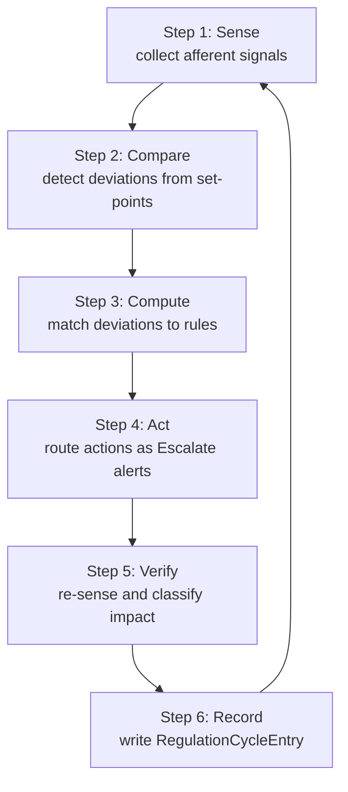

# hkask-regulation — Tutorial: Reading a Regulation Cycle

This tutorial walks through one execution of `CyberneticsLoop::tick()` — the
sense→compare→compute→act→verify cycle that drives hKask's homeostatic
self-regulation. By the end you will be able to read a `RegulationCycleEntry`
and trace each of its fields back to the phase that produced it.

The crate lives at `kask/crates/hkask-regulation/`. Its public surface is
re-exported from `kask/crates/hkask-regulation/src/hkask_regulation.rs:24-39`.

## Source citations

| Symbol | Location |
|--------|----------|
| `CyberneticsLoop::tick` (cycle entry point) | `kask/crates/hkask-regulation/src/cybernetics_loop.rs:721` |
| `CyberneticsLoop::sense` | `kask/crates/hkask-regulation/src/cybernetics_loop/cycle.rs:253` |
| `CyberneticsLoop::compare` | `kask/crates/hkask-regulation/src/cybernetics_loop/cycle.rs:248` |
| `CyberneticsLoop::compute` | `kask/crates/hkask-regulation/src/cybernetics_loop/cycle.rs:350` |
| `CyberneticsLoop::act` | `kask/crates/hkask-regulation/src/cybernetics_loop/cycle.rs:408` |
| `CyberneticsLoop::verify_impact` | `kask/crates/hkask-regulation/src/cybernetics_loop/cycle.rs:684` |
| `RegulationCycleEntry` (cycle record) | `kask/crates/hkask-regulation/src/runtime.rs:406` |
| `RegulationLedger::record_regulation_cycle` | `kask/crates/hkask-regulation/src/runtime.rs:562` |
| `LoopMetrics::from_cycle` (quality telemetry) | `kask/crates/hkask-regulation/src/loops/core.rs:241` |
| `RegulationPolicy::decide` (rule lookup) | `kask/crates/hkask-regulation/src/regulation_policy.rs:379` |
| `SensorBus::sense_all` (pluggable sensors) | `kask/crates/hkask-regulation/src/sensor_provider.rs:57` |

## Learning path

<!-- DIAGRAM_ALIGNMENT
id: DIAG-REG-001
verified_date: 2026-08-31
verified_against: kask/crates/hkask-regulation/src/cybernetics_loop.rs:721; kask/crates/hkask-regulation/src/cybernetics_loop/cycle.rs:253,248,350,408,684; kask/crates/hkask-regulation/src/runtime.rs:406,562
status: VERIFIED
-->

## Step 1: Sense — collect afferent signals

The cycle begins in `CyberneticsLoop::sense()` (`cycle.rs:253`). It first
drains the curator-directive inbox via `process_inbox()`
(`cybernetics_loop.rs:697`), so any `CuratorDirective` from the Curation
loop is applied before sensing. Then it calls
`SensorBus::sense_all(LoopId::Cybernetics)` (`sensor_provider.rs:57`), which
walks every registered `Sensor` and collects the `Signal`s they emit. It
also senses the in-memory algedonic log cap directly
(`cycle.rs:272-279`) — when the log approaches its cap, an
`AlgedonicLogApproachingCap` signal fires so the operator (or the
`algedonic-review` skill) can review entries before eviction.

The default sensor registry, built in `CyberneticsLoop::build()`
(`cybernetics_loop.rs:248-279`), registers five sensors:

- `EnergyBudgetSensor` (`sensor_provider.rs:79`) — emits `EnergyRemaining`.
- `VarietySensor` (`sensor_provider.rs:126`) — emits `VarietyDeficit`.
- `TestCoverageSensor` (`sensor_provider.rs:251`) — emits `TestCoverage`.
- `MutationScoreSensor` (`sensor_provider.rs:382`) — emits `MutationScore`.
- `ToolReliabilitySensor` (`sensor_provider.rs:331`) — emits
  `ToolReliability`.

Additional health sensors (`InferenceHealthSensor`, `ContextServerHealthSensor`,
`MemoryHealthSensor`) are registered when their sources are wired via the
`with_*_health_source` builders (`cybernetics_loop.rs:479,520,558`). Each
`Signal` carries a `source` (`LoopId::Cybernetics`), a `metric`
(`SignalMetric`), a `value`, and the `set_point` it is being compared
against.

At the end of the sense phase, the simulator observes each value:
`self.simulator.observe(signal.metric, signal.value)` (`cycle.rs:342-344`).

## Step 2: Compare — detect deviations

`CyberneticsLoop::compare()` (`cycle.rs:248`) is a one-liner: it filters
each `Signal` through `Deviation::from_signal` (`loops/signals.rs:256`),
which returns `None` when the value equals the set-point and
`Some(Deviation)` otherwise. A `Deviation` records the `magnitude`
(absolute difference) and `direction` (`AboveSetPoint` or
`BelowSetPoint`).

## Step 3: Compute — match deviations to rules

`CyberneticsLoop::compute()` (`cycle.rs:350`) first runs the predictive
simulator: for each deviation it calls
`MovingAverageExtrapolator::predict` (`system_simulator.rs:55`) and, if the
metric is within 3 ticks of its set-point with a reliable trend, logs a
`Predictive: metric approaching set-point` observation (`cycle.rs:362-370`)
— logged, not routed, so the action count stays honest.

It then walks the `RegulationPolicy::default()` rules
(`regulation_policy.rs:119`) via `decide()` (`regulation_policy.rs:379`),
which returns the `&ProposedAction`s whose `metric` and `direction` match
the deviation. Each proposal is converted to a `RegulatoryAction` by
`build_regulation_action` (`cycle.rs:1080`), which applies mode-specific
filtering (e.g., `InferenceThrottleMode::Autonomous` gates the
`EnergyBudgetLow` rule) and `try_substitute` (`cycle.rs:31`) for
stagnation-based action substitution.

## Step 4: Act — route actions as Escalate alerts

`CyberneticsLoop::act()` (`cycle.rs:408`) first calls `reset_all_caps()`
(`cybernetics_loop.rs:689`) — one regulation tick resets every agent's call
cap to its ceiling. It then detects call-cap exhaustion via
`CallCapManager::all_agent_statuses()` (`energy.rs:205`) and emits a
`Warning` alert for each exhausted agent (`cycle.rs:411-479`).

Each action is routed through `route_action_as_alert` (`cycle.rs:510`).
The loop is a sensor+advisor, not an actuator: every computed action is
converted to an `Escalate` alert and routed through a three-tier path:

1. **Escalation queue** — `persist_alert_to_queue` (`cycle.rs:147`) writes
   the alert to the `AlertEscalationSink` (the `EscalationQueue` on the
   curator's `curator.db`). This is the primary durable path for alert
   review.
2. **Live channel** — `alerts_tx.send(CurationInput::Alert(...))` delivers
   the alert to the Curation loop's inbox.
3. **Archive fallback** — if the live channel is down, the alert is
   persisted to the `RegulationSink` (`RegulationArchive` on `curator.db`)
   for restart durability, and optionally emailed via `AlertEmailSink`.

`Notify` actions are skipped — they are observational, not actionable.

## Step 5: Verify — re-sense and classify impact

`CyberneticsLoop::verify_impact()` (`cycle.rs:684`) re-senses the metrics
targeted by the previous cycle's actions and compares post-action values
against pre-action values. For each action it computes an `ImpactReport`
(`loops/core.rs:80`) with a three-tier `ActionDecision`
(`loops/core.rs:173`):

- **Accept** — action improved the metric or worsened within noise tolerance.
- **Stage** — action was moderately ineffective; escalate as Warning.
- **Block** — action was severely counterproductive; prevent re-use.

Classification uses `classify_decision` (`regulation_policy.rs:566`) with
the `stage_worsening_ratio` (default 0.05) and `block_worsening_ratio`
(default 0.20) from `SetPoints` (`set_points.rs:108,114`).

When a `RolloutEventSource` is wired (`cybernetics_loop.rs:205`),
`verify_impact` queries it for before/after metric values on rollouts the
action targeted, and writes its impact verdict back to the event store as
a `regulation_impact`-sourced verdict event (`cybernetics_loop.rs:73-110`).
Externally-submitted rollout checks (via `submit_rollout_impact_check`,
`cybernetics_loop.rs:609`) are drained into the current tick's verification
pass (`cybernetics_loop.rs:739-750`).

The `StagnationDetector` (`dampener.rs:231`) records each (metric, action)
pair's outcome. When the same pair is rejected for `substitution_after`
cycles (default 2), `try_substitute` walks the substitution ladder
(`regulation_policy.rs:589`). When it hits the per-metric stagnation
threshold (default 5), a regulatory-plateau alert fires.

## Step 6: Record — write the RegulationCycleEntry

After verify, `tick()` aggregates the cycle's counts and calls
`RegulationLedger::record_regulation_cycle` (`runtime.rs:562`) with a
`RegulationCycleEntry` (`runtime.rs:406`):

| Field | Source phase |
|-------|--------------|
| `timestamp` | end of cycle |
| `signals` | sense — `signals.len()` |
| `deviations` | compare — `deviations.len()` |
| `actions` | compute — `actions.len()` |
| `verified` | verify — `impact_reports.len()` |
| `accepted` / `staged` / `blocked` | verify — `ActionDecision` counts |
| `cumulative_effectiveness` | ledger — `regulation_health()` |

Finally, `LoopMetrics::from_cycle` (`loops/core.rs:241`) computes quality
telemetry, and `tick()` stores it in `loop_quality` for the next
`loop_quality()` query (`cybernetics_loop.rs:847`). The cycle also emits a
`reg.runtime.select` telemetry span with the signal count
(`cybernetics_loop.rs:732-736`).

## See also

- [hkask-regulation Reference](./reference.md): class diagram of the
  ledger, loop, and call-cap types.
- [hkask-regulation How-to](./how-to.md): adding a new sensor.
- [hkask-regulation Explanation](./explanation.md): why the loop is a
  sensor+advisor, not an actuator.

---

[^conant-ashby]: Conant, R. C., & Ashby, W. R. (1970). *Every good regulator of a control system must be a model of that system.* International Journal of Systems Science, 1(2), 89–97. <https://www.tandfonline.com/doi/abs/10.1080/00207727008902020>.
[^ashby]: Ashby, W. R. (1956). *An Introduction to Cybernetics.* Chapman & Hall. <https://archive.org/details/introductiontocy00ashb>.
