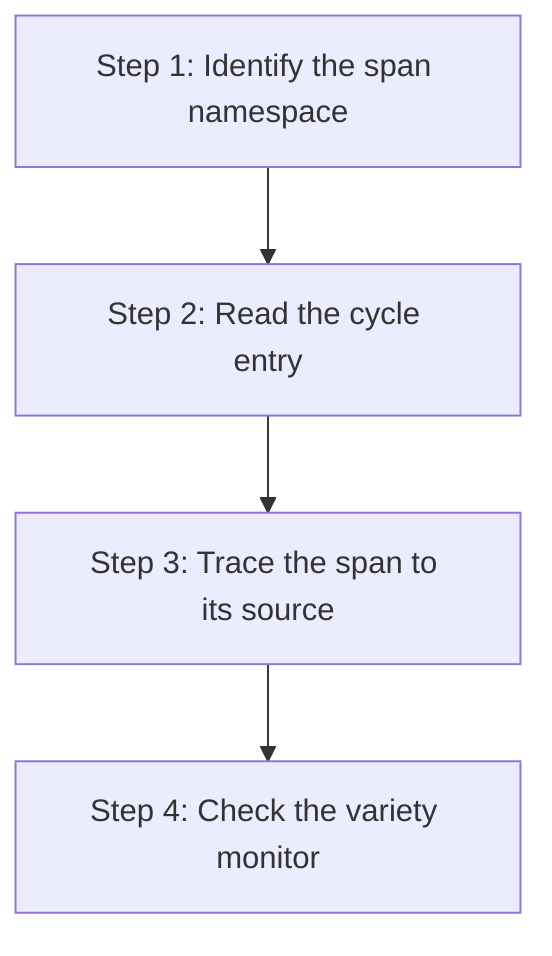

# hkask-regulation — Tutorial: Reading a Regulation Span

This tutorial shows how to read and interpret a Regulation observable span.
Regulation spans are the telemetry that the cybernetic loop consumes to
monitor agent behavior.

## Learning path

<!-- DIAGRAM_ALIGNMENT
id: DIAG-DIA-REG-003
verified_date: 2026-07-29
verified_against: kask/crates/hkask-regulation/src/runtime.rs:405,343,276; kask/crates/hkask-regulation/src/qa_span.rs:13
status: VERIFIED
-->

## Steps 1-2: Identify the namespace and read the cycle entry

Regulation spans use the `reg.*` namespace. The `RegulationLedger`
(`runtime.rs:405`) records each cycle as a `RegulationCycleEntry`
(`runtime.rs:343`). Each entry has a `timestamp`, a `signals` count (afferent
signals from the sense phase), a `deviations` count (from compare), an
`actions` count (from compute), a `verified` count (from verify), and
decision counts (`accepted`, `staged`, `blocked`) from impact verification.

Skill-feedback spans are stored separately in `StoredSkillSpan`
(`runtime.rs:57`), keyed by `skill_id` and `phase` (`outcome` or
`operator_feedback`), and queried via `RegulationLedger::query_skill_feedback`.

## Steps 3-4: Trace the source and check variety

Trace the span to its emission point in the source code. Check the
`VarietyMonitor` (`runtime.rs:276`) to see whether the span's domain has
sufficient variety. The monitor counts distinct states per domain via
`VarietyTracker` counters; a deficit (expected minus actual) that exceeds
the `AlgedonicManager` threshold triggers an algedonic `RuntimeAlert`.

## See also

- [hkask-regulation Reference](./reference.md): class diagram of the
  ledger and loop.
- [hkask-regulation How-to](./how-to.md): adding a new span namespace.

---

[^conant-ashby]: Conant, R. C., & Ashby, W. R. (1970). *Every good regulator of a control system must be a model of that system.* International Journal of Systems Science, 1(2), 89-97. <https://www.tandfonline.com/doi/abs/10.1080/00207727008902020>.
