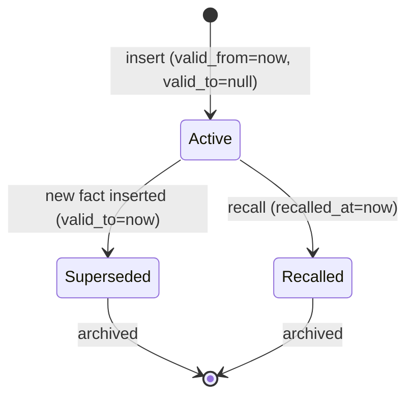

# hkask-storage — Explanation: Bitemporal hMem Model

The `hmems` table stores entity-attribute-value triples with bitemporal
semantics. Each triple carries two time axes: `valid_time` (when the fact was
true in the world, encoded as `valid_from`/`valid_to`) and `transaction_time`
(when the fact was recorded in the database, encoded as `transaction_at`).
This design allows the system to answer both "what did we know at time T?"
and "what was true at time T?".

## Source citations

| Symbol | Location |
|--------|----------|
| `hmems` table | `kask/crates/hkask-storage/src/sql/schema.sql:1` |
| `valid_from` column | `kask/crates/hkask-storage/src/sql/schema.sql:1` |
| `valid_to` column | `kask/crates/hkask-storage/src/sql/schema.sql:1` |
| `transaction_at` column | `kask/crates/hkask-storage/src/sql/schema.sql:1` |
| `recalled_at` column | `kask/crates/hkask-storage/src/sql/schema.sql:1` |
| `HMemEntry` struct | `kask/crates/hkask-types/src/hkask_types.rs` |

## Bitemporal state machine

<!-- DIAGRAM_ALIGNMENT
id: DIAG-DIA-STOR-004
verified_date: 2026-07-29
verified_against: kask/crates/hkask-storage/src/sql/schema.sql:1
status: VERIFIED
-->

## Why bitemporal

A single time axis cannot answer both "what did we know?" and "what was
true?" If a fact is corrected after it was recorded, a single-axis model
either loses the correction history or loses the original record. The
bitemporal model preserves both: the `valid_time` axis (encoded in
`valid_from`/`valid_to`) tracks when the fact was true, and the
`transaction_time` axis (encoded in `transaction_at`) tracks when the
database recorded it.

The `recalled_at` column marks when a fact was explicitly recalled (soft
deleted). A recalled fact is not physically deleted; it is marked with a
timestamp. This preserves the audit trail.

## See also

- [hkask-storage Reference](./reference.md): ERD of the full schema.
- [`kask/docs/architecture/core/PRINCIPLES.md`](../../architecture/core/PRINCIPLES.md):
  P1 (User Sovereignty) and P5.4 (dual-axis ontology).

---

[^snodgrass]: Snodgrass, R. T. (1999). *Developing Time-Oriented Database Applications in SQL.* Morgan Kaufmann. <https://www.cs.arizona.edu/people/rts/tdbbook.pdf>. The bitemporal model that the `hmems` table implements.
