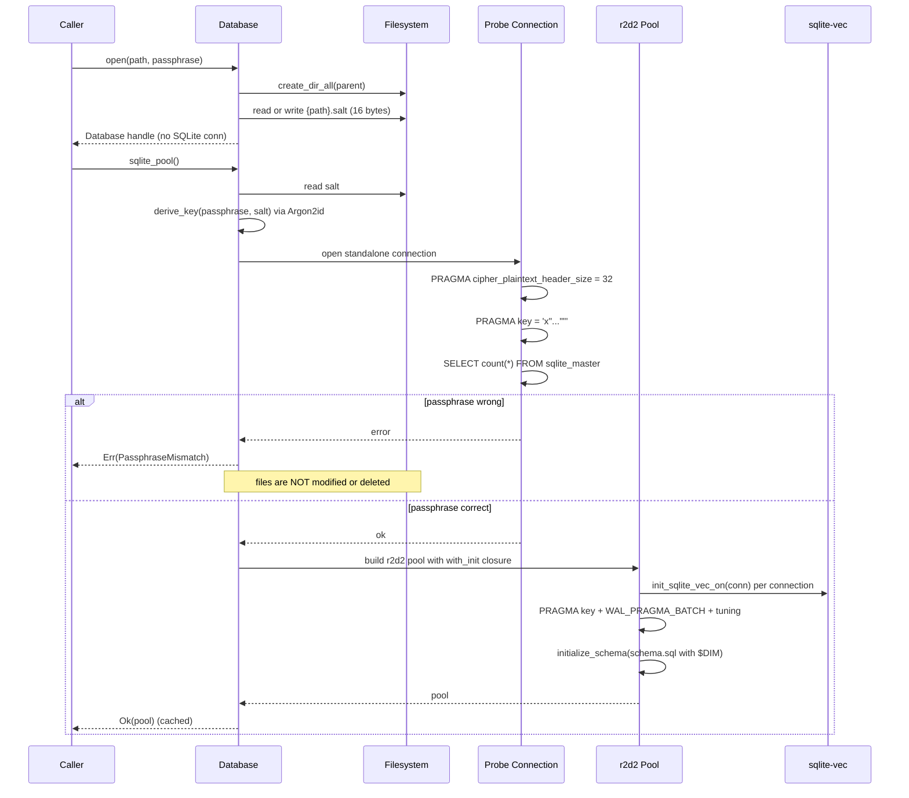
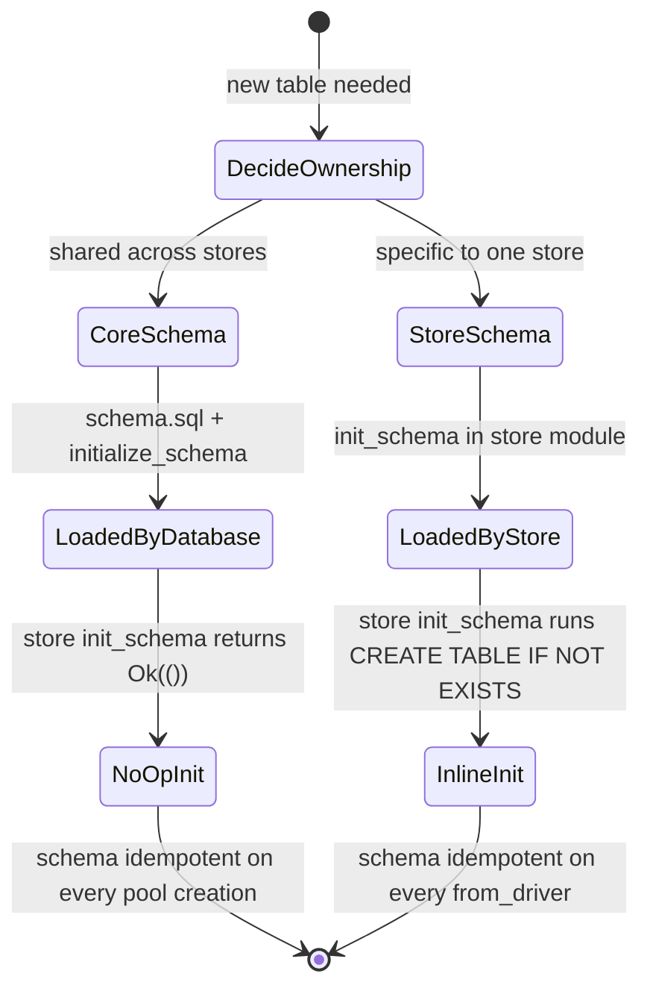

# hkask-storage — Explanation: Why Database Splits from SqliteDriver

The consolidated `hkask-storage` crate separates two concerns that the
pre-merge crates tangled: `Database` handles file infrastructure (the
SQLCipher salt file, parent directories, passphrase validation), and
`SqliteDriver` handles everything SQLite-related (the r2d2 pool, PRAGMAs,
schema initialization, query dispatch). This split is not aesthetic — it
eliminates the dual-path bugs that the consolidation was commissioned to
fix, and it lets stores code against a provider-agnostic port
(`DatabaseDriver`) instead of `rusqlite::Connection` directly[^fowler-poeaa].

## Source citations

| Symbol | Location |
|--------|----------|
| `Database` struct (path + passphrase + pool_cache) | `kask/crates/hkask-storage/src/core/database.rs:104-110` |
| `Database::open_impl` (file infra, no SQLite) | `kask/crates/hkask-storage/src/core/database.rs:117-175` |
| `Database::sqlite_pool` (cached r2d2 pool) | `kask/crates/hkask-storage/src/core/database.rs:222-244` |
| `file_pool` (passphrase probe before pool) | `kask/crates/hkask-storage/src/core/database.rs:297-395` |
| `in_memory_pool` (max_size 1) | `kask/crates/hkask-storage/src/core/database.rs:272-295` |
| `DatabaseError::PassphraseMismatch` | `kask/crates/hkask-storage/src/core/database.rs:89-90` |
| `open_or_repair` (never deletes files) | `kask/crates/hkask-storage/src/core/database.rs:427-431` |
| `init_sqlite_vec_on` (per-connection, before schema) | `kask/crates/hkask-storage/src/core/database.rs:56-76` |
| `DatabaseDriver` trait (the port) | `kask/crates/hkask-storage/src/database/driver.rs:16-58` |
| `SqliteDriver` (the only impl) | `kask/crates/hkask-storage/src/database/sqlite.rs:42-50` |
| `define_driver_store!` (store boilerplate) | `kask/crates/hkask-storage/src/core/store_macros.rs:44-71` |
| `HMemStore::from_driver` (no re-create of core table) | `kask/crates/hkask-storage/src/hmem.rs:177-184` |
| `KataHistoryStore::init_schema` (no-op for core table) | `kask/crates/hkask-storage/src/kata.rs:36-44` |
| `RegulationArchive::init_schema` (store-specific table) | `kask/crates/hkask-storage/src/regulation_store.rs:78-106` |
| `Encryptor` (ENCv1 transparent encryption) | `kask/crates/hkask-storage/src/database/encrypt.rs:17-115` |
| `BackupArchive` (sovereignty export) | `kask/crates/hkask-storage/src/hmem/archive.rs:56-59` |

## The open/connect sequence

`open()` and `sqlite_pool()` are deliberately separate methods. `open()`
writes the salt file and creates parent directories; `sqlite_pool()` creates
the r2d2 pool, verifies the passphrase with a standalone probe connection,
loads sqlite-vec, sets PRAGMAs, and initializes the schema. One path for
file infrastructure, one path for SQLite — no dual-path bugs.

<!-- DIAGRAM_ALIGNMENT
id: DIAG-STOR-005
verified_date: 2026-08-13
verified_against: kask/crates/hkask-storage/src/core/database.rs:117-175,222-244,272-395,427-431; kask/crates/hkask-storage/src/database/sqlite.rs:24-35
status: VERIFIED
-->

## Why the split exists

### 1. No dual-path passphrase handling

Before the consolidation, `open()` both wrote the salt file and opened a
SQLite connection, so a wrong passphrase could leave the codec in a corrupted
state and SIGSEGV on connection teardown. The new `file_pool` verifies the
passphrase with a **standalone probe connection** before creating the pool
(`core/database.rs:318-326`): a wrong key fails the probe, the pool is never
built, and the codec cleanup runs on the probe alone. The pool only ever
holds connections with a validated key.

`open_or_repair` (`core/database.rs:427-431`) enforces the P1 invariant "a
passphrase mistake never destroys my encrypted database": it calls `open`
then `sqlite_pool`, and on `PassphraseMismatch` it returns the error without
touching the database or salt file. The test at `core/database.rs:451-479`
pins this — a wrong passphrase leaves both files byte-identical.

### 2. `Database` is not `Send`-irrelevant; `SqliteDriver` is the store handle

Stores hold `Arc<dyn DatabaseDriver>`, not `Arc<Database>`. `Database` is a
connection manager with a `Mutex<Option<Pool>>` cache; `SqliteDriver` is the
thin, cloneable, `Send + Sync` handle that the `DatabaseDriver` trait
requires. This lets stores be passed across threads (the regulation loop,
the curator ingest path) without dragging the pool cache's lock along.

### 3. Stores code against a port, not `rusqlite`

The `DatabaseDriver` trait (`database/driver.rs:16-58`) is dyn-compatible:
`execute`, `execute_batch`, `query`, `query_optional`, `commit_tx`,
`rollback_tx`, `as_any`, `sqlite_pool`. Stores call these methods plus the
free-function helpers `query_map` / `query_row` (`database/driver.rs:78-109`)
and never touch `rusqlite::Connection` directly. The one exception is
`EmbeddingStore`, which needs the raw connection for `vec0` MATCH — it
downcasts via `as_any()` and uses `sqlite_pool()` to acquire a connection
(`embeddings.rs:103-107, 281-295`).

The port abstraction earned its keep during consolidation: the
`hkask-database` crate's `DatabaseDriver` trait and the `hkask-storage-core`
crate's `Database` handle merged without touching any store's call sites.
A future Postgres driver would implement the same trait.

## Why per-store `init_schema` instead of a migration runner

The crate has no centralized migration runner. Each store owns its schema
and runs `CREATE TABLE IF NOT EXISTS` during `from_driver` construction.
The `define_driver_store!` macro generates `from_driver` to call
`Self::init_schema(driver)` and propagate any failure, so a store is never
constructed against a missing table (`core/store_macros.rs:44-71`).

Two ownership patterns coexist:

- **Core tables** (`hmems`, `embeddings`, `vec_embeddings`, `audit_log`,
  `kata_history`, `pod_meta`, `agent_registry`, `loop_cursors`,
  `reg_variety_checkpoint`, `reg_alerts`) live in `core/sql/schema.sql` and
  are loaded by `Database::initialize_schema` on every pool creation. Stores
  for these tables implement `init_schema` as a no-op — `KataHistoryStore`
  documents why (`kata.rs:36-44`): re-creating the table here would duplicate
  the schema and drift, because the prior `IF NOT EXISTS` no-op meant the
  live schema depended on which store ran first.
- **Store-specific tables** (`reg_records`, `reg_cursors`, `escalations`,
  the `gallery_*` family) are created inline in the store's `init_schema`.
  `HMemStore::from_driver` explicitly does NOT re-create `hmems`
  (`hmem.rs:170-176`): the prior `CREATE TABLE IF NOT EXISTS` here declared
  `recalled_at TEXT` nullable while `schema.sql` declared it
  `NOT NULL DEFAULT`, and the `IF NOT EXISTS` no-op meant the live schema
  depended on which ran first.

The state machine below shows the schema-ownership decision a contributor
faces when adding a table.

<!-- DIAGRAM_ALIGNMENT
id: DIAG-STOR-006
verified_date: 2026-08-13
verified_against: kask/crates/hkask-storage/src/core/database.rs:206-211; kask/crates/hkask-storage/src/core/store_macros.rs:44-71; kask/crates/hkask-storage/src/kata.rs:36-44; kask/crates/hkask-storage/src/hmem.rs:170-184; kask/crates/hkask-storage/src/regulation_store.rs:78-106
status: VERIFIED
-->

## Why the in-memory pool is `max_size(1)`

`SqliteConnectionManager::memory()` creates a separate in-memory database
per connection. A pool size greater than 1 would scatter writes across
independent databases, breaking read-your-writes semantics for tests
(`core/database.rs:272-295`). The file pool, by contrast, defaults to
`max_size(8)` (overridable via `HKASK_DB_POOL_SIZE`, with a `warn!` on
malformed values per the `.rules` trap on numeric env vars).

## Why sqlite-vec is loaded per-connection

`init_sqlite_vec_on` (`core/database.rs:56-76`) loads the `vec0` extension
into each connection via the r2d2 `with_init` closure, before schema init
(which creates `vec0` virtual tables). This avoids `sqlite3_auto_extension`,
whose process-global registration is deprecated on Apple platforms and is a
known teardown-segfault source. Scoping the extension's lifetime to each
connection means its state is torn down with the connection, not orphaned at
process exit.

## Why `EmbeddingStore` duplicates the vector BLOB

The vector BLOB is stored in both the `embeddings` table (metadata + vector)
and the `vec_embeddings` virtual table (KNN index). `vec0` requires the
vector for its MATCH operator; `embeddings.vector` provides uniform
retrieval via the backend-agnostic `DatabaseDriver` query path
(`get`, `get_all_by_prefix`). Deduplicating would require backend-conditional
retrieval (join `vec0` for the KNN path, read the column for the metadata
path) — more complexity for ~4 KB/embedding savings. The redundancy earns
its keep by preserving the uniform retrieval abstraction
(`embeddings.rs:1-14`).

## Why `HMemStore` has an optional `Encryptor`

`HMemStore::with_passphrase` attaches an `Encryptor` that does transparent
AES-256-GCM encryption of `DbValue::Text` values, with an `ENCv1:` prefix
for automatic detection (`database/encrypt.rs:1-115`). Plaintext passes
through on decrypt, so a store can be migrated from unencrypted to
encrypted without a schema change. The encryption is at the driver level,
not the SQLCipher level: SQLCipher encrypts the whole database file, while
the `Encryptor` encrypts individual text values, so a curator with database
access still cannot read encrypted h_mem values without the value-passphrase.

## Why `BackupArchive` is a separate SQLCipher file

`BackupArchive` (`hmem/archive.rs:56-59`) creates a single SQLCipher-encrypted
SQLite file containing a `backup_meta` table and the user's full live h_mem
set. This is the P1 sovereignty mechanism: a user can export their h_mems
to a downloadable, passphrase-encrypted file and restore them into another
instance. The archive covers SQLite + h_mems only — adapter weight blobs and
GGUFs are not backed up by anything today, and the archive's doc comment
warns against adding a third ad-hoc S3 sync path (`hmem/archive.rs:1-15`).

## See also

- [hkask-storage Reference](./reference.md): ERD of the full schema and the
  `DatabaseDriver` class diagram.
- [hkask-storage How-to](./how-to.md): procedural flowchart for adding a new
  migration.
- [hkask-storage Tutorial](./tutorial.md): the store lifecycle from
  `Database` to CRUD.
- [`kask/docs/architecture/core/PRINCIPLES.md`](../../architecture/core/PRINCIPLES.md):
  P1 (User Sovereignty) governing `open_or_repair` and `BackupArchive`.

---

[^fowler-poeaa]: Fowler, M. (2002). *Patterns of Enterprise Application Architecture.* Addison-Wesley. <https://martinfowler.com/books/eaa.html>. The Repository pattern that motivates coding stores against a port trait instead of a concrete connection.

[^sqlcipher]: Zetetic LLC. (2024). *SQLCipher — Transparent SQLite Encryption.* <https://www.zetetic.net/sqlcipher/>. The encrypted SQLite extension whose codec-state corruption motivated the standalone passphrase probe.
