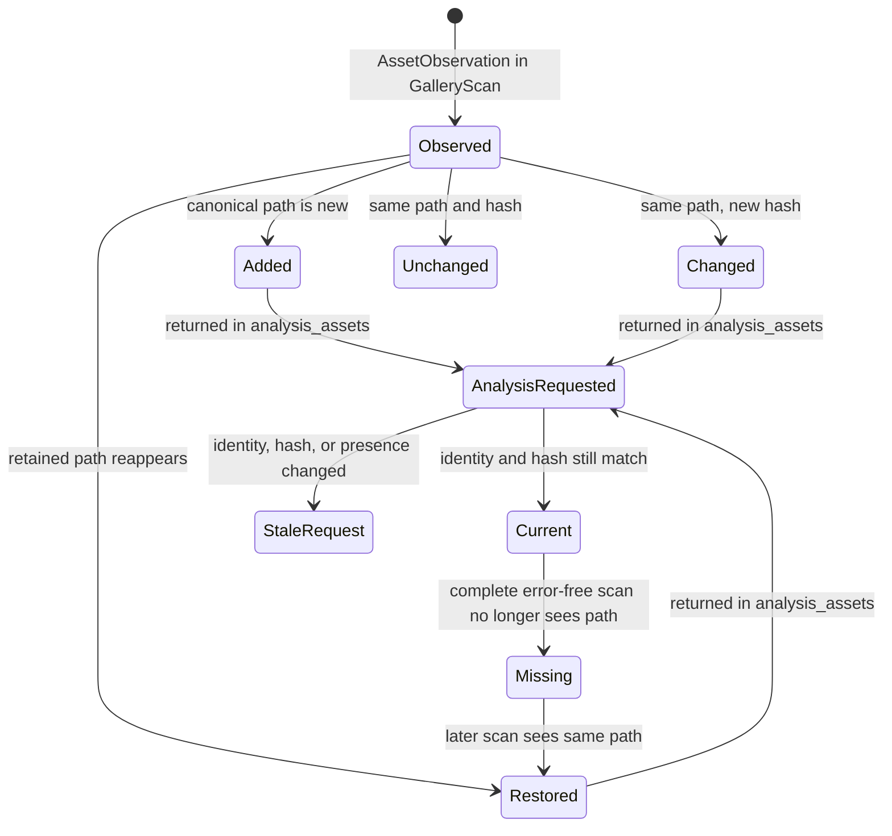

# hkask-storage — Explanation: Boundaries, Maintenance, and Gallery Identity

`hkask-storage` separates connection infrastructure, a database driver port, and
domain stores. `Database` owns path preparation, passphrase validation, SQLCipher
pool creation, maintenance leases, and core-schema initialization
(`kask/crates/hkask-storage/src/core/connection.rs:157-192,194-279,337-366`).
`SqliteDriver` is the cloneable implementation of the provider-neutral
`DatabaseDriver` port
(`kask/crates/hkask-storage/src/database/driver.rs:16-58`;
`kask/crates/hkask-storage/src/database/sqlite.rs:42-102`). This is the Repository
and Data Mapper separation: domain stores depend on a persistence contract rather
than embedding connection management.[^fowler-poeaa]

## Why database encryption is a connection concern

File-backed `Database` pools use SQLCipher page encryption. The passphrase is
applied through `PRAGMA key`; SQLCipher derives the page key and stores its salt in
the database header
(`kask/crates/hkask-storage/src/core/connection.rs:417-445`). `DbValue` is the typed SQL binding representation
(`kask/crates/hkask-storage/src/database/value.rs:8-46`); encryption is supplied
by the SQLCipher-backed connection rather than by field wrappers.[^sqlcipher]

A standalone probe verifies the passphrase before the r2d2 pool is built, so the
pool never retains a connection initialized with a wrong key
(`kask/crates/hkask-storage/src/core/connection.rs:433-445`). In-memory pools are
unencrypted and use one connection because separate SQLite in-memory connections
would be separate databases
(`kask/crates/hkask-storage/src/core/connection.rs:394-415`).

```mermaid
sequenceDiagram
    participant Caller
    participant DB as Database
    participant Inventory as Managed inventory
    participant Lease as Maintenance lease
    participant Probe as SQLCipher probe
    participant Pool as r2d2 pool
    Caller->>DB: open(path, passphrase)
    DB-->>Caller: validated handle
    Caller->>DB: sqlite_pool()
    DB->>Lease: acquire shared database lease
    DB->>Inventory: record canonical managed path
    DB->>Probe: PRAGMA key + sqlite_master query
    alt key rejected
        Probe-->>DB: PassphraseMismatch
        DB-->>Caller: error; source retained
    else key accepted
        DB->>Pool: create initialized leased pool
        Pool-->>Caller: cached pool
    end
```

<!-- DIAGRAM_ALIGNMENT
id: DIAG-STOR-005
verified_date: 2026-09-16
verified_against: kask/crates/hkask-storage/src/core/connection.rs:194-252,337-366,394-466; kask/crates/hkask-storage/src/maintenance_inventory.rs:41-48,103-152
status: VERIFIED
-->

## Why maintenance inventory is an attestation, not a lock

Passphrase rotation needs a complete path set before any key changes. The
`maintenance_inventory` module records managed database paths in a locked JSONL
catalog and can combine configured paths, explicit external paths, and discovered
maintenance markers into a bounded preview
(`kask/crates/hkask-storage/src/maintenance_inventory.rs:1-20,41-152,207-295`).
Missing, corrupt, oversized, or incomplete catalog data is an error rather than an
empty inventory (`kask/crates/hkask-storage/src/maintenance_inventory.rs:57-101`).

`DatabaseInventory::confirm` requires a fresh identical preview, explicit
attestation that historical/external scope is complete, reasons for exclusions,
no unresolved recovery artifacts, and unambiguous file identity
(`kask/crates/hkask-storage/src/maintenance_inventory.rs:297-375`). The resulting
`ConfirmedInventory` is only a receipt for the selected path set; it is not a
quiescence grant and does not rotate or publish a passphrase
(`kask/crates/hkask-storage/src/maintenance_inventory.rs:183-205`).

This separation avoids a dangerous category error: knowing which files exist does
not prove that every process has released them.

## Why gallery identity follows paths rather than hashes

The gallery is an index over user-owned files, not a content-addressed copy. A
`GalleryScan` carries physical `AssetObservation`s plus explicit coverage and
errors; `GalleryStore::reconcile` applies all observations and safe missing
transitions in one immediate transaction
(`kask/crates/hkask-storage/src/gallery.rs:103-135,754-851`). Distinct paths with
equal content remain distinct assets. A changed hash preserves the stable image ID
and marks metadata stale; a missing asset retains its row and can later be restored
(`kask/crates/hkask-storage/src/gallery.rs:726-750,815-851`).



<!-- DIAGRAM_ALIGNMENT
id: DIAG-STOR-006
verified_date: 2026-09-19
verified_against: kask/crates/hkask-storage/src/gallery.rs:103-135,726-750,754-851,868-940
status: VERIFIED
-->

`ReconcileResult::analysis_assets` names the exact added, changed, or restored
records that need analysis; callers do not infer positional ranges
(`kask/crates/hkask-storage/src/gallery.rs:125-135,754-851`). Analysis persistence
checks image ID, gallery ID, hash, and non-missing state before replacing model
metadata, so a response for an old request cannot annotate a newer file revision
(`kask/crates/hkask-storage/src/gallery.rs:868-940`).

Workflow, generation, OMC creation-graph, album, face, and tag records hang from the
same durable asset identity
(`kask/crates/hkask-storage/src/gallery.rs:203-293,307-383`). Deleting an image
therefore relies on foreign-key cascades instead of leaving detached lifecycle
metadata.

## Why schemas remain store-owned

Core tables are initialized from `core/sql/schema.sql`; column-level migrations
run immediately afterward
(`kask/crates/hkask-storage/src/core/connection.rs:272-335`). Domain-specific tables
are created by their stores, including Regulation, escalation, and gallery tables
(`kask/crates/hkask-storage/src/regulation_store.rs:76-104`;
`kask/crates/hkask-storage/src/escalation.rs:83-103`;
`kask/crates/hkask-storage/src/gallery.rs:295-384`). The
`define_driver_store!` macro makes construction fail if a store's schema
initialization fails (`kask/crates/hkask-storage/src/core/store_macros.rs:44-71`).

## See also

- [How to add a store and review maintenance inventory](./how-to.md)
- [hkask-storage reference](./reference.md)
- [Standardized artifact storage](../../architecture/standardized-artifact-storage.md)

---

[^fowler-poeaa]: Fowler, M. (2002). *Patterns of Enterprise Application Architecture.* Addison-Wesley. <https://martinfowler.com/books/eaa.html>.
[^sqlcipher]: Zetetic LLC. (2024). *SQLCipher — Transparent SQLite Encryption.* <https://www.zetetic.net/sqlcipher/>.
