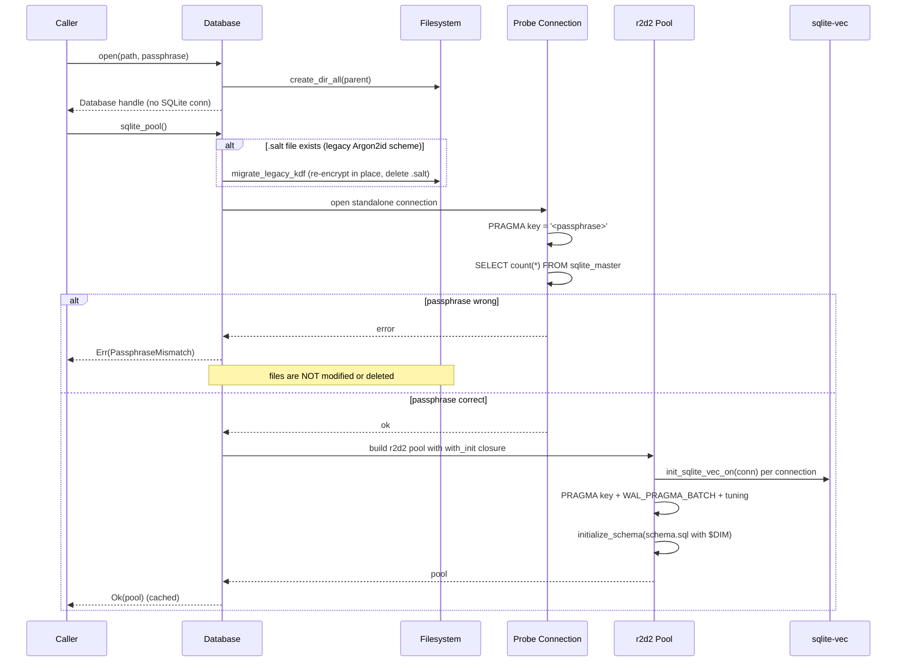
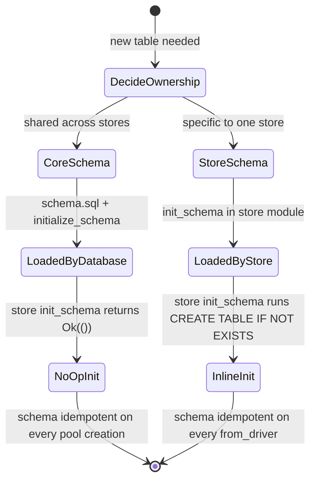

# hkask-storage — Explanation: Why Database Splits from SqliteDriver

The consolidated `hkask-storage` crate separates two concerns: `Database`
handles file infrastructure (parent directories, passphrase validation),
and `SqliteDriver` handles everything SQLite-related (the r2d2 pool,
PRAGMAs, schema initialization, query dispatch). This split is not
aesthetic — it eliminates dual-path bugs, and it lets stores code against
a provider-agnostic port (`DatabaseDriver`) instead of
`rusqlite::Connection` directly[^fowler-poeaa].

## Source citations

| Symbol | Location |
|--------|----------|
| `Database` struct (path + passphrase + pool_cache) | `kask/crates/hkask-storage/src/core/connection.rs:108-114` |
| `Database::open_impl` (file infra, no SQLite) | `kask/crates/hkask-storage/src/core/connection.rs:122-160` |
| `Database::sqlite_pool` (cached r2d2 pool) | `kask/crates/hkask-storage/src/core/connection.rs:230-252` |
| `file_pool` (native KDF + legacy migration + probe) | `kask/crates/hkask-storage/src/core/connection.rs:305-398` |
| `in_memory_pool` (max_size 1) | `kask/crates/hkask-storage/src/core/connection.rs:280-303` |
| `DatabaseError::PassphraseMismatch` | `kask/crates/hkask-storage/src/core/connection.rs:86-97` |
| `open_or_repair` (non-destructive contract) | `kask/crates/hkask-storage/src/core/connection.rs:415-434` |
| `init_sqlite_vec_on` (per-connection, before schema) | `kask/crates/hkask-storage/src/core/connection.rs:60-76` |
| `DatabaseDriver` trait (the port) | `kask/crates/hkask-storage/src/database/driver.rs:16-58` |
| `SqliteDriver` (the only impl) | `kask/crates/hkask-storage/src/database/sqlite.rs:42-50` |
| `define_driver_store!` (store boilerplate) | `kask/crates/hkask-storage/src/core/store_macros.rs:44-71` |
| `HMemStore::from_driver` (no re-create of core table) | `kask/crates/hkask-storage/src/hmem.rs:140-163` |
| `RegulationArchive::init_schema` (store-specific table) | `kask/crates/hkask-storage/src/regulation_store.rs:76-104` |
| `Encryptor` (ENCv1 transparent encryption) | `kask/crates/hkask-storage/src/database/encrypt.rs:15-75` |
| `migrate_legacy_kdf` (Argon2id → native KDF) | `kask/crates/hkask-storage/src/rotation.rs:302` |

## The open/connect sequence

`open()` and `sqlite_pool()` are deliberately separate methods. `open()`
validates the passphrase and creates parent directories; `sqlite_pool()`
creates the r2d2 pool, migrates legacy-KDF DBs if a `.salt` file is
present, verifies the passphrase with a standalone probe connection, loads
sqlite-vec, sets PRAGMAs, and initializes the schema. One path for file
infrastructure, one path for SQLite — no dual-path bugs.

Encryption uses SQLCipher's native passphrase KDF: the passphrase is
passed as a SQL string literal in `PRAGMA key`, SQLCipher derives the page
key via PBKDF2 internally, and the salt lives in the DB file header — no
external key material exists to lose (`core/connection.rs:317-321`).

<!-- DIAGRAM_ALIGNMENT
id: DIAG-STOR-005
verified_date: 2026-08-28
verified_against: kask/crates/hkask-storage/src/core/connection.rs:122-160,230-252,280-398,415-434; kask/crates/hkask-storage/src/rotation.rs:302; kask/crates/hkask-storage/src/database/sqlite.rs:24-35
status: VERIFIED
-->

## Why the split exists

### 1. No dual-path passphrase handling

A wrong passphrase can leave SQLCipher's native codec in a corrupted state;
when the pool later drops that connection during teardown, the codec
cleanup can SIGSEGV. `file_pool` therefore verifies the passphrase with a
**standalone probe connection** before creating the pool
(`core/connection.rs:328-336`): a wrong key fails the probe, the pool is
never built, and the codec cleanup runs on the probe alone. The pool only
ever holds connections with a validated key.

`open_or_repair` (`core/connection.rs:429-434`) enforces the P1 invariant
"a passphrase mistake never destroys my encrypted database". With the
native KDF there is no external key material to lose, so there is nothing
to "repair": a wrong passphrase returns `PassphraseMismatch` (the DB is
preserved for manual recovery — pinned by
`wrong_passphrase_returns_mismatch_and_preserves_db` at
`core/connection.rs:494`, in the test module starting at 447) and a corrupt
file returns `Corrupted`. A DB from the pre-native scheme (marked by a
`.salt` file) is re-encrypted in place by `rotation::migrate_legacy_kdf`
during pool creation (`core/connection.rs:305-315`) — data-preserving,
never destructive.

### 2. `Database` is the connection manager; `SqliteDriver` is the store handle

Stores hold `Arc<dyn DatabaseDriver>`, not `Arc<Database>`. `Database` is a
connection manager with a `Mutex<Option<Pool>>` cache
(`core/connection.rs:112-113`); `SqliteDriver` is the thin, cloneable,
`Send + Sync` handle that the `DatabaseDriver` trait requires. This lets
stores be passed across threads (the regulation loop, the curator ingest
path) without dragging the pool cache's lock along.

### 3. Stores code against a port, not `rusqlite`

The `DatabaseDriver` trait (`database/driver.rs:16-58`) is dyn-compatible:
`execute`, `execute_batch`, `query`, `query_optional`, `commit_tx`,
`rollback_tx`, `as_any`, `sqlite_pool`. Stores call these methods plus the
free-function helpers `query_map` / `query_row` (`database/driver.rs:78-109`)
and never touch `rusqlite::Connection` directly. The one exception is
`EmbeddingStore`, which needs the raw connection for `vec0` MATCH — it
downcasts via `sqlite_pool()` to acquire a connection
(`embeddings.rs:104-108`).

## Why per-store `init_schema` instead of a migration runner

The crate has no centralized migration runner. Each store owns its schema
and runs `CREATE TABLE IF NOT EXISTS` during `from_driver` construction.
The `define_driver_store!` macro generates `from_driver` to call
`Self::init_schema(driver)` and propagate any failure, so a store is never
constructed against a missing table (`core/store_macros.rs:44-71`).

Two ownership patterns coexist:

- **Core tables** (`hmems`, `embeddings`, `vec_embeddings`, `audit_log`,
  `memory_links`, `pod_meta`, `agent_registry`, `loop_cursors`,
  `reg_variety_checkpoint`, `reg_alerts`) live in `core/sql/schema.sql` and
  are loaded by `Database::initialize_schema` on every pool creation
  (`core/connection.rs:192-204`). Stores for these tables do not re-create
  them: `HMemStore::from_driver` explicitly does NOT re-create `hmems`
  (`hmem.rs:143-149`) — the prior `CREATE TABLE IF NOT EXISTS` here declared
  `recalled_at TEXT` nullable while `schema.sql` declared it
  `NOT NULL DEFAULT`, and the `IF NOT EXISTS` no-op meant the live schema
  depended on which ran first.
- **Store-specific tables** (`reg_records`, `reg_cursors`, `escalations`,
  the gallery tables) are created inline in the store's `init_schema`
  (`regulation_store.rs:76-104`, `escalation.rs:83-103`,
  `gallery.rs:193-270`).

The one schema migration that exists is column-level:
`migrate_embeddings_passage_text` (`core/connection.rs:205-219`) adds the
`passage_text` column to pre-existing `embeddings` tables via
`ALTER TABLE`, because `CREATE TABLE IF NOT EXISTS` cannot add columns to
an already-existing table.

<!-- DIAGRAM_ALIGNMENT
id: DIAG-STOR-006
verified_date: 2026-08-28
verified_against: kask/crates/hkask-storage/src/core/connection.rs:192-219; kask/crates/hkask-storage/src/core/store_macros.rs:44-71; kask/crates/hkask-storage/src/hmem.rs:140-163; kask/crates/hkask-storage/src/regulation_store.rs:76-104; kask/crates/hkask-storage/src/escalation.rs:83-103
status: VERIFIED
-->

## Why the in-memory pool is `max_size(1)`

`SqliteConnectionManager::memory()` creates a separate in-memory database
per connection. A pool size greater than 1 would scatter writes across
independent databases, breaking read-your-writes semantics for tests
(`core/connection.rs:280-303`). The file pool, by contrast, defaults to
`max_size(8)` (overridable via `HKASK_DB_POOL_SIZE`, with a `warn!` on
malformed values, `core/connection.rs:358-372`).

## Why sqlite-vec is loaded per-connection

`init_sqlite_vec_on` (`core/connection.rs:60-76`) loads the `vec0`
extension into each connection via the r2d2 `with_init` closure, before
schema init (which creates `vec0` virtual tables). This avoids
`sqlite3_auto_extension`, whose process-global registration is deprecated
on Apple platforms and is a known teardown-segfault source. Scoping the
extension's lifetime to each connection means its state is torn down with
the connection, not orphaned at process exit.

## Why `EmbeddingStore` duplicates the vector BLOB

The vector BLOB is stored in both the `embeddings` table (metadata + vector)
and the `vec_embeddings` virtual table (KNN index). `vec0` requires the
vector for its MATCH operator; `embeddings.vector` provides uniform
retrieval via the backend-agnostic `DatabaseDriver` query path (`get`,
`get_all_by_prefix`). Deduplicating would require backend-conditional
retrieval — more complexity for ~4 KB/embedding savings. The redundancy
earns its keep by preserving the uniform retrieval abstraction
(`embeddings.rs:1-14`).

## Why `HMemStore` has an optional `Encryptor` — and why it is not yet wired

`HMemStore` holds an `encryptor: Option<Arc<Encryptor>>` field
(`hmem.rs:137`), and the `Encryptor` (`database/encrypt.rs:15-75`) does
transparent AES-256-GCM encryption of text values with an `ENCv1:` prefix
for automatic detection — plaintext passes through on decrypt, so a store
could migrate from unencrypted to encrypted without a schema change.
However, `HMemStore::from_driver` currently always sets `encryptor: None`
(`hmem.rs:155`), and no other constructor sets it: **value-level
encryption is not yet wired** — the encrypt/decrypt branches exist but are
unreachable in production. SQLCipher file-level encryption is the enforced
confidentiality mechanism today.

## See also

- [hkask-storage Reference](./reference.md): ERD of the full schema and the
  `DatabaseDriver` class diagram.
- [hkask-storage How-to](./how-to.md): procedural flowchart for adding a new
  store.
- [hkask-storage Tutorial](./tutorial.md): the store lifecycle from
  `Database` to CRUD.
- [`kask/docs/architecture/core/magna-carta.md`](../../architecture/core/magna-carta.md):
  P1 (User Sovereignty) governing `open_or_repair`'s passphrase-safety
  contract.

---

[^fowler-poeaa]: Fowler, M. (2002). *Patterns of Enterprise Application Architecture.* Addison-Wesley. <https://martinfowler.com/books/eaa.html>. The Repository pattern that motivates coding stores against a port trait instead of a concrete connection.

[^sqlcipher]: Zetetic LLC. (2024). *SQLCipher — Transparent SQLite Encryption.* <https://www.zetetic.net/sqlcipher/>. The encrypted SQLite extension whose codec-state corruption motivated the standalone passphrase probe.
