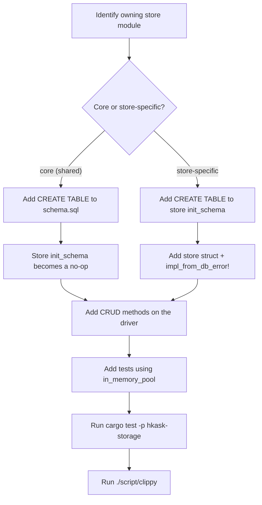

# hkask-storage — How-to: Add a New Store or Migration

This guide shows how to add a new table or modify the schema in
`hkask-storage`. The crate uses a per-store `init_schema` pattern rather
than a centralized migration runner. Each store module owns its schema and
runs `CREATE TABLE IF NOT EXISTS` statements during `from_driver`
construction. There is no Postgres mirror — the consolidation removed the
`schema_pg.sql` path; SQLite is the only backend.

## Source citations

| Symbol | Location |
|--------|----------|
| Core schema loader (`initialize_schema`) | `kask/crates/hkask-storage/src/core/database.rs:206-211` |
| `Database::open` (file infrastructure) | `kask/crates/hkask-storage/src/core/database.rs:177-179` |
| `Database::in_memory` (test pool) | `kask/crates/hkask-storage/src/core/database.rs:198-200` |
| `Database::sqlite_pool` (r2d2 pool + schema) | `kask/crates/hkask-storage/src/core/database.rs:222-244` |
| `open_database` dispatcher | `kask/crates/hkask-storage/src/core/database.rs:433-439` |
| `open_or_repair` (passphrase-safe open) | `kask/crates/hkask-storage/src/core/database.rs:427-431` |
| `define_driver_store!` macro | `kask/crates/hkask-storage/src/core/store_macros.rs:44-71` |
| `impl_from_db_error!` macro | `kask/crates/hkask-storage/src/core/store_macros.rs:78-87` |
| `DatabaseDriver` trait | `kask/crates/hkask-storage/src/database/driver.rs:16-58` |
| `query_map` / `query_row` helpers | `kask/crates/hkask-storage/src/database/driver.rs:78-109` |
| `TransactionHandle` (RAII tx) | `kask/crates/hkask-storage/src/database/transaction.rs:19-53` |
| `DbValue` / `DbRow` typed values | `kask/crates/hkask-storage/src/database/value.rs:7-309` |
| `SqliteDriver::new` / `new_labeled` | `kask/crates/hkask-storage/src/database/sqlite.rs:60-73` |
| `SqliteDriver::in_memory_pool` | `kask/crates/hkask-storage/src/database/sqlite.rs:86-101` |
| `WAL_PRAGMA_BATCH` (PRAGMA ordering) | `kask/crates/hkask-storage/src/database/sqlite.rs:24-25` |
| `sanitize_path` (traversal guard) | `kask/crates/hkask-storage/src/core/security.rs:17-54` |
| Core schema (`schema.sql`) | `kask/crates/hkask-storage/src/core/sql/schema.sql:1-22` |
| `regulation_store.rs` `init_schema` (store-specific pattern) | `kask/crates/hkask-storage/src/regulation_store.rs:78-106` |
| `gallery.rs` `init_schema` (multi-table pattern) | `kask/crates/hkask-storage/src/gallery.rs:170-233` |
| `kata.rs` `init_schema` (no-op for core-owned table) | `kask/crates/hkask-storage/src/kata.rs:36-44` |

## Procedure

<!-- DIAGRAM_ALIGNMENT
id: DIAG-STOR-002
verified_date: 2026-08-13
verified_against: kask/crates/hkask-storage/src/core/database.rs:206-211,433-439; kask/crates/hkask-storage/src/core/store_macros.rs:44-87; kask/crates/hkask-storage/src/regulation_store.rs:78-106; kask/crates/hkask-storage/src/gallery.rs:170-233; kask/crates/hkask-storage/src/kata.rs:36-44
status: VERIFIED
-->

### Step 1: Identify the owning store module

Determine which store module owns the new table. If the table is used by
multiple stores or is foundational (like `hmems`, `embeddings`,
`agent_registry`, `kata_history`), it belongs in
`src/core/sql/schema.sql` (loaded by `initialize_schema` in
`core/database.rs:206-211`). If the table is specific to one store (like
`reg_records` for regulation, `escalations` for the escalation queue, or the
`gallery_*` family), it belongs in that store's `init_schema` method.

### Step 2: Add the `CREATE TABLE` statement

For **core tables**, add the statement to `src/core/sql/schema.sql`. The file
uses single-line `CREATE TABLE IF NOT EXISTS` statements; the `IF NOT EXISTS`
clause makes initialization idempotent. The `$DIM` placeholder in
`vec_embeddings` is replaced with `embedding_dim()` at load time
(`core/database.rs:208-210`).

For **store-specific tables**, add the statement inside the store's
`init_schema` method. The method receives a `&Arc<dyn DatabaseDriver>` and
calls `driver.execute_batch(sql)`. See `regulation_store.rs:78-106` for the
single-table pattern and `gallery.rs:170-233` for the multi-table pattern
(galleries, images, tags, face_registry, workflow, generation, with indexes).

### Step 3: Wire the store struct

If you are adding a new store, invoke `define_driver_store!(MyStore)` to
generate the struct, `from_driver` constructor, and `driver()` accessor
(`core/store_macros.rs:44-71`). If your store's domain error is distinct
from `InfrastructureError`, pass it as the second macro argument:
`define_driver_store!(MyStore, MyError)`. Then implement `init_schema` in a
separate `impl` block — for core-owned tables, return `Ok(())` (see
`kata.rs:36-44`).

Add `impl_from_db_error!(MyError, Infra)` to derive `From<DbError>` mapping
to `MyError::Infra(InfrastructureError::from(e))`
(`core/store_macros.rs:78-87`).

### Step 4: Add CRUD methods

Add methods to the store struct for inserting, querying, updating, and
deleting rows. The store holds an `Arc<dyn DatabaseDriver>` (generated by
the macro) and calls `driver.execute` or `driver.query`. For typed row
mapping, use the free functions `query_map` and `query_row`
(`database/driver.rs:78-109`). For multi-statement atomicity, use
`driver.transaction()` to get a RAII `TransactionHandle` that auto-rollbacks
on drop (`database/transaction.rs:19-53`).

Follow the pattern in `regulation_store.rs` (single-table CRUD) or
`gallery.rs` (multi-entity CRUD with foreign keys and indexes).

### Step 5: Add tests

Add tests in the store module or in a `tests/` subdirectory. The tests should
build a driver via `SqliteDriver::in_memory_pool()` (which loads the core
schema), construct the store with `from_driver`, and verify the CRUD methods.
See `kata.rs:203-207` for the test harness pattern.

Run the tests with `cargo test -p hkask-storage`, then run `./script/clippy`
(repo rule: use `./script/clippy` instead of `cargo clippy`).

## Common pitfalls

- **PRAGMA ordering**: `busy_timeout` MUST be set before `journal_mode = WAL`
  because the WAL mode change acquires a brief exclusive lock. With
  `busy_timeout = 0` (SQLite default), any lock contention fails immediately
  with `SQLITE_BUSY`. Use `WAL_PRAGMA_BATCH` (`database/sqlite.rs:24-25`)
  rather than inlining PRAGMA strings.
- **In-memory pool size**: `SqliteConnectionManager::memory()` creates a
  separate in-memory database per connection. A pool size > 1 scatters writes
  across independent databases, breaking read-your-writes. Use `max_size(1)`
  for in-memory pools (`core/database.rs:272-295`).
- **Path traversal**: any user-supplied path passed to a store MUST go through
  `sanitize_path(base, input)` (`core/security.rs:17-54`), which rejects `..`
  components and verifies the joined path stays within `base`.
- **Per-connection sqlite-vec loading**: `init_sqlite_vec_on` must run BEFORE
  schema init (which creates `vec0` virtual tables) and is scoped per
  connection to avoid the deprecated `sqlite3_auto_extension` teardown
  segfault (`core/database.rs:39-76`).

## See also

- [hkask-storage Reference](./reference.md): ERD of the full schema and the
  `DatabaseDriver` class diagram.
- [hkask-storage Tutorial](./tutorial.md): the store lifecycle from
  `Database` to CRUD.
- [hkask-storage Explanation](./explanation.md): why the crate splits
  `Database` from `SqliteDriver`.

---

[^fowler-poeaa]: Fowler, M. (2002). *Patterns of Enterprise Application Architecture.* Addison-Wesley. <https://martinfowler.com/books/eaa.html>. The Active Record pattern that the store modules implement, where each store owns its schema and CRUD methods.
