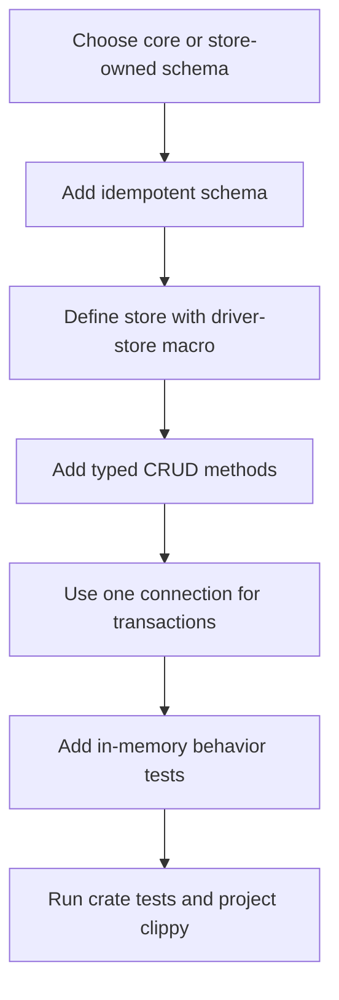
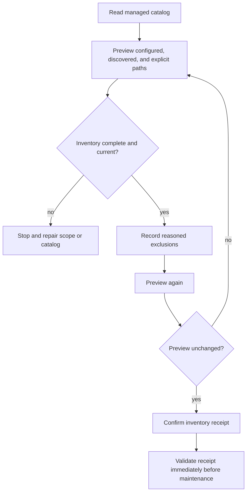

# hkask-storage — How-to: Add a Store and Review Maintenance Inventory

Use Procedure A to add a table-backed store. Use Procedure B to preview and
confirm the database path set before an already-designed maintenance operation.
The store pattern follows Fowler's Repository separation: callers use domain
methods while the store uses the database port.[^fowler-poeaa]

## Procedure A: Add a store



<!-- DIAGRAM_ALIGNMENT
id: DIAG-STOR-002
verified_date: 2026-09-16
verified_against: kask/crates/hkask-storage/src/core/connection.rs:272-335,394-415; kask/crates/hkask-storage/src/core/store_macros.rs:44-86; kask/crates/hkask-storage/src/database/driver.rs:16-109; kask/crates/hkask-storage/src/hmem.rs:404-476
status: VERIFIED
-->

### 1. Choose schema ownership

Put foundational tables used across stores in
`kask/crates/hkask-storage/src/core/sql/schema.sql:1-29`. Put a domain-specific
table in that store's `init_schema`, following Regulation, escalation, or gallery
(`kask/crates/hkask-storage/src/regulation_store.rs:76-104`;
`kask/crates/hkask-storage/src/escalation.rs:83-103`;
`kask/crates/hkask-storage/src/gallery.rs:295-384`).

`CREATE TABLE IF NOT EXISTS` does not add columns to an existing table. For a
column addition, inspect `PRAGMA table_info` and run an explicit migration, as the
embedding and forgetting-spec migrations do
(`kask/crates/hkask-storage/src/core/connection.rs:281-335`).

### 2. Define the store

Use `define_driver_store!(MyStore)` to generate the driver-backed struct,
`from_driver`, and `driver()` accessor. Use the two-argument form for a domain
error and `impl_from_db_error!` for error conversion
(`kask/crates/hkask-storage/src/core/store_macros.rs:44-86`). Construction runs
`init_schema` and propagates failure.

### 3. Add operations through `DatabaseDriver`

Use `execute`, `execute_batch`, `query`, and `query_optional` from
`DatabaseDriver`, plus `query_map` and `query_row` for typed mapping
(`kask/crates/hkask-storage/src/database/driver.rs:16-109`). Do not present
`DbValue` as encrypted data; it is the typed SQL parameter/result representation
(`kask/crates/hkask-storage/src/database/value.rs:8-46`). File encryption is
provided at the SQLCipher connection layer.

For an atomic multi-statement operation, hold one pooled connection and one RAII
transaction. `HMemStore::update` is the reference shape
(`kask/crates/hkask-storage/src/hmem.rs:404-476`). Separate driver calls may use
separate pooled connections and therefore do not form one transaction.

### 4. Test the behavior

Use `SqliteDriver::in_memory_pool()` for store tests
(`kask/crates/hkask-storage/src/database/sqlite.rs:86-106`). Verify CRUD behavior,
constraint failures, transaction rollback, and corrupted-row error propagation.
The in-memory pool has one connection so tests preserve read-your-writes semantics
(`kask/crates/hkask-storage/src/core/connection.rs:394-415`).

Run from the repository root:

```sh
cargo test -p hkask-storage
./script/clippy
```

## Procedure B: Preview and confirm maintenance inventory

Inventory confirmation records scope; it does not quiesce consumers, rotate files,
or publish a key.



<!-- DIAGRAM_ALIGNMENT
id: DIAG-STOR-007
verified_date: 2026-09-16
verified_against: kask/crates/hkask-storage/src/maintenance_inventory.rs:57-101,168-218,220-295,297-375
status: VERIFIED
-->

### 1. Read the managed catalog

The canonical catalog location is configured through
`DATABASE_CATALOG_ENV` and `DATABASE_CATALOG_RELATIVE_PATH`; both constants and
the configuration/read functions are public
(`kask/crates/hkask-storage/src/maintenance_inventory.rs:12-20,37-48,94-101`).
Treat a missing or malformed catalog as an error, not as an empty known set.

### 2. Build a bounded preview

Call `DatabaseInventory::preview(configured, roots, additional)`. It combines
configured paths, explicit historical/external paths, and database paths inferred
from maintenance markers below bounded search roots. It does not traverse directory
symlinks and fails rather than returning a partial inventory when the scan cap is
reached (`kask/crates/hkask-storage/src/maintenance_inventory.rs:207-295`).

### 3. Confirm against a fresh preview

Call `preview` again and pass both snapshots to `DatabaseInventory::confirm` with:

- explicit confirmation that historical/external inventory is complete;
- a non-empty reason for each excluded independent database; and
- no exclusion for a configured shared-key database.

Confirmation rejects changed snapshots, unresolved recovery artifacts, ambiguous
hard links, and an empty rotation set
(`kask/crates/hkask-storage/src/maintenance_inventory.rs:297-375`).

### 4. Validate before maintenance

Call `ConfirmedInventory::validate_current` against the newest preview immediately
before using `rotate_paths()`
(`kask/crates/hkask-storage/src/maintenance_inventory.rs:183-205`). Establish
quiescence separately; the inventory receipt is not a maintenance lease.
Single-database rotation itself is implemented by `rotate_passphrase`
(`kask/crates/hkask-storage/src/rotation.rs:122-297`).

## Gallery scan and analysis requests

When adding gallery-facing work, carry exact lifecycle entities rather than
positional guesses:

- `AssetObservation` describes one physical asset.
- `GalleryScan` carries observations plus coverage and errors.
- `ReconcileResult` reports added, changed, restored, missing, and unchanged counts
  and returns exact `analysis_assets`.

These types are defined at `kask/crates/hkask-storage/src/gallery.rs:103-135` and
consumed atomically by `GalleryStore::reconcile` at
`kask/crates/hkask-storage/src/gallery.rs:626-725`. Persist an analysis response
through `persist_analysis` or `persist_analysis_for_tag_types`; both refuse to
apply an old request when image identity, hash, or presence no longer matches
(`kask/crates/hkask-storage/src/gallery.rs:741-815`).

## See also

- [Why storage separates connection, inventory, and gallery identity](./explanation.md)
- [hkask-storage reference](./reference.md)

---

[^fowler-poeaa]: Fowler, M. (2002). *Patterns of Enterprise Application Architecture.* Addison-Wesley. <https://martinfowler.com/books/eaa.html>.
