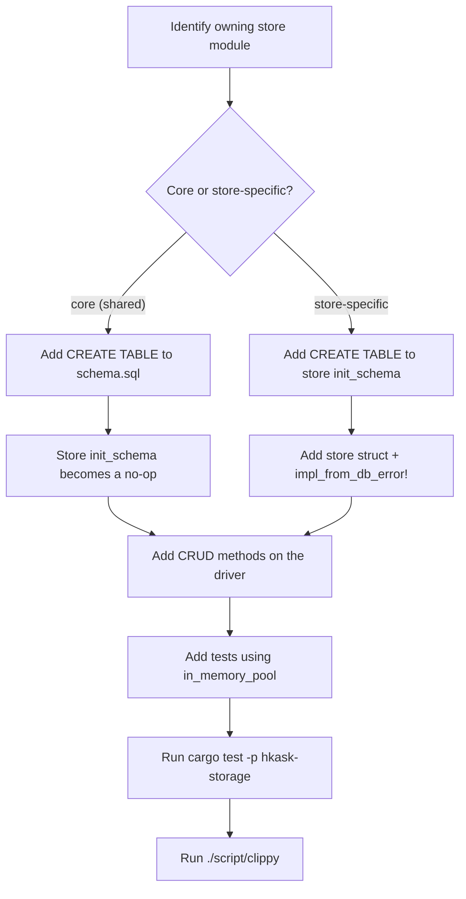

# hkask-storage — How-to: Add a New Store or Rotate a Passphrase

This guide shows how to add a new table or store in `hkask-storage`. The
crate uses a per-store `init_schema` pattern rather than a centralized
migration runner: each store module owns its schema and runs
`CREATE TABLE IF NOT EXISTS` statements during `from_driver` construction.
SQLite is the only backend.

## Source citations

| Symbol | Location |
|--------|----------|
| Core schema loader (`initialize_schema`) | `kask/crates/hkask-storage/src/core/connection.rs:223-229` |
| `Database::open` (file infrastructure) | `kask/crates/hkask-storage/src/core/connection.rs:194-196` |
| `Database::in_memory` (test pool) | `kask/crates/hkask-storage/src/core/connection.rs:215-217` |
| `Database::sqlite_pool` (r2d2 pool + schema) | `kask/crates/hkask-storage/src/core/connection.rs:261-283` |
| `open_database` dispatcher | `kask/crates/hkask-storage/src/core/connection.rs:515-526` |
| `open_or_repair` (salt-missing self-heal) | `kask/crates/hkask-storage/src/core/connection.rs:466-513` |
| `define_driver_store!` macro | `kask/crates/hkask-storage/src/core/store_macros.rs:44-71` |
| `impl_from_db_error!` macro | `kask/crates/hkask-storage/src/core/store_macros.rs:79-86` |
| `DatabaseDriver` trait | `kask/crates/hkask-storage/src/database/driver.rs:16-58` |
| `query_map` / `query_row` helpers | `kask/crates/hkask-storage/src/database/driver.rs:78-109` |
| `TransactionHandle` (RAII tx) | `kask/crates/hkask-storage/src/database/transaction.rs` |
| `DbValue` / `DbRow` typed values | `kask/crates/hkask-storage/src/database/value.rs` |
| `SqliteDriver::new` / `new_labeled` | `kask/crates/hkask-storage/src/database/sqlite.rs:60-73` |
| `SqliteDriver::in_memory_pool` | `kask/crates/hkask-storage/src/database/sqlite.rs:86-101` |
| `WAL_PRAGMA_BATCH` (PRAGMA ordering) | `kask/crates/hkask-storage/src/database/sqlite.rs:24-25` |
| `sanitize_path` (traversal guard) | `kask/crates/hkask-storage/src/core/security.rs:17-54` |
| Core schema (`schema.sql`) | `kask/crates/hkask-storage/src/core/sql/schema.sql:1-27` |
| `regulation_store.rs` `init_schema` (store-specific pattern) | `kask/crates/hkask-storage/src/regulation_store.rs:76-104` |
| `gallery.rs` `init_schema` (multi-table pattern) | `kask/crates/hkask-storage/src/gallery.rs:193-270` |
| `rotate_passphrase` | `kask/crates/hkask-storage/src/rotation.rs:118-347` |
| Rotation tests | `kask/crates/hkask-storage/src/rotation.rs:673-812` |

## Procedure



<!-- DIAGRAM_ALIGNMENT
id: DIAG-STOR-002
verified_date: 2026-08-28
verified_against: kask/crates/hkask-storage/src/core/connection.rs:223-229,515-526; kask/crates/hkask-storage/src/core/store_macros.rs:44-86; kask/crates/hkask-storage/src/regulation_store.rs:76-104; kask/crates/hkask-storage/src/gallery.rs:193-270
status: VERIFIED
-->

### Step 1: Identify the owning store module

Determine which store module owns the new table. If the table is used by
multiple stores or is foundational (like `hmems`, `embeddings`,
`agent_registry`, `memory_links`), it belongs in
`src/core/sql/schema.sql` (loaded by `initialize_schema` in
`core/connection.rs:223-229`). If the table is specific to one store (like
`reg_records` for regulation or `escalations` for the escalation queue), it
belongs in that store's `init_schema` method.

### Step 2: Add the `CREATE TABLE` statement

For **core tables**, add the statement to `src/core/sql/schema.sql`. The
file uses `CREATE TABLE IF NOT EXISTS` statements; the `IF NOT EXISTS`
clause makes initialization idempotent. The `$DIM` placeholder in
`vec_embeddings` is replaced with `embedding_dim()` at load time
(`core/connection.rs:225-226`). Note that `IF NOT EXISTS` cannot add columns
to an existing table — column additions to core tables need a
`PRAGMA table_info` check + `ALTER TABLE` migration, as
`migrate_embeddings_passage_text` does (`core/connection.rs:236-250`).

For **store-specific tables**, add the statement inside the store's
`init_schema` method. The method receives a `&Arc<dyn DatabaseDriver>` and
calls `driver.execute_batch(sql)`. See `regulation_store.rs:76-104` for the
single-table pattern and `gallery.rs:193-270` for the multi-table pattern
(galleries, images, tags, face_registry, workflow, generation, albums,
album members, with indexes and foreign keys).

### Step 3: Wire the store struct

If you are adding a new store, invoke `define_driver_store!(MyStore)` to
generate the struct, `from_driver` constructor, and `driver()` accessor
(`core/store_macros.rs:44-71`). If your store's domain error is distinct
from `InfrastructureError`, pass it as the second macro argument:
`define_driver_store!(MyStore, MyError)`. Then implement `init_schema` in
a separate `impl` block — for core-owned tables, return `Ok(())`.

Add `impl_from_db_error!(MyError, Infra)` to derive `From<DbError>` mapping
to `MyError::Infra(InfrastructureError::from(e))`
(`core/store_macros.rs:79-86`).

### Step 4: Add CRUD methods

Add methods to the store struct for inserting, querying, updating, and
deleting rows. The store holds an `Arc<dyn DatabaseDriver>` (generated by
the macro) and calls `driver.execute` or `driver.query`. For typed row
mapping, use the free functions `query_map` and `query_row`
(`database/driver.rs:78-109`). For multi-statement atomicity, hold a single
pooled connection and use its RAII transaction — see `HMemStore::update`
(`hmem.rs:404-476`), which documents why per-call `BEGIN`/`COMMIT` on
separate pool connections is not a transaction at all.

### Step 5: Add tests

Add tests in the store module. The tests should build a driver via
`SqliteDriver::in_memory_pool()` (which loads the core schema,
`database/sqlite.rs:86-101`), construct the store with `from_driver`, and
verify the CRUD methods.

Run the tests with `cargo test -p hkask-storage`, then run `./script/clippy`
(repo rule: use `./script/clippy` instead of `cargo clippy`).

## Common pitfalls

- **PRAGMA ordering**: `busy_timeout` MUST be set before
  `journal_mode = WAL` because the WAL mode change acquires a brief
  exclusive lock. With `busy_timeout = 0` (SQLite default), any lock
  contention fails immediately with `SQLITE_BUSY`. Use `WAL_PRAGMA_BATCH`
  (`database/sqlite.rs:24-25`) rather than inlining PRAGMA strings.
- **In-memory pool size**: `SqliteConnectionManager::memory()` creates a
  separate in-memory database per connection. A pool size > 1 scatters
  writes across independent databases, breaking read-your-writes. Use
  `max_size(1)` for in-memory pools (`core/connection.rs:311-334`).
- **Path traversal**: any user-supplied path passed to a store MUST go
  through `sanitize_path(base, input)` (`core/security.rs:17-54`), which
  rejects `..` components and verifies the joined path stays within
  `base`.
- **Per-connection sqlite-vec loading**: `init_sqlite_vec_on` must run
  BEFORE schema init (which creates `vec0` virtual tables) and is scoped
  per connection to avoid the deprecated `sqlite3_auto_extension`
  teardown segfault (`core/connection.rs:39-76`).
- **Corrupted rows must propagate**: `HMemStore::query_rows` logs and
  propagates row-decode errors rather than skipping them
  (`hmem.rs:180-189`) — a silently skipped row reads as "no deviation"
  to the regulation loop. Follow the same discipline in new stores.

## Rotate a DB passphrase

To re-encrypt a SQLCipher DB under a new passphrase (e.g., after a key
compromise or routine rotation), use `rotate_passphrase`
(`rotation.rs:118`). The bridge layer wraps this in
`rotate_curator_db_passphrase` (`kask_bridge/src/identity.rs:321`) and
`rotate_swarm_memory_db_passphrase` (`kask_bridge/src/identity.rs:366`),
which resolve the old passphrase from the keychain and the DB path from
env/data-dir.

The rotation is atomic and fail-safe:

1. Validates the new passphrase (≥ 8 chars, different from old).
2. Opens the source DB with the old passphrase (verifies it).
3. Creates `<db>.new` with the new passphrase; copies all user tables +
   `sqlite_sequence`. `vec0` shadow tables are rebuilt from `schema.sql` on
   first open of the new DB.
4. Atomically renames: `<db>` → `<db>.old`, `<db>.new` → `<db>`, same for
   `.salt` files.
5. Deletes `.old` and `.salt.old` on success.

If any step fails, the original DB is untouched. The caller (settings UI)
writes the new passphrase to the keychain ONLY after `Ok(())` — a failed
rotation leaves the old passphrase in effect.

**From the settings UI**: use the Security sub-page (for the curator DB
passphrase) or the Swarm page (for the swarm memory DB passphrase). Both
trigger rotation before saving the new passphrase.

**From code**:

```rust,ignore
use kask_bridge::rotate_curator_db_passphrase;

// Rotate the curator DB passphrase. The old passphrase is resolved
// from the keychain; the new passphrase must be >=8 chars.
rotate_curator_db_passphrase("new-passphrase")?;

// After rotation succeeds, write the new passphrase to the keychain
// and nudge MCP servers to restart.
```

Run the rotation tests with `cargo test -p hkask-storage rotation` (six
tests at `rotation.rs:673-812`, including wrong-old-passphrase failure
safety and artifact cleanup).

## See also

- [hkask-storage Reference](./reference.md): ERD of the full schema and the
  `DatabaseDriver` class diagram.
- [hkask-storage Tutorial](./tutorial.md): the store lifecycle from
  `Database` to CRUD.
- [hkask-storage Explanation](./explanation.md): why the crate splits
  `Database` from `SqliteDriver`.

---

[^fowler-poeaa]: Fowler, M. (2002). *Patterns of Enterprise Application Architecture.* Addison-Wesley. <https://martinfowler.com/books/eaa.html>. The Active Record pattern that the store modules implement, where each store owns its schema and CRUD methods.
