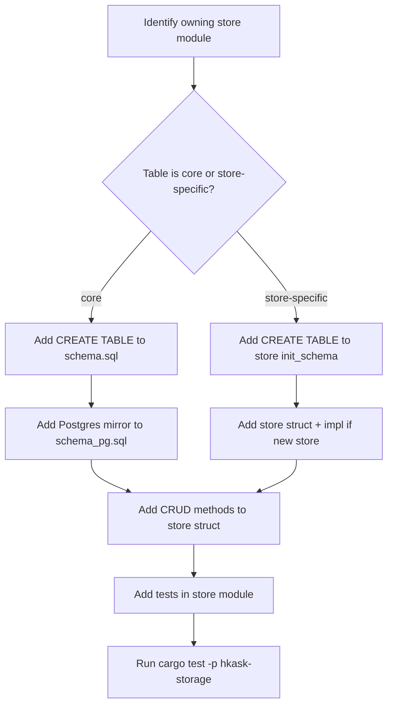

# hkask-storage — How-to: Add a New Migration

This guide shows how to add a new table or modify the schema in
`hkask-storage`. The crate uses a per-store `init_schema` pattern rather than
a centralized migration runner. Each store module owns its schema and runs
`CREATE TABLE IF NOT EXISTS` statements during database initialization.

## Source citations

| Symbol | Location |
|--------|----------|
| Core schema loader | `kask/crates/hkask-storage/src/core/database.rs:204` |
| `initialize_schema` fn | `kask/crates/hkask-storage/src/core/database.rs:203` |
| `Database::open` | `kask/crates/hkask-storage/src/core/database.rs:172` |
| `open_database` fn | `kask/crates/hkask-storage/src/core/database.rs:419` |
| `open_postgres` fn | `kask/crates/hkask-storage/src/core/database.rs:440` |
| Store macro (init_schema contract) | `kask/crates/hkask-storage/src/core/store_macros.rs:11` |
| `regulation_store.rs` init_schema | `kask/crates/hkask-storage/src/regulation_store.rs:78` |
| `schema.sql` | `kask/crates/hkask-storage/src/core/sql/schema.sql:1` |

## Procedure

<!-- DIAGRAM_ALIGNMENT
id: DIAG-DIA-STOR-002
verified_date: 2026-07-29
verified_against: kask/crates/hkask-storage/src/core/database.rs:203,204,440; kask/crates/hkask-storage/src/core/store_macros.rs:11; kask/crates/hkask-storage/src/regulation_store.rs:78
status: VERIFIED
-->

### Step 1: Identify the owning store module

Determine which store module owns the new table. If the table is used by
multiple stores or is foundational (like `hmems` or `agent_registry`), it
belongs in `src/core/sql/schema.sql` (loaded by `initialize_schema` in
`core/database.rs`). If the table is specific to one store (like `reg_records`
for regulation or `escalations` for the escalation queue), it belongs in that
store's `init_schema` method.

### Step 2: Add the CREATE TABLE statement

For core tables, add the statement to `src/core/sql/schema.sql`. The file uses
single-line `CREATE TABLE IF NOT EXISTS` statements. The `IF NOT EXISTS`
clause makes the initialization idempotent.

For store-specific tables, add the statement inside the store's
`init_schema` method. The method receives a `&Arc<dyn DatabaseDriver>` and
calls `driver.execute_batch(sql)`. See `regulation_store.rs:78` for the
pattern.

### Step 3: Mirror to Postgres if core

If the table is in `schema.sql`, add the equivalent statement to
`src/core/sql/schema_pg.sql`. The Postgres schema mirrors the SQLite schema
with Postgres-specific syntax. The `open_postgres` function at
`core/database.rs:440` loads this file.

### Step 4: Add CRUD methods

Add methods to the store struct for inserting, querying, updating, and
deleting rows. The store struct holds an `Arc<dyn DatabaseDriver>` (generated
by `define_driver_store!`) and calls `driver.execute` or `driver.query`
methods. Follow the pattern in `regulation_store.rs` or `escalation.rs`.

### Step 5: Add tests

Add tests in the store module or in a `tests/` subdirectory. The tests should
construct an in-memory database via `Database::in_memory()`, call
`from_driver`, and verify the CRUD methods work. Run the tests with
`cargo test -p hkask-storage`.

## See also

- [hkask-storage Reference](./reference.md): ERD of the full schema.
- [hkask-storage Tutorial](./tutorial.md): your first migration.
- [`kask/docs/architecture/core/PRINCIPLES.md`](../../architecture/core/PRINCIPLES.md):
  P5 (Essentialism) and P6 (No Dead Docs) governing schema additions.

---

[^fowler-poeaa]: Fowler, M. (2002). *Patterns of Enterprise Application Architecture.* Addison-Wesley. <https://martinfowler.com/books/eaa.html>. The Active Record pattern that the store modules implement, where each store owns its schema and CRUD methods.
