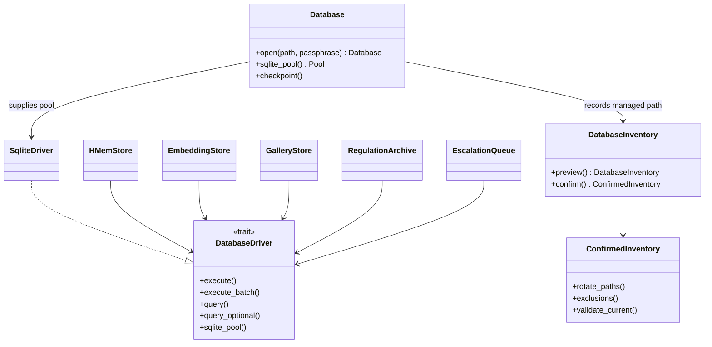
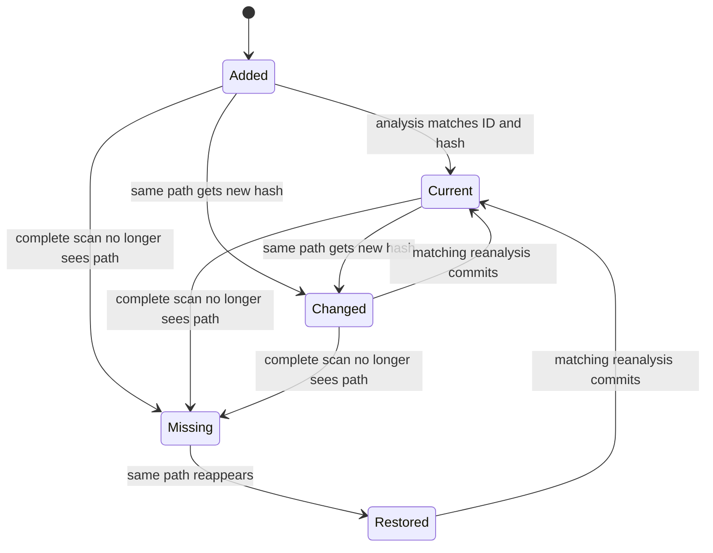
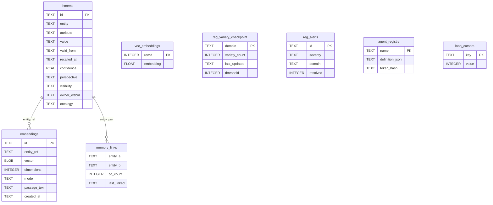

# hkask-storage — Reference

`hkask-storage` is the SQLite persistence crate. File-backed `Database` pools use
SQLCipher page encryption and sqlite-vec; in-memory and `SqliteDriver::file_pool`
paths are unencrypted SQLite
(`kask/crates/hkask-storage/src/core/connection.rs:337-466`;
`kask/crates/hkask-storage/src/database/sqlite.rs:86-117`). `DbValue` supplies SQL
binding types; SQLCipher-backed connections supply encryption.[^sqlcipher]
SQLite vector search is supplied by sqlite-vec.[^sqlite-vec]

## Module inventory and exports

The crate root declares and exports the current modules at
`kask/crates/hkask-storage/src/hkask_storage.rs:9-43`.

| Module | Public surface | Evidence |
|---|---|---|
| `core` | `Database`, `DatabaseError`, `LeasedSqliteConnection`, `SqliteConnectionManager`, `embedding_dim`, `open_database`, `open_or_repair`, `sanitize_path` | `kask/crates/hkask-storage/src/hkask_storage.rs:20-24` |
| `database` | `DatabaseDriver`, `SqliteDriver`, `WAL_PRAGMA_BATCH`, `init_wal_pragmas`; transaction and typed SQL values under the module | `kask/crates/hkask-storage/src/hkask_storage.rs:10,25`; `kask/crates/hkask-storage/src/database.rs:6-13` |
| `maintenance_inventory` | catalog configuration/read, previews, confirmations, entries, and typed errors | `kask/crates/hkask-storage/src/hkask_storage.rs:12-18` |
| `rotation` | `rotate_passphrase`, `RotationError` | `kask/crates/hkask-storage/src/hkask_storage.rs:13,27` |
| `embeddings` | `EmbeddingStore`, `SimilarityResult`, `EmbeddingError` | `kask/crates/hkask-storage/src/hkask_storage.rs:29,34` |
| `escalation` | `EscalationEntry`, `EscalationQueue`, `EscalationStatus`, `EscalationError` | `kask/crates/hkask-storage/src/hkask_storage.rs:30,35` |
| `hmem` | `HMem`, `HMemStore`, `HMemError` | `kask/crates/hkask-storage/src/hkask_storage.rs:31,36-37` |
| `regulation_store` | `RegulationArchive`, `DecayConfig` | `kask/crates/hkask-storage/src/hkask_storage.rs:32,38` |
| `gallery` | gallery index, scan/reconciliation, tags, faces, workflows, generations, OMC graphs, and albums | `kask/crates/hkask-storage/src/hkask_storage.rs:11,40-43`; `kask/crates/hkask-storage/src/gallery.rs:73-135,203-293` |

## Connection and driver surfaces

| Item | Contract | Evidence |
|---|---|---|
| `Database::open` | validates path/passphrase and returns a handle without opening SQLite | `kask/crates/hkask-storage/src/core/connection.rs:194-252` |
| `Database::sqlite_pool` | lazily creates and caches the SQLCipher/in-memory pool | `kask/crates/hkask-storage/src/core/connection.rs:337-366` |
| Core schema | loaded from `core/sql/schema.sql`, then explicit column migrations run | `kask/crates/hkask-storage/src/core/connection.rs:272-335` |
| Managed inventory registration | file-backed managed opens record the canonical path before pool creation | `kask/crates/hkask-storage/src/core/connection.rs:417-425` |
| `DatabaseDriver` | provider-neutral execute/query/transaction boundary | `kask/crates/hkask-storage/src/database/driver.rs:16-109` |
| `SqliteDriver` | current driver implementation | `kask/crates/hkask-storage/src/database/sqlite.rs:42-117` |
| `DbValue` / `DbRow` | typed SQL parameter and row values; not encryption | `kask/crates/hkask-storage/src/database/value.rs:8-70` |

<!-- DIAGRAM_ALIGNMENT
id: DIAG-STOR-003
verified_date: 2026-09-16
verified_against: kask/crates/hkask-storage/src/core/connection.rs:176-192,337-466; kask/crates/hkask-storage/src/database/driver.rs:16-109; kask/crates/hkask-storage/src/database/sqlite.rs:42-117; kask/crates/hkask-storage/src/maintenance_inventory.rs:168-218,297-375; kask/crates/hkask-storage/src/hmem.rs:135-163; kask/crates/hkask-storage/src/embeddings.rs:64-110; kask/crates/hkask-storage/src/gallery.rs:294-306; kask/crates/hkask-storage/src/regulation_store.rs:70-104; kask/crates/hkask-storage/src/escalation.rs:58-103
status: VERIFIED
-->

## Maintenance inventory

| Item | Fields or behavior | Evidence |
|---|---|---|
| `DATABASE_CATALOG_ENV` | `HKASK_DB_INVENTORY_PATH` | `kask/crates/hkask-storage/src/maintenance_inventory.rs:12-14` |
| `DATABASE_CATALOG_RELATIVE_PATH` | `maintenance/database-inventory.jsonl` | `kask/crates/hkask-storage/src/maintenance_inventory.rs:13-15` |
| `InventoryEntry` | path, configured, exists, recovery artifact, private file identity | `kask/crates/hkask-storage/src/maintenance_inventory.rs:168-175` |
| `DatabaseInventory` | entries and search roots | `kask/crates/hkask-storage/src/maintenance_inventory.rs:177-181` |
| `ConfirmedInventory` | confirmed preview, selected rotation paths, reasoned exclusions | `kask/crates/hkask-storage/src/maintenance_inventory.rs:183-205` |
| `preview` | bounded read-only discovery; no DB opens or file creation | `kask/crates/hkask-storage/src/maintenance_inventory.rs:207-295` |
| `confirm` | freshness, scope attestation, exclusions, recovery, hard-link, and non-empty checks | `kask/crates/hkask-storage/src/maintenance_inventory.rs:297-375` |

A confirmation is an inventory receipt only. Quiescence and key publication are
separate responsibilities.

## Gallery and request-lifecycle entities

All entities below are public through the public `gallery` module. The crate root
also directly re-exports `GalleryMode`, `GalleryRecord`, `ImageRecord`,
`TagRecord`, `FaceRegistryRecord`, `GalleryStore`, and `GalleryStoreError`
(`kask/crates/hkask-storage/src/hkask_storage.rs:40-43`).

| Entity | Role | Evidence |
|---|---|---|
| `GalleryMode` | read-only, copy-on-write, or destructive policy | `kask/crates/hkask-storage/src/gallery.rs:37-71` |
| `GalleryRecord` | durable canonical root and aggregate view | `kask/crates/hkask-storage/src/gallery.rs:73-83` |
| `ImageRecord` | stable path identity, content revision, presence, metadata freshness | `kask/crates/hkask-storage/src/gallery.rs:84-101` |
| `AssetObservation` | one physical observation supplied by a scan request | `kask/crates/hkask-storage/src/gallery.rs:103-113` |
| `GalleryScan` | request coverage, observations, and errors | `kask/crates/hkask-storage/src/gallery.rs:115-123` |
| `ReconcileResult` | lifecycle counts plus exact assets requiring analysis | `kask/crates/hkask-storage/src/gallery.rs:125-135` |
| `TagRecord` | persisted annotation | `kask/crates/hkask-storage/src/gallery.rs:203-213` |
| `FaceRegistryRecord` | named face reference and status | `kask/crates/hkask-storage/src/gallery.rs:214-227` |
| `WorkflowRecord` / `WorkflowSummary` | full persisted workflow and bounded list row | `kask/crates/hkask-storage/src/gallery.rs:229-246` |
| `AlbumRecord` | nested metadata-only grouping | `kask/crates/hkask-storage/src/gallery.rs:248-259` |
| `GenerationRecord` | provider-independent generation lineage | `kask/crates/hkask-storage/src/gallery.rs:261-285` |
| `OmcCreationGraphRecord` | canonical MovieLabs OMC graph for one asset | `kask/crates/hkask-storage/src/gallery.rs:287-293` |

<!-- DIAGRAM_ALIGNMENT
id: DIAG-STOR-004
verified_date: 2026-09-16
verified_against: kask/crates/hkask-storage/src/gallery.rs:84-135,598-725,741-815,836-930
status: VERIFIED
-->

`GalleryStore::reconcile` commits observations and safe absence transitions in one
transaction (`kask/crates/hkask-storage/src/gallery.rs:626-725`). Errors in scan
coverage suppress absence inference. `persist_analysis_for_tag_types` applies a
response only while image ID, gallery ID, hash, and non-missing state still match
(`kask/crates/hkask-storage/src/gallery.rs:760-815`). Active list/count/index
surfaces exclude missing records, while stable-ID inspection can include them
(`kask/crates/hkask-storage/src/gallery.rs:728-739,836-930`).

## Core schema

<!-- DIAGRAM_ALIGNMENT
id: DIAG-STOR-008
verified_date: 2026-09-16
verified_against: kask/crates/hkask-storage/src/core/sql/schema.sql:1-29
status: VERIFIED
-->

Store-owned schemas add `reg_records`, `reg_cursors`, `escalations`, and gallery
lifecycle tables outside the core schema
(`kask/crates/hkask-storage/src/regulation_store.rs:76-104`;
`kask/crates/hkask-storage/src/escalation.rs:83-103`;
`kask/crates/hkask-storage/src/gallery.rs:295-384`).

## Passphrase rotation

`rotate_passphrase` re-encrypts one quiesced database through SQLCipher export,
validates the exported database, and replaces the source while retaining recovery
artifacts on failures that require operator action
(`kask/crates/hkask-storage/src/rotation.rs:122-297`). The maintenance inventory
identifies and confirms scope; it does not itself quiesce databases or make a
multi-database/keychain operation crash-atomic.

## See also

- [Why storage separates connection, inventory, and gallery identity](./explanation.md)
- [How to add a store and review maintenance inventory](./how-to.md)
- [Standardized artifact storage](../../architecture/standardized-artifact-storage.md)

---

[^fowler-poeaa]: Fowler, M. (2002). *Patterns of Enterprise Application Architecture.* Addison-Wesley. <https://martinfowler.com/books/eaa.html>.
[^sqlcipher]: Zetetic LLC. (2024). *SQLCipher — Transparent SQLite Encryption.* <https://www.zetetic.net/sqlcipher/>.
[^sqlite-vec]: Aslett, A. (2024). *sqlite-vec: A vector search extension for SQLite.* <https://github.com/asg0171/sqlite-vec>.
