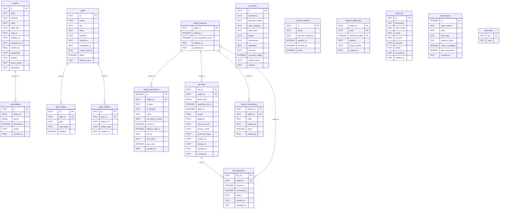

# hkask-storage — Reference

`hkask-storage` provides the persistence layer for hKask. It implements the
port traits from `hkask-types` against a SQLCipher (SQLite with encryption)
backend. The schema is defined in SQL files under `src/sql/` and in inline
`CREATE TABLE` statements in the store modules.

## Source citations

| Symbol | Location |
|--------|----------|
| `schema.sql` (core tables) | `kask/crates/hkask-storage/src/sql/schema.sql:1` |
| `hmems` table | `kask/crates/hkask-storage/src/sql/schema.sql:1` |
| `embeddings` table | `kask/crates/hkask-storage/src/sql/schema.sql:2` |
| `vec_embeddings` virtual table | `kask/crates/hkask-storage/src/sql/schema.sql:4` |
| `nu_events` table | `kask/crates/hkask-storage/src/sql/schema.sql:5` |
| `audit_log` table | `kask/crates/hkask-storage/src/sql/schema.sql:8` |
| `reg_variety_checkpoint` table | `kask/crates/hkask-storage/src/sql/schema.sql:11` |
| `reg_alerts` table | `kask/crates/hkask-storage/src/sql/schema.sql:12` |
| `agent_registry` table | `kask/crates/hkask-storage/src/sql/schema.sql:13` |
| `goals` table | `kask/crates/hkask-storage/src/sql/schema.sql:15` |
| `goal_criteria` table (FK to goals) | `kask/crates/hkask-storage/src/sql/schema.sql:16` |
| `goal_artifacts` table (FK to goals) | `kask/crates/hkask-storage/src/sql/schema.sql:17` |
| `consent_records` table | `kask/crates/hkask-storage/src/sql/schema.sql:18` |
| `quarantined_goals` table | `kask/crates/hkask-storage/src/sql/schema.sql:20` |
| `loop_cursors` table | `kask/crates/hkask-storage/src/sql/schema.sql:21` |
| `wallet_balances` table | `kask/crates/hkask-storage/src/sql/schema.sql:23` |
| `wallet_transactions` table (FK to wallet_balances) | `kask/crates/hkask-storage/src/sql/schema.sql:24` |
| `api_keys` table (FK to wallet_balances) | `kask/crates/hkask-storage/src/sql/schema.sql:27` |
| `deposit_addresses` table | `kask/crates/hkask-storage/src/sql/schema.sql:30` |
| `deposit_references` table (FK to wallet_balances) | `kask/crates/hkask-storage/src/sql/schema.sql:32` |
| `encumbrances` table (FK to api_keys, wallet_balances) | `kask/crates/hkask-storage/src/sql/schema.sql:36` |
| `kata_history` table | `kask/crates/hkask-storage/src/sql/schema.sql:39` |
| `pod_meta` table | `kask/crates/hkask-storage/src/sql/schema.sql:44` |
| `reg_records` table (inline) | `kask/crates/hkask-storage/src/regulation_store.rs:82` |
| `reg_cursors` table (inline) | `kask/crates/hkask-storage/src/regulation_store.rs:98` |
| `delegation_tokens` table (inline) | `kask/crates/hkask-storage/src/token_registry.rs:29` |
| `escalations` table (inline) | `kask/crates/hkask-storage/src/escalation.rs:86` |
| `EmbeddingStore` (impl EmbeddingPort) | `kask/crates/hkask-storage/src/embeddings.rs:629` |
| `EscalationQueue` (impl EscalationPort) | `kask/crates/hkask-storage/src/escalation.rs:402` |
| `RegulationArchive` (impl LedgerStoragePort) | `kask/crates/hkask-storage/src/regulation_store.rs:505` |

## Entity relationship diagram

The schema has four clusters: memory and events, goals and consent, wallet
and keys, and regulation. The ERD below shows the tables and their foreign-key
relationships.

<!-- DIAGRAM_ALIGNMENT
id: DIAG-DIA-STOR-001
verified_date: 2026-07-29
verified_against: kask/crates/hkask-storage/src/sql/schema.sql:1,2,4,5,8,11,12,13,15,16,17,18,20,21,23,24,27,30,32,36,39,44; kask/crates/hkask-storage/src/regulation_store.rs:82,98; kask/crates/hkask-storage/src/token_registry.rs:29; kask/crates/hkask-storage/src/escalation.rs:86
status: VERIFIED
-->

## Schema clusters

### Memory and events

The `hmems` table (`schema.sql:1`) is the entity-attribute-value store for
hKask memory. Each row is a bitemporal triple with `valid_from` and `valid_to`
columns, plus `recalled_at` and `transaction_at` for the transaction-time
axis, `owner_webid` and `visibility` for sovereignty, and `perspective` and
`dimension` for multi-perspective modeling. The `embeddings` table
(`schema.sql:2`) stores vector embeddings keyed by `entity_ref`, with a
`created_at` timestamp. The `vec_embeddings` virtual table (`schema.sql:4`)
uses the `vec0` extension for cosine-similarity search.

The `nu_events` table (`schema.sql:5`) stores Regulation observable spans.
Each event has `span_category`, `span_path`, `phase`, `observer_webid`,
`observation`, `regulation`, `outcome`, `recursion_depth`, `parent_event` for
recursive span nesting, and `visibility`.

The `audit_log` table (`schema.sql:8`) records actor-action-resource-outcome
tuples for compliance forensics, with `ip_address` and `created_at`.

### Goals and consent

The `goals` table (`schema.sql:15`) stores user goals with a `parent_goal_id`
for hierarchical decomposition, a `depth` field, `visibility`, `created_at`,
`completed_at`, and `display_name`. The `goal_criteria` table
(`schema.sql:16`) has a foreign key to `goals(id)` and stores acceptance
criteria with a `satisfied` flag. The `goal_artifacts` table (`schema.sql:17`)
links artifacts to goals with `artifact_ref` and `artifact_type`.

The `consent_records` table (`schema.sql:18`) stores per-WebID consent grants
with `granted_categories`, `granted_at`, `revoked_at`, and an `active` flag.
The `webid` column has a `UNIQUE` constraint — one active consent record per
WebID.

The `quarantined_goals` table (`schema.sql:20`) holds goals quarantined for
repair, with `quarantine_reason`, `repair_attempts`, and `repaired` flag.

### Wallet and keys

The `wallet_balances` table (`schema.sql:23`) is the root of the wallet
cluster. Three tables reference it: `wallet_transactions` (`schema.sql:24`),
`api_keys` (`schema.sql:27`), and `deposit_references` (`schema.sql:32`). The
`encumbrances` table (`schema.sql:36`) references both `api_keys(key_id)` and
`wallet_balances(wallet_id)`, modeling the hold-settle pattern for gas
budgets.

The `deposit_addresses` table (`schema.sql:30`) has a composite primary key
of `(wallet_id, chain, derivation_index)` and no foreign-key constraint,
because it is populated before the wallet balance row is committed.

The `wallet_transactions` table (`schema.sql:24`) is an append-only ledger
with `tx_type`, `tx_subtype`, `chain`, `on_chain_tx_hash`, `amount_rj`,
`balance_after_rj`, `key_id`, `tool_name`, and `gas_units` for gas
accounting.

The `api_keys` table (`schema.sql:27`) stores Ed25519 public keys with
`spending_limit_rj`, `spent_rj`, `scope`, `purpose`, `rate_limit_json`,
`privacy_mode`, `preferred_chain`, and lifecycle timestamps (`expires_at`,
`issued_at`, `revoked_at`, `created_at`).

### Regulation and system

The `reg_records` table (`regulation_store.rs:82`) stores Regulation ledger
records. The `reg_cursors` table (`regulation_store.rs:98`) stores loop
cursors for the Regulation cycle. Both are created inline in the
`regulation_store.rs` module rather than in `schema.sql`.

The `delegation_tokens` table (`token_registry.rs:29`) persists OCAP tokens
for audit, with `attenuation_level`, `max_attenuation`, `context_nonce`, and
`revoked` flag. The `escalations` table (`escalation.rs:86`) stores escalation
records for the algedonic alert path.

The `reg_variety_checkpoint` table (`schema.sql:11`) tracks per-domain
variety counts for Ashby's Law monitoring. The `reg_alerts` table
(`schema.sql:12`) stores algedonic alerts with `severity` and `resolved`
flag. The `agent_registry` table (`schema.sql:13`) registers agent
definitions with `token_hash` for integrity verification.

The `loop_cursors` table (`schema.sql:21`) stores key-value loop state for
the Regulation cycle. The `kata_history` table (`schema.sql:39`) tracks
practice frequency, streaks, and automaticity across sessions. The `pod_meta`
table (`schema.sql:44`) stores pod metadata (webid, pod_kind, schema_version).

### Users (dead SQL — not loaded)

The file `src/sql/users.sql` defines `human_users`, `userpod_identities`,
`user_sessions`, and `invites` tables. However, no Rust code loads this
file — `grep` for `users.sql` in `*.rs` returns no matches. The architecture
plan calls for deleting the userpod abstraction (the Zed account replaces
it). These tables are dead SQL and should not be relied upon. They are not
shown in the ERD above.

## Port trait implementors

Three port traits from `hkask-types` are implemented in this crate:

- `EmbeddingPort` by `EmbeddingStore` at `embeddings.rs:629`.
- `EscalationPort` by `EscalationQueue` at `escalation.rs:402`.
- `LedgerStoragePort` by `RegulationArchive` at `regulation_store.rs:505`.

(`ConsentPort` / `ConsentStore` were removed — consent records are no longer persisted via this crate.)

## See also

- [hkask-storage How-to](./how-to.md): procedural flowchart for adding a new
  migration.
- [hkask-types Reference](../hkask-types/reference.md): the port traits this
  crate implements.
- [`kask/docs/architecture/salience-specification.md`](../../architecture/salience-specification.md):
  the passage salience algorithm that consumes the `hmems` table.

---

[^fowler-poeaa]: Fowler, M. (2002). *Patterns of Enterprise Application Architecture.* Addison-Wesley. <https://martinfowler.com/books/eaa.html>. The Active Record and Repository patterns that the store modules implement.

[^sqlcipher]: Zetetic LLC. (2024). *SQLCipher — Transparent SQLite Encryption.* <https://www.zetetic.net/sqlcipher/>. The encrypted SQLite extension that provides the database backend.
