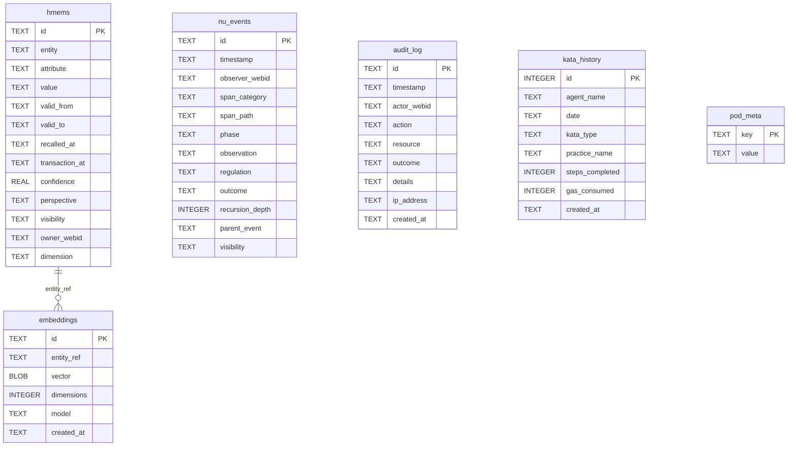

# hkask-storage — Reference

`hkask-storage` provides the persistence layer for hKask. It implements the
port traits from `hkask-types` against a SQLCipher (SQLite with encryption)
backend. The core schema is `src/core/sql/schema.sql` (loaded by
`Database::initialize_schema` in `core/database.rs`); Postgres mirrors it in
`src/core/sql/schema_pg.sql`. Store-specific tables are defined inline in their
store modules' `init_schema` methods.

## Source citations

| Symbol | Location |
|--------|----------|
| `schema.sql` (core tables) | `kask/crates/hkask-storage/src/core/sql/schema.sql:1` |
| `hmems` table | `kask/crates/hkask-storage/src/core/sql/schema.sql:1` |
| `embeddings` table | `kask/crates/hkask-storage/src/core/sql/schema.sql:2` |
| `vec_embeddings` virtual table | `kask/crates/hkask-storage/src/core/sql/schema.sql:4` |
| `nu_events` table | `kask/crates/hkask-storage/src/core/sql/schema.sql:5` |
| `audit_log` table | `kask/crates/hkask-storage/src/core/sql/schema.sql:8` |
| `reg_variety_checkpoint` table | `kask/crates/hkask-storage/src/core/sql/schema.sql:11` |
| `reg_alerts` table | `kask/crates/hkask-storage/src/core/sql/schema.sql:12` |
| `agent_registry` table | `kask/crates/hkask-storage/src/core/sql/schema.sql:13` |
| `loop_cursors` table | `kask/crates/hkask-storage/src/core/sql/schema.sql:15` |
| `kata_history` table | `kask/crates/hkask-storage/src/core/sql/schema.sql:17` |
| `pod_meta` table | `kask/crates/hkask-storage/src/core/sql/schema.sql:22` |
| `reg_records` table (inline) | `kask/crates/hkask-storage/src/regulation_store.rs` |
| `reg_cursors` table (inline) | `kask/crates/hkask-storage/src/regulation_store.rs` |
| `escalations` table (inline) | `kask/crates/hkask-storage/src/escalation.rs` |
| `EmbeddingStore` | `kask/crates/hkask-storage/src/embeddings.rs` |
| `EscalationQueue` | `kask/crates/hkask-storage/src/escalation.rs:58` |
| `RegulationArchive` (impl `RegulationSink`) | `kask/crates/hkask-storage/src/regulation_store.rs:508` |

## Entity relationship diagram

The schema's core tables cluster around memory/events and regulation/system.
(The `goals`/`consent`/`wallet` tables were removed — see the corresponding
REMOVED sections under Schema clusters.) The ERD below shows the surviving
core tables.

<!-- DIAGRAM_ALIGNMENT
id: DIAG-DIA-STOR-001
verified_date: 2026-08-04
verified_against: kask/crates/hkask-storage/src/core/sql/schema.sql:1,2,4,5,8,11,12,13,15,17,22; kask/crates/hkask-storage/src/regulation_store.rs; kask/crates/hkask-storage/src/escalation.rs
status: VERIFIED
-->

## Schema clusters

### Memory and events

The `hmems` table (`schema.sql:1`) is the entity-attribute-value store for
hKask memory. Each row is a bitemporal triple with `valid_from` and `valid_to`
columns, plus `recalled_at` and `transaction_at` for the transaction-time
axis, `owner_webid` and `visibility` for sovereignty, and `perspective` and
`dimension` for multi-perspective modeling. The `embeddings` table
(`schema.sql:2`) stores vector embeddings keyed by `entity_ref`, with a
`created_at` timestamp. The `vec_embeddings` virtual table (`schema.sql:4`)
uses the `vec0` extension for cosine-similarity search.

The `nu_events` table (`schema.sql:5`) stores Regulation observable spans.
Each event has `span_category`, `span_path`, `phase`, `observer_webid`,
`observation`, `regulation`, `outcome`, `recursion_depth`, `parent_event` for
recursive span nesting, and `visibility`.

The `audit_log` table (`schema.sql:8`) records actor-action-resource-outcome
tuples for compliance forensics, with `ip_address` and `created_at`.

### Goals and consent (REMOVED)

The `goals`, `goal_criteria`, `goal_artifacts`, `consent_records`, and
`quarantined_goals` tables no longer exist. The `hkask-goal` crate and its
storage were deleted (see the architecture plan §2.3); `GoalState` survives only
as a type in `hkask-types`. Consent records and the multi-user identity store
(`users.sql`) were removed when zed-kask's account system replaced them. The
`schema.sql` line numbers that previously pointed at these tables now point at
other tables (e.g. `goals` was `:15`, which is now `loop_cursors`).

### Wallet and keys (REMOVED 2026-08-03)

The crypto wallet schema (`wallet_balances`, `wallet_transactions`, `api_keys`,
`deposit_addresses`, `deposit_references`, `encumbrances`) and the
`hkask-storage::wallet` Rust module that read/wrote them were deleted 2026-08-03
as dead-in-production (zero callers). These tables are no longer created by
`schema.sql`. Governed tool-call bounding is now in-memory via
`hkask-regulation::CallCapManager`; per-skill-cascade USD budgeting is
`hkask-templates::BudgetTracker`. The unrelated ABW wallet balance shown in the
swarm panel is read from the ABW REST API, not from any local table.

### Regulation and system

The `reg_records` table (`regulation_store.rs:82`) stores Regulation ledger
records. The `reg_cursors` table (`regulation_store.rs:98`) stores loop
cursors for the Regulation cycle. Both are created inline in the
`regulation_store.rs` module rather than in `schema.sql`.

The `escalations` table (`escalation.rs`) stores escalation
records for the algedonic alert path.

The `reg_variety_checkpoint` table (`schema.sql:11`) tracks per-domain
variety counts for Ashby's Law monitoring. The `reg_alerts` table
(`schema.sql:12`) stores algedonic alerts with `severity` and `resolved`
flag. The `agent_registry` table (`schema.sql:13`) registers agent
definitions with `token_hash` for integrity verification.

The `loop_cursors` table (`schema.sql:15`) stores key-value loop state for
the Regulation cycle. The `kata_history` table (`schema.sql:17`) tracks
practice frequency, streaks, and automaticity across sessions. The `pod_meta`
table (`schema.sql:22`) stores pod metadata (webid, pod_kind).

### Users (dead SQL — deleted 2026-08-03)

The `src/sql/users.sql` file (`human_users`, `userpod_identities`,
`user_sessions`, `invites`) was an orphan from the deleted multi-user identity
store — no Rust code loaded it (the Zed account replaces the userpod
abstraction). The entire `src/sql/` directory was deleted 2026-08-03; the
canonical schema now lives solely in `src/core/sql/schema.sql`.

## Port trait implementors

One port trait from `hkask-types` is implemented in this crate:

- `RegulationSink` by `RegulationArchive` at `regulation_store.rs:508`.

(`EmbeddingPort`, `EscalationPort`, and `LedgerStoragePort` were removed as speculative generality — each had a single implementor whose consumers already depended on the storage crate. Their methods are now inherent on `EmbeddingStore`, `EscalationQueue`, and `RegulationArchive`. `ConsentPort` / `ConsentStore` were removed earlier — consent records are no longer persisted via this crate.)

## See also

- [hkask-storage How-to](./how-to.md): procedural flowchart for adding a new
  migration.
- [hkask-types Reference](../hkask-types/reference.md): the port traits this
  crate implements.
- [`kask/docs/architecture/salience-specification.md`](../../architecture/salience-specification.md):
  the passage salience algorithm that consumes the `hmems` table.

---

[^fowler-poeaa]: Fowler, M. (2002). *Patterns of Enterprise Application Architecture.* Addison-Wesley. <https://martinfowler.com/books/eaa.html>. The Active Record and Repository patterns that the store modules implement.

[^sqlcipher]: Zetetic LLC. (2024). *SQLCipher — Transparent SQLite Encryption.* <https://www.zetetic.net/sqlcipher/>. The encrypted SQLite extension that provides the database backend.
