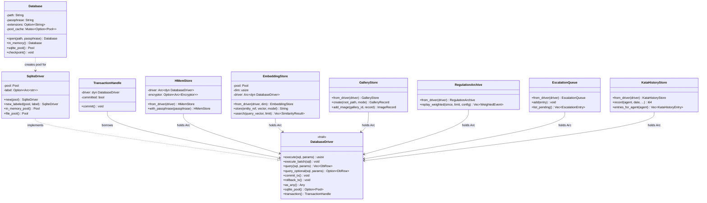
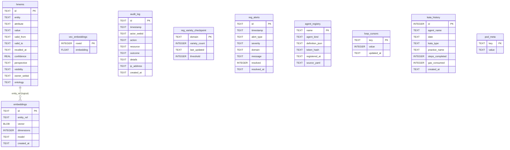

# hkask-storage — Reference

`hkask-storage` is the consolidated persistence layer for hKask. It merged
the former `hkask-storage`, `hkask-database`, and `hkask-storage-core`
crates into one crate with a `core/` foundation (the `Database` connection
manager, the `DatabaseDriver` port, the `SqliteDriver` implementation, path
sanitization, and the `define_driver_store!` macro) and per-domain store
modules (`hmem.rs`, `embeddings.rs`, `gallery.rs`, `regulation_store.rs`,
`escalation.rs`, `kata.rs`). The backend is SQLCipher (SQLite with AES-256-CBC
encryption, Argon2id key derivation). There is no Postgres mirror — the
`schema_pg.sql` path was removed during consolidation.

The core schema is `src/core/sql/schema.sql`, loaded by
`Database::initialize_schema` on every pool creation
(`core/database.rs:206-211`). Store-specific tables are defined inline in
their store modules' `init_schema` methods.

## Source citations

| Symbol | Location |
|--------|----------|
| Crate root (re-exports) | `kask/crates/hkask-storage/src/hkask_storage.rs:9-41` |
| `Database` struct | `kask/crates/hkask-storage/src/core/database.rs:104-110` |
| `Database::open` | `kask/crates/hkask-storage/src/core/database.rs:177-179` |
| `Database::open_with_extensions` | `kask/crates/hkask-storage/src/core/database.rs:181-187` |
| `Database::in_memory` | `kask/crates/hkask-storage/src/core/database.rs:198-200` |
| `Database::sqlite_pool` (cached r2d2 pool) | `kask/crates/hkask-storage/src/core/database.rs:222-244` |
| `Database::checkpoint` (WAL + vacuum) | `kask/crates/hkask-storage/src/core/database.rs:255-270` |
| `DatabaseError` enum | `kask/crates/hkask-storage/src/core/database.rs:82-93` |
| `check_passphrase` | `kask/crates/hkask-storage/src/core/database.rs:413-419` |
| `open_or_repair` (passphrase-safe) | `kask/crates/hkask-storage/src/core/database.rs:427-431` |
| `open_database` dispatcher | `kask/crates/hkask-storage/src/core/database.rs:433-439` |
| `embedding_dim` / `DEFAULT_EMBEDDING_DIM` | `kask/crates/hkask-storage/src/core/database.rs:20-37` |
| `init_sqlite_vec_on` (per-connection vec0) | `kask/crates/hkask-storage/src/core/database.rs:56-76` |
| `SQLCIPHER_SALT_SIZE` | `kask/crates/hkask-storage/src/core/database.rs:78` |
| `sanitize_path` (traversal guard) | `kask/crates/hkask-storage/src/core/security.rs:17-54` |
| `define_driver_store!` macro | `kask/crates/hkask-storage/src/core/store_macros.rs:44-71` |
| `impl_from_db_error!` macro | `kask/crates/hkask-storage/src/core/store_macros.rs:78-87` |
| `DatabaseDriver` trait | `kask/crates/hkask-storage/src/database/driver.rs:16-58` |
| `query_map` / `query_row` helpers | `kask/crates/hkask-storage/src/database/driver.rs:78-109` |
| `SqliteDriver` struct | `kask/crates/hkask-storage/src/database/sqlite.rs:42-50` |
| `SqliteDriver::new` / `new_labeled` | `kask/crates/hkask-storage/src/database/sqlite.rs:60-73` |
| `SqliteDriver::in_memory_pool` / `in_memory_driver` | `kask/crates/hkask-storage/src/database/sqlite.rs:86-106` |
| `SqliteDriver::file_pool` / `file_driver` | `kask/crates/hkask-storage/src/database/sqlite.rs:113-131` |
| `WAL_PRAGMA_BATCH` / `init_wal_pragmas` | `kask/crates/hkask-storage/src/database/sqlite.rs:24-35` |
| `TransactionHandle` (RAII tx) | `kask/crates/hkask-storage/src/database/transaction.rs:19-53` |
| `DbValue` enum | `kask/crates/hkask-storage/src/database/value.rs:7-14` |
| `DbRow` struct + accessors | `kask/crates/hkask-storage/src/database/value.rs:148-309` |
| `DbError` (re-export from `hkask-types`) | `kask/crates/hkask-storage/src/database/types.rs:7` |
| `Encryptor` (AES-256-GCM, ENCv1 prefix) | `kask/crates/hkask-storage/src/database/encrypt.rs:17-115` |
| `HMem` struct | `kask/crates/hkask-storage/src/hmem.rs:42-60` |
| `HMemStore` | `kask/crates/hkask-storage/src/hmem.rs:162-165` |
| `HMemStore::from_driver` | `kask/crates/hkask-storage/src/hmem.rs:177-184` |
| `HMemStore::with_passphrase` | `kask/crates/hkask-storage/src/hmem.rs:187-192` |
| `SEMANTIC_PREDICATE` / `EPISODIC_PREDICATE` | `kask/crates/hkask-storage/src/hmem.rs:210-217` |
| `BackupArchive` (sovereignty export) | `kask/crates/hkask-storage/src/hmem/archive.rs:56-59` |
| `BackupMeta` / `MigrationReceipt` | `kask/crates/hkask-storage/src/hmem/archive.rs:42-53` |
| `StoredEmbedding` / `SimilarityResult` | `kask/crates/hkask-storage/src/embeddings.rs:28-38` |
| `EmbeddingStore` | `kask/crates/hkask-storage/src/embeddings.rs:63-67` |
| `EmbeddingStore::from_driver` (dim clamp) | `kask/crates/hkask-storage/src/embeddings.rs:82-109` |
| `EmbeddingStore::store` (two-table tx) | `kask/crates/hkask-storage/src/embeddings.rs:169-222` |
| `EmbeddingStore::search` (vec0 KNN) | `kask/crates/hkask-storage/src/embeddings.rs:273-318` |
| `EmbeddingError` enum | `kask/crates/hkask-storage/src/embeddings.rs:40-51` |
| `GalleryStore` / `GalleryMode` | `kask/crates/hkask-storage/src/gallery.rs:36-43,162` |
| `GalleryRecord` / `ImageRecord` / `TagRecord` | `kask/crates/hkask-storage/src/gallery.rs:71-104` |
| `FaceRegistryRecord` | `kask/crates/hkask-storage/src/gallery.rs:109-123` |
| `WorkflowRecord` / `GenerationRecord` | `kask/crates/hkask-storage/src/gallery.rs:129-160` |
| `GalleryStore::init_schema` (multi-table) | `kask/crates/hkask-storage/src/gallery.rs:170-233` |
| `GalleryStoreError` enum | `kask/crates/hkask-storage/src/gallery.rs:22-31` |
| `RegulationArchive` | `kask/crates/hkask-storage/src/regulation_store.rs:70` |
| `RegulationArchive::init_schema` | `kask/crates/hkask-storage/src/regulation_store.rs:78-106` |
| `RegulationArchive::replay_weighted` | `kask/crates/hkask-storage/src/regulation_store.rs:127-150` |
| `RegulationArchive::lambda_for` | `kask/crates/hkask-storage/src/regulation_store.rs:162-172` |
| `DecayConfig` / `WeightedEvent` | `kask/crates/hkask-storage/src/regulation_store.rs:17-47` |
| `ALGEDONIC_SPAN_CATEGORIES` | `kask/crates/hkask-storage/src/regulation_store.rs:58-68` |
| `impl RegulationSink for RegulationArchive` | `kask/crates/hkask-storage/src/regulation_store.rs:508-520` |
| `EscalationEntry` / `EscalationStatus` | `kask/crates/hkask-storage/src/escalation.rs:15-57` |
| `EscalationQueue` | `kask/crates/hkask-storage/src/escalation.rs:58-60` |
| `EscalationQueue::from_driver` / `init` | `kask/crates/hkask-storage/src/escalation.rs:76-103` |
| `EscalationBatch` / `EscalationStats` | `kask/crates/hkask-storage/src/escalation.rs:356-405` |
| `EscalationError` enum | `kask/crates/hkask-storage/src/escalation.rs:62-67` |
| `KataHistoryStore` / `KataHistoryEntry` | `kask/crates/hkask-storage/src/kata.rs:10-23` |
| `KataHistoryStore::init_schema` (no-op) | `kask/crates/hkask-storage/src/kata.rs:36-44` |
| `KataHistoryError` enum | `kask/crates/hkask-storage/src/kata.rs:27-33` |
| Core schema (`schema.sql`) | `kask/crates/hkask-storage/src/core/sql/schema.sql:1-22` |
| `hmems` table | `kask/crates/hkask-storage/src/core/sql/schema.sql:1` |
| `embeddings` table | `kask/crates/hkask-storage/src/core/sql/schema.sql:5` |
| `vec_embeddings` virtual table | `kask/crates/hkask-storage/src/core/sql/schema.sql:7` |
| `audit_log` table | `kask/crates/hkask-storage/src/core/sql/schema.sql:8` |
| `reg_variety_checkpoint` table | `kask/crates/hkask-storage/src/core/sql/schema.sql:11` |
| `reg_alerts` table | `kask/crates/hkask-storage/src/core/sql/schema.sql:12` |
| `agent_registry` table | `kask/crates/hkask-storage/src/core/sql/schema.sql:13` |
| `loop_cursors` table | `kask/crates/hkask-storage/src/core/sql/schema.sql:15` |
| `kata_history` table | `kask/crates/hkask-storage/src/core/sql/schema.sql:17` |
| `pod_meta` table | `kask/crates/hkask-storage/src/core/sql/schema.sql:22` |

## Class diagram — the driver port and its stores

<!-- DIAGRAM_ALIGNMENT
id: DIAG-STOR-003
verified_date: 2026-08-13
verified_against: kask/crates/hkask-storage/src/core/database.rs:104-110,177-204,222-270; kask/crates/hkask-storage/src/database/driver.rs:16-58; kask/crates/hkask-storage/src/database/sqlite.rs:42-73; kask/crates/hkask-storage/src/database/transaction.rs:19-53; kask/crates/hkask-storage/src/hmem.rs:162-198; kask/crates/hkask-storage/src/embeddings.rs:63-109; kask/crates/hkask-storage/src/gallery.rs:162; kask/crates/hkask-storage/src/regulation_store.rs:70; kask/crates/hkask-storage/src/escalation.rs:58-82; kask/crates/hkask-storage/src/kata.rs:10
status: VERIFIED
-->

## Entity relationship diagram — core schema

The core schema clusters around memory/events and regulation/system. The
ERD below shows the surviving core tables from `schema.sql`. Store-specific
tables (`reg_records`, `reg_cursors`, `escalations`, the `gallery_*` family)
are created inline by their stores and are not in `schema.sql`.

<!-- DIAGRAM_ALIGNMENT
id: DIAG-STOR-004
verified_date: 2026-08-13
verified_against: kask/crates/hkask-storage/src/core/sql/schema.sql:1,5,7,8,11,12,13,15,17,22
status: VERIFIED
-->

## Schema clusters

### Memory and embeddings

The `hmems` table (`schema.sql:1`) is the entity-attribute-value store for
hKask memory. Each row is a bitemporal triple with `valid_from`/`valid_to`
(valid time), `recalled_at` (recall-time decay clock), `owner_webid` and
`visibility` (sovereignty), `perspective` (multi-perspective modeling), and
`ontology` (a JSON blob carrying the P5.4 dual-axis anchoring — DC+BIBO state
axis + PKO process axis). The `embeddings` table (`schema.sql:5`) stores
vector embeddings keyed by `entity_ref`, with a `vector` BLOB (little-endian
f32) and `dimensions`. The `vec_embeddings` virtual table (`schema.sql:7`)
uses the `vec0` extension for cosine-similarity KNN search; its `$DIM`
placeholder is replaced with `embedding_dim()` at load time.

The `audit_log` table (`schema.sql:8`) records actor-action-resource-outcome
tuples for compliance forensics, with `ip_address` and `created_at`.

### Regulation and system

The `reg_records` and `reg_cursors` tables are created inline in
`regulation_store.rs:78-106` (not in `schema.sql`). `reg_records` stores
Regulation observable spans with `span_category`, `span_path`, `phase`,
`observer_webid`, `observation`, `regulation`, `outcome`, `recursion_depth`,
`parent_event`, and `visibility`. `reg_cursors` stores key-value loop state.

The `escalations` table is created inline in `escalation.rs:83-103` for the
algedonic alert path (Cybernetics Loop 6).

The `reg_variety_checkpoint` table (`schema.sql:11`) tracks per-domain
variety counts for Ashby's Law monitoring. The `reg_alerts` table
(`schema.sql:12`) stores algedonic alerts with `severity` and `resolved`
flag. The `agent_registry` table (`schema.sql:13`) registers agent
definitions with `token_hash` for integrity verification. The `loop_cursors`
table (`schema.sql:15`) stores key-value loop state for the Regulation cycle.
The `kata_history` table (`schema.sql:17`) tracks practice frequency,
streaks, and automaticity across sessions. The `pod_meta` table
(`schema.sql:22`) stores pod metadata (webid, pod_kind) for passphrase
derivation and discovery.

### Gallery (store-specific)

The `galleries`, `gallery_images`, `gallery_tags`, `face_registry`,
`gallery_workflow`, and `gallery_generation` tables are created inline in
`gallery.rs:170-233`. The gallery is a lens over the filesystem, not a copy
of it: images are indexed by path + hash, tags are AI-generated metadata,
and `gallery_generation` records the full lineage (op, prompt, model,
provider, seed, params, parent_image_id) so an asset stays reproducible even
if the provider is later removed.

## Port trait implementors

One port trait from `hkask-types` is implemented in this crate:

- `RegulationSink` by `RegulationArchive` at `regulation_store.rs:508-520`.

The other stores (`EmbeddingStore`, `EscalationQueue`, `HMemStore`,
`GalleryStore`, `KataHistoryStore`) expose their methods as inherent impls
rather than behind port traits — the speculative-generality port traits
(`EmbeddingPort`, `EscalationPort`, `LedgerStoragePort`) were removed because
each had a single implementor whose consumers already depended on the
storage crate.

## D28 — Standardized Artifact Storage

Under D28, storage artifacts live under a single rooted data tree
(`{kask_data_dir}/`) with four class subdirs: `agents/`, `mcp/`, `skills/`,
`threads/`. An artifact lives under the class subdir of the entity that owns
it — agent-owned under `agents/{name}/`, server-owned under
`mcp/{server_id}/`. The curator DB is `agents/curator/curator.db` (the "pod"
concept was deprecated; `pod.db` is gone). MCP server DBs follow
`mcp/{server_id}/{purpose}.db` (e.g. `mcp/codegraph/codegraph.db`,
`mcp/kata-kanban/kanban.db`, `mcp/media/gallery.db`). The `pod_meta` table
in `schema.sql:22` is the in-DB metadata mirror, not a path component.

## See also

- [hkask-storage How-to](./how-to.md): procedural flowchart for adding a new
  migration.
- [hkask-storage Tutorial](./tutorial.md): the store lifecycle from
  `Database` to CRUD.
- [hkask-storage Explanation](./explanation.md): why the crate splits
  `Database` from `SqliteDriver` and uses per-store `init_schema`.
- [hkask-types Reference](../hkask-types/reference.md): the port traits this
  crate implements.
- [`kask/docs/architecture/standardized-artifact-storage.md`](../../architecture/standardized-artifact-storage.md):
  the D28 layout spec.

---

[^fowler-poeaa]: Fowler, M. (2002). *Patterns of Enterprise Application Architecture.* Addison-Wesley. <https://martinfowler.com/books/eaa.html>. The Repository and Active Record patterns that the store modules implement.

[^sqlcipher]: Zetetic LLC. (2024). *SQLCipher — Transparent SQLite Encryption.* <https://www.zetetic.net/sqlcipher/>. The encrypted SQLite extension that provides the database backend.

[^sqlite-vec]: Aslett, A. (2024). *sqlite-vec: A vector search extension for SQLite.* <https://github.com/asg0171/sqlite-vec>. The `vec0` virtual table extension used by `EmbeddingStore::search`.
