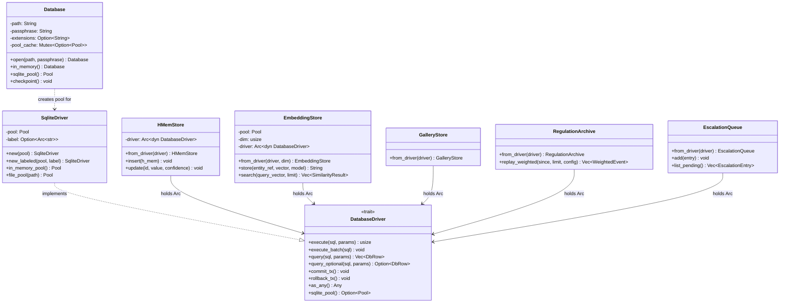
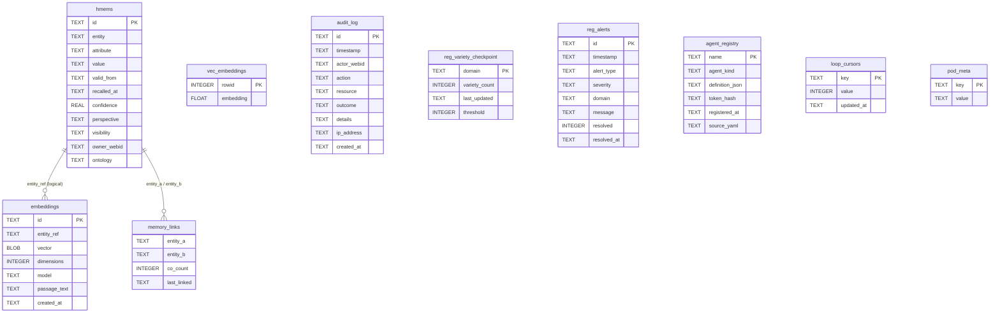

# hkask-storage — Reference

`hkask-storage` is the consolidated persistence layer for hKask: SQLCipher
(SQLite encryption using SQLCipher's native passphrase KDF — PBKDF2 inside
`PRAGMA key`, salt stored in the DB file header) plus the sqlite-vec vector
extension. The crate has a `core/` foundation (the `Database` connection
manager, path sanitization, the `define_driver_store!` macro), a
`database/` driver layer (the `DatabaseDriver` port, the `SqliteDriver`
implementation, value encryption), and per-domain store modules (`hmem.rs`,
`embeddings.rs`, `gallery.rs`, `regulation_store.rs`, `escalation.rs`,
`rotation.rs`). SQLite is the only backend.

The core schema is `src/core/sql/schema.sql`, loaded by
`Database::initialize_schema` on every pool creation
(`core/connection.rs:192-204`). Store-specific tables are defined inline in
their store modules' `init_schema` methods.

## Source citations

| Symbol | Location |
|--------|----------|
| Crate root (re-exports) | `kask/crates/hkask-storage/src/hkask_storage.rs:9-35` |
| `Database` struct | `kask/crates/hkask-storage/src/core/connection.rs:108-114` |
| `Database::open` | `kask/crates/hkask-storage/src/core/connection.rs:163-165` |
| `Database::open_with_extensions` | `kask/crates/hkask-storage/src/core/connection.rs:167-173` |
| `Database::in_memory` | `kask/crates/hkask-storage/src/core/connection.rs:184-186` |
| `Database::sqlite_pool` (cached r2d2 pool) | `kask/crates/hkask-storage/src/core/connection.rs:230-252` |
| `Database::checkpoint` (WAL + vacuum + optimize) | `kask/crates/hkask-storage/src/core/connection.rs:263-278` |
| `initialize_schema` + `passage_text` migration | `kask/crates/hkask-storage/src/core/connection.rs:192-219` |
| `DatabaseError` enum | `kask/crates/hkask-storage/src/core/connection.rs:86-97` |
| `open_or_repair` (non-destructive open) | `kask/crates/hkask-storage/src/core/connection.rs:429-434` |
| `open_database` dispatcher | `kask/crates/hkask-storage/src/core/connection.rs:435-446` |
| `embedding_dim` / `DEFAULT_EMBEDDING_DIM` | `kask/crates/hkask-storage/src/core/connection.rs:24-37` |
| `init_sqlite_vec_on` (per-connection vec0) | `kask/crates/hkask-storage/src/core/connection.rs:60-76` |
| `SQLCIPHER_SALT_SIZE` (legacy-scheme marker) | `kask/crates/hkask-storage/src/core/connection.rs:82` |
| `sanitize_path` (traversal guard) | `kask/crates/hkask-storage/src/core/security.rs:17-54` |
| `define_driver_store!` macro | `kask/crates/hkask-storage/src/core/store_macros.rs:44-71` |
| `impl_from_db_error!` macro | `kask/crates/hkask-storage/src/core/store_macros.rs:79-86` |
| `DatabaseDriver` trait | `kask/crates/hkask-storage/src/database/driver.rs:16-58` |
| `query_map` / `query_row` helpers | `kask/crates/hkask-storage/src/database/driver.rs:78-109` |
| `SqliteDriver` struct | `kask/crates/hkask-storage/src/database/sqlite.rs:42-50` |
| `SqliteDriver::new` / `new_labeled` | `kask/crates/hkask-storage/src/database/sqlite.rs:60-73` |
| `SqliteDriver::in_memory_pool` / `in_memory_driver` | `kask/crates/hkask-storage/src/database/sqlite.rs:86-106` |
| `SqliteDriver::file_pool` (unencrypted WAL pool) | `kask/crates/hkask-storage/src/database/sqlite.rs:111-117` |
| `WAL_PRAGMA_BATCH` / `init_wal_pragmas` | `kask/crates/hkask-storage/src/database/sqlite.rs:24-35` |
| Storage spans (`reg.storage` tracing) | `kask/crates/hkask-storage/src/database/sqlite.rs:210-232` |
| `TransactionHandle` (RAII tx) | `kask/crates/hkask-storage/src/database/transaction.rs` |
| `DbValue` / `DbRow` | `kask/crates/hkask-storage/src/database/value.rs` |
| `rotate_passphrase` (atomic re-encryption) | `kask/crates/hkask-storage/src/rotation.rs:122-297` |
| `RotationError` enum | `kask/crates/hkask-storage/src/rotation.rs:66-90` |
| `HMem` struct | `kask/crates/hkask-storage/src/hmem.rs:41-59` |
| `HMemStore` | `kask/crates/hkask-storage/src/hmem.rs:135-138` |
| `HMemStore::from_driver` (no schema re-create) | `kask/crates/hkask-storage/src/hmem.rs:150-157` |
| `HMemStore::update` (single-connection tx) | `kask/crates/hkask-storage/src/hmem.rs:404-476` |
| `HMemStore::touch_recall` (decay clock) | `kask/crates/hkask-storage/src/hmem.rs:501-507` |
| Ontology queries (`json_extract` paths) | `kask/crates/hkask-storage/src/hmem.rs:586-700` |
| `HMemStore::delete_by_id` | `kask/crates/hkask-storage/src/hmem.rs:709-729` |
| `StoredEmbedding` / `SimilarityResult` | `kask/crates/hkask-storage/src/embeddings.rs:27-39` |
| `EmbeddingStore` | `kask/crates/hkask-storage/src/embeddings.rs:64-68` |
| `EmbeddingStore::from_driver` (dim==0 clamp) | `kask/crates/hkask-storage/src/embeddings.rs:83-110` |
| `EmbeddingStore::store` (two-table tx) | `kask/crates/hkask-storage/src/embeddings.rs:170-224` |
| `EmbeddingStore::search` (vec0 KNN) | `kask/crates/hkask-storage/src/embeddings.rs:281-329` |
| `EmbeddingStore::all_with_text` | `kask/crates/hkask-storage/src/embeddings.rs:468-488` |
| `EmbeddingError` enum | `kask/crates/hkask-storage/src/embeddings.rs:41-52` |
| `GalleryStore` / `GalleryMode` | `kask/crates/hkask-storage/src/gallery.rs:36,185` |
| `GalleryRecord` / `ImageRecord` / `TagRecord` | `kask/crates/hkask-storage/src/gallery.rs:71-104` |
| `FaceRegistryRecord` / `WorkflowRecord` / `GenerationRecord` | `kask/crates/hkask-storage/src/gallery.rs:111-178` |
| `GalleryStore::init_schema` (multi-table) | `kask/crates/hkask-storage/src/gallery.rs:193-270` |
| `RegulationArchive` | `kask/crates/hkask-storage/src/regulation_store.rs:70-104` |
| `DecayConfig` / `WeightedEvent` | `kask/crates/hkask-storage/src/regulation_store.rs:16-46` |
| `ALGEDONIC_SPAN_CATEGORIES` | `kask/crates/hkask-storage/src/regulation_store.rs:57-66` |
| `RegulationArchive::replay_weighted` | `kask/crates/hkask-storage/src/regulation_store.rs:125-148` |
| `RegulationArchive::lambda_for` | `kask/crates/hkask-storage/src/regulation_store.rs:160-170` |
| `RegulationArchive::delete_older_than` / `checkpoint` | `kask/crates/hkask-storage/src/regulation_store.rs:242-292` |
| `RegulationArchive::query_algedonic` | `kask/crates/hkask-storage/src/regulation_store.rs:318-351` |
| `impl RegulationSink for RegulationArchive` | `kask/crates/hkask-storage/src/regulation_store.rs:474-486` |
| `EscalationEntry` / `EscalationStatus` | `kask/crates/hkask-storage/src/escalation.rs:15-57` |
| `EscalationQueue` | `kask/crates/hkask-storage/src/escalation.rs:58-60` |
| `EscalationQueue::from_driver` / `init` | `kask/crates/hkask-storage/src/escalation.rs:76-103` |
| `EscalationQueue` resolve/dismiss by output | `kask/crates/hkask-storage/src/escalation.rs:331-416` |
| `EscalationError` enum | `kask/crates/hkask-storage/src/escalation.rs:62-67` |
| Core schema (`schema.sql`) | `kask/crates/hkask-storage/src/core/sql/schema.sql:1-27` |

## Class diagram — the driver port and its stores

<!-- DIAGRAM_ALIGNMENT
id: DIAG-STOR-003
verified_date: 2026-08-28
verified_against: kask/crates/hkask-storage/src/core/connection.rs:108-114,163-186,230-278; kask/crates/hkask-storage/src/database/driver.rs:16-58; kask/crates/hkask-storage/src/database/sqlite.rs:42-73; kask/crates/hkask-storage/src/hmem.rs:135-157; kask/crates/hkask-storage/src/embeddings.rs:64-110; kask/crates/hkask-storage/src/gallery.rs:185; kask/crates/hkask-storage/src/regulation_store.rs:70; kask/crates/hkask-storage/src/escalation.rs:58-82
status: VERIFIED
-->

## Entity relationship diagram — core schema

The core schema clusters around memory/embeddings and regulation/system.
Store-specific tables (`reg_records`, `reg_cursors`, `escalations`, the
gallery tables) are created inline by their stores and are not in
`schema.sql`.

<!-- DIAGRAM_ALIGNMENT
id: DIAG-STOR-004
verified_date: 2026-08-28
verified_against: kask/crates/hkask-storage/src/core/sql/schema.sql:1-27
status: VERIFIED
-->

## Schema clusters

### Memory and embeddings

The `hmems` table (`schema.sql:1`) is the entity-attribute-value store for
hKask memory. Each retained row has `valid_from` (creation time) and
`recalled_at` (recall-time decay
clock, reset by `HMemStore::touch_recall` at `hmem.rs:501-507`),
`owner_webid` and `visibility` (sovereignty), `perspective`
(multi-perspective modeling), and `ontology` (a JSON blob carrying the
dual-axis anchoring — DC+BIBO state axis + PKO process axis + 5W1H +
open-world domain tags; `hmem.rs:53-58`). Ontology queries reach into the
blob with SQLite `json_extract`, guarded by `json_valid(ontology)`
(`hmem.rs`, ontology query methods). Each memory is a uni-temporal triple
with `valid_from`; forgotten rows are deleted from the database (operator
ruling 2026-09-04). On open, `core/connection.rs::migrate_hmems_forgetting_spec`
purges rows marked for removal by the former lifecycle and drops its marker
column in one transaction. A failed migration rolls back both changes.

The `embeddings` table (`schema.sql:5`) stores vector embeddings keyed by
`entity_ref`, with a `vector` BLOB (little-endian f32), `dimensions`,
`model`, and `passage_text` (chunk text stored alongside the vector; the
column is added to pre-existing DBs by an `ALTER TABLE` migration at
`core/connection.rs:205-219`). The `vec_embeddings` virtual table
(`schema.sql:7`) uses the `vec0` extension for cosine-similarity KNN
search; its `$DIM` placeholder is replaced with `embedding_dim()` at load
time (`core/connection.rs:193-195`).

The `memory_links` table (`schema.sql:18-27`) tracks co-occurrence: how
often two entities are recalled together. The link count is the
`connectedness` signal for recall ranking.

The `audit_log` table (`schema.sql:9`) records
actor-action-resource-outcome tuples for compliance forensics.

### Regulation and system

The `reg_records` and `reg_cursors` tables are created inline in
`RegulationArchive::init_schema` (`regulation_store.rs:76-104`, not in
`schema.sql`). `reg_records` stores Regulation observable spans with
`span_category`, `span_path`, `phase`, `observer_webid`, `observation`,
`regulation`, `outcome`, `recursion_depth`, `parent_event`, and
`visibility`. `reg_cursors` stores key-value loop state.

The `escalations` table is created inline in `EscalationQueue::init`
(`escalation.rs:83-103`) for the algedonic alert review path.

The `reg_variety_checkpoint` table (`schema.sql:13`) tracks per-domain
variety counts for Ashby's Law monitoring. The `reg_alerts` table
(`schema.sql:14`) stores algedonic alerts with `severity` and `resolved`
flag. The `agent_registry` table (`schema.sql:15`) registers agent
definitions with `token_hash` for integrity verification. The `loop_cursors`
table (`schema.sql:17`) stores key-value loop state for the Regulation
cycle. The `pod_meta` table (`schema.sql:21`) stores pod metadata (webid,
pod_kind) for passphrase derivation and discovery.

## Port trait implementors

One port trait from `hkask-types` is implemented in this crate:

- `RegulationSink` by `RegulationArchive` at
  `regulation_store.rs:474-486` (`persist` and `persist_if_absent`).

The other stores (`EmbeddingStore`, `EscalationQueue`, `HMemStore`,
`GalleryStore`) expose their methods as inherent impls rather than behind
port traits.

## D28 — Standardized Artifact Storage

Under D28, storage artifacts live under a single rooted data tree
(`{kask_data_dir}/`) with four class subdirs: `agents/`, `mcp/`, `skills/`,
`threads/`. An artifact lives under the class subdir of the entity that owns
it — agent-owned under `agents/{name}/`, server-owned under
`mcp/{server_id}/`. The curator DB is `agents/curator/curator.db` (the "pod"
concept was deprecated). MCP server DBs follow
`mcp/{server_id}/{purpose}.db` (e.g. `mcp/kata-kanban/kanban.db`,
`mcp/swarm/ledger.db`). The `pod_meta` table in `schema.sql:21` is the
in-DB metadata mirror, not a path component. See
[`kask/docs/architecture/standardized-artifact-storage.md`](../../architecture/standardized-artifact-storage.md)
for the full layout spec.

## Passphrase rotation

`rotate_passphrase` (`rotation.rs:122-297`) atomically re-encrypts a
SQLCipher DB under a new passphrase without data loss. The process:

1. Validates the new passphrase (non-empty, ≥ 8 chars,
   `rotation.rs:127-136`); a no-op if old equals new (`rotation.rs:138-146`).
2. Opens the source DB with the old passphrase (verifies it via the pool's
   probe connection, `rotation.rs:163-177`).
3. Creates `<db>.new` with the new passphrase. Under the native KDF the
   salt lives in the DB header — there is no salt file to manage
   (`rotation.rs:186-196`).
4. Copies all user tables + `sqlite_sequence` via `INSERT INTO ... SELECT`
   (`copy_all_tables` at `rotation.rs:486`). `vec0` shadow tables are NOT
   copied — they are rebuilt from `schema.sql` on first open of the new DB.
5. Drops both pools (releases file locks), then atomically renames:
   `<db>` → `<db>.old`, `<db>.new` → `<db>` (`rotation.rs:247-262`), and
   deletes `.old` on success (`rotation.rs:266`).

**Failure safety**: if any step before the rename fails, the `.new`
artifacts are deleted and the original DB is untouched
(`rotation.rs:209-217`). If the DB rename fails after `<db>` → `<db>.old`
succeeds, the code attempts to restore `<db>.old` back to `<db>`
(`rotation.rs:254-262`). The caller (the settings UI) writes the new
passphrase to the keychain ONLY after rotation returns `Ok(())` — a failed
rotation leaves the old passphrase in effect.

The bridge layer wraps rotation in `rotate_all_kask_db_passphrases`
(`kask_bridge/src/identity.rs`), which rotates every kask SQLCipher DB
(curator, swarm memory, kata-kanban, research, training) with rollback
on failure.

## See also

- [hkask-storage How-to](./how-to.md): procedural flowchart for adding a new
  store or rotating a passphrase.
- [hkask-storage Tutorial](./tutorial.md): the store lifecycle from
  `Database` to CRUD.
- [hkask-storage Explanation](./explanation.md): why the crate splits
  `Database` from `SqliteDriver` and uses per-store `init_schema`.
- [`kask/docs/architecture/standardized-artifact-storage.md`](../../architecture/standardized-artifact-storage.md):
  the D28 layout spec.

---

[^fowler-poeaa]: Fowler, M. (2002). *Patterns of Enterprise Application Architecture.* Addison-Wesley. <https://martinfowler.com/books/eaa.html>. The Repository pattern that the store modules implement behind a provider-agnostic port.

[^sqlcipher]: Zetetic LLC. (2024). *SQLCipher — Transparent SQLite Encryption.* <https://www.zetetic.net/sqlcipher/>. The encrypted SQLite extension that provides the database backend.

[^sqlite-vec]: Aslett, A. (2024). *sqlite-vec: A vector search extension for SQLite.* <https://github.com/asg0171/sqlite-vec>. The `vec0` virtual table extension used by `EmbeddingStore::search`.
