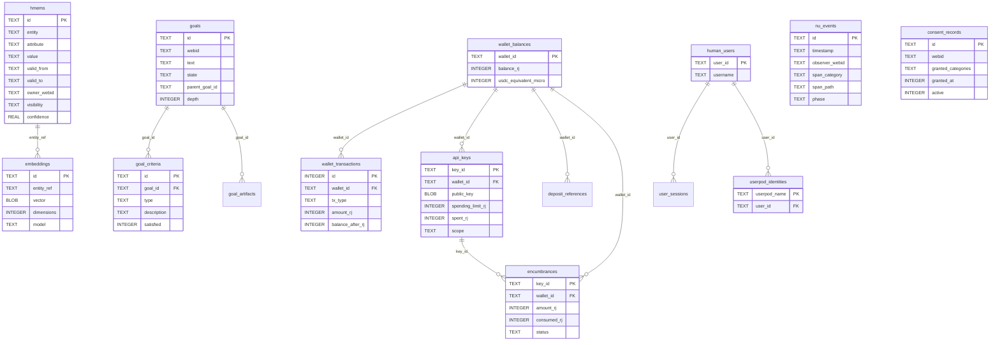

# hkask-storage — Reference

`hkask-storage` provides the persistence layer for hKask. It implements the
port traits from `hkask-types` against a SQLCipher (SQLite with encryption)
backend. The schema is defined in SQL files under `src/sql/` and in inline
`CREATE TABLE` statements in the store modules.

## Source citations

| Symbol | Location |
|--------|----------|
| `schema.sql` (core tables) | `kask/crates/hkask-storage/src/sql/schema.sql:1` |
| `users.sql` (user tables) | `kask/crates/hkask-storage/src/sql/users.sql:2` |
| `hmems` table | `kask/crates/hkask-storage/src/sql/schema.sql:1` |
| `embeddings` table | `kask/crates/hkask-storage/src/sql/schema.sql:2` |
| `nu_events` table | `kask/crates/hkask-storage/src/sql/schema.sql:5` |
| `audit_log` table | `kask/crates/hkask-storage/src/sql/schema.sql:8` |
| `goals` table | `kask/crates/hkask-storage/src/sql/schema.sql:15` |
| `goal_criteria` table (FK to goals) | `kask/crates/hkask-storage/src/sql/schema.sql:16` |
| `goal_artifacts` table (FK to goals) | `kask/crates/hkask-storage/src/sql/schema.sql:17` |
| `consent_records` table | `kask/crates/hkask-storage/src/sql/schema.sql:18` |
| `wallet_balances` table | `kask/crates/hkask-storage/src/sql/schema.sql:23` |
| `wallet_transactions` table (FK to wallet_balances) | `kask/crates/hkask-storage/src/sql/schema.sql:24` |
| `api_keys` table (FK to wallet_balances) | `kask/crates/hkask-storage/src/sql/schema.sql:27` |
| `deposit_addresses` table | `kask/crates/hkask-storage/src/sql/schema.sql:30` |
| `deposit_references` table (FK to wallet_balances) | `kask/crates/hkask-storage/src/sql/schema.sql:32` |
| `encumbrances` table (FK to api_keys, wallet_balances) | `kask/crates/hkask-storage/src/sql/schema.sql:36` |
| `kata_history` table | `kask/crates/hkask-storage/src/sql/schema.sql:39` |
| `reg_records` table (inline) | `kask/crates/hkask-storage/src/regulation_store.rs:80` |
| `reg_cursors` table (inline) | `kask/crates/hkask-storage/src/regulation_store.rs:96` |
| `delegation_tokens` table (inline) | `kask/crates/hkask-storage/src/token_registry.rs:28` |
| `escalations` table (inline) | `kask/crates/hkask-storage/src/escalation.rs:86` |
| `human_users` table | `kask/crates/hkask-storage/src/sql/users.sql:2` |
| `userpod_identities` table | `kask/crates/hkask-storage/src/sql/users.sql:28` |
| `user_sessions` table (FK to human_users) | `kask/crates/hkask-storage/src/sql/users.sql:43` |
| `EmbeddingStore` (impl EmbeddingPort) | `kask/crates/hkask-storage/src/embeddings.rs:616` |
| `EscalationQueue` (impl EscalationPort) | `kask/crates/hkask-storage/src/escalation.rs:402` |
| `RegulationArchive` (impl LedgerStoragePort) | `kask/crates/hkask-storage/src/regulation_store.rs:502` |

## Entity relationship diagram

The schema has four clusters: memory and events, goals and consent, wallet
and keys, and regulation. The ERD below shows the tables and their foreign-key
relationships.

<!-- DIAGRAM_ALIGNMENT
id: DIAG-DIA-STOR-001
verified_date: 2026-07-27
verified_against: kask/crates/hkask-storage/src/sql/schema.sql:1,2,5,8,15,16,17,18,23,24,27,30,32,36,39; kask/crates/hkask-storage/src/sql/users.sql:2,28,43
status: VERIFIED
-->

## Schema clusters

### Memory and events

The `hmems` table (`schema.sql:1`) is the entity-attribute-value store for
hKask memory. Each row is a bitemporal triple with `valid_from` and `valid_to`
columns, plus `owner_webid` and `visibility` for sovereignty. The `embeddings`
table (`schema.sql:2`) stores vector embeddings keyed by `entity_ref`.

The `nu_events` table (`schema.sql:5`) stores Regulation observable spans.
Each event has a `span_category`, `span_path`, `phase`, `observer_webid`, and
`parent_event` for recursive span nesting.

### Goals and consent

The `goals` table (`schema.sql:15`) stores user goals with a `parent_goal_id`
for hierarchical decomposition and a `depth` field. The `goal_criteria` table
(`schema.sql:16`) has a foreign key to `goals(id)` and stores acceptance
criteria with a `satisfied` flag. The `goal_artifacts` table (`schema.sql:17`)
links artifacts to goals.

The `consent_records` table (`schema.sql:18`) stores per-WebID consent grants
with `granted_categories`, `granted_at`, `revoked_at`, and an `active` flag.

### Wallet and keys

The `wallet_balances` table (`schema.sql:23`) is the root of the wallet
cluster. Three tables reference it: `wallet_transactions` (`schema.sql:24`),
`api_keys` (`schema.sql:27`), and `deposit_references` (`schema.sql:32`). The
`encumbrances` table (`schema.sql:36`) references both `api_keys(key_id)` and
`wallet_balances(wallet_id)`, modeling the hold-settle pattern for gas
budgets.

The `deposit_addresses` table (`schema.sql:30`) has a composite primary key
of `(wallet_id, chain, derivation_index)` and no foreign-key constraint,
because it is populated before the wallet balance row is committed.

### Regulation

The `reg_records` table (`regulation_store.rs:80`) stores Regulation ledger
records. The `reg_cursors` table (`regulation_store.rs:96`) stores loop
cursors for the Regulation cycle. Both are created inline in the
`regulation_store.rs` module rather than in `schema.sql`.

The `delegation_tokens` table (`token_registry.rs:28`) persists OCAP tokens
for audit. The `escalations` table (`escalation.rs:86`) stores escalation
records for the algedonic alert path.

### Users

The `human_users` table (`users.sql:2`) is the root of the user cluster. The
`userpod_identities` table (`users.sql:28`) links userpods to human users.
The `user_sessions` table (`users.sql:43`) has a foreign key to
`human_users(user_id)`.

## Port trait implementors

Four port traits from `hkask-types` are implemented in this crate:

- `EmbeddingPort` by `EmbeddingStore` at `embeddings.rs:616`.
- `EscalationPort` by `EscalationQueue` at `escalation.rs:402`.
- `LedgerStoragePort` by `RegulationArchive` at `regulation_store.rs:502`.
- `ConsentPort` by `ConsentStore` in `consent_store.rs`.

## See also

- [hkask-storage How-to](./how-to.md): procedural flowchart for adding a new
  migration.
- [hkask-types Reference](../hkask-types/reference.md): the port traits this
  crate implements.
- [`kask/docs/architecture/salience-specification.md`](../../architecture/salience-specification.md):
  the passage salience algorithm that consumes the `hmems` table.

---

[^fowler-poeaa]: Fowler, M. (2002). *Patterns of Enterprise Application Architecture.* Addison-Wesley. <https://martinfowler.com/books/eaa.html>. The Active Record and Repository patterns that the store modules implement.

[^sqlcipher]: Zetetic LLC. (2024). *SQLCipher — Transparent SQLite Encryption.* <https://www.zetetic.net/sqlcipher/>. The encrypted SQLite extension that provides the database backend.
