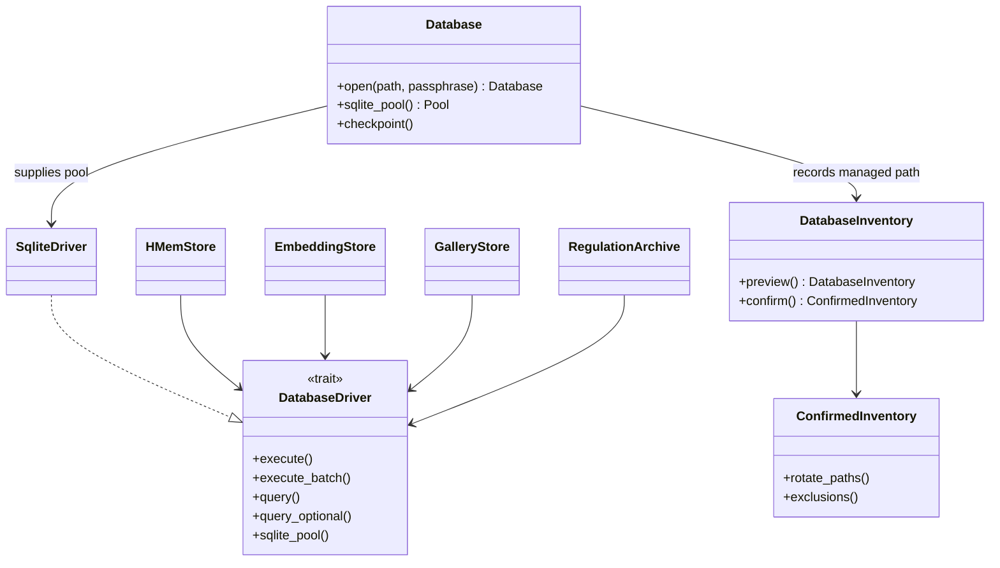
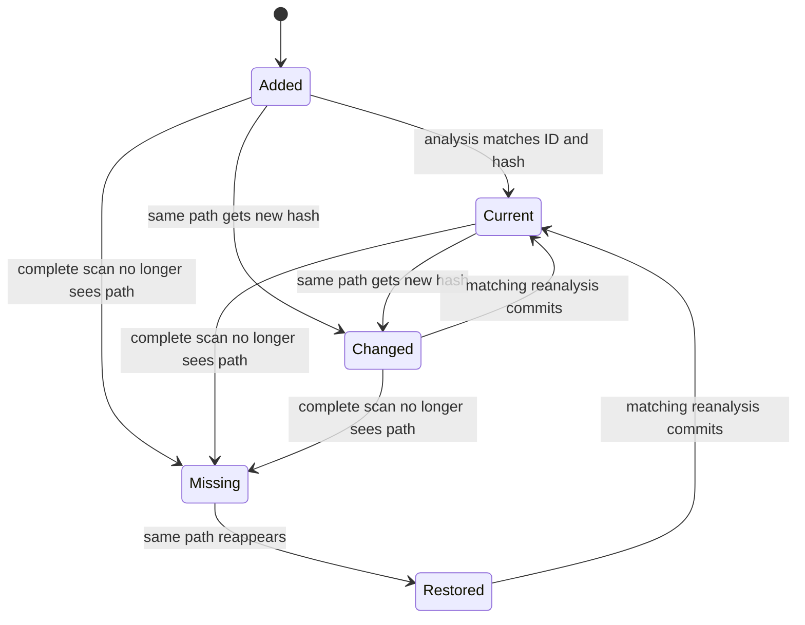
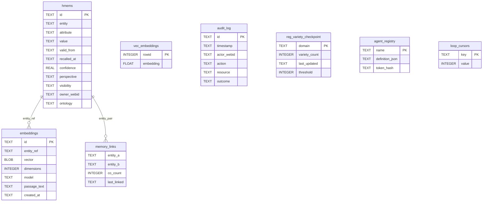
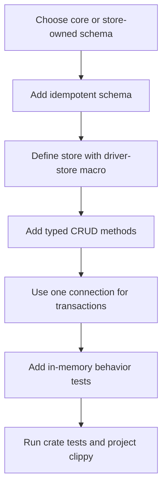
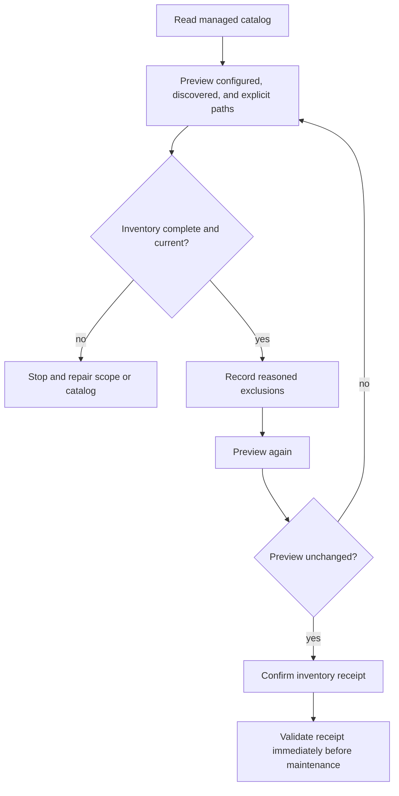

# hkask-storage — Reference

`hkask-storage` is the SQLite persistence crate. File-backed `Database` pools use
SQLCipher page encryption and sqlite-vec; in-memory and `SqliteDriver::file_pool`
paths are unencrypted SQLite
(`kask/crates/hkask-storage/src/core/connection.rs:420-536`;
`kask/crates/hkask-storage/src/database/sqlite.rs:112,139`). `DbValue` supplies SQL
binding types; SQLCipher-backed connections supply encryption.[^sqlcipher]
SQLite vector search is supplied by sqlite-vec.[^sqlite-vec]

## Module inventory and exports

The crate root declares and exports the current modules at
`kask/crates/hkask-storage/src/hkask_storage.rs:9-43`.

| Module | Public surface | Evidence |
|---|---|---|
| `core` | `Database`, `DatabaseError`, `LeasedSqliteConnection`, `SqliteConnectionManager`, `embedding_dim`, `open_database`, `open_or_repair`, `sanitize_path` | `kask/crates/hkask-storage/src/hkask_storage.rs:20-24` |
| `database` | `DatabaseDriver`, `SqliteDriver`, `WAL_PRAGMA_BATCH`, `init_wal_pragmas`; typed SQL values. Transactions belong to a leased connection, not the driver | `kask/crates/hkask-storage/src/database.rs:1-14` |
| `maintenance_inventory` | catalog configuration/read, previews, confirmations, entries, and typed errors | `kask/crates/hkask-storage/src/hkask_storage.rs:14-18` |
| `rotation` | `rotate_passphrase`, `verify_database_key`, `RotationError` | `kask/crates/hkask-storage/src/hkask_storage.rs:27` |
| `embeddings` | `EmbeddingStore`, `SimilarityResult`, `EmbeddingError` | `kask/crates/hkask-storage/src/hkask_storage.rs:34` |
| `hmem` | `HMem`, `HMemStore`, `HMemError` | `kask/crates/hkask-storage/src/hkask_storage.rs:37` |
| `regulation_store` | `RegulationArchive` | `kask/crates/hkask-storage/src/hkask_storage.rs:38` |
| `gallery` | gallery index, scan/reconciliation, tags, faces, workflows, generations, OMC graphs, and albums | `kask/crates/hkask-storage/src/hkask_storage.rs:40-43`; `kask/crates/hkask-storage/src/gallery.rs:75-135,205-293` |

## Connection and driver surfaces

| Item | Contract | Evidence |
|---|---|---|
| `Database::open` | validates path/passphrase and returns a handle without opening SQLite | `kask/crates/hkask-storage/src/core/connection.rs:301-345` |
| `Database::sqlite_pool` | lazily creates and caches the SQLCipher/in-memory pool | `kask/crates/hkask-storage/src/core/connection.rs:420-452` |
| Core schema | loaded from `core/sql/schema.sql`, then explicit column migrations run | `kask/crates/hkask-storage/src/core/connection.rs:347-392` |
| Managed inventory registration | file-backed managed opens record the canonical path before pool creation | `kask/crates/hkask-storage/src/core/connection.rs:582` |
| `DatabaseDriver` | provider-neutral single-operation execute/query boundary; no transaction facade | `kask/crates/hkask-storage/src/database/driver.rs:15-47` |
| `SqliteDriver` | current driver implementation | `kask/crates/hkask-storage/src/database/sqlite.rs:42-117` |
| `DbValue` / `DbRow` | typed SQL parameter and row values; not encryption | `kask/crates/hkask-storage/src/database/value.rs:7-150` |


```mermaid
classDiagram
    class Database {
        +open(path, passphrase) Database
        +sqlite_pool() Pool
        +checkpoint()
    }
    class DatabaseDriver {
        <<trait>>
        +execute()
        +execute_batch()
        +query()
        +query_optional()
        +sqlite_pool()
    }
    class SqliteDriver
    class DatabaseInventory {
        +preview() DatabaseInventory
        +confirm() ConfirmedInventory
    }
    class ConfirmedInventory {
        +rotate_paths()
        +exclusions()
    }
    class HMemStore
    class EmbeddingStore
    class GalleryStore
    class RegulationArchive

    SqliteDriver ..|> DatabaseDriver
    Database --> SqliteDriver : supplies pool
    Database --> DatabaseInventory : records managed path
    DatabaseInventory --> ConfirmedInventory
    HMemStore --> DatabaseDriver
    EmbeddingStore --> DatabaseDriver
    GalleryStore --> DatabaseDriver
    RegulationArchive --> DatabaseDriver

```

<!-- DIAGRAM_ALIGNMENT
id: DIAG-STOR-003
verified_date: 2026-09-28
verified_against: kask/crates/hkask-storage/src/core/connection.rs:166-192,301-452,474-536; kask/crates/hkask-storage/src/database/driver.rs:15-47; kask/crates/hkask-storage/src/database/sqlite.rs:42-117; kask/crates/hkask-storage/src/maintenance_inventory.rs:169-205,294-375; kask/crates/hkask-storage/src/hmem.rs:136-163; kask/crates/hkask-storage/src/embeddings.rs:64-110; kask/crates/hkask-storage/src/gallery.rs:329; kask/crates/hkask-storage/src/regulation_store.rs:30-104
status: VERIFIED
-->

## Maintenance inventory

| Item | Fields or behavior | Evidence |
|---|---|---|
| `DATABASE_CATALOG_ENV` | `HKASK_DB_INVENTORY_PATH` | `kask/crates/hkask-storage/src/maintenance_inventory.rs:13` |
| `DATABASE_CATALOG_RELATIVE_PATH` | `maintenance/database-inventory.jsonl` | `kask/crates/hkask-storage/src/maintenance_inventory.rs:14` |
| `InventoryEntry` | path, configured, exists, recovery artifact, private file identity | `kask/crates/hkask-storage/src/maintenance_inventory.rs:169-175` |
| `DatabaseInventory` | entries and search roots | `kask/crates/hkask-storage/src/maintenance_inventory.rs:178-181` |
| `ConfirmedInventory` | confirmed preview, selected rotation paths, reasoned exclusions | `kask/crates/hkask-storage/src/maintenance_inventory.rs:186-205` |
| `preview` | bounded read-only discovery; no DB opens or file creation | `kask/crates/hkask-storage/src/maintenance_inventory.rs:206-293` |
| `confirm` | freshness, scope attestation, exclusions, recovery, hard-link, and non-empty checks | `kask/crates/hkask-storage/src/maintenance_inventory.rs:294-375` |

A confirmation is an inventory receipt only. Quiescence and key publication are
separate responsibilities.

## Gallery and request-lifecycle entities

All entities below are public through the public `gallery` module. The crate root
also directly re-exports `GalleryMode`, `GalleryRecord`, `ImageRecord`,
`AssetCreationPublication`, `AssetObservation`, `PublishedAssetCreation`,
`TagRecord`, `FaceRegistryRecord`, `GalleryStore`, and `GalleryStoreError`
(`kask/crates/hkask-storage/src/hkask_storage.rs:40-43`).

| Entity | Role | Evidence |
|---|---|---|
| `GalleryMode` | read-only, copy-on-write, or destructive policy | `kask/crates/hkask-storage/src/gallery.rs:40-71` |
| `GalleryRecord` | durable canonical root and aggregate view | `kask/crates/hkask-storage/src/gallery.rs:75-83` |
| `ImageRecord` | stable path identity, content revision, presence, metadata freshness | `kask/crates/hkask-storage/src/gallery.rs:86-101` |
| `AssetObservation` | one physical observation supplied by a scan request | `kask/crates/hkask-storage/src/gallery.rs:105-113` |
| `GalleryScan` | request coverage, observations, and errors | `kask/crates/hkask-storage/src/gallery.rs:117-123` |
| `ReconcileResult` | lifecycle counts plus exact assets requiring analysis | `kask/crates/hkask-storage/src/gallery.rs:126-135` |
| `TagRecord` | persisted annotation | `kask/crates/hkask-storage/src/gallery.rs:205-213` |
| `FaceRegistryRecord` | named face reference and status | `kask/crates/hkask-storage/src/gallery.rs:218-227` |
| `WorkflowRecord` / `WorkflowSummary` | full persisted workflow and bounded list row | `kask/crates/hkask-storage/src/gallery.rs:233-246` |
| `AlbumRecord` | nested metadata-only grouping | `kask/crates/hkask-storage/src/gallery.rs:252-259` |
| `GenerationRecord` | provider-independent generation lineage | `kask/crates/hkask-storage/src/gallery.rs:266-285` |
| `OmcCreationGraphRecord` | canonical MovieLabs OMC graph for one asset | `kask/crates/hkask-storage/src/gallery.rs:289-293` |


```mermaid
stateDiagram-v2
    [*] --> Added
    Added --> Current: analysis matches ID and hash
    Added --> Changed: same path gets new hash
    Current --> Changed: same path gets new hash
    Changed --> Current: matching reanalysis commits
    Added --> Missing: complete scan no longer sees path
    Current --> Missing: complete scan no longer sees path
    Changed --> Missing: complete scan no longer sees path
    Missing --> Restored: same path reappears
    Restored --> Current: matching reanalysis commits
```

<!-- DIAGRAM_ALIGNMENT
id: DIAG-STOR-004
verified_date: 2026-09-28
verified_against: kask/crates/hkask-storage/src/gallery.rs:86-135,737-754,770-870,881-940
status: VERIFIED
-->

`GalleryStore::reconcile` commits observations and safe absence transitions in one
transaction (`kask/crates/hkask-storage/src/gallery.rs:770-870`). Errors in scan
coverage suppress absence inference. `persist_analysis_for_tag_types` applies a
response only while image ID, gallery ID, hash, and non-missing state still match
(`kask/crates/hkask-storage/src/gallery.rs:881-940`). Active list/count/index
surfaces exclude missing records, while stable-ID inspection can include them
(`kask/crates/hkask-storage/src/gallery.rs:859-986`).

## Core schema


```mermaid
erDiagram
    hmems ||--o{ embeddings : entity_ref
    hmems ||--o{ memory_links : entity_pair
    hmems {
        TEXT id PK
        TEXT entity
        TEXT attribute
        TEXT value
        TEXT valid_from
        TEXT recalled_at
        REAL confidence
        TEXT perspective
        TEXT visibility
        TEXT owner_webid
        TEXT ontology
    }
    embeddings {
        TEXT id PK
        TEXT entity_ref
        BLOB vector
        INTEGER dimensions
        TEXT model
        TEXT passage_text
        TEXT created_at
    }
    vec_embeddings {
        INTEGER rowid PK
        FLOAT embedding
    }
    memory_links {
        TEXT entity_a
        TEXT entity_b
        INTEGER co_count
        TEXT last_linked
    }
    audit_log {
        TEXT id PK
        TEXT timestamp
        TEXT actor_webid
        TEXT action
        TEXT resource
        TEXT outcome
    }
    reg_variety_checkpoint {
        TEXT domain PK
        INTEGER variety_count
        TEXT last_updated
        INTEGER threshold
    }
    agent_registry {
        TEXT name PK
        TEXT definition_json
        TEXT token_hash
    }
    loop_cursors {
        TEXT key PK
        INTEGER value
    }
```

<!-- DIAGRAM_ALIGNMENT
id: DIAG-STOR-008
verified_date: 2026-09-28
verified_against: kask/crates/hkask-storage/src/core/sql/schema.sql:1-28
status: VERIFIED
-->

Store-owned schemas add `reg_records`, `reg_cursors`, and gallery lifecycle
tables outside the core schema
(`kask/crates/hkask-storage/src/regulation_store.rs:38-70`;
`kask/crates/hkask-storage/src/gallery.rs:329-384`). Escalation alerts do not
persist as storage rows: they reconcile into kanban board review cards through
`BoardAlertEscalationSink` (`kask/crates/kask_bridge/src/algedonic_board.rs:227`).

## Passphrase rotation

`rotate_passphrase` re-encrypts one quiesced database through SQLCipher export,
validates the exported database, and replaces the source while retaining recovery
artifacts on failures that require operator action
(`kask/crates/hkask-storage/src/rotation.rs:115-302`). The maintenance inventory
identifies and confirms scope; it does not itself quiesce databases or make a
multi-database/keychain operation crash-atomic.

## Procedures

Use Procedure A to add a table-backed store. Use Procedure B to preview and
confirm the database path set before an already-designed maintenance operation.
The store pattern follows Fowler's Repository separation: callers use domain
methods while the store uses the database port.[^fowler-poeaa]

### Procedure A: Add a store


```mermaid
flowchart TD
    A[Choose core or store-owned schema] --> B[Add idempotent schema]
    B --> C[Define store with driver-store macro]
    C --> D[Add typed CRUD methods]
    D --> E[Use one connection for transactions]
    E --> F[Add in-memory behavior tests]
    F --> G[Run crate tests and project clippy]
```

<!-- DIAGRAM_ALIGNMENT
id: DIAG-STOR-002
verified_date: 2026-09-28
verified_against: kask/crates/hkask-storage/src/core/store_macros.rs:44-86; kask/crates/hkask-storage/src/core/connection.rs:347-392; kask/crates/hkask-storage/src/database/driver.rs:15-97; kask/crates/hkask-storage/src/hmem.rs:296-352,784-830
status: VERIFIED
-->

#### 1. Choose schema ownership

Put foundational tables used across stores in
`kask/crates/hkask-storage/src/core/sql/schema.sql:1-29`. Put a domain-specific
table in that store's `init_schema`, following Regulation or gallery
(`kask/crates/hkask-storage/src/regulation_store.rs:38-70`;
`kask/crates/hkask-storage/src/gallery.rs:329-384`).

`CREATE TABLE IF NOT EXISTS` does not add columns to an existing table. For a
column addition, inspect `PRAGMA table_info` and run an explicit migration, as the
embedding and forgetting-spec migrations do
(`kask/crates/hkask-storage/src/core/connection.rs:359-392`).

#### 2. Define the store

Use `define_driver_store!(MyStore)` to generate the driver-backed struct,
`from_driver`, and `driver()` accessor. Use the two-argument form for a domain
error and `impl_from_db_error!` for error conversion
(`kask/crates/hkask-storage/src/core/store_macros.rs:44-86`). Construction runs
`init_schema` and propagates failure.

#### 3. Add operations through `DatabaseDriver`

Use `execute`, `execute_batch`, `query`, and `query_optional` from
`DatabaseDriver`, plus `query_map` and `query_row` for typed mapping
(`kask/crates/hkask-storage/src/database/driver.rs:15-97`). Do not present
`DbValue` as encrypted data; it is the typed SQL parameter/result representation
(`kask/crates/hkask-storage/src/database/value.rs:7-46`). File encryption is
provided at the SQLCipher connection layer.

For an atomic multi-statement operation, hold one pooled connection and one RAII
`rusqlite::Transaction`. `HMemStore::insert_batch_atomic` and `HMemStore::update`
are the reference shapes
(`kask/crates/hkask-storage/src/hmem.rs:296-352,784-830`). Separate driver calls may use
separate pooled connections and therefore do not form one transaction.
The unused connectionless driver transaction facade was deleted; do not recreate
it or issue separate BEGIN/write/COMMIT driver calls. Connection ownership and
rollback-on-drop are supplied by rusqlite's concrete transaction type.[^rusqlite-transaction]

`atomic_batch_commit_failure_is_rolled_back_before_reuse_and_reopen` in
`kask/crates/hkask-storage/src/hmem.rs:1321`
uses a real file, a two-connection pool, and a deferred foreign-key failure to
check rollback at COMMIT, subsequent successful reuse, and reopen visibility.
This is transaction/reopen evidence, not power-loss or multi-resource atomicity.

#### 4. Test the behavior

Use `SqliteDriver::in_memory_pool()` for store tests
(`kask/crates/hkask-storage/src/database/sqlite.rs:112`). Verify CRUD behavior,
constraint failures, transaction rollback, and corrupted-row error propagation.
The in-memory pool has one connection so tests preserve read-your-writes semantics
(`kask/crates/hkask-storage/src/core/connection.rs:474-483`).

Run from the repository root:

```sh
cargo test -p hkask-storage
./script/clippy
```

### Procedure B: Preview and confirm maintenance inventory

Inventory confirmation records scope; it does not quiesce consumers, rotate files,
or publish a key.


```mermaid
flowchart TD
    A[Read managed catalog] --> B[Preview configured, discovered, and explicit paths]
    B --> C{Inventory complete and current?}
    C -->|no| D[Stop and repair scope or catalog]
    C -->|yes| E[Record reasoned exclusions]
    E --> F[Preview again]
    F --> G{Preview unchanged?}
    G -->|no| B
    G -->|yes| H[Confirm inventory receipt]
    H --> I[Validate receipt immediately before maintenance]
```

<!-- DIAGRAM_ALIGNMENT
id: DIAG-STOR-007
verified_date: 2026-09-28
verified_against: kask/crates/hkask-storage/src/maintenance_inventory.rs:57-101,169-218,206-293,294-375
status: VERIFIED
-->

#### 1. Read the managed catalog

The canonical catalog location is configured through
`DATABASE_CATALOG_ENV` and `DATABASE_CATALOG_RELATIVE_PATH`; both constants and
the configuration/read functions are public
(`kask/crates/hkask-storage/src/maintenance_inventory.rs:13-20,37-48,96-101`).
Treat a missing or malformed catalog as an error, not as an empty known set.

#### 2. Build a bounded preview

Call `DatabaseInventory::preview(configured, roots, additional)`. It combines
configured paths, explicit historical/external paths, and database paths inferred
from maintenance markers below bounded search roots. It does not traverse directory
symlinks and fails rather than returning a partial inventory when the scan cap is
reached (`kask/crates/hkask-storage/src/maintenance_inventory.rs:206-293`).

#### 3. Confirm against a fresh preview

Call `preview` again and pass both snapshots to `DatabaseInventory::confirm` with:

- explicit confirmation that historical/external inventory is complete;
- a non-empty reason for each excluded independent database; and
- no exclusion for a configured shared-key database.

Confirmation rejects changed snapshots, unresolved recovery artifacts, ambiguous
hard links, and an empty rotation set
(`kask/crates/hkask-storage/src/maintenance_inventory.rs:294-375`).

#### 4. Rotate the confirmed paths

The receipt's `rotate_paths()` are recorded with the pending rotation and applied
at the next startup, which classifies each database by key with
`verify_database_key` before rotating it
(`kask/crates/kask_bridge/src/passphrase_rotation.rs`). Establish quiescence
separately; the inventory receipt is not a maintenance lease.
Single-database rotation itself is implemented by `rotate_passphrase`
(`kask/crates/hkask-storage/src/rotation.rs:115-302`).

### Gallery scan and analysis requests

When adding gallery-facing work, carry exact lifecycle entities rather than
positional guesses:

- `AssetObservation` describes one physical asset.
- `GalleryScan` carries observations plus coverage and errors.
- `ReconcileResult` reports added, changed, restored, missing, and unchanged counts
  and returns exact `analysis_assets`.

These types are defined at `kask/crates/hkask-storage/src/gallery.rs:105-135` and
consumed atomically by `GalleryStore::reconcile` at
`kask/crates/hkask-storage/src/gallery.rs:770-870`. Persist an analysis response
through `persist_analysis_for_tag_types`; it refuses to
apply an old request when image identity, hash, or presence no longer matches
(`kask/crates/hkask-storage/src/gallery.rs:881-940`).

## See also

- [Why storage separates connection, inventory, and gallery identity](./explanation.md)
- [Standardized artifact storage](../../architecture/standardized-artifact-storage.md)

---

[^fowler-poeaa]: Fowler, M. (2002). *Patterns of Enterprise Application Architecture.* Addison-Wesley. <https://martinfowler.com/books/eaa.html>.
[^sqlcipher]: Zetetic LLC. (2024). *SQLCipher — Transparent SQLite Encryption.* <https://www.zetetic.net/sqlcipher/>.
[^sqlite-vec]: Garcia, A. (2024). *sqlite-vec: A vector search extension for SQLite.* <https://github.com/asg017/sqlite-vec>.
[^rusqlite-transaction]: rusqlite contributors. *Transaction*. https://docs.rs/rusqlite/latest/rusqlite/struct.Transaction.html. The transaction borrows one connection and rolls back on drop unless committed.