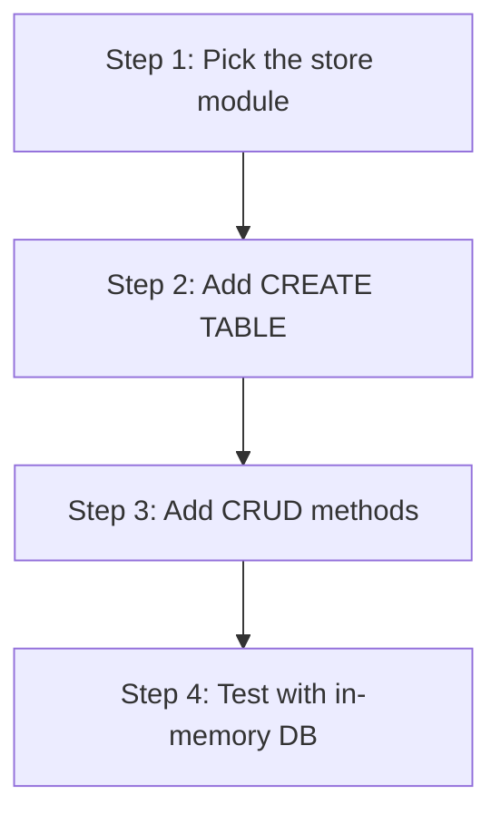

# hkask-storage — Tutorial: Your First Migration

This tutorial walks through adding a new table to the `hkask-storage`
schema. You will learn the per-store `init_schema` pattern and how to test
your migration.

## Learning path

<!-- DIAGRAM_ALIGNMENT
id: DIAG-DIA-STOR-003
verified_date: 2026-07-29
verified_against: kask/crates/hkask-storage/src/core/database.rs:203,204; kask/crates/hkask-storage/src/regulation_store.rs:78
status: VERIFIED
-->

## Steps 1-2: Pick the store and add the table

Decide whether your table is core (belongs in `src/sql/schema.sql`, loaded by
`initialize_schema` at `core/database.rs:203`) or store-specific (belongs in
the store's `init_schema` method at e.g. `regulation_store.rs:78`). Add a
`CREATE TABLE IF NOT EXISTS` statement with the appropriate columns and
foreign keys.

The `define_driver_store!` macro (`core/store_macros.rs:11`) generates the
`from_driver` constructor, which calls `Self::init_schema(driver)` — so your
`init_schema` is automatically invoked when the store is constructed.

## Steps 3-4: Add CRUD methods and test

Add insert, query, update, and delete methods to the store struct. The store
struct holds an `Arc<dyn DatabaseDriver>` (generated by the macro) and calls
`driver.execute` or `driver.query` methods. Write a test that constructs an
in-memory database via `Database::in_memory()`, calls `from_driver`, and
verifies the CRUD methods. Run `cargo test -p hkask-storage`.

## See also

- [hkask-storage Reference](./reference.md): ERD of the full schema.
- [hkask-storage How-to](./how-to.md): procedural reference for migrations.

---

[^fowler-poeaa]: Fowler, M. (2002). *Patterns of Enterprise Application Architecture.* Addison-Wesley. <https://martinfowler.com/books/eaa.html>. The Active Record pattern that the store modules implement.
