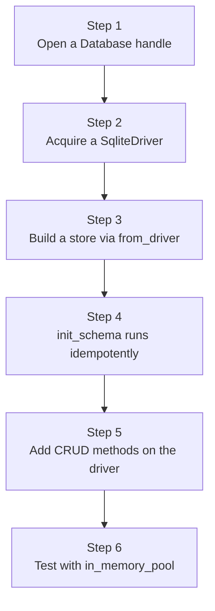

# hkask-storage — Tutorial: Build a Store on the DatabaseDriver Port

This tutorial walks a new contributor through the lifecycle of a storage
module: from the `Database` connection handle, through the provider-agnostic
`DatabaseDriver` port, to a domain store built with the `define_driver_store!`
macro. You will learn how a store acquires a driver, initializes its schema
idempotently, and exposes CRUD methods that never touch `rusqlite` directly.

The crate is the consolidated storage layer for hKask — it merged the former
`hkask-storage`, `hkask-database`, and `hkask-storage-core` crates into one
crate with a `core/` foundation and per-domain store modules (`hmem.rs`,
`embeddings.rs`, `gallery.rs`, `regulation_store.rs`, `escalation.rs`,
`kata.rs`)[^fowler-poeaa].

## Learning path



<!-- DIAGRAM_ALIGNMENT
id: DIAG-STOR-001
verified_date: 2026-08-13
verified_against: kask/crates/hkask-storage/src/hkask_storage.rs:9-41; kask/crates/hkask-storage/src/core/database.rs:177-204,222-244; kask/crates/hkask-storage/src/core/store_macros.rs:44-71; kask/crates/hkask-storage/src/database/sqlite.rs:60-106
status: VERIFIED
-->

## Step 1: Open a `Database` handle

A `Database` is the connection manager. `Database::open(path, passphrase)`
handles file infrastructure (parent directories, the 16-byte SQLCipher salt
file at `{path}.salt`) and validates the passphrase length (≥ 8 chars). It
does **not** open a SQLite connection — that is deferred to `sqlite_pool()`.
This split prevents the dual-path bugs the consolidation eliminated
(`core/database.rs:117-175`).

For tests, `Database::in_memory()` returns a handle whose `sqlite_pool()`
builds a `max_size(1)` unencrypted pool — `max_size(1)` is mandatory because
`SqliteConnectionManager::memory()` creates a separate in-memory database
per connection (`core/database.rs:198-204, 272-295`).

```rust,ignore
use hkask_storage::Database;
let db = Database::open("agents/alice/alice.db", "passphrase")?;
let pool = db.sqlite_pool()?; // creates the r2d2 pool, loads schema
```

## Step 2: Acquire a `SqliteDriver`

Stores do not hold a `Database`; they hold an `Arc<dyn DatabaseDriver>`. The
`SqliteDriver` wraps an `r2d2::Pool<SqliteConnectionManager>` and implements
the `DatabaseDriver` trait — the provider-agnostic port that stores code
against (`database/driver.rs:16-58`). Each `execute`/`query` call acquires a
connection from the pool and returns it on completion, enabling concurrent
read access.

```rust,ignore
use hkask_storage::SqliteDriver;
let driver = Arc::new(SqliteDriver::new(pool));
```

For file-backed production pools, prefer `SqliteDriver::new_labeled(pool, path)`
so a `SQLITE_BUSY`/lock failure names the offending file in its error prefix
(`database/sqlite.rs:64-73`).

## Step 3: Build a store via `from_driver`

The `define_driver_store!` macro generates a struct holding
`Arc<dyn DatabaseDriverTrait>`, a `from_driver(driver)` constructor, and a
`driver()` accessor (`core/store_macros.rs:44-71`). The constructor calls
`Self::init_schema(driver)` and propagates any schema-init failure, so the
store is never constructed against a missing table.

```rust,ignore
use hkask_storage::define_driver_store;
define_driver_store!(MyStore);

impl MyStore {
    fn init_schema(driver: &Arc<dyn DatabaseDriverTrait>) -> Result<(), InfrastructureError> {
        driver.execute_batch("CREATE TABLE IF NOT EXISTS my_table (id TEXT PRIMARY KEY, ...);")?;
        Ok(())
    }
}

let store = MyStore::from_driver(driver.clone())?;
```

## Step 4: `init_schema` runs idempotently

Every `init_schema` uses `CREATE TABLE IF NOT EXISTS` so the call is safe to
repeat. Two ownership patterns coexist:

- **Core tables** (`hmems`, `embeddings`, `vec_embeddings`, `audit_log`,
  `kata_history`, `pod_meta`, `agent_registry`, `loop_cursors`,
  `reg_variety_checkpoint`, `reg_alerts`) live in `core/sql/schema.sql` and
  are loaded by `Database::initialize_schema` on every pool creation
  (`core/database.rs:206-211`). Stores for these tables implement
  `init_schema` as a no-op (see `kata.rs:36-44`).
- **Store-specific tables** (`reg_records`, `reg_cursors`, `escalations`)
  are created inline in the store's `init_schema`
  (see `regulation_store.rs:78-106`).

The split exists because core tables are shared across stores; duplicating
their schema in each store would drift (the prior `IF NOT EXISTS` no-op let
the live schema depend on which store ran first — `hmem.rs:170-176`).

## Step 5: Add CRUD methods on the driver

Stores call `driver.execute(sql, &[DbValue])`, `driver.query(sql, &[DbValue])`,
or the ergonomic free functions `query_map` and `query_row`
(`database/driver.rs:78-109`). `DbValue` is the provider-agnostic parameter
type (`Null | Integer | Real | Text | Blob | Bool`); `DbRow` provides typed
accessors (`get_str`, `get_int`, `get_json`, ...) so stores never touch
`rusqlite::Row` directly (`database/value.rs:7-309`).

For multi-statement atomicity, use `driver.transaction()` to get a RAII
`TransactionHandle` that auto-rollbacks on drop (`database/transaction.rs:19-53`).

## Step 6: Test with `in_memory_pool`

Tests build a driver via `SqliteDriver::in_memory_pool()` (which loads the
core schema) and construct the store with `from_driver`. The whole suite
runs in-process with no file I/O.

```rust,ignore
let pool = SqliteDriver::in_memory_pool().expect("in-memory pool");
let driver = Arc::new(SqliteDriver::new(pool));
let store = MyStore::from_driver(driver).expect("store init");
```

Run the tests with `cargo test -p hkask-storage`.

## See also

- [hkask-storage Reference](./reference.md): ERD of the full schema and the
  `DatabaseDriver` class diagram.
- [hkask-storage How-to](./how-to.md): procedural flowchart for adding a new
  migration.
- [hkask-storage Explanation](./explanation.md): why the crate splits
  `Database` from `SqliteDriver` and uses per-store `init_schema`.

---

[^fowler-poeaa]: Fowler, M. (2002). *Patterns of Enterprise Application Architecture.* Addison-Wesley. <https://martinfowler.com/books/eaa.html>. The Repository and Active Record patterns that the store modules implement, where each store owns its schema and CRUD methods behind a provider-agnostic port.
