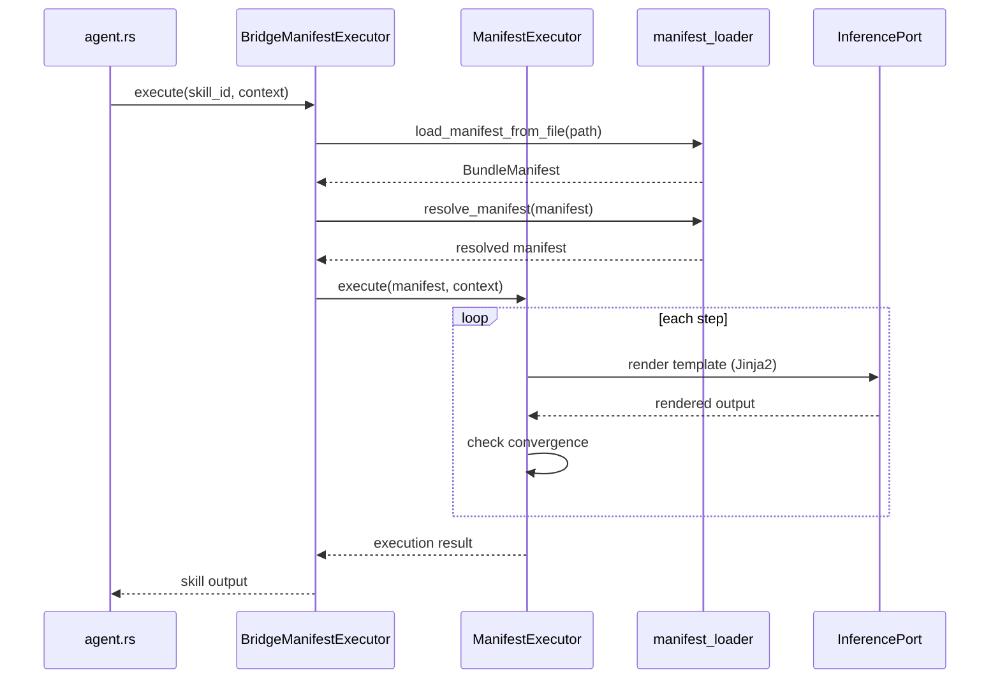

# hkask-templates — Explanation

The `ManifestExecutor` is the D1 integration seam: it runs skill PDCA loops
inside zed-kask. When the agent panel invokes a skill, the executor loads the
manifest, resolves the template cascade, renders each Jinja2 step against the
inference port, and checks convergence after each step. The design separates
the skill definition (the manifest) from the skill execution (the executor),
which allows skills to be authored without touching Rust code.

## Source citations

| Symbol | Location |
|--------|----------|
| `ManifestExecutor` | `kask/crates/hkask-templates/src/executor.rs:144` |
| `BundleManifest` | `kask/crates/hkask-templates/src/bundle/manifest.rs:91` |
| `BundleManifestStep` | `kask/crates/hkask-templates/src/bundle/manifest.rs:35` |
| `resolve_manifest` | `kask/crates/hkask-templates/src/manifest_loader.rs:197` |
| `BridgeManifestExecutor` | `kask/crates/kask_bridge/src/skill_executor.rs:30` |
| `BridgeManifestExecutor` impl | `kask/crates/kask_bridge/src/skill_executor.rs:103` |
| `set_manifest_executor` hook | `crates/agent/src/agent.rs:2712` |
| Deferred-task wiring | `crates/zed/src/main.rs:1491` |

## Invocation sequence

The sequence below shows what happens when the agent panel invokes a skill.
The `BridgeManifestExecutor` (`kask_bridge/src/skill_executor.rs:30`) is the
adapter that connects zed's `SkillManifestExecutor` trait to hKask's
`ManifestExecutor`.

<!-- DIAGRAM_ALIGNMENT
id: DIAG-DIA-TPL-002
verified_date: 2026-07-27
verified_against: kask/crates/hkask-templates/src/executor.rs:144; kask/crates/hkask-templates/src/manifest_loader.rs:197; kask/crates/kask_bridge/src/skill_executor.rs:30,103; crates/zed/src/main.rs:1491
status: VERIFIED
-->

## Why the executor is a separate type

The `ManifestExecutor` (`executor.rs:144`) is deliberately separate from the
`BridgeManifestExecutor` (`kask_bridge/src/skill_executor.rs:30`). The
`ManifestExecutor` knows about manifests, templates, and convergence checks.
The `BridgeManifestExecutor` knows about zed's `InferencePort`, `ToolPort`,
and the A2A secret. This separation follows the hexagonal architecture
principle: the executor is the core, the bridge is the adapter.

## Convergence checking

After each step, the executor checks whether the PDCA loop has converged. The
convergence criteria are declared in the manifest's step definition. If the
convergence check passes, the executor stops the cascade early. If it fails,
the executor proceeds to the next step. This prevents over-execution: a skill
that has already produced a satisfactory result should not run remaining steps
unnecessarily.

## See also

- [hkask-templates Reference](./reference.md): class diagram of the manifest
  schema and registry.
- [kask_bridge Explanation](../kask_bridge/explanation.md): the full D1–D10
  composition root wiring.
- [`kask/docs/explanation/skills-and-composition.md`](../../explanation/skills-and-composition.md):
  cross-cutting skill anatomy and composition.

---

[^cockburn]: Cockburn, A. (2005). *Hexagonal Architecture.* <https://alistair.cockburn.us/hexagonal-architecture/>. The separation of core (executor) from adapter (bridge) that this design follows.

[^deming]: Deming, W. E. (1986). *Out of the Crisis.* MIT Press. The PDCA cycle that the manifest step cascade implements.
