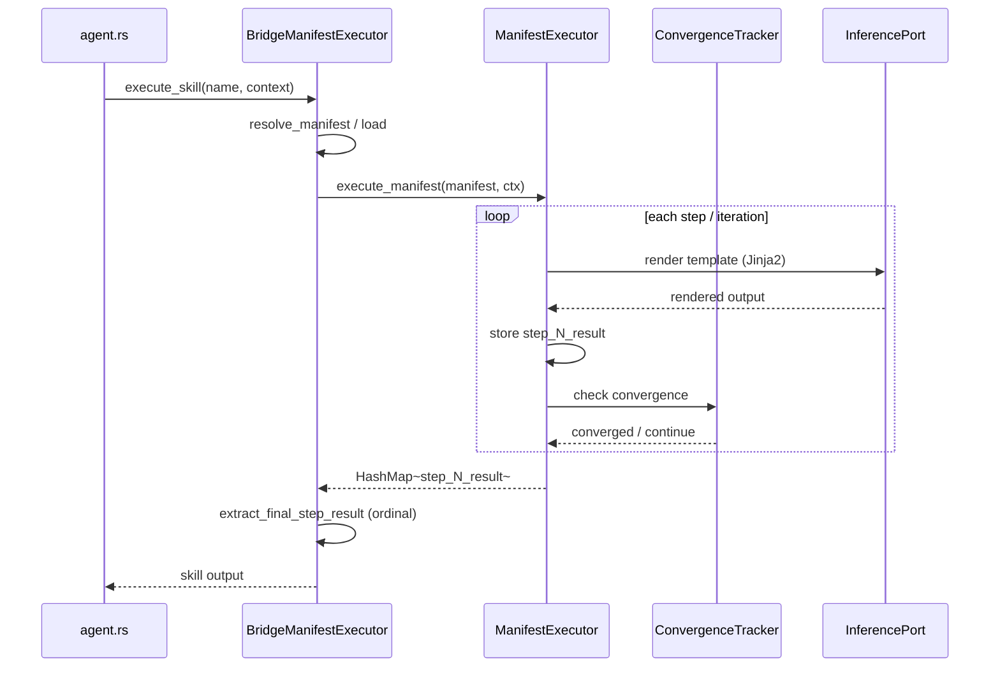

# hkask-templates — Explanation

The `ManifestExecutor` is the D1 integration seam: it runs skill PDCA
cascades inside zed-kask. When the agent panel invokes a skill, the executor
loads the manifest, resolves the template cascade, renders each Jinja2 step
against the inference port, and checks convergence after each iteration. The
design separates the skill definition (the manifest) from the skill execution
(the executor), which allows skills to be authored without touching Rust code.

## Source citations

| Symbol | Location |
|--------|----------|
| `ManifestExecutor` struct | `kask/crates/hkask-templates/src/executor.rs:125` |
| `execute_manifest` | `kask/crates/hkask-templates/src/executor.rs:413` |
| `ConvergenceTracker` | `kask/crates/hkask-templates/src/convergence.rs:73` |
| `BundleManifest` | `kask/crates/hkask-templates/src/bundle/manifest.rs:91` |
| `resolve_manifest` | `kask/crates/hkask-templates/src/manifest_loader.rs:197` |
| `BridgeManifestExecutor` struct | `kask/crates/kask_bridge/src/skill_executor.rs:30` |
| `SkillManifestExecutor` impl | `kask/crates/kask_bridge/src/skill_executor.rs:103` |
| `extract_final_step_result` | `kask/crates/kask_bridge/src/skill_executor.rs:251` |
| `set_manifest_executor` hook | `crates/agent/src/agent.rs:2781` |
| Deferred-task wiring | `crates/zed/src/main.rs:1727` |

## Invocation sequence

The sequence below shows what happens when the agent panel invokes a skill.
The `BridgeManifestExecutor` (`kask_bridge/src/skill_executor.rs:30`) is the
adapter that connects zed's `SkillManifestExecutor` trait to hKask's
`ManifestExecutor`. The bridge's `execute_skill` method
(`skill_executor.rs:103`) is the entry point.

<!-- DIAGRAM_ALIGNMENT
id: DIAG-DIA-TPL-002
verified_date: 2026-07-29
verified_against: kask/crates/hkask-templates/src/executor.rs:125,413; kask/crates/hkask-templates/src/convergence.rs:73; kask/crates/hkask-templates/src/manifest_loader.rs:197; kask/crates/kask_bridge/src/skill_executor.rs:30,103,251; crates/agent/src/agent.rs:2781; crates/zed/src/main.rs:1727
status: VERIFIED
-->

## Why the executor is a separate type

The `ManifestExecutor` (`executor.rs:125`) is deliberately separate from the
`BridgeManifestExecutor` (`kask_bridge/src/skill_executor.rs:30`). The
`ManifestExecutor` knows about manifests, templates, convergence tracking,
and gas/rJoule budgets. The `BridgeManifestExecutor` knows about zed's
`InferencePort`, `ToolPort`, and the A2A secret. This separation follows the
hexagonal architecture principle: the executor is the core, the bridge is the
adapter.

## Convergence checking

After each step, the `ConvergenceTracker` (`convergence.rs:73`) reports
whether the PDCA loop has converged. The tracker reads
`max_iterations()` (`convergence.rs:163`) and `threshold()`
(`convergence.rs:153`) from the manifest's `ConvergenceConfig`
(`bundle/config.rs:52`). On `action: loop`, the executor re-enters the
cascade from the target ordinal, snapshots prior results under
`prev_step_N_result` keys (`executor.rs:706`), and increments the iteration
counter. The loop terminates when the convergence threshold is met,
`max_iterations` is exhausted, or `abort`/`escalate` is triggered.

## Final-result extraction is ordinal-keyed

`execute_manifest` returns `HashMap<String, Value>` with step results under
`step_{ordinal}_result` keys. `HashMap` iteration order is randomized
(`RandomState`), so `values().last()` picks an arbitrary step, not the final
one. The bridge's `extract_final_step_result` (`skill_executor.rs:251`) parses
the ordinal from `step_N_result` keys and picks the highest. This is a
documented trap (see `.rules`); any new caller must reuse the canonical
extractor, not re-implement with `.last()`.

## Wiring: deferred post-login task

The `set_manifest_executor` hook (`crates/agent/src/agent.rs:2781`) is a
`OnceLock`-based process-global. It depends on
`LanguageModelRegistry::default_model()` being populated, which only happens
after the Zed user resolves. Wiring it synchronously at startup leaves it
unwired for the entire session. The deferred task in
`crates/zed/src/main.rs:1727` wires the executor after login. The hook emits a
`log::warn!` on re-wiring attempts (re-login, multi-window) so operators can
distinguish "not configured" from "configured but broken".

## See also

- [hkask-templates Reference](./reference.md): class diagram of the manifest
  schema and registry.
- [kask_bridge Explanation](../kask_bridge/explanation.md): the full D1–D14
  composition root wiring.
- [`kask/docs/explanation/skills-and-composition.md`](../../explanation/skills-and-composition.md):
  cross-cutting skill anatomy and composition.

---

[^cockburn]: Cockburn, A. (2005). *Hexagonal Architecture.* <https://alistair.cockburn.us/hexagonal-architecture/>. The separation of core (executor) from adapter (bridge) that this design follows.

[^deming]: Deming, W. E. (1986). *Out of the Crisis.* MIT Press. The PDCA cycle that the manifest step cascade implements.
