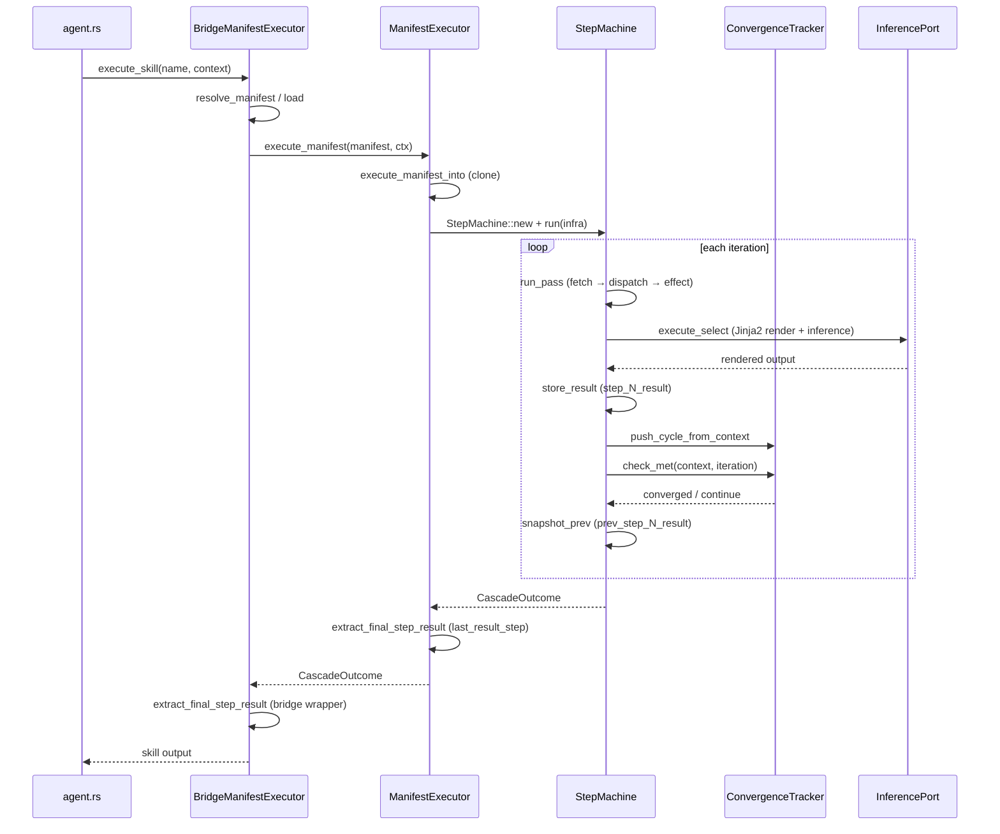
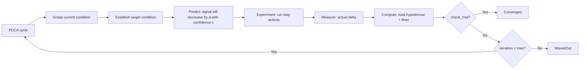

# hkask-templates — Explanation

The `ManifestExecutor` is the D1 integration seam: it runs skill PDCA
cascades inside zed-kask. When the agent panel invokes a skill, the executor
loads the manifest, resolves the template cascade, renders each Jinja2 step
against the inference port, and checks convergence after each iteration. The
design separates the skill definition (the manifest) from the skill execution
(the executor), which allows skills to be authored without touching Rust
code.

This separation follows the hexagonal architecture principle: the executor
is the core, the bridge is the adapter[^cockburn]. The
`ManifestExecutor` (`executor.rs:69`) knows about manifests, templates,
convergence tracking, and gas/rJoule budgets. The `BridgeManifestExecutor`
(`kask_bridge/src/skill_executor.rs:88`) knows about zed's `InferencePort`,
`ToolPort`, and the GPUI→tokio handoff.

## Source citations

| Symbol | Location |
|--------|----------|
| `ManifestExecutor` struct | `kask/crates/hkask-templates/src/executor.rs:69` |
| `ManifestExecutor::execute_manifest` | `kask/crates/hkask-templates/src/executor.rs:141` |
| `ManifestExecutor::execute_manifest_into` | `kask/crates/hkask-templates/src/executor.rs:155` |
| `extract_final_step_result` | `kask/crates/hkask-templates/src/executor.rs:210` |
| `ConvergenceTracker` struct | `kask/crates/hkask-templates/src/convergence.rs:82` |
| `ConvergenceTracker::check_met` | `kask/crates/hkask-templates/src/convergence.rs:307` |
| `ConvergenceTracker::finalize_report` | `kask/crates/hkask-templates/src/convergence.rs:521` |
| `BundleManifest` struct | `kask/crates/hkask-templates/src/bundle/manifest.rs:134` |
| `ConvergenceConfig` struct | `kask/crates/hkask-templates/src/bundle/config.rs:52` |
| `StepMachine::run` | `kask/crates/hkask-templates/src/step_machine.rs:97` |
| `StepMachine::run_pass` | `kask/crates/hkask-templates/src/step_machine.rs:239` |
| `resolve_manifest` | `kask/crates/hkask-templates/src/manifest_loader.rs:207` |
| `BridgeManifestExecutor` struct | `kask/crates/kask_bridge/src/skill_executor.rs:88` |
| `BridgeManifestExecutor::execute_skill` | `kask/crates/kask_bridge/src/skill_executor.rs:534` |
| `seed_registry_to_disk` | `kask/crates/kask_bridge/src/skill_executor.rs:457` |
| `extract_final_step_result` (bridge) | `kask/crates/kask_bridge/src/skill_executor.rs:916` |
| `set_manifest_executor` hook | `crates/agent/src/agent.rs:2859` |
| Deferred-task wiring | `crates/zed/src/main.rs:2311` |
| `try_wire_manifest_executor` | `crates/zed/src/main.rs:2980` |
| D28 registry root | `crates/zed/src/main.rs:2293` |

## Invocation sequence

The sequence below shows what happens when the agent panel invokes a skill.
The `BridgeManifestExecutor` (`kask_bridge/src/skill_executor.rs:88`) is the
adapter that connects zed's `SkillManifestExecutor` trait to hKask's
`ManifestExecutor`. The bridge's `execute_skill` method
(`kask_bridge/src/skill_executor.rs:534`) is the entry point.

<!-- DIAGRAM_ALIGNMENT
id: DIAG-TMPL-006
verified_date: 2026-08-13
verified_against: kask/crates/hkask-templates/src/executor.rs:69,141,155,210; kask/crates/hkask-templates/src/step_machine.rs:97,239; kask/crates/hkask-templates/src/convergence.rs:82,307; kask/crates/hkask-templates/src/manifest_loader.rs:207; kask/crates/kask_bridge/src/skill_executor.rs:88,534,916
status: VERIFIED
-->

## Why the executor is a separate type

The `ManifestExecutor` (`executor.rs:69`) is deliberately separate from the
`BridgeManifestExecutor` (`kask_bridge/src/skill_executor.rs:88`). The
`ManifestExecutor` knows about manifests, templates, convergence tracking,
and gas/rJoule budgets. The `BridgeManifestExecutor` knows about zed's
`InferencePort`, `ToolPort`, and the A2A secret. This separation follows the
hexagonal architecture principle: the executor is the core, the bridge is
the adapter[^cockburn].

The `execute_manifest` (`executor.rs:141`) entry point is the
borrowed-interface variant; it clones `self` and delegates to
`execute_manifest_into` (`executor.rs:155`), the owned-args variant that
consumes `self` and `manifest` so the returned future owns both (no borrows)
and is `Send + 'static` — safe to `tokio::spawn`. The bridge uses
`execute_manifest_into` for the GPUI→tokio handoff; the borrowed
`execute_manifest` is for tests that hold a borrowed executor and await
directly.

## Why convergence is deterministic

The `ConvergenceTracker` (`convergence.rs:82`) is a pure state machine over
`(context, config)` — it has no dependency on `InferencePort`, `ToolPort`,
gas, or rJoule (`convergence.rs:13`). The executor constructs one per
cascade, calls `check_met` (`convergence.rs:307`) after each pass, and
calls `finalize_report` (`convergence.rs:521`) at exit.

This replaces the old self-grade model where an LLM graded its own plan
quality on a [0,1] scale. That was a category error: it measured plan
quality (a snapshot) instead of gap closure (a trajectory), and it used the
LLM for the deterministic convergence decision (causing the 30s timeouts
across 12+ skills). The Kata model uses the LLM only for the four Kata
steps (grasp current, establish target, predict, experiment); the executor
computes the gap and Brier score deterministically[^rother-kata].

### The Kata convergence model

The agent has a **target condition** and a **current condition**, each
measured in two orthogonal spaces:

- **Object space** (Dublin Core): artifact completeness — are the required
  fields populated and grounded?
- **Process space** (PKO): procedure progress — are the required steps
  executed?

The total distance to the target is the hypotenuse of the right triangle
formed by the two gaps: `sqrt(object_gap² + process_gap²)`, produced by the
`kata.hypotenuse` compute primitive (`compute.rs:318`) and pushed into the
tracker as the convergence signal. Convergence requires the gap to close.

<!-- DIAGRAM_ALIGNMENT
id: DIAG-TMPL-007
verified_date: 2026-08-13
verified_against: kask/crates/hkask-templates/src/convergence.rs:82,307; kask/crates/hkask-templates/src/compute.rs:318; kask/crates/hkask-templates/src/step_machine.rs:189; kask/crates/hkask-templates/src/bundle/config.rs:52
status: VERIFIED
-->

Each PDCA cycle, the agent makes a **prediction** ("the signal will decrease
by Δ" with confidence `c`). After the experiment, the actual decrease is
measured. The **Brier score** `(c − actual_outcome)²` tracks whether the
agent's predictions are calibrated. Brier decreasing → the agent is learning
to predict its own progress. Brier stable and low → confidence convergence
(`convergence.rs:71`).

The three stop conditions are orthogonal: gap measures distance to target,
Cauchy measures stability of iterates, Brier measures prediction quality.
They can be combined with OR via `convergence_mode` (`bundle/config.rs:140`).
The default is `gap_or_cauchy_or_calibration` because the Kata literature
recognizes all three as valid stop conditions[^rother-kata].

## Why final-result extraction is deterministic

`extract_final_step_result` (`executor.rs:210`) reads the machine-tracked
`last_result_step` field — O(1) and deterministic by construction. It
replaced the old `step_N_result` ordinal-keyed `HashMap` scan, which was
non-deterministic because `HashMap` iteration order is randomized
(`RandomState`). The old `values().last()` picked an arbitrary step, not
the final one.

The `StepMachine` tracks `last_result_step` (`step_machine.rs:60`) — the
highest `StepId` that stored a result during this cascade. The
`extract_final_step_result` reads this field via
`outcome.context.result(step_id)` (`executor.rs:213`), applies
`normalize_model_output` to strip `<thinking>` wrappers, and returns the
value. Returns `Value::Null` when no step stored a result.

The bridge's `extract_final_step_result` (`kask_bridge/src/skill_executor.rs:916`)
wraps this extractor and falls back to the materialized context when no step
stored a result. This is a documented trap (see `.rules`); any new caller
must reuse the canonical extractor, not re-implement with `.last()`.

## Why the registry is seeded to disk

The compiled-in seed payloads (embedded by `build.rs:30`) exist solely so a
self-contained binary can populate the registry on a fresh install with no
source tree. The runtime reads exclusively from disk —
`BridgeManifestExecutor::manifest_yaml` and `TemplateRenderer::load` read
exclusively from disk, so YAML/J2 edits take effect immediately without
recompilation (`registry.rs:42`).

The bridge's `seed_registry_to_disk` (`kask_bridge/src/skill_executor.rs:457`)
materialises the seed payloads under `{kask_data_dir}/skills/registry/`
(D28). Existing files are **never overwritten** — user edits are sovereign.
A user who deletes a shipped manifest/template will see it re-seeded on the
next startup.

D28 standardized the registry location to `skills/registry/` (not
`agents/registry/`). The `seeded_registry_root` is resolved via
`agent_skills::global_skills_dir().join("registry")` (`crates/zed/src/main.rs:2298`).
In dev mode, when the live repo source exists at `kask/registry/manifests/`
and `kask/registry/templates/`, the bridge uses those directly instead of
seeding (`crates/zed/src/main.rs:2301`).

## Wiring: deferred post-login task

The `set_manifest_executor` hook (`crates/agent/src/agent.rs:2859`) is a
`OnceLock`-based process-global. It depends on
`LanguageModelRegistry::default_model()` being populated, which only happens
after the Zed user resolves. Wiring it synchronously at startup leaves it
unwired for the entire session. The deferred task in
`crates/zed/src/main.rs:2311` wires the executor after login.

The hook emits a `log::warn!` on re-wiring attempts (re-login, multi-window)
so operators can distinguish "not configured" from "configured but broken"
(`crates/agent/src/agent.rs:2860`). An `AtomicBool` guard ensures the wiring
fires only once — `set_manifest_executor` is `OnceLock`-based and a second
call would warn and be dropped (`crates/zed/src/main.rs:2267`).

The `try_wire_manifest_executor` function (`crates/zed/src/main.rs:2980`)
constructs the `BridgeManifestExecutor` with the resolved
`registry_manifests_dir` and `registry_templates_dir`, wires the profile
resolver for proposer/evaluator separation, and calls
`agent::set_manifest_executor`.

## Why the step machine replaced run_cascade

The `StepMachine` (`step_machine.rs:45`) replaced the 720-line `run_cascade`
that simultaneously owned step dispatch, iteration counting, step-index
bookkeeping, convergence checking, budget checking, prev-step snapshotting,
profile enforcement, feedback-span emission, and matryoshka recursion —
causing the five control-flow bugs documented in `.rules`
(`step_machine.rs:1`).

The new design has three properties:

1. **Convergence is checked in exactly one place** — the `Reenter` arm of
   `StepMachine::run` (`step_machine.rs:189`). Not four places, not threaded
   through every action.
2. **Budget is checked in exactly one place** — after applying each effect
   (`step_machine.rs:206`).
3. **The matryoshka guard is a property of `FlowDefAction::execute`** (the
   only action that recurses), not a `depth` parameter threaded through
   every call (`step_machine.rs:100`).

The machine owns three things: a program counter (`StepId`), an iteration
counter (`u32`), and a budget tracker. It loops: fetch step → dispatch via
the step's action → apply the effect → check exits → advance the PC. There
is no `match` arm in the dispatch loop — dispatch is trait-based via
`StepAction` (`step_machine.rs:6`).

## See also

- [hkask-templates Reference](./reference.md): class diagram of the manifest
  schema and registry.
- [hkask-templates Tutorial](./tutorial.md): your first skill manifest.
- [hkask-templates How-to](./how-to.md): adding a PDCA step to an existing
  manifest.
- [kask_bridge Explanation](../kask_bridge/explanation.md): the full D1–D23
  composition root wiring.
- [`kask/docs/explanation/skills-and-composition.md`](../../explanation/skills-and-composition.md):
  cross-cutting skill anatomy and composition.

---

[^cockburn]: Cockburn, A. (2005). *Hexagonal Architecture.*
    <https://alistair.cockburn.us/hexagonal-architecture/>. The separation
    of core (executor) from adapter (bridge) that this design follows.

[^rother-kata]: Rother, M. (2010). *Toyota Kata: Managing People for
    Improvement, Adaptiveness, and Superior Results.* McGraw-Hill.
    <https://www.toyotakata.com/>. The Improvement Kata model that the
    convergence config implements: target condition, current condition,
    prediction, experiment.

[^deming]: Deming, W. E. (1986). *Out of the Crisis.* MIT Press. The PDCA
    cycle that the manifest step cascade implements.
