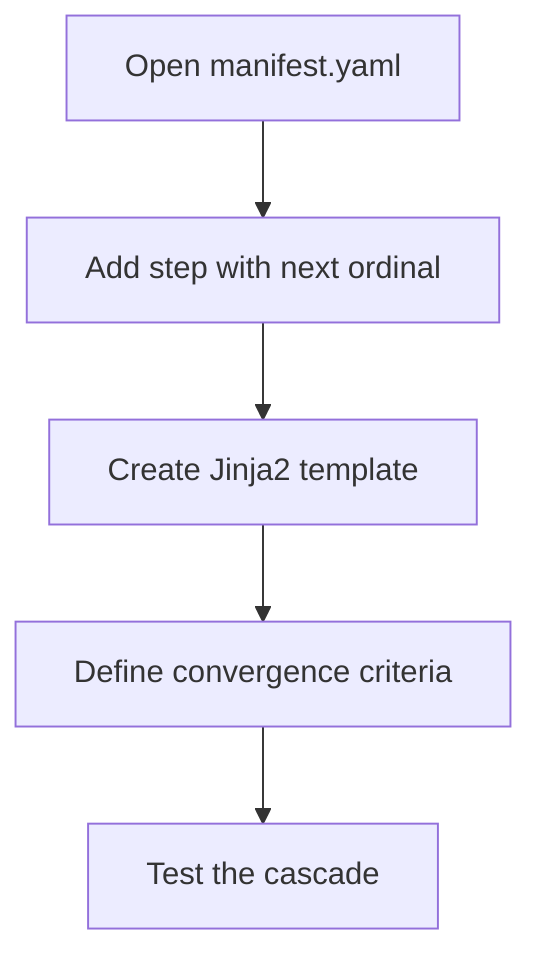

# hkask-templates — How-to: Add a PDCA Step to a Manifest

This guide shows how to add a new step to an existing skill's
`manifest.yaml`. Each step is one iteration of the PDCA cycle.

## Source citations

| Symbol | Location |
|--------|----------|
| `BundleManifestStep` | `kask/crates/hkask-templates/src/bundle/manifest.rs:35` |
| `BundleManifest` | `kask/crates/hkask-templates/src/bundle/manifest.rs:91` |
| `resolve_manifest` | `kask/crates/hkask-templates/src/manifest_loader.rs:197` |

## Procedure

<!-- DIAGRAM_ALIGNMENT
id: DIAG-DIA-TPL-004
verified_date: 2026-07-27
verified_against: kask/crates/hkask-templates/src/bundle/manifest.rs:35,91; kask/crates/hkask-templates/src/manifest_loader.rs:197
status: VERIFIED
-->

### Step 1: Add the step entry

Add a new entry to the `steps` list in `manifest.yaml`. Set `ordinal` to
the next number. Set `action` to the step name. Set `template` to the
Jinja2 template path.

### Step 2: Create the template

Create the Jinja2 template file in
`kask/registry/templates/<skill>/`. The template receives the context
variables from prior steps.

### Step 3: Define convergence criteria

Add a `convergence` section to the step. The `ManifestExecutor` checks
convergence after each step and stops the cascade early if it passes.

### Step 4: Test

Run the skill and verify the cascade executes the new step and checks
convergence.

## See also

- [hkask-templates Reference](./reference.md): class diagram of the manifest.
- [hkask-templates Tutorial](./tutorial.md): your first skill manifest.

---

[^deming]: Deming, W. E. (1986). *Out of the Crisis.* MIT Press. The PDCA cycle that the manifest steps implement.
