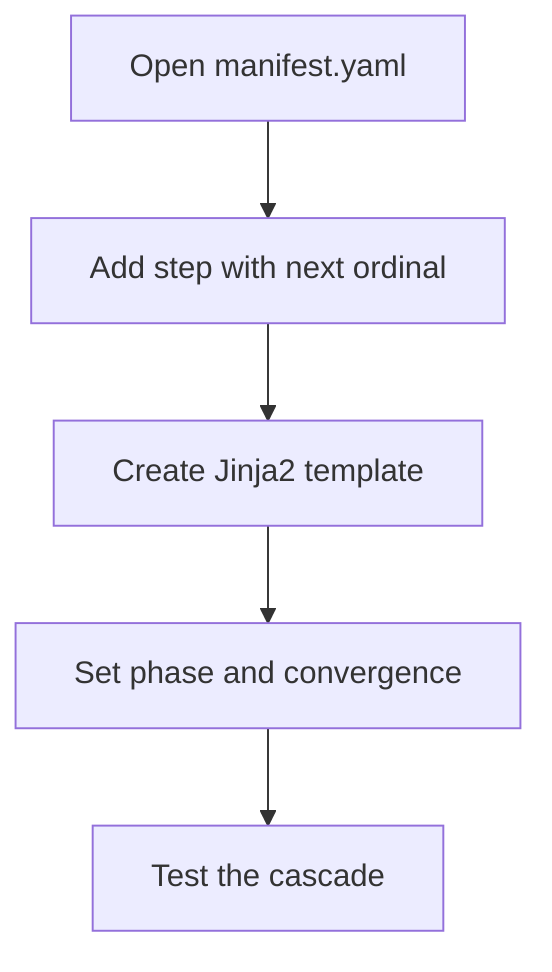

# hkask-templates — How-to: Add a PDCA Step to a Manifest

This guide shows how to add a new step to an existing skill's
`manifest.yaml`. Each step is one iteration of the PDCA cycle; the
`ManifestExecutor` re-enters the cascade on `action: loop` until the
`ConvergenceTracker` (`convergence.rs:120`) reports convergence or
`max_iterations` is exhausted.

## Source citations

| Symbol | Location |
|--------|----------|
| `BundleManifestStep` | `kask/crates/hkask-templates/src/bundle/manifest.rs:35` |
| `BundleManifest` | `kask/crates/hkask-templates/src/bundle/manifest.rs:91` |
| `CascadePhase` enum | `kask/crates/hkask-templates/src/bundle/cascade.rs:8` |
| `ConvergenceConfig` | `kask/crates/hkask-templates/src/bundle/config.rs:52` |
| `ConvergenceTracker` | `kask/crates/hkask-templates/src/convergence.rs:73` |
| `resolve_manifest` | `kask/crates/hkask-templates/src/manifest_loader.rs:197` |
| `execute_manifest` | `kask/crates/hkask-templates/src/executor.rs:413` |

## Procedure

<!-- DIAGRAM_ALIGNMENT
id: DIAG-DIA-TPL-004
verified_date: 2026-07-29
verified_against: kask/crates/hkask-templates/src/bundle/manifest.rs:35,91; kask/crates/hkask-templates/src/bundle/cascade.rs:8; kask/crates/hkask-templates/src/bundle/config.rs:52; kask/crates/hkask-templates/src/convergence.rs:73; kask/crates/hkask-templates/src/manifest_loader.rs:197; kask/crates/hkask-templates/src/executor.rs:413
status: VERIFIED
-->

### Step 1: Add the step entry

Add a new entry to the `steps` list in `manifest.yaml`. Set `ordinal` to the
next number. Set `action` to one of the cascade branches (`select`,
`populate`, `render`, `flowdef`, `tool_invoke`, `compute`, `choice`, `loop`,
`abort`, `escalate`). Set `template_ref` to the Jinja2 template path. Set
`phase` to `Pre`, `Core`, or `Post` (`bundle/cascade.rs:8`).

### Step 2: Create the template

Create the Jinja2 template file in
`kask/registry/templates/<skill>/`. The template receives the context
variables from prior steps, including `step_{ordinal}_result` entries and, in
`loop` iterations, `prev_step_{ordinal}_result` snapshots of the prior
iteration's results (`executor.rs:722`).

### Step 3: Set phase and convergence

Set the step's `phase` (`Pre`/`Core`/`Post`). Convergence is declared at the
manifest level via `ConvergenceConfig` (`bundle/config.rs:52`), tracked by
`ConvergenceTracker` (`convergence.rs:73`). The tracker exposes
`max_iterations()` (`convergence.rs:163`) and `threshold()`
(`convergence.rs:153`). When a `loop` step re-enters the cascade, the executor
snapshots prior results under `prev_step_N_result` keys before re-execution
(`executor.rs:706`).

### Step 4: Test

Run the skill and verify the cascade executes the new step and that
convergence tracking stops the loop when the threshold is met or
`max_iterations` is exhausted.

## See also

- [hkask-templates Reference](./reference.md): class diagram of the manifest.
- [hkask-templates Tutorial](./tutorial.md): your first skill manifest.
- [hkask-templates Explanation](./explanation.md): the D1 invocation sequence.

---

[^deming]: Deming, W. E. (1986). *Out of the Crisis.* MIT Press. The PDCA cycle that the manifest steps implement.
