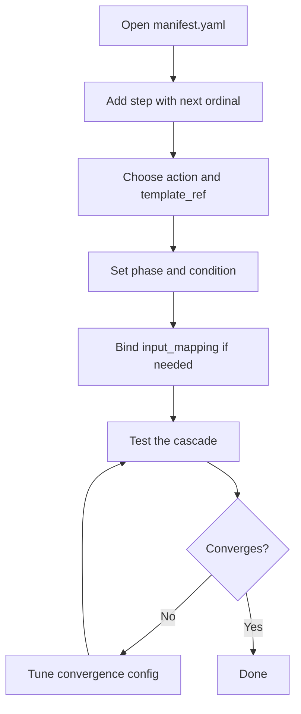

# hkask-templates — How-to: Add a PDCA Step to a Manifest

This guide shows how to add a new step to an existing skill's
`manifest.yaml`. Each step is one iteration of the PDCA cycle; the
`StepMachine` re-enters the cascade on `action: loop` until the
`ConvergenceTracker` (`convergence.rs:82`) reports convergence or
`max_iterations` is exhausted.

## Source citations

| Symbol | Location |
|--------|----------|
| `BundleManifestStep` struct | `kask/crates/hkask-templates/src/bundle/manifest.rs:56` |
| `BundleManifest` struct | `kask/crates/hkask-templates/src/bundle/manifest.rs:134` |
| `CascadePhase` enum | `kask/crates/hkask-templates/src/bundle/cascade.rs:8` |
| `ConvergenceConfig` struct | `kask/crates/hkask-templates/src/bundle/config.rs:52` |
| `ConvergenceTracker` struct | `kask/crates/hkask-templates/src/convergence.rs:82` |
| `ConvergenceTracker::new` | `kask/crates/hkask-templates/src/convergence.rs:123` |
| `ConvergenceTracker::check_met` | `kask/crates/hkask-templates/src/convergence.rs:307` |
| `resolve_manifest` | `kask/crates/hkask-templates/src/manifest_loader.rs:207` |
| `ManifestExecutor::execute_manifest` | `kask/crates/hkask-templates/src/executor.rs:141` |
| `StepMachine::run` | `kask/crates/hkask-templates/src/step_machine.rs:97` |
| `StepMachine::run_pass` | `kask/crates/hkask-templates/src/step_machine.rs:239` |
| `StepContext::snapshot_prev` | `kask/crates/hkask-templates/src/step_context.rs:174` |
| `StepGraph::new` | `kask/crates/hkask-templates/src/step_graph.rs:120` |
| `MAX_STEPS` capacity cap | `kask/crates/hkask-templates/src/step_graph.rs:41` |
| `execute_select` | `kask/crates/hkask-templates/src/step_actions.rs:195` |
| `execute_compute` | `kask/crates/hkask-templates/src/step_actions.rs:349` |
| `dispatch_compute` | `kask/crates/hkask-templates/src/compute.rs:58` |

## Procedure



<!-- DIAGRAM_ALIGNMENT
id: DIAG-TMPL-002
verified_date: 2026-08-13
verified_against: kask/crates/hkask-templates/src/bundle/manifest.rs:56,134; kask/crates/hkask-templates/src/bundle/cascade.rs:8; kask/crates/hkask-templates/src/bundle/config.rs:52; kask/crates/hkask-templates/src/convergence.rs:82,307; kask/crates/hkask-templates/src/step_machine.rs:97,239; kask/crates/hkask-templates/src/step_graph.rs:41,120
status: VERIFIED
-->

### Step 1: Add the step entry

Add a new entry to the `steps` list in `manifest.yaml`. Set `ordinal` to the
next number. Set `action` to one of the cascade branches (`select`,
`populate`, `render`, `compute`, `tool_invoke`, `flowdef`, `parallel`,
`choice`, `loop`, `abort`, `escalate`). Set `template_ref` to the Jinja2
template path (without the `.j2` extension). Set `phase` to `Pre`, `Core`, or
`Post` (`bundle/cascade.rs:8`).

```yaml
- ordinal: 4
  action: select
  description: Evaluate the experiment result.
  template_ref: my-skill/evaluator
  phase: Post
  timeout_seconds: 120
```

The `BundleManifestStep` (`bundle/manifest.rs:56`) is `#[non_exhaustive]` —
new fields may be added without a breaking change. The `timeout_seconds`
field defaults to 120 when omitted (`bundle/manifest.rs:78`); a zero timeout
fires immediately without polling the future, silently breaking inference
and tool calls.

### Step 2: Choose the action and template_ref

The `action` selects a branch in `StepMachine::run_pass`
(`step_machine.rs:239`), which dispatches via `dispatch_action`
(`step_machine.rs:328`). The only probabilistic action is `select` — it
calls `InferencePort` through `execute_select` (`step_actions.rs:195`).
Everything else is deterministic.

For deterministic math without an LLM round-trip, use `action: compute` with
a `compute_ref` naming a `hkask_forecast` or `hkask_lisp` primitive. The
`dispatch_compute` function (`compute.rs:58`) maps the string to the
primitive. Supported refs include `calibrate_from_fermi`,
`outside_view_adjustment`, `bayesian_update`, `brier_score`,
`kata.object_gap`, `kata.process_gap`, `kata.hypotenuse`,
`kata.prediction_vs_result`, `lisp.eval`, and `shell.exec`
(`compute.rs:58`).

### Step 3: Set phase and condition

Set the step's `phase` (`Pre`/`Core`/`Post`). The phase is emitted in the
`reg.skill.cascade.step_executed` span via `extract_feedback_phase`
(`executor.rs:29`).

Optional `condition` gates execution. Supported forms: `"var_name"` (truthy),
`"NOT var_name"` (falsy), `"a AND b"`, `"a OR b"` (`bundle/manifest.rs:86`).
The `StepMachine::evaluate_condition` (`step_machine.rs:496`) renders Jinja
expressions first, then evaluates the truthy/comparison expression.

### Step 4: Bind input_mapping if needed

The `input_mapping` field (`bundle/manifest.rs:81`) binds prior step results
into the step's context. The `apply_input_mapping` helper
(`step_actions.rs:46`) resolves each mapping value via
`input_mapping::resolve_mapping_value` and inserts it into the protocol
context. For `compute` steps, `input_mapping` binds the function's arguments
from prior step results; the result is stored as `step_{ordinal}_result`
(`bundle/manifest.rs:63`).

### Step 5: Test the cascade

Load the manifest with `resolve_manifest` (`manifest_loader.rs:207`) and
execute it with `ManifestExecutor::execute_manifest` (`executor.rs:141`).
The executor builds a `StepGraph` (`step_graph.rs:120`) and runs the
`StepMachine` (`step_machine.rs:97`).

The `MAX_STEPS` capacity cap (`step_graph.rs:41`) is 4096 — a manifest
exceeding it is allowed (advisory warn) but is outside the measured
performance envelope. Hard enforcement lands at `execute_manifest_into`
(`executor.rs:163`), which returns an error if `manifest.steps.len() >
MAX_STEPS`.

When a `loop` step re-enters the cascade, the machine snapshots prior
results under `prev_step_N_result` keys via `StepContext::snapshot_prev`
(`step_context.rs:174`) before re-execution. The convergence check runs in
exactly one place — the `Reenter` arm of `StepMachine::run`
(`step_machine.rs:189`) — and calls `ConvergenceTracker::check_met`
(`convergence.rs:307`).

### Step 6: Tune convergence if it does not converge

If the cascade runs to `max_iterations` without converging, tune the
`ConvergenceConfig` (`bundle/config.rs:52`):

- Lower `gap_epsilon` (default 0.05) for tighter gap convergence.
- Lower `cauchy_epsilon` (default 0.03) for tighter stability convergence.
- Lower `brier_threshold` (default 0.15) for tighter calibration convergence.
- Raise `max_iterations` (default 10) to allow more PDCA cycles.
- Check `min_iterations` (default 2) — the loop will not exit before this
  many cycles even if the signal is below epsilon (`convergence.rs:121`).

The `ConvergenceTracker::new` (`convergence.rs:123`) reads these from the
config; the tracker is a pure state machine over `(context, config)` with no
dependency on `InferencePort`, `ToolPort`, gas, or rJoule
(`convergence.rs:13`).

## See also

- [hkask-templates Reference](./reference.md): class diagram of the manifest
  schema and registry.
- [hkask-templates Tutorial](./tutorial.md): your first skill manifest.
- [hkask-templates Explanation](./explanation.md): the D1 invocation sequence
  and convergence design.

---

[^deming]: Deming, W. E. (1986). *Out of the Crisis.* MIT Press. The PDCA
    cycle that the manifest steps implement.
