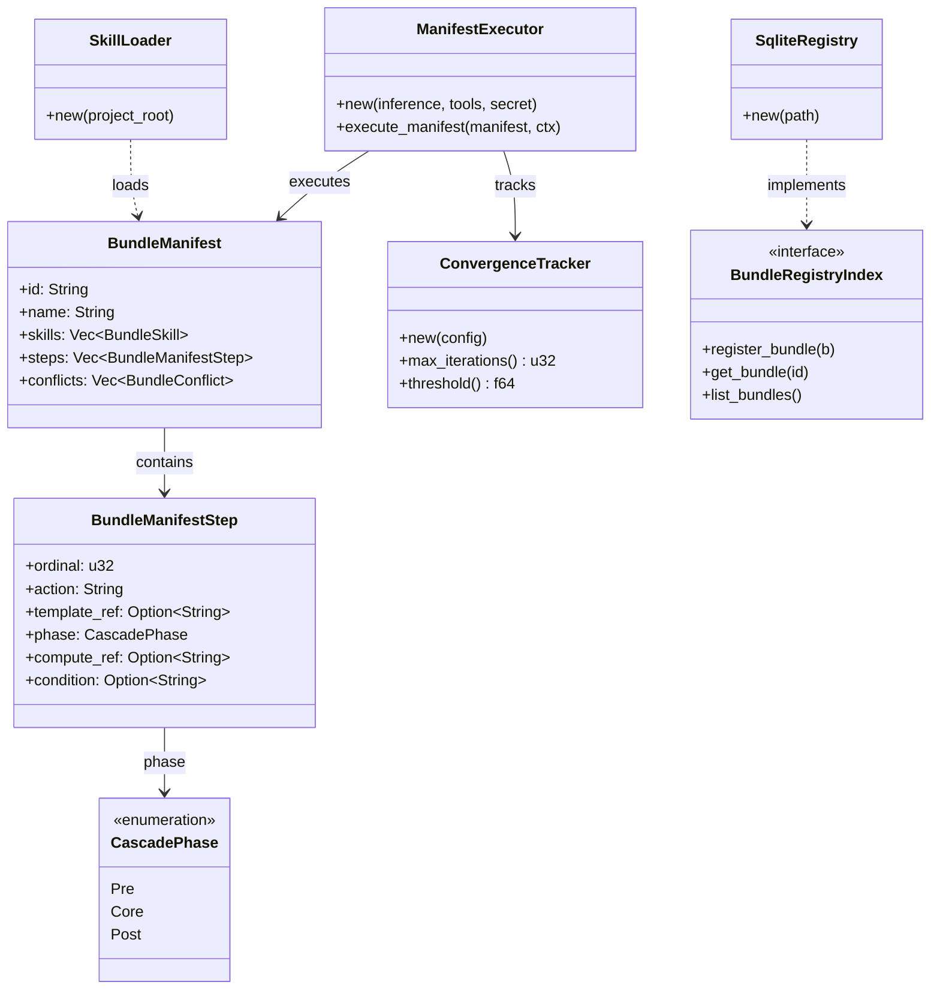

# hkask-templates — Reference

`hkask-templates` implements the skill manifest registry and the
`ManifestExecutor` that runs skill PDCA cascades. It loads `manifest.yaml`
files from the registry, resolves template dependencies, and executes Jinja2
templates against the inference port. Template types are `Prompt` (WordAct),
`Process` (FlowDef), and `Cognition` (KnowAct) — see `hkask_templates.rs:1`.

## Source citations

| Symbol | Location |
|--------|----------|
| `ManifestExecutor` struct | `kask/crates/hkask-templates/src/executor.rs:125` |
| `ManifestExecutor::new` | `kask/crates/hkask-templates/src/executor.rs:154` |
| `execute_manifest` | `kask/crates/hkask-templates/src/executor.rs:413` |
| `BundleManifest` struct | `kask/crates/hkask-templates/src/bundle/manifest.rs:91` |
| `BundleManifestStep` | `kask/crates/hkask-templates/src/bundle/manifest.rs:35` |
| `BundleSkill` | `kask/crates/hkask-templates/src/bundle/manifest.rs:24` |
| `BundleConflict` | `kask/crates/hkask-templates/src/bundle/composition.rs:72` |
| `BundleComplementarity` | `kask/crates/hkask-templates/src/bundle/composition.rs:97` |
| `CascadePhase` enum | `kask/crates/hkask-templates/src/bundle/cascade.rs:8` |
| `ConvergenceConfig` | `kask/crates/hkask-templates/src/bundle/config.rs:52` |
| `ConvergenceTracker` | `kask/crates/hkask-templates/src/convergence.rs:73` |
| `ValidationResult` | `kask/crates/hkask-templates/src/bundle/manifest.rs:314` |
| `BundleRegistryIndex` trait | `kask/crates/hkask-templates/src/bundle/mod.rs:22` |
| `SkillLoader` | `kask/crates/hkask-templates/src/skill_loader.rs:64` |
| `SkillFrontMatter` | `kask/crates/hkask-templates/src/skill_loader.rs:28` |
| `SkillLoadResult` | `kask/crates/hkask-templates/src/skill_loader.rs:57` |
| `SqliteRegistry` | `kask/crates/hkask-templates/src/registry_sqlite.rs:65` |
| `load_manifest_from_file` | `kask/crates/hkask-templates/src/manifest_loader.rs:123` |
| `load_manifest_from_yaml` | `kask/crates/hkask-templates/src/manifest_loader.rs:138` |
| `resolve_manifest` | `kask/crates/hkask-templates/src/manifest_loader.rs:197` |
| `ManifestLoadError` enum | `kask/crates/hkask-templates/src/manifest_loader.rs:319` |
| `PromptStrategy` enum | `kask/crates/hkask-templates/src/prompt_strategy.rs:14` |
| `TemplateCrateLoader` | `kask/crates/hkask-templates/src/crate_loader.rs:15` |
| `CapabilityAwareValidator` | `kask/crates/hkask-templates/src/capability_validator.rs:19` |
| `BudgetTracker` | `kask/crates/hkask-templates/src/budget.rs:71` |

## Manifest schema

The `BundleManifest` (`bundle/manifest.rs:91`) is the parsed representation of
a `manifest.yaml` file. It contains a list of `BundleSkill` entries, a list of
`BundleManifestStep` entries, and declared `BundleConflict` /
`BundleComplementarity` relations. Each step references a Jinja2 template via
`template_ref`, declares its `action`, `phase`, `input_mapping`,
`output_schema`, optional `compute_ref` (deterministic math primitive),
and `condition`.

<!-- DIAGRAM_ALIGNMENT
id: DIAG-DIA-TPL-001
verified_date: 2026-07-29
verified_against: kask/crates/hkask-templates/src/executor.rs:125,154,413; kask/crates/hkask-templates/src/bundle/manifest.rs:91,35,24,314; kask/crates/hkask-templates/src/bundle/cascade.rs:8; kask/crates/hkask-templates/src/bundle/config.rs:52; kask/crates/hkask-templates/src/convergence.rs:73,153,163; kask/crates/hkask-templates/src/bundle/composition.rs:72,97; kask/crates/hkask-templates/src/skill_loader.rs:64; kask/crates/hkask-templates/src/registry_sqlite.rs:65; kask/crates/hkask-templates/src/bundle/mod.rs:22
status: VERIFIED
-->

## Manifest loading

Three functions in `manifest_loader.rs` handle manifest loading:
`load_manifest_from_file` (`manifest_loader.rs:123`) reads from a file path,
`load_manifest_from_yaml` (`manifest_loader.rs:138`) parses a YAML string, and
`resolve_manifest` (`manifest_loader.rs:197`) resolves a manifest reference
against a `BundleRegistryIndex`. The `ManifestLoadError` enum
(`manifest_loader.rs:319`) covers IO and YAML parse failures.

## Skill loading

The `SkillLoader` (`skill_loader.rs:64`) loads skill definitions from the
registry. It parses `SkillFrontMatter` (`skill_loader.rs:28`) and returns a
`SkillLoadResult` (`skill_loader.rs:57`). The `TemplateCrateLoader`
(`crate_loader.rs:15`) loads template crates from disk with path validation
to prevent directory traversal.

## Registry

The `SqliteRegistry` (`registry_sqlite.rs:65`) implements the
`BundleRegistryIndex` trait (`bundle/mod.rs:22`) and persists skill and
template metadata in SQLite. An in-memory `Registry` adapter also exists (see
`hkask_templates.rs:39`).

## Cascade actions

`ManifestExecutor::execute_manifest` (`executor.rs:413`) dispatches on
`step.action`:

| Action | Handler | Purpose |
|--------|---------|---------|
| `select` | `execute_select` (`executor.rs:1038`) | LLM inference, parse JSON, merge into context |
| `populate` | `execute_populate` (`executor.rs:1165`) | Render-only, store under `step_N_populated` |
| `render` | `execute_render` (`executor.rs:1200`) | RenderAct — no inference, for reference docs |
| `flowdef` | `execute_flowdef` (`executor.rs:1249`) | Nested sub-manifest cascade (composability) |
| `tool_invoke` | `execute_tool_invoke` (`executor.rs:1357`) | MCP tool call via `step.mcp` |
| `compute` | `execute_compute` (`executor.rs:1415`) | Deterministic math primitive (`hkask_forecast::*`) |
| `choice` | inline (`executor.rs:564`) | Conditional branch via `_next_ordinal` |
| `loop` | inline (`executor.rs:580`) | PDCA re-entry from target ordinal |
| `abort` / `escalate` | inline | Terminate cascade |

Step results are stored under `step_{ordinal}_result` keys. Final-result
extraction must be ordinal-keyed (see
`kask_bridge/src/skill_executor.rs:251`); `HashMap::values().last()` is
non-deterministic.

## See also

- [hkask-templates Explanation](./explanation.md): sequence diagram of the
  ManifestExecutor invocation path.
- [hkask-types Reference](../hkask-types/reference.md): the
  `SkillRegistryIndex` and `RegistryIndex` traits this crate implements.
- [`kask/docs/explanation/skills-and-composition.md`](../../explanation/skills-and-composition.md):
  cross-cutting skill anatomy and composition.

---

[^beck-tdd]: Beck, K. (2003). *Test-Driven Development: By Example.* Addison-Wesley. <https://www.oreilly.com/library/view/test-driven-development/0321146530/>. The red-green-refactor cycle that the manifest PDCA steps parallel.

[^minijinja]: mitsuhiko. (2024). *minijinja — a Jinja2 template engine for Rust.* <https://docs.rs/minijinja/>. The Rust Jinja2 implementation used for template rendering.
