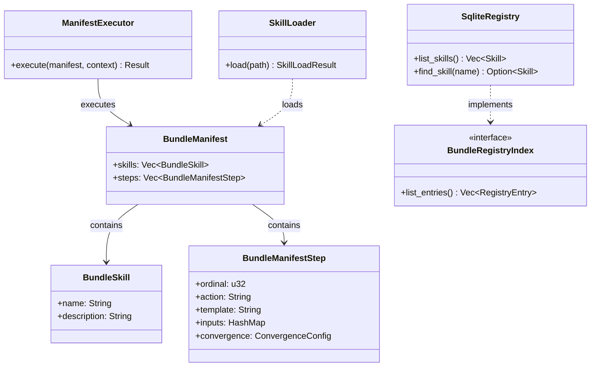

# hkask-templates — Reference

`hkask-templates` implements the skill manifest registry and the
`ManifestExecutor` that runs skill PDCA loops. It loads `manifest.yaml` files
from the registry, resolves template dependencies, and executes Jinja2
templates against the inference port.

## Source citations

| Symbol | Location |
|--------|----------|
| `ManifestExecutor` struct | `kask/crates/hkask-templates/src/executor.rs:144` |
| `BundleManifest` struct | `kask/crates/hkask-templates/src/bundle/manifest.rs:91` |
| `BundleManifestStep` | `kask/crates/hkask-templates/src/bundle/manifest.rs:35` |
| `BundleSkill` | `kask/crates/hkask-templates/src/bundle/manifest.rs:24` |
| `ValidationResult` | `kask/crates/hkask-templates/src/bundle/manifest.rs:314` |
| `BundleRegistryIndex` trait | `kask/crates/hkask-templates/src/bundle/mod.rs:22` |
| `SkillLoader` | `kask/crates/hkask-templates/src/skill_loader.rs:64` |
| `SkillFrontMatter` | `kask/crates/hkask-templates/src/skill_loader.rs:28` |
| `SkillLoadResult` | `kask/crates/hkask-templates/src/skill_loader.rs:57` |
| `SqliteRegistry` | `kask/crates/hkask-templates/src/registry_sqlite.rs:65` |
| `load_manifest_from_file` | `kask/crates/hkask-templates/src/manifest_loader.rs:123` |
| `load_manifest_from_yaml` | `kask/crates/hkask-templates/src/manifest_loader.rs:138` |
| `resolve_manifest` | `kask/crates/hkask-templates/src/manifest_loader.rs:197` |
| `ManifestLoadError` enum | `kask/crates/hkask-templates/src/manifest_loader.rs:319` |
| `PromptStrategy` enum | `kask/crates/hkask-templates/src/prompt_strategy.rs:14` |
| `TemplateCrateLoader` | `kask/crates/hkask-templates/src/crate_loader.rs:15` |
| `CapabilityAwareValidator` | `kask/crates/hkask-templates/src/capability_validator.rs:21` |

## Manifest schema

The `BundleManifest` (`bundle/manifest.rs:91`) is the parsed representation of
a `manifest.yaml` file. It contains a list of `BundleSkill` entries and a
list of `BundleManifestStep` entries. Each step references a Jinja2 template
and declares its inputs, outputs, and convergence criteria.

<!-- DIAGRAM_ALIGNMENT
id: DIAG-DIA-TPL-001
verified_date: 2026-07-27
verified_against: kask/crates/hkask-templates/src/executor.rs:144; kask/crates/hkask-templates/src/bundle/manifest.rs:91,35,24; kask/crates/hkask-templates/src/skill_loader.rs:64; kask/crates/hkask-templates/src/registry_sqlite.rs:65; kask/crates/hkask-templates/src/bundle/mod.rs:22
status: VERIFIED
-->

## Manifest loading

Three functions in `manifest_loader.rs` handle manifest loading:
`load_manifest_from_file` (`manifest_loader.rs:123`) reads from a file path,
`load_manifest_from_yaml` (`manifest_loader.rs:138`) parses a YAML string, and
`resolve_manifest` (`manifest_loader.rs:197`) resolves template references and
dependency chains. The `ManifestLoadError` enum (`manifest_loader.rs:319`)
covers parse, IO, and resolution failures.

## Skill loading

The `SkillLoader` (`skill_loader.rs:64`) loads skill definitions from the
registry. It parses `SkillFrontMatter` (`skill_loader.rs:28`) and returns a
`SkillLoadResult` (`skill_loader.rs:57`). The `TemplateCrateLoader`
(`crate_loader.rs:15`) loads template crates from disk.

## Registry

The `SqliteRegistry` (`registry_sqlite.rs:65`) implements the
`BundleRegistryIndex` trait (`bundle/mod.rs:22`) and the `SkillRegistryIndex`
and `RegistryIndex` traits from `hkask-types`. It persists skill and template
metadata in SQLite.

## See also

- [hkask-templates Explanation](./explanation.md): sequence diagram of the
  ManifestExecutor invocation path.
- [hkask-types Reference](../hkask-types/reference.md): the
  `SkillRegistryIndex` and `RegistryIndex` traits this crate implements.
- [`kask/docs/explanation/skills-and-composition.md`](../../explanation/skills-and-composition.md):
  cross-cutting skill anatomy and composition.

---

[^beck-tdd]: Beck, K. (2003). *Test-Driven Development: By Example.* Addison-Wesley. <https://www.oreilly.com/library/view/test-driven-development/0321146530/>. The red-green-refactor cycle that the manifest PDCA steps parallel.

[^minijinja]: mitsuhiko. (2024). *minijinja — a Jinja2 template engine for Rust.* <https://docs.rs/minijinja/>. The Rust Jinja2 implementation used for template rendering.
