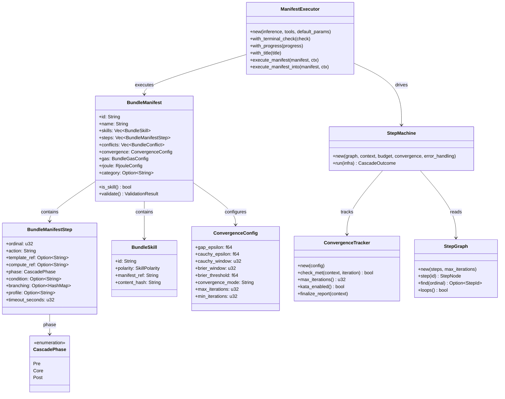
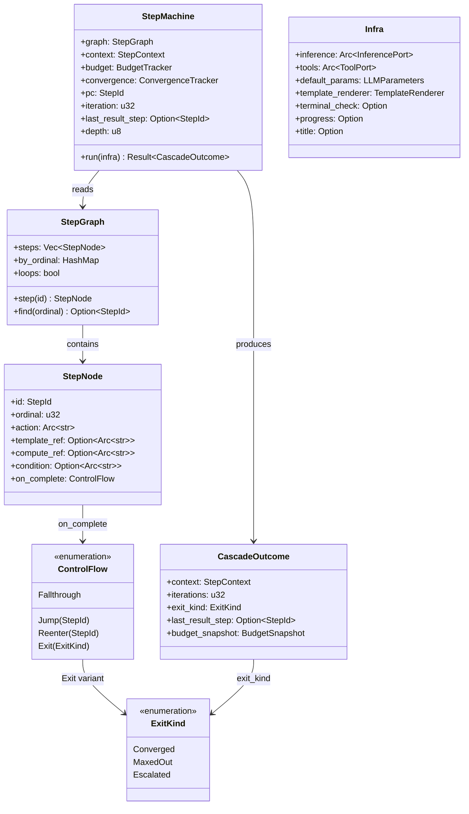
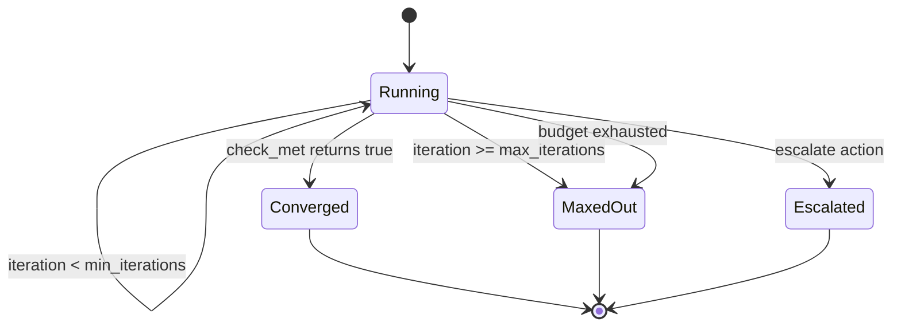

# hkask-templates — Reference

`hkask-templates` implements the skill manifest registry and the
`ManifestExecutor` that runs skill PDCA cascades. It loads `manifest.yaml`
files from the registry, resolves template dependencies, and executes Jinja2
templates against the inference port. Template types are `WordAct` (Prompt),
`FlowDef` (Process), and `KnowAct` (Cognition) — unified under a single
registry with a `template_type` discriminator per architecture v0.22.0
(`hkask_templates.rs:9`).

## Source citations

| Symbol | Location |
|--------|----------|
| `ManifestExecutor` struct | `kask/crates/hkask-templates/src/executor.rs:69` |
| `ManifestExecutor::new` | `kask/crates/hkask-templates/src/executor.rs:81` |
| `ManifestExecutor::execute_manifest` | `kask/crates/hkask-templates/src/executor.rs:141` |
| `ManifestExecutor::execute_manifest_into` | `kask/crates/hkask-templates/src/executor.rs:155` |
| `extract_final_step_result` | `kask/crates/hkask-templates/src/executor.rs:210` |
| `normalize_model_output` | `kask/crates/hkask-templates/src/executor.rs:227` |
| `parse_json_response` | `kask/crates/hkask-templates/src/executor.rs:255` |
| `extract_feedback_phase` | `kask/crates/hkask-templates/src/executor.rs:29` |
| `BundleManifest` struct | `kask/crates/hkask-templates/src/bundle/manifest.rs:134` |
| `BundleManifestStep` struct | `kask/crates/hkask-templates/src/bundle/manifest.rs:56` |
| `BundleSkill` struct | `kask/crates/hkask-templates/src/bundle/manifest.rs:46` |
| `ValidationResult` struct | `kask/crates/hkask-templates/src/bundle/manifest.rs:356` |
| `MAX_CONCURRENCY` const | `kask/crates/hkask-templates/src/bundle/manifest.rs:41` |
| `CascadePhase` enum | `kask/crates/hkask-templates/src/bundle/cascade.rs:8` |
| `BundleConflict` struct | `kask/crates/hkask-templates/src/bundle/composition.rs:72` |
| `BundleComplementarity` struct | `kask/crates/hkask-templates/src/bundle/composition.rs:97` |
| `ConflictType` enum | `kask/crates/hkask-templates/src/bundle/composition.rs:10` |
| `ConflictResolution` enum | `kask/crates/hkask-templates/src/bundle/composition.rs:31` |
| `ComplementarityType` enum | `kask/crates/hkask-templates/src/bundle/composition.rs:54` |
| `ConvergenceConfig` struct | `kask/crates/hkask-templates/src/bundle/config.rs:52` |
| `BundleGasConfig` struct | `kask/crates/hkask-templates/src/bundle/config.rs:267` |
| `RjouleConfig` struct | `kask/crates/hkask-templates/src/bundle/config.rs:290` |
| `ErrorHandlingConfig` struct | `kask/crates/hkask-templates/src/bundle/config.rs:337` |
| `BundleLedgerConfig` struct | `kask/crates/hkask-templates/src/bundle/config.rs:392` |
| `BundleAuditConfig` struct | `kask/crates/hkask-templates/src/bundle/config.rs:420` |
| `AggregationSource` struct | `kask/crates/hkask-templates/src/bundle/config.rs:251` |
| `RJOULE_TO_GAS` const | `kask/crates/hkask-templates/src/bundle/config.rs:10` |
| `ConvergenceTracker` struct | `kask/crates/hkask-templates/src/convergence.rs:82` |
| `ConvergenceStatus` enum | `kask/crates/hkask-templates/src/convergence.rs:26` |
| `BudgetTracker` struct | `kask/crates/hkask-templates/src/budget.rs:74` |
| `BudgetSnapshot` struct | `kask/crates/hkask-templates/src/budget.rs:33` |
| `BudgetExhaustion` enum | `kask/crates/hkask-templates/src/budget.rs:25` |
| `StepMachine` struct | `kask/crates/hkask-templates/src/step_machine.rs:45` |
| `CascadeOutcome` struct | `kask/crates/hkask-templates/src/step_machine.rs:66` |
| `Infra` struct | `kask/crates/hkask-templates/src/step_machine.rs:34` |
| `StepGraph` struct | `kask/crates/hkask-templates/src/step_graph.rs:103` |
| `StepNode` struct | `kask/crates/hkask-templates/src/step_graph.rs:79` |
| `ControlFlow` enum | `kask/crates/hkask-templates/src/step_graph.rs:51` |
| `ExitKind` enum | `kask/crates/hkask-templates/src/step_graph.rs:65` (re-exported at `hkask_templates.rs:38` as `pub use step_graph::ExitKind`) |
| `StepId` type alias | `kask/crates/hkask-templates/src/step_graph.rs:23` |
| `ENTRY` const | `kask/crates/hkask-templates/src/step_graph.rs:26` |
| `MAX_STEPS` const | `kask/crates/hkask-templates/src/step_graph.rs:41` |
| `StepContext` struct | `kask/crates/hkask-templates/src/step_context.rs:76` |
| `StepResult` struct | `kask/crates/hkask-templates/src/step_context.rs:66` |
| `ContextLookup` trait | `kask/crates/hkask-templates/src/step_context.rs:40` |
| `ContextMap` trait | `kask/crates/hkask-templates/src/step_context.rs:48` |
| `Effect` enum | `kask/crates/hkask-templates/src/step_actions.rs:27` |
| `dispatch_compute` | `kask/crates/hkask-templates/src/compute.rs:58` |
| `Registry` struct | `kask/crates/hkask-templates/src/registry.rs:182` |
| `Registry::bootstrap` | `kask/crates/hkask-templates/src/registry.rs:486` |
| `process_manifest_seed` | `kask/crates/hkask-templates/src/registry.rs:46` |
| `process_manifest_yaml` | `kask/crates/hkask-templates/src/registry.rs:35` |
| `template_file_seed` | `kask/crates/hkask-templates/src/registry.rs:52` |
| `template_yaml_file_seed` | `kask/crates/hkask-templates/src/registry.rs:59` |
| `template_manifest_seed` | `kask/crates/hkask-templates/src/registry.rs:66` |
| `company_source_seed` | `kask/crates/hkask-templates/src/registry.rs:76` |
| `template_file` | `kask/crates/hkask-templates/src/registry.rs:92` |
| `template_yaml_file` | `kask/crates/hkask-templates/src/registry.rs:118` |
| `SqliteRegistry` struct | `kask/crates/hkask-templates/src/registry_sqlite.rs:51` |
| `SqliteRegistry::new` | `kask/crates/hkask-templates/src/registry_sqlite.rs:55` |
| `BundleRegistryIndex` trait | `kask/crates/hkask-templates/src/bundle/mod.rs:22` |
| `SkillLoader` struct | `kask/crates/hkask-templates/src/skill_loader.rs:64` |
| `SkillFrontMatter` struct | `kask/crates/hkask-templates/src/skill_loader.rs:28` |
| `SkillLoadResult` struct | `kask/crates/hkask-templates/src/skill_loader.rs:57` |
| `load_manifest_from_file` | `kask/crates/hkask-templates/src/manifest_loader.rs:127` |
| `load_manifest_from_yaml` | `kask/crates/hkask-templates/src/manifest_loader.rs:142` |
| `resolve_manifest` | `kask/crates/hkask-templates/src/manifest_loader.rs:207` |
| `ManifestFile` wrapper | `kask/crates/hkask-templates/src/manifest_loader.rs:42` |
| `ManifestLoadError` enum | `kask/crates/hkask-templates/src/manifest_loader.rs:329` |
| `PromptStrategy` enum | `kask/crates/hkask-templates/src/prompt_strategy.rs:14` |
| `TemplateRenderer` struct | `kask/crates/hkask-templates/src/template_renderer.rs:59` |
| `DEFAULT_TEMPLATE_BASE_PATH` const | `kask/crates/hkask-templates/src/template_renderer.rs:26` |
| `safe_template_join` | `kask/crates/hkask-templates/src/template_renderer.rs:34` |
| `validate_inputs` | `kask/crates/hkask-templates/src/inputs.rs:57` |
| `InputValidationError` struct | `kask/crates/hkask-templates/src/inputs.rs:52` |
| `extract_contract_input_keys` | `kask/crates/hkask-templates/src/inputs.rs:189` |
| `render_input_param_spec` | `kask/crates/hkask-templates/src/inputs.rs:141` |
| build script (registry embedding) | `kask/crates/hkask-templates/build.rs:30` |

## Manifest schema

The `BundleManifest` (`bundle/manifest.rs:134`) is the parsed representation
of a `manifest.yaml` file. It contains a list of `BundleSkill` entries, a
list of `BundleManifestStep` entries, declared `BundleConflict` /
`BundleComplementarity` relations, and config blocks for convergence, gas,
rJoule, error handling, ledger, and audit. Each step references a Jinja2
template via `template_ref`, declares its `action`, `phase`,
`input_mapping`, `output_schema`, optional `compute_ref` (deterministic math
primitive), `condition`, `branching`, and `profile`.

<!-- DIAGRAM_ALIGNMENT
id: DIAG-TMPL-003
verified_date: 2026-08-13
verified_against: kask/crates/hkask-templates/src/bundle/manifest.rs:46,56,134; kask/crates/hkask-templates/src/bundle/cascade.rs:8; kask/crates/hkask-templates/src/bundle/config.rs:52; kask/crates/hkask-templates/src/executor.rs:69,141,155; kask/crates/hkask-templates/src/convergence.rs:82; kask/crates/hkask-templates/src/step_machine.rs:45,66; kask/crates/hkask-templates/src/step_graph.rs:103
status: VERIFIED
-->

## Manifest loading

Three functions in `manifest_loader.rs` handle manifest loading:

- `load_manifest_from_file` (`manifest_loader.rs:127`) reads from a file path.
- `load_manifest_from_yaml` (`manifest_loader.rs:142`) parses a YAML string.
- `resolve_manifest` (`manifest_loader.rs:207`) resolves a manifest
  reference against a `BundleRegistryIndex`, trying registry ID first, then
  file path, then relative path. Returns `ManifestResolveError::NotASkill`
  if the manifest loads but is not `category: skill` — only skill manifests
  may bind as agent `process_manifest`s.

The `ManifestFile` wrapper (`manifest_loader.rs:42`) flattens the
`manifest:` header with top-level config peers into a single
`BundleManifest`. It uses `#[serde(deny_unknown_fields)]` so extra fields
are rejected, not silently dropped.

## Registry

The registry has two adapters that implement the same three index traits
(`RegistryIndex`, `SkillRegistryIndex`, `BundleRegistryIndex`):

- `Registry` (`registry.rs:182`) — in-memory read-through cache. Loaded from
  the filesystem on startup via `Registry::bootstrap` (`registry.rs:486`),
  which deserializes the per-skill template manifests embedded by `build.rs`.
- `SqliteRegistry` (`registry_sqlite.rs:51`) — persistent backing store.
  Created via `SqliteRegistry::new` (`registry_sqlite.rs:55`) with an optional
  filesystem path (None = in-memory).

The two are always used in tandem: `Registry` for fast lookups,
`SqliteRegistry` for durability (`registry.rs:170`).

### Seed payloads

`build.rs` (`build.rs:30`) embeds five seed payloads at compile time, exposed
as accessors in `registry.rs`:

| Accessor | Source directory | Purpose |
|----------|------------------|---------|
| `process_manifest_seed` (`registry.rs:46`) | `registry/manifests/*.yaml` | FlowDef cascade definitions |
| `template_manifest_seed` (`registry.rs:66`) | `registry/templates/<skill>/manifest.yaml` | Per-skill template manifests |
| `template_file_seed` (`registry.rs:52`) | `registry/templates/<skill>/*.j2` | Jinja2 templates (WordAct/KnowAct/RenderAct) |
| `template_yaml_file_seed` (`registry.rs:59`) | `registry/templates/<skill>/*.yaml` (excl. `manifest.yaml`) | FlowDef sub-manifests + RenderAct reference docs |
| `company_source_seed` (`registry.rs:76`) | `registry/company-sources/*.yaml` | Corpus-specific resource manifests |

The seed payloads are **seed-only** — used by the registry seeding path to
write the shipped manifests to disk. The runtime reads exclusively from disk
(`registry.rs:42`). The bridge's `seed_registry_to_disk`
(`kask_bridge/src/skill_executor.rs:457`) materialises them under
`{kask_data_dir}/skills/registry/` (D28) on first startup; existing files are
never overwritten — user edits are sovereign.

### Template lookup

`template_file` (`registry.rs:92`) and `template_yaml_file`
(`registry.rs:118`) look up embedded templates by `template_ref`, handling
both the with-extension and without-extension forms. Callers that need to
fall back to the filesystem (dev workflows where a template has been edited
but not yet rebuilt) should do so after these return `None`.

## ManifestExecutor — constructor and wiring

`ManifestExecutor::new(inference, tools, default_params)` (`executor.rs:81`)
takes exactly three arguments: the `InferencePort`, the `ToolPort`, and
default `LLMParameters`. The struct carries no defense-layer fields. Its
remaining fields are all defaulted in `new` and overridable via builders:

| Field | Role | Set via | Default |
|-------|------|---------|---------|
| `terminal_check: Option<Arc<dyn Fn() -> bool + Send + Sync>>` | Profile enforcement for the built-in `terminal` tool (proposer/evaluator separation) | `with_terminal_check` (`executor.rs:102`) | `None` |
| `progress: Option<Arc<dyn Fn(&str) + Send + Sync>>` | Real-time cascade feedback (thinking traces) | `with_progress` (`executor.rs:109`) | `None` |
| `title: Option<Arc<dyn Fn(&str) + Send + Sync>>` | Step-label updates | `with_title` (`executor.rs:116`) | `None` |
| `template_renderer: TemplateRenderer` | Jinja2 rendering rooted at the registry template base path | `with_template_base_path` (`executor.rs:123`) | `DEFAULT_TEMPLATE_BASE_PATH` (`template_renderer.rs:26`) |

`execute_manifest` (`executor.rs:141`) is the borrowed-interface entry point;
it clones `self` and delegates to `execute_manifest_into` (`executor.rs:155`),
the owned-args variant that consumes `self` and `manifest` so the returned
future owns both (no borrows) and is `Send + 'static` — safe to
`tokio::spawn`. The bridge uses `execute_manifest_into` for the GPUI→tokio
handoff.

## Step machine

The `StepMachine` (`step_machine.rs:45`) is the deterministic interpreter
that replaces the old 720-line `run_cascade`. It owns a program counter
(`StepId`), an iteration counter (`u32`), a `BudgetTracker`, a
`ConvergenceTracker`, and a `StepGraph`. It loops: fetch step → dispatch
via the step's action → apply the effect → check exits → advance the PC
(`step_machine.rs:1`).

<!-- DIAGRAM_ALIGNMENT
id: DIAG-TMPL-004
verified_date: 2026-08-13
verified_against: kask/crates/hkask-templates/src/step_machine.rs:34,45,66; kask/crates/hkask-templates/src/step_graph.rs:51,65,79,103; kask/crates/hkask-templates/src/budget.rs:33
status: VERIFIED
-->

Steps are addressed by `StepId` (a `u32` index into the graph's `steps`
vector), not by the user-facing `ordinal` (`step_graph.rs:1`). The `ordinal`
is retained on each `StepNode` for error messages and context-key naming
(`step_{ordinal}_result`), but the machine never scans for it. Control flow
is a property of the node (`on_complete`), not something the interpreter
reconstructs from `match` arms (`step_graph.rs:43`).

### Cascade actions

`StepMachine::run_pass` (`step_machine.rs:239`) dispatches on
`node.action` via `dispatch_action` (`step_machine.rs:328`):

| Action | Handler | Purpose |
|--------|---------|---------|
| `select` | `execute_select` (`step_actions.rs:195`) | LLM inference, parse JSON, merge into context |
| `populate` | `execute_populate` (`step_actions.rs:325`) | Render-only, store under `step_N_populated` |
| `render` | `execute_render` (`step_actions.rs:395`) | RenderAct — no inference, for reference docs |
| `compute` | `execute_compute` (`step_actions.rs:349`) | Deterministic math primitive via `dispatch_compute` |
| `tool_invoke` | `execute_tool_invoke` (`step_actions.rs:408`) | MCP tool call via `step.mcp` |
| `flowdef` | `execute_flowdef` (`step_actions.rs:467`) | Nested sub-manifest cascade (composability) |
| `parallel` | `execute_parallel` (`step_actions.rs:604`) | Concurrent branch fan-out with shared gas cap |
| `choice` | `execute_choice` (`step_actions.rs:62`) | Conditional branch via `input_mapping.branches` |
| `loop` | `execute_loop` (`step_actions.rs:146`) | PDCA re-entry from target ordinal |
| `abort` / `escalate` | inline in `step_machine.rs` | Terminate cascade |

Each action returns an `Effect` (`step_actions.rs:27`), which the machine
merges with the node's static `ControlFlow` via `merge_control_flow`
(`step_machine.rs:459`). The effect wins if it specifies a jump/re-enter/exit;
otherwise the node's static flow is used.

### Compute primitives

`dispatch_compute` (`compute.rs:58`) maps a `compute_ref` string to a
canonical `hkask_forecast` / `hkask_lisp` primitive with no LLM round-trip.
Supported refs:

| `compute_ref` | Input shape | Source |
|--------------|------------|--------|
| `calibrate_from_fermi` | `{questions: [{question, estimate, confidence}]}` | `hkask_forecast` |
| `outside_view_adjustment` | `{base_rate, inside_estimate, reference_count}` | `hkask_forecast` |
| `bayesian_update` | `{prior, evidence_likelihood, evidence_base_rate}` | `hkask_forecast` |
| `apply_calibration_adjustment` | `{prior, overconfidence_bias}` | `hkask_forecast` |
| `brier_score` | `{probability, outcome_occurred}` | `hkask_forecast` |
| `brier_score_multi` | `{probabilities: [f64], outcomes: [bool]}` | `hkask_forecast` |
| `brier_interpretation` | `{score}` | `hkask_forecast` |
| `kata.object_gap` | `{current_artifacts, target_artifacts}` | `compute.rs:278` |
| `kata.process_gap` | `{current_procedure, target_procedure}` | `compute.rs:299` |
| `kata.hypotenuse` | `{object_gap, process_gap}` | `compute.rs:318` |
| `kata.prediction_vs_result` | `{prediction, result}` | `compute.rs:331` |
| `swarm.converge_accumulate` | swarm state + iteration log | `compute.rs:376` |
| `swarm.second_order_monitor` | iteration log | `compute.rs:510` |
| `lisp.eval` | `{form, env?, max_steps?, max_depth?}` | `compute.rs:775` |
| `shell.exec` | `{command, cwd}` | `compute.rs:803` |

The Kata convergence primitives (object/process gap, hypotenuse, Brier) live
in `compute.rs` — they replace the old LLM self-grade convergence templates
that caused 30s timeouts across 12+ skills (`compute.rs:1`).

## Convergence

`ConvergenceTracker` (`convergence.rs:82`) is a pure state machine over
`(context, config)` — no dependency on `InferencePort`, `ToolPort`, gas, or
rJoule (`convergence.rs:13`). The executor constructs one per cascade, calls
`check_met` (`convergence.rs:307`) after each pass, and calls
`finalize_report` (`convergence.rs:521`) at exit.

<!-- DIAGRAM_ALIGNMENT
id: DIAG-TMPL-005
verified_date: 2026-08-13
verified_against: kask/crates/hkask-templates/src/convergence.rs:26,82,307; kask/crates/hkask-templates/src/step_machine.rs:189,206; kask/crates/hkask-templates/src/step_graph.rs:65
status: VERIFIED
-->

The `ConvergenceStatus` enum (`convergence.rs:26`) has four variants:
`Converged`, `MaxedOut`, `Escalated`, `Running`. The string representation
(`convergence.rs:39`) is used in the `_convergence.status` context field.

### Convergence modes

The three stop conditions are orthogonal and combined via `convergence_mode`
(`bundle/config.rs:140`):

| Mode | Active conditions |
|------|-------------------|
| `gap` | `signal < gap_epsilon` (limit-of-a-sequence) |
| `cauchy` | max pairwise delta in `cauchy_window` < `cauchy_epsilon` (stall) |
| `calibration` | rolling Brier average over `brier_window` < `brier_threshold` |
| `gap_or_cauchy` | gap OR Cauchy |
| `gap_or_cauchy_or_calibration` (default) | any of the three |

The Cauchy check (`convergence.rs:381`) works on any scalar signal — it
detects when the signal stops moving, regardless of whether the signal is a
gap distance. It catches oscillation (large pairwise distances → not Cauchy)
and plateau (small pairwise distances → Cauchy) (`bundle/config.rs:103`).

### Compound aggregation

For compound skills (nested PDCA loops), `aggregation` (`bundle/config.rs:176`)
combines convergence signals from multiple source steps:

| Method | Behavior |
|--------|----------|
| `none` (default) | single-field check |
| `min` | worst (highest) quality score across sources |
| `weighted_avg` | weighted average of source quality scores |
| `all_converged` | every source step must have `_convergence.status == "converged"` |

Sources are declared via `aggregation_sources: Vec<AggregationSource>`
(`bundle/config.rs:180`), each with `step_ordinal`, `field`, and `weight`
(`bundle/config.rs:251`).

## Budget

`BudgetTracker` (`budget.rs:74`) enforces gas (compute) and rJoule (inference
energy) budgets. The conversion constant is `RJOULE_TO_GAS = 250_000`
(`bundle/config.rs:10`) — 250,000 compute gas cycles = 1 rJoule of inference
energy.

Gas uses `Arc<AtomicU64>` (`budget.rs:74`) so a `parallel` action's
concurrent branches share the parent's gas counter, enforcing the shared cap
during the wave. rJoule stays `f64` per-branch (no atomic for `f64`); branches
settle via `charge_rjoule` (`budget.rs:185`) after the wave.

`check_exhausted` (`budget.rs:203`) is called in exactly one place — the
`Reenter` arm of `StepMachine::run` (`step_machine.rs:206`). It fires
threshold alerts first (once per crossing) so the alert span precedes the
exhaustion span. `snapshot` (`budget.rs:265`) returns a `BudgetSnapshot`
(`budget.rs:33`) for context injection.

## Skill loading

`SkillLoader` (`skill_loader.rs:64`) loads skill definitions from the
registry. It parses `SkillFrontMatter` (`skill_loader.rs:28`) — name,
visibility, namespace, description — and returns a `SkillLoadResult`
(`skill_loader.rs:57`) with loaded skills and warnings.

## Input validation

`validate_inputs` (`inputs.rs:57`) validates the manifest's declared
`inputs` against the runtime `context`. It is opt-in via
`enforce_inputs: Some(true)` on the manifest (`bundle/manifest.rs:169`) —
existing skills whose required inputs are supplied programmatically are not
broken. When enabled, it rejects invocations that omit a `required` input or
supply a value whose JSON type does not match the declared `type`. Unknown
keys are warned, not rejected (`bundle/manifest.rs:160`).

`extract_contract_input_keys` (`inputs.rs:189`) extracts the input keys
declared in a template's frontmatter. `render_input_param_spec`
(`inputs.rs:141`) renders the declared inputs as a parameter spec string.

## Output normalization

`normalize_model_output` (`executor.rs:227`) strips `<thinking>...</thinking>`
reasoning wrappers that reasoning models (Qwen3, GLM-5.2, DeepSeek-R1) emit
before the final answer. Without stripping, these tags pollute downstream
step inputs and break JSON parsing. Applied at the
`extract_final_step_result` entry point (`executor.rs:210`). Non-string
values pass through unchanged; clean strings borrow (`Cow::Borrowed`), dirty
strings own (`Cow::Owned`).

`parse_json_response` (`executor.rs:255`) parses a model response as JSON,
falling back to `llm_json::extract_json_from_response` for responses with
surrounding prose.

## See also

- [hkask-templates Explanation](./explanation.md): sequence diagram of the
  ManifestExecutor invocation path and convergence design rationale.
- [hkask-templates Tutorial](./tutorial.md): your first skill manifest.
- [hkask-templates How-to](./how-to.md): adding a PDCA step to an existing
  manifest.
- [`kask/docs/explanation/skills-and-composition.md`](../../explanation/skills-and-composition.md):
  cross-cutting skill anatomy and composition.

---

[^minijinja]: mitsuhiko. (2024). *minijinja — a Jinja2 template engine for
    Rust.* <https://docs.rs/minijinja/>. The Rust Jinja2 implementation used
    for template rendering.

[^rother-kata]: Rother, M. (2010). *Toyota Kata: Managing People for
    Improvement, Adaptiveness, and Superior Results.* McGraw-Hill.
    <https://www.toyotakata.com/>. The Improvement Kata model that the
    convergence config implements.
