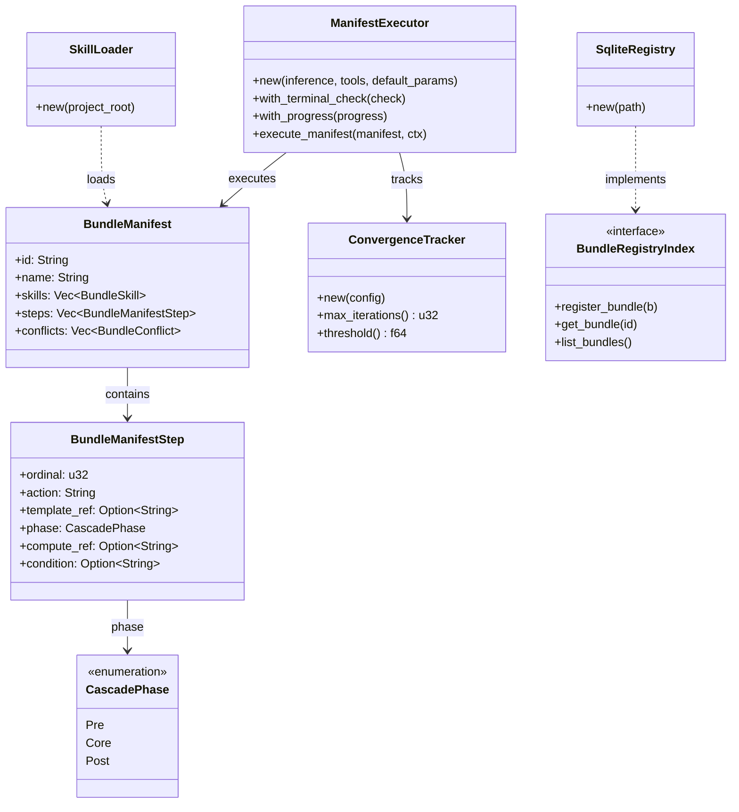

# hkask-templates — Reference

`hkask-templates` implements the skill manifest registry and the
`ManifestExecutor` that runs skill PDCA cascades. It loads `manifest.yaml`
files from the registry, resolves template dependencies, and executes Jinja2
templates against the inference port. Template types are `Prompt` (WordAct),
`Process` (FlowDef), and `Cognition` (KnowAct) — see `hkask_templates.rs:1`.

## Source citations

| Symbol                        | Location                                                   |
| ----------------------------- | ---------------------------------------------------------- |
| `ManifestExecutor` struct     | `kask/crates/hkask-templates/src/executor.rs:73`           |
| `ManifestExecutor::new`       | `kask/crates/hkask-templates/src/executor.rs:85`           |
| `execute_manifest`            | `kask/crates/hkask-templates/src/executor.rs:161`          |
| `extract_final_step_result`   | `kask/crates/hkask-templates/src/executor.rs:200`          |
| `StepResult` struct           | `kask/crates/hkask-templates/src/step_context.rs` (no `taint` field — see [Removed](#removed-the-fides-taint-pipeline)) |
| `check_untrusted_input`       | _removed_ (2026-08-12, RR-0053)                            |
| `spotlight_tool_output`       | _removed_ (D4 — `hkask-guard` deleted 2026-08-10)           |
| `BundleManifest` struct       | `kask/crates/hkask-templates/src/bundle/manifest.rs:91`    |
| `BundleManifestStep`          | `kask/crates/hkask-templates/src/bundle/manifest.rs:35`    |
| `BundleSkill`                 | `kask/crates/hkask-templates/src/bundle/manifest.rs:24`    |
| `BundleConflict`              | `kask/crates/hkask-templates/src/bundle/composition.rs:72` |
| `BundleComplementarity`       | `kask/crates/hkask-templates/src/bundle/composition.rs:97` |
| `CascadePhase` enum           | `kask/crates/hkask-templates/src/bundle/cascade.rs:8`      |
| `ConvergenceConfig`           | `kask/crates/hkask-templates/src/bundle/config.rs:52`      |
| `ConvergenceTracker`          | `kask/crates/hkask-templates/src/convergence.rs:73`        |
| `ValidationResult`            | `kask/crates/hkask-templates/src/bundle/manifest.rs:314`   |
| `BundleRegistryIndex` trait   | `kask/crates/hkask-templates/src/bundle/mod.rs:22`         |
| `SkillLoader`                 | `kask/crates/hkask-templates/src/skill_loader.rs:64`       |
| `SkillFrontMatter`            | `kask/crates/hkask-templates/src/skill_loader.rs:28`       |
| `SkillLoadResult`             | `kask/crates/hkask-templates/src/skill_loader.rs:57`       |
| `SqliteRegistry`              | `kask/crates/hkask-templates/src/registry_sqlite.rs:65`    |
| `load_manifest_from_file`     | `kask/crates/hkask-templates/src/manifest_loader.rs:123`   |
| `load_manifest_from_yaml`     | `kask/crates/hkask-templates/src/manifest_loader.rs:138`   |
| `resolve_manifest`            | `kask/crates/hkask-templates/src/manifest_loader.rs:197`   |
| `ManifestLoadError` enum      | `kask/crates/hkask-templates/src/manifest_loader.rs:319`   |
| `PromptStrategy` enum         | `kask/crates/hkask-templates/src/prompt_strategy.rs:14`    |
| `BudgetTracker`               | `kask/crates/hkask-templates/src/budget.rs:71`             |

## Manifest schema

The `BundleManifest` (`bundle/manifest.rs:91`) is the parsed representation of
a `manifest.yaml` file. It contains a list of `BundleSkill` entries, a list of
`BundleManifestStep` entries, and declared `BundleConflict` /
`BundleComplementarity` relations. Each step references a Jinja2 template via
`template_ref`, declares its `action`, `phase`, `input_mapping`,
`output_schema`, optional `compute_ref` (deterministic math primitive),
and `condition`.

<!-- DIAGRAM_ALIGNMENT
id: DIAG-DIA-TPL-001
verified_date: 2026-08-05
verified_against: kask/crates/hkask-templates/src/executor.rs:128,170,467; kask/crates/hkask-templates/src/bundle/manifest.rs:91,35,24,314; kask/crates/hkask-templates/src/bundle/cascade.rs:8; kask/crates/hkask-templates/src/bundle/config.rs:52; kask/crates/hkask-templates/src/convergence.rs:73; kask/crates/hkask-templates/src/bundle/composition.rs:72,97; kask/crates/hkask-templates/src/skill_loader.rs:64; kask/crates/hkask-templates/src/registry_sqlite.rs:65; kask/crates/hkask-templates/src/bundle/mod.rs:22
status: VERIFIED
-->

## Manifest loading

Three functions in `manifest_loader.rs` handle manifest loading:
`load_manifest_from_file` (`manifest_loader.rs:123`) reads from a file path,
`load_manifest_from_yaml` (`manifest_loader.rs:138`) parses a YAML string, and
`resolve_manifest` (`manifest_loader.rs:197`) resolves a manifest reference
against a `BundleRegistryIndex`. The `ManifestLoadError` enum
(`manifest_loader.rs:319`) covers IO and YAML parse failures.

## Skill loading

The `SkillLoader` (`skill_loader.rs:64`) loads skill definitions from the
registry. It parses `SkillFrontMatter` (`skill_loader.rs:28`) and returns a
`SkillLoadResult` (`skill_loader.rs:57`).

## Registry

The `SqliteRegistry` (`registry_sqlite.rs:65`) implements the
`BundleRegistryIndex` trait (`bundle/mod.rs:22`) and persists skill and
template metadata in SQLite. An in-memory `Registry` adapter also exists (see
`hkask_templates.rs:39`).

## ManifestExecutor — constructor and wiring

`ManifestExecutor::new(inference, tools, default_params)` (`executor.rs`) takes
exactly three arguments: the `InferencePort`, the `ToolPort`, and default
`LLMParameters`. (The former `secret` parameter was removed.) The struct carries
no defense-layer fields. Its remaining fields are all defaulted in `new` and
overridable via builders:

| Field                                                        | Role                                                                                    | Set via                | Default |
| ------------------------------------------------------------ | --------------------------------------------------------------------------------------- | ---------------------- | ------- |
| `terminal_check: Option<Arc<dyn Fn() -> bool + Send + Sync>>` | Profile enforcement for the built-in `terminal` tool (F6 proposer/evaluator separation) | `with_terminal_check`  | None    |
| `progress: Option<Arc<dyn Fn(&str) + Send + Sync>>`          | Real-time cascade feedback (thinking traces)                                            | `with_progress`        | None    |
| `title: Option<Arc<dyn Fn(&str) + Send + Sync>>`             | Step-label updates                                                                      | `with_title`           | None    |
| `template_renderer: TemplateRenderer`                        | Jinja2 rendering rooted at the registry template base path                              | `with_template_base_path` | default base path |

`invoke_tool` (`step_actions.rs`) now does exactly two things: resolve the tool's
server via `ToolPort::get_tool_info`, then dispatch through `ToolPort::invoke`
with an accounting `WebID`. No pre-dispatch check runs in the executor.

### Removed: the FIDES taint pipeline

The Source→Sink information-flow gate this executor used to host was **deleted on
2026-08-12**, not repaired. Both of its inputs were constants — every MCP tool was
labelled `ToolTaint::Pure` at its only construction site, and the untrusted-input
flag read legacy `__taint__{key}` context markers that the write side had stopped
emitting — so its one prohibition could never fire.

Gone from this crate: the `runtime_policy` field and its `with_runtime_policy`
builder, `runtime_policy_is_wired`, the `taint_labels` map, `check_untrusted_input`,
`collect_referenced_keys`, `StepResult.taint`, `StepContext::taint_of`, the
`taint_of_key` method on the `ContextLookup` trait, and the taint parameters on
`StepContext::store_result` / `store_named`. The `hkask-regulation` dependency this
crate carried solely for `DefaultPolicy` was dropped from `Cargo.toml`. A
removal-rationale comment sits above `invoke_tool` in `step_actions.rs`.

Defense **Layer 5 (information flow control) is absent by decision**, recorded the
same way Layer 3 (instruction hierarchy) is under RR-0010. The governing entry is
`kask/security/regressions/RR-0053.yaml`, rewritten as an absence check forbidding
re-introduction of an inert gate; RR-0012, RR-0013, RR-0026, RR-0027, RR-0033 and
RR-0034 are now `obsolete`. Full rationale and the bar a replacement must clear:
[`guard-taint-pipeline.md`](../../architecture/guard-taint-pipeline.md).

## Cascade actions

`ManifestExecutor::execute_manifest` (`executor.rs:161`) dispatches on
`step.action` (via the `StepMachine` dispatch loop in `step_machine.rs`):

| Action               | Handler                                    | Purpose                                            |
| -------------------- | ------------------------------------------ | -------------------------------------------------- |
| `select`             | `execute_select` (`step_actions.rs:196`)      | LLM inference, parse JSON, merge into context      |
| `populate`           | `execute_populate` (`step_actions.rs:279`)    | Render-only, store under `step_N_populated`        |
| `render`             | `execute_render` (`step_actions.rs:351`)      | RenderAct — no inference, for reference docs       |
| `flowdef`            | `execute_flowdef` (`step_actions.rs:429`)     | Nested sub-manifest cascade (composability)        |
| `tool_invoke`        | `execute_tool_invoke` (`step_actions.rs:384`) | MCP tool call via `step.mcp`                       |
| `compute`            | `execute_compute` (`step_actions.rs:304`)     | Deterministic math primitive (`hkask_forecast::*`) |
| `choice`             | inline (`step_machine.rs` dispatch loop)     | Conditional branch via `_next_ordinal`             |
| `loop`               | inline (`step_machine.rs` dispatch loop)     | PDCA re-entry from target ordinal                  |
| `abort` / `escalate` | inline (`step_machine.rs` dispatch loop)     | Terminate cascade                                  |

Step results are stored under `step_{ordinal}_result` keys. Final-result
extraction must be ordinal-keyed — the canonical extractors are
`extract_final_step_result` (`executor.rs:200`) and the same-named function
in `kask_bridge/src/skill_executor.rs`; `HashMap::values().last()` is
non-deterministic (`RandomState`).

### Wall-clock defense

The cascade has three layers of wall-clock defense against the "performative
reasoning" failure mode documented in Wang (2026, arXiv:2603.02615v1) — a
model stuck in a serial sub-call verification loop that burns wall-clock
while consuming few tokens (observed: 741.5s for 11,715 tokens):

1. **Per-step timeout** (`step.timeout_seconds`, `manifest.rs:55`) — hard,
   enforced via `tokio::time::timeout` in `execute_select` (`step_actions.rs:196`).
   Catches individual stuck inference calls. Default is 0 (disabled); skill
   authors set it per step.
2. **Iteration cap** (`convergence.max_iterations`, `config.rs:194`, default 10)
   — bounds the number of PDCA loop passes. Each pass can spawn sub-calls,
   so the cascade is bounded by `max_iterations × steps_per_pass ×
per_step_timeout`.
3. **Matryoshka depth guard** (`SYSTEM_MAX_RECURSION = 7`, `hkask-capability/src/token_types.rs:18`)
   — bounds flowdef sub-cascade nesting depth, enforced at `StepMachine::run`
   entry (`step_machine.rs:129`; was `run_cascade` in the pre-refactor `executor.rs`).

**Known gap:** there is no _cascade-level aggregate_ wall-clock cap that
bounds total elapsed time across all nesting levels. The per-step timeout
bounds individual calls; the iteration cap bounds loop passes; the matryoshka
guard bounds depth. A deeply-nested flowdef cascade with `max_iterations: 10`
and 30s per-step timeouts can run up to 7 × 10 × 30 = 2100s in the worst case.
The `reg.skill.budget.*` spans and `ConvergenceStatus` provide operator
visibility, but the default ceiling is high. A cascade-level
`wall_clock_cap_seconds` field is a known defense-in-depth candidate, not
yet implemented.

### Output normalization

`normalize_model_output` (`executor.rs:1976`) strips `<thinking>...</thinking>`
reasoning wrappers that reasoning models (Kimi K2, DeepSeek-R1) emit before
the final answer. Without stripping, these tags pollute downstream step
inputs and break JSON parsing — the failure mode documented in Wang (2026,
Appendix A.4), where the RLM framework's parsers missed answers entirely
until a `strip_think_tags` helper was added. Applied at the
`extract_final_step_result` entry point. Non-string values pass through
unchanged; clean strings borrow (`Cow::Borrowed`), dirty strings own
(`Cow::Owned`).

## See also

- [hkask-templates Explanation](./explanation.md): sequence diagram of the
  ManifestExecutor invocation path.
- [hkask-types Reference](../hkask-types/reference.md): the
  `SkillRegistryIndex` and `RegistryIndex` traits this crate implements.
- [`guard-taint-pipeline.md`](../../architecture/guard-taint-pipeline.md): the
  removed FIDES taint pipeline this executor used to host, and why it was deleted.
- [`kask/docs/explanation/skills-and-composition.md`](../../explanation/skills-and-composition.md):
  cross-cutting skill anatomy and composition.

---

[^beck-tdd]: Beck, K. (2003). _Test-Driven Development: By Example._ Addison-Wesley. <https://www.oreilly.com/library/view/test-driven-development/0321146530/>. The red-green-refactor cycle that the manifest PDCA steps parallel.

[^minijinja]: mitsuhiko. (2024). _minijinja — a Jinja2 template engine for Rust._ <https://docs.rs/minijinja/>. The Rust Jinja2 implementation used for template rendering.
