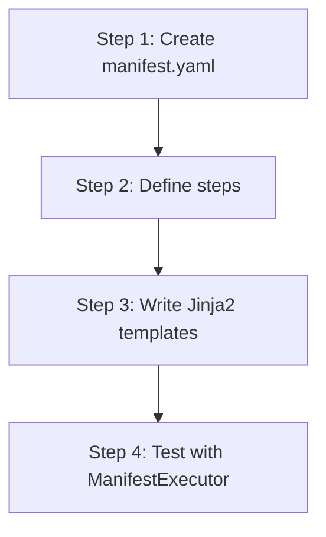

# hkask-templates — Tutorial: Your First Skill Manifest

This tutorial walks through creating a `manifest.yaml` file for a new skill.
You will learn the manifest structure, the step cascade, and how the
`ManifestExecutor` runs it.

## Learning path

<!-- DIAGRAM_ALIGNMENT
id: DIAG-DIA-TPL-003
verified_date: 2026-07-27
verified_against: kask/crates/hkask-templates/src/bundle/manifest.rs:91,35; kask/crates/hkask-templates/src/manifest_loader.rs:123
status: VERIFIED
-->

## Steps 1-2: Create the manifest and define steps

Create a `manifest.yaml` file in `kask/registry/manifests/`. The
`BundleManifest` struct (`bundle/manifest.rs:91`) is the parsed form. Define
a list of `BundleManifestStep` entries (`bundle/manifest.rs:35`), each with
an `ordinal`, an `action`, a `template` path, and convergence criteria.

## Steps 3-4: Write templates and test

Write Jinja2 templates in `kask/registry/templates/<skill>/`. Load the
manifest with `load_manifest_from_file` (`manifest_loader.rs:123`) and
execute it with `ManifestExecutor`.

## See also

- [hkask-templates Reference](./reference.md): class diagram of the manifest.
- [hkask-templates How-to](./how-to.md): adding a PDCA step.
- [`kask/docs/explanation/skills-and-composition.md`](../../explanation/skills-and-composition.md).

---

[^beck-tdd]: Beck, K. (2003). *Test-Driven Development: By Example.* Addison-Wesley. <https://www.oreilly.com/library/view/test-driven-development/0321146530/>.
