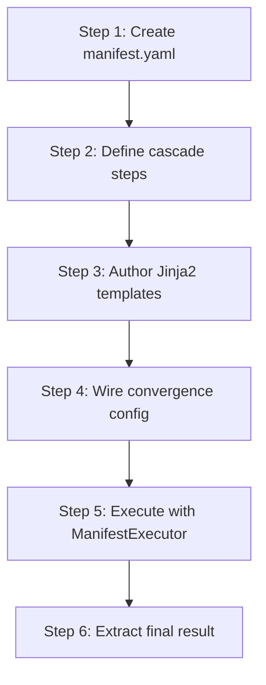

# hkask-templates — Tutorial: Your First Skill Manifest

This tutorial walks through creating a `manifest.yaml` file for a new skill.
You will learn the manifest structure, the step cascade, and how the
`ManifestExecutor` runs it. By the end you will have a working skill that the
agent panel can invoke.

The crate's three template types — `WordAct` (Jinja2 prompts), `KnowAct`
(Jinja2 cognition), and `FlowDef` (YAML pipeline manifests) — are unified
under a single registry with a `template_type` discriminator
(`hkask_templates.rs:9`)[^arch-v022]. A skill is a `FlowDef` cascade that
composes `WordAct`/`KnowAct` templates.

## Learning path



<!-- DIAGRAM_ALIGNMENT
id: DIAG-TMPL-001
verified_date: 2026-08-13
verified_against: kask/crates/hkask-templates/src/manifest_loader.rs:42; kask/crates/hkask-templates/src/bundle/manifest.rs:56,134; kask/crates/hkask-templates/src/bundle/config.rs:52; kask/crates/hkask-templates/src/executor.rs:141; kask/crates/hkask-templates/src/executor.rs:210
status: VERIFIED
-->

## Source citations

| Symbol | Location |
|--------|----------|
| `ManifestFile` deserialization wrapper | `kask/crates/hkask-templates/src/manifest_loader.rs:42` |
| `BundleManifestStep` struct | `kask/crates/hkask-templates/src/bundle/manifest.rs:56` |
| `BundleManifest` struct | `kask/crates/hkask-templates/src/bundle/manifest.rs:134` |
| `ConvergenceConfig` struct | `kask/crates/hkask-templates/src/bundle/config.rs:52` |
| `CascadePhase` enum | `kask/crates/hkask-templates/src/bundle/cascade.rs:8` |
| `ManifestExecutor::execute_manifest` | `kask/crates/hkask-templates/src/executor.rs:141` |
| `extract_final_step_result` | `kask/crates/hkask-templates/src/executor.rs:210` |
| `StepMachine::run` | `kask/crates/hkask-templates/src/step_machine.rs:97` |
| `StepGraph::new` | `kask/crates/hkask-templates/src/step_graph.rs:120` |

## Step 1: Create the manifest file

Create a `manifest.yaml` file in `kask/registry/manifests/<skill>.yaml`. The
build script (`kask/crates/hkask-templates/build.rs:67`) auto-discovers every
`.yaml` file in that directory and embeds it via `include_str!` so the runtime
binary has the full registry available as a fallback. The filesystem is the
primary source at runtime — YAML/J2 edits take effect immediately without
recompilation (`build.rs:11`).

The YAML file uses a `manifest:` header with identity fields and top-level
peers for `steps:`, `gas:`, `error_handling:`, etc. The `ManifestFile`
wrapper (`manifest_loader.rs:42`) flattens this into the canonical
`BundleManifest` (`bundle/manifest.rs:134`).

```yaml
manifest:
  id: my-skill
  name: My First Skill
  description: A minimal PDCA cascade.
  version: "0.1.0"
  editor: cli
  visibility: Public
  category: skill
steps:
  - ordinal: 1
    action: select
    description: Grasp the current condition.
    template_ref: my-skill/grather
    phase: Pre
    timeout_seconds: 120
  - ordinal: 2
    action: select
    description: Establish the target condition.
    template_ref: my-skill/target
    phase: Core
  - ordinal: 3
    action: loop
    description: Re-enter for the next PDCA cycle.
    phase: Post
convergence:
  max_iterations: 5
  min_iterations: 2
  convergence_mode: gap_or_cauchy_or_calibration
  gap_epsilon: 0.05
  cauchy_epsilon: 0.03
  cauchy_window: 3
  brier_window: 3
  brier_threshold: 0.15
```

## Step 2: Define the cascade steps

Each entry in `steps` is a `BundleManifestStep` (`bundle/manifest.rs:56`).
Required fields are `ordinal` (the user-facing step number) and `action`
(the cascade branch). The `phase` field (`bundle/cascade.rs:8`) classifies
the step as `Pre`, `Core`, or `Post` for span emission.

The `action` selects a branch in the `StepMachine` dispatch loop
(`step_machine.rs:97`):

| Action | Purpose | Handler |
|--------|---------|---------|
| `select` | LLM inference, parse JSON, merge into context | `execute_select` (`step_actions.rs:195`) |
| `populate` | Render-only, store under `step_N_populated` | `execute_populate` (`step_actions.rs:325`) |
| `render` | RenderAct — no inference, for reference docs | `execute_render` (`step_actions.rs:395`) |
| `compute` | Deterministic math primitive (`hkask_forecast::*`) | `execute_compute` (`step_actions.rs:349`) |
| `tool_invoke` | MCP tool call via `step.mcp` | `execute_tool_invoke` (`step_actions.rs:408`) |
| `flowdef` | Nested sub-manifest cascade (composability) | `execute_flowdef` (`step_actions.rs:467`) |
| `parallel` | Concurrent branch fan-out with shared gas cap | `execute_parallel` (`step_actions.rs:604`) |
| `choice` | Conditional branch via `input_mapping.branches` | `execute_choice` (`step_actions.rs:62`) |
| `loop` | PDCA re-entry from target ordinal | `execute_loop` (`step_actions.rs:146`) |
| `abort` / `escalate` | Terminate cascade | inline in `step_machine.rs` |

The only probabilistic action is `select` — it calls `InferencePort`
(`step_actions.rs:1`). Everything else is deterministic.

## Step 3: Author the Jinja2 templates

Write Jinja2 templates in `kask/registry/templates/<skill>/`. The build
script (`build.rs:94`) embeds every `.j2` file under that directory. Template
refs in manifests omit the `.j2` extension (e.g. `my-skill/gatherer`); the
`template_file` accessor (`registry.rs:92`) handles both forms.

Templates receive the context map: user-supplied inputs (`{{ target }}`),
prior step results (`{{ step_1_result }}`), and — in `loop` iterations —
the previous iteration's snapshots (`{{ prev_step_1_result }}`). The
`StepContext::lookup` (`step_context.rs:218`) resolves these keys in O(1)
via the `by_ordinal` index.

```jinja
{# my-skill/gatherer.j2 #}
You are grasping the current condition for: {{ task }}.

Prior findings (if any):

- {{ finding }}


Return JSON: { "current_condition": "...", "evidence": [...] }
```

## Step 4: Wire convergence configuration

Convergence is declared at the manifest level via `ConvergenceConfig`
(`bundle/config.rs:52`) and tracked by `ConvergenceTracker`
(`convergence.rs:82`). The Kata model measures the gap between a target
condition and the current condition in two orthogonal spaces — object
(artifact completeness) and process (procedure progress) — and treats the
total distance as the hypotenuse of a right triangle
(`bundle/config.rs:20`)[^kata-model].

Three orthogonal stop conditions are combined via `convergence_mode`:

| Mode | Stop condition |
|------|----------------|
| `gap` | Signal < `gap_epsilon` (limit-of-a-sequence) |
| `cauchy` | Iterates stabilized (max pairwise delta in window < `cauchy_epsilon`) |
| `calibration` | Rolling Brier average < `brier_threshold` |
| `gap_or_cauchy` | gap OR Cauchy (no Brier) |
| `gap_or_cauchy_or_calibration` (default) | any of the three |

The default `min_iterations: 2` prevents premature exit before the Kata has
run at least one full experiment cycle (`convergence.rs:121`). The default
`max_iterations: 10` bounds the loop.

## Step 5: Execute the cascade

Load the manifest with `load_manifest_from_yaml` (`manifest_loader.rs`).
Then execute it with `ManifestExecutor::execute_manifest` (`executor.rs`),
which builds a `StepGraph` (`step_graph.rs:120`), a `StepContext`, a
`BudgetTracker`, and a `ConvergenceTracker`, then drives them through a
`StepMachine::run` (`step_machine.rs:97`).

```rust
use hkask_templates::{ManifestExecutor, extract_final_step_result};
use hkask_templates::load_manifest_from_yaml;

let yaml = std::fs::read_to_string(path)?;
let manifest = load_manifest_from_yaml(&yaml)?;
let executor = ManifestExecutor::new(inference, tools, default_params);
let outcome = executor.execute_manifest(&manifest, initial_context).await?;
let final_result = extract_final_step_result(&outcome);
```

The machine's dispatch loop runs each step's action via `step_actions.rs`,
checks convergence in exactly one place (the `Reenter` arm,
`step_machine.rs:189`), and checks budget in exactly one place
(`step_machine.rs:206`).

## Step 6: Extract the final result

`extract_final_step_result` (`executor.rs:210`) reads the machine-tracked
`last_result_step` field — O(1) and deterministic by construction. It
replaced the old `step_N_result` ordinal-keyed `HashMap` scan, which was
non-deterministic because `HashMap` iteration order is randomized
(`RandomState`).

The bridge (`kask_bridge/src/skill_executor.rs:916`) wraps this extractor and
falls back to the materialized context when no step stored a result. Reuse
the canonical extractor — do not re-implement with `.last()`.

## See also

- [hkask-templates Reference](./reference.md): class diagram of the manifest
  schema and registry.
- [hkask-templates How-to](./how-to.md): adding a PDCA step to an existing
  manifest.
- [hkask-templates Explanation](./explanation.md): the D1 invocation sequence
  and convergence design.
- [`kask/docs/explanation/skills-and-composition.md`](../../explanation/skills-and-composition.md):
  cross-cutting skill anatomy and composition.

---

[^arch-v022]: hKask architecture v0.22.0 — unified registry with
    `template_type` discriminator. See `kask/crates/hkask-templates/src/hkask_templates.rs:9`
    for the canonical declaration.

[^kata-model]: Rother, M. (2010). *Toyota Kata: Managing People for
    Improvement, Adaptiveness, and Superior Results.* McGraw-Hill.
    <https://www.toyotakata.com/>. The Improvement Kata model that the
    convergence config implements: target condition, current condition,
    prediction, experiment.
