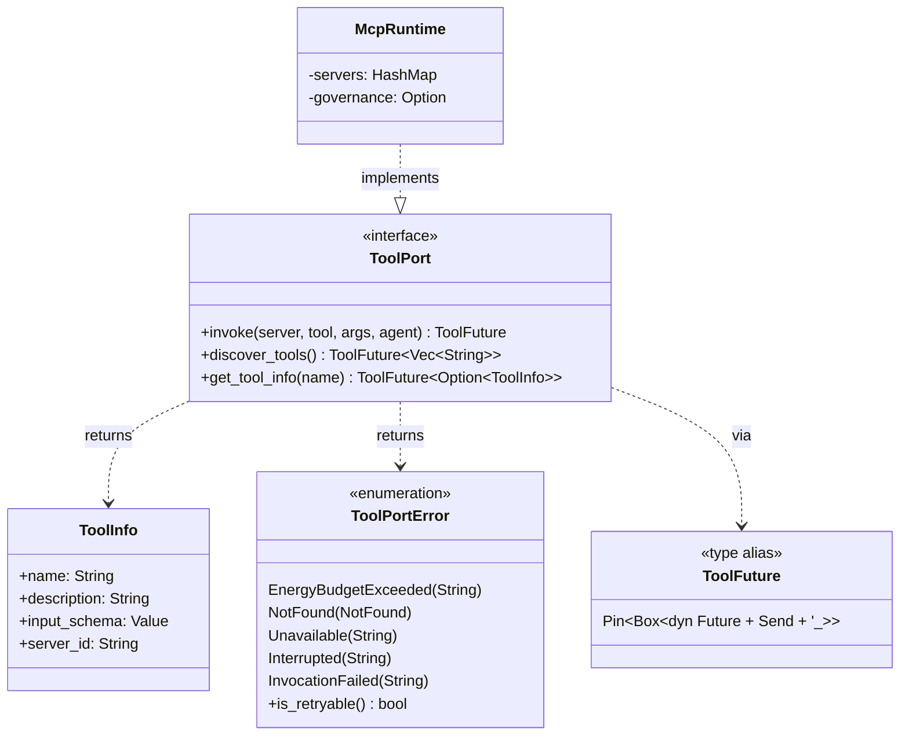
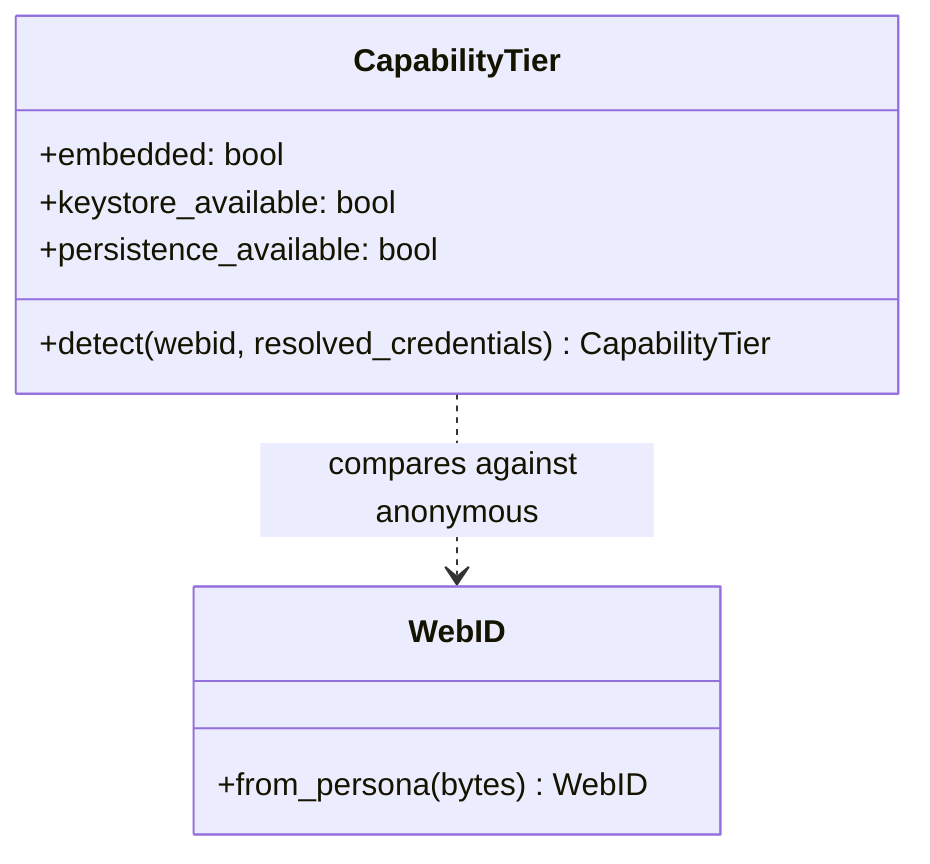

# hkask-tool-port — Reference

`hkask-tool-port` defines the tool dispatch port: the `ToolPort` trait, its
`ToolInfo` metadata, the `ToolFuture` alias, and the `ToolPortError` taxonomy.
That is the entire surface. It contains **no capability tokens, no per-call
authorization check, and no information-flow labels**. Tool authority is
enforced outside this crate, at the allowlist boundaries listed under
[Where authority is enforced](#where-authority-is-enforced).

## Source citations

| Symbol                       | Location                                                                                       |
| ---------------------------- | ---------------------------------------------------------------------------------------------- |
| `ToolPort` trait             | `kask/crates/hkask-tool-port/src/tool_port.rs:89-115`                                         |
| `ToolPortError` enum         | `kask/crates/hkask-tool-port/src/tool_port.rs:8-38`                                           |
| `ToolPortError::is_retryable`| `kask/crates/hkask-tool-port/src/tool_port.rs:49-53`                                          |
| `ToolFuture` type alias      | `kask/crates/hkask-tool-port/src/tool_port.rs:62`                                             |
| `ToolInfo` struct            | `kask/crates/hkask-tool-port/src/tool_port.rs:118-123`                                        |
| Crate lib root               | `kask/crates/hkask-tool-port/src/hkask_tool_port.rs:1-23`                                     |
| `ToolPort` implementor      | `kask/crates/hkask-mcp/src/runtime.rs:1286` (`impl hkask_tool_port::ToolPort for McpRuntime`) |
| `McpRuntime::invoke` body    | `kask/crates/hkask-mcp/src/runtime.rs:1286-1400`                                               |
| `McpRuntime::with_governance`| `kask/crates/hkask-mcp/src/runtime.rs:432`                                                     |
| `CallMeterOutcome` enum      | `kask/crates/hkask-regulation/src/energy.rs:30-40`                                             |
| `CallCapManager::charge_metered` | `kask/crates/hkask-regulation/src/energy.rs:176`                                           |
| `DEFAULT_RUNAWAY_CALL_CEILING` | `kask/crates/hkask-regulation/src/energy.rs:26`                                              |
| `CyberneticsLoop::charge_call_metered` | `kask/crates/hkask-regulation/src/cybernetics_loop.rs:662`                          |
| Per-request `tool_allowlist` gate | `kask/crates/kask_bridge/src/inference_ipc_server.rs:813-831`                              |
| Per-agent `mcp_tools` allowlist | `kask/mcp-servers/hkask-mcp-swarm/src/agent_executor.rs:214-219,431-437`                    |
| Per-server credential allowlist | `kask/crates/kask_bridge/src/mcp_servers.rs:43` (`BuiltinMcpServer.credentials`)         |
| `CapabilityTier::detect`     | `kask/crates/hkask-mcp-server/src/server/context.rs:91`                                        |

The crate's `src/` directory holds exactly two files: `hkask_tool_port.rs`
(lib root) and `tool_port.rs`.

## Type surface



<!-- DIAGRAM_ALIGNMENT
id: DIAG-CAP-002
verified_date: 2026-08-28
verified_against: kask/crates/hkask-tool-port/src/tool_port.rs:62,89-123; kask/crates/hkask-tool-port/src/tool_port.rs:8-53; kask/crates/hkask-mcp/src/runtime.rs:1286
status: VERIFIED
-->

## `ToolPort` trait

`ToolPort` is the dispatch boundary for MCP tool invocation. Every method
returns `ToolFuture` (`Pin<Box<dyn Future + Send + '_>>`), so the trait is
object-safe and `Arc<dyn ToolPort>` works — this is why no adapter layer wraps
`McpRuntime` any more (`tool_port.rs:84-88`).

| Method            | Signature                                                                                     |
| ------------------ | --------------------------------------------------------------------------------------------- |
| `invoke`          | `(&self, server: &str, tool: &str, args: Value, agent: WebID) -> Result<Value, ToolPortError>` |
| `discover_tools`  | `(&self) -> Vec<String>`                                                                       |
| `get_tool_info`   | `(&self, tool_name: &str) -> Option<ToolInfo>`                                                 |

`agent` is the accounting identity for the call meter (`tool_port.rs:90-95`).
`discover_tools` and `get_tool_info` take no identity at all, because tool
schemas are public per the MCP protocol design (`tools/list` is an
unauthenticated handshake, `tool_port.rs:107-111`).

## `ToolPortError` taxonomy

Five variants and one predicate, `is_retryable`, which is true only for
`Unavailable` — the call provably never reached the tool, so a retry cannot
duplicate a side effect (`tool_port.rs:49-53`).

| Variant                  | Meaning                                                                                       | Retryable |
| ------------------------ | --------------------------------------------------------------------------------------------- | --------- |
| `EnergyBudgetExceeded`   | The runaway-loop breaker tripped: the agent exhausted its per-tick call ceiling.             | No — needs a new regulation tick |
| `NotFound`               | The tool is not registered.                                                                    | No — would fail identically |
| `Unavailable`            | No live connection accepted the request; the tool provably never ran.                         | **Yes** |
| `Interrupted`            | A live peer accepted the request and the connection then dropped. The outcome is unknown.   | No — a retry could duplicate a side effect |
| `InvocationFailed`       | The call reached the tool and the tool failed.                                                | No — repeats the failure |

The `Unavailable` / `Interrupted` split is forced by `rmcp`, which reports both
a failed send and a dropped response channel as the same
`ServiceError::TransportClosed` (`tool_port.rs:26-33`). Once a request has
reached a live peer, a transport loss cannot be read as proof of
non-delivery, so `Interrupted` is never auto-retried at any layer.

## `ToolInfo` struct

Canonical tool metadata (`tool_port.rs:118-123`). Four descriptive fields,
nothing that decides anything:

```rust
pub struct ToolInfo {
    pub name: String,
    pub description: String,
    pub input_schema: serde_json::Value,
    pub server_id: String,
}
```

`server_id` is how the MCP runtime's tool dispatch resolves which server
to dispatch to.

## What `invoke` does

`McpRuntime::invoke` (`runtime.rs:1286-1400`) performs, in order:

1. **Call metering** — when governance is wired (`with_governance`,
   `runtime.rs:432`), charge one call against the agent's per-tick ceiling
   via `CyberneticsLoop::charge_call_metered`
   (`cybernetics_loop.rs:662`), which delegates to
   `CallCapManager::charge_metered` (`energy.rs:176`). Without governance,
   dispatch unmetered (`runtime.rs:1299-1301`).
2. **Dispatch** — `call_tool_inner` (`runtime.rs:1349`) checks for a live
   connection, reconnects once if the transport closed, and issues the
   JSON-RPC call.
3. **Span emission** — persist a `SpanKind::ToolCompleted`
   `RegulationRecord` at `CyclePhase::Act` carrying server, tool, call
   count, and success/failure status, through the wired `RegulationSink`
   (`runtime.rs:1351-1358`), then record the outcome in the
   `RegulationLedger` per-server so the `ToolReliabilitySensor` can sense
   aggregate success rates (`runtime.rs:1360-1366`).

There is no authorization step. The only way `invoke` returns an error
before dispatch is `EnergyBudgetExceeded` (`runtime.rs:1337-1345`).

## Call metering

The meter is a runaway-loop breaker and a usage recorder, not a permission
check. `CallCapManager::charge_metered` (`energy.rs:176`) returns a
`CallMeterOutcome` (`energy.rs:30-40`):

| Outcome                        | Behavior                                                                                    |
| ------------------------------ | ------------------------------------------------------------------------------------------- |
| `Charged` (`energy.rs:32`)     | Headroom remained; the call proceeds.                                                       |
| `AutoRegistered` (`energy.rs:37`) | The agent had no registered ceiling: register at `DEFAULT_RUNAWAY_CALL_CEILING` (10 000, `energy.rs:26`), charge, proceed, and log the wiring gap. |
| `CeilingReached { ceiling }` (`energy.rs:40`) | The per-tick ceiling is exhausted: refuse with `ToolPortError::EnergyBudgetExceeded`. Resets on the next regulation tick. |

Fail-open on an unregistered agent is deliberate: a missing registration is a
composition-root wiring omission, and refusing it fails live paths without
protecting anything (`runtime.rs:1311-1317` records the incident: the
`kask-panel` and skill execution personas were never seeded, so every IPC
and cascade tool call died at the gate).

## Where authority is enforced

A capability check is only a gate when the authority list is not chosen by the
caller being checked. Three boundaries satisfy that:

| Boundary                                                        | Location                                                       | Note                                        |
| --------------------------------------------------------------- | -------------------------------------------------------------- | ------------------------------------------- |
| Per-request delegated-tool `tool_allowlist` (fail-closed on missing/empty) | `kask/crates/kask_bridge/src/inference_ipc_server.rs:813-831` `tool_invoke` dispatch | Enforced before dispatch; pinned by `dispatch_tool_invoke_rejects_unallowed_tool` (`inference_ipc_server.rs:1359`) |
| Per-agent declared `mcp_tools` allowlist                        | `kask/mcp-servers/hkask-mcp-swarm/src/agent_executor.rs:214-219` | Restricts which tools a swarm agent may call; refusal at `agent_executor.rs:431-437` |
| Per-server MCP env / credential allowlists                      | `kask/crates/kask_bridge/src/mcp_servers.rs:43`              | Scopes credentials per server (`BuiltinMcpServer.credentials`; `None` means no filtering, `Some(&[])` preferred for new servers) |

There is no fourth gate. A FIDES `Source`→`Sink` information-flow check used
to be listed here; it was deleted — see
[Information flow](#information-flow-absent-by-decision).

## Information flow: absent by decision

Nothing in this crate or on the invoke path inspects information flow. Defense
**Layer 5 (information flow control) is absent by decision**, recorded in the
same register as Layer 3 (instruction hierarchy): de-advertised rather than
deployed.

The FIDES lattice labelled each tool `Source` / `Sink` / `Pure` / `Endorser`
and blocked `Source → Sink`. It was deleted rather than repaired because the
gate consuming it could not decide anything: every `ToolInfo` was labelled
`Pure` at its only construction site, so the `Sink` arm never matched
(`hkask_tool_port.rs:17-19`). An inert gate is worse than no gate — it invites
reliance on a protection that does not exist.

The machinery must not be re-added in inert form. The bar a real IFC gate must
clear: tools carrying real labels, taint propagated on context write, and a
test showing a `Source → Sink` flow being refused.

## CapabilityTier (sibling crate)

`CapabilityTier` lives in the sibling `hkask-mcp-server` crate, not here. It
is the per-server startup probe (`context.rs:67`) that distinguishes
**embedded** mode (launched by the hKask runtime, non-anonymous WebID,
keystore reachable, persistence available) from **standalone** mode
(anonymous WebID, keystore may be unavailable, persistence unavailable).
Detection (`context.rs:91`) compares the resolved WebID against the anonymous
persona (`WebID::from_persona(b"anonymous")`, `context.rs:95`) — not the
credential map, because `HKASK_WEBID` is an identity injected via
`config_env`, not a credential.



<!-- DIAGRAM_ALIGNMENT
id: DIAG-CAP-003
verified_date: 2026-08-28
verified_against: kask/crates/hkask-mcp-server/src/server/context.rs:67,91,95
status: VERIFIED
-->

## See also

- [hkask-tool-port Explanation](./explanation.md): why per-call gating was
  removed and separation kept.
- [hkask-tool-port Tutorial](./tutorial.md): dispatching through the seam.
- [`kask/docs/architecture/core/PRINCIPLES.md`](../../architecture/core/PRINCIPLES.md):
  P4 (Clear Boundaries).

---

[^fides-cap]: Microsoft Research. (2025). _FIDES: Information flow control for LLM agents_ (arXiv:2505.23643). The Source/Sink/Pure/Endorser lattice and the Source→Sink endorsement rule. Retained as the academic source for a design this crate no longer implements — the lattice was deleted. Citing it is not a claim that information flow control is deployed.

[^miller-ocap]: Miller, M. S. (2006). _Robust Composition: Towards a Unified Approach to Access Control and Concurrency Control._ Johns Hopkins University. <https://www.erights.org/talks/thesis/markm-thesis.pdf>. The Object Capability model, retained here as the source of the principle that authority must be *separated* by a list the caller cannot choose.
