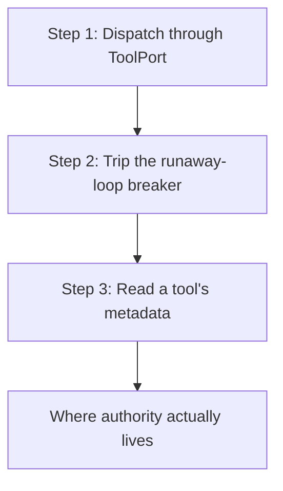

# hkask-tool-port — Tutorial: Dispatch a Tool Through the ToolPort Seam

This tutorial walks through the three things the `hkask-tool-port` crate
actually lets you do: dispatch a tool through the `ToolPort` seam, trip the
runaway-loop breaker, and read a tool's metadata. You will learn what `invoke`
*does* — it meters and dispatches — and what it deliberately does *not* do:
authorize. Authority is enforced outside this crate, at allowlist boundaries
the caller cannot choose.

The crate is small on purpose. It contains one trait (`ToolPort`), one error
enum (`ToolPortError`), one metadata struct (`ToolInfo`), and one type alias
(`ToolFuture`) — the entire crate is two source files
(`hkask_tool_port.rs`, `tool_port.rs`). There are no capability tokens in
this crate and no per-call authorization argument on `invoke`.

## Learning path



<!-- DIAGRAM_ALIGNMENT
id: DIAG-CAP-001
verified_date: 2026-08-28
verified_against: kask/crates/hkask-tool-port/src/tool_port.rs:89-115 (ToolPort trait); kask/crates/hkask-tool-port/src/tool_port.rs:8-38 (ToolPortError); kask/crates/hkask-mcp/src/runtime.rs:1286 (impl ToolPort for McpRuntime)
status: VERIFIED
-->

## Step 1: Dispatch through `ToolPort`

`McpRuntime` implements `ToolPort` directly (`kask/crates/hkask-mcp/src/runtime.rs:1286`)
— there is no adapter layer between them. Build a runtime
(`McpRuntime::new()` at `runtime.rs:409`), register a server so the runtime
has tool metadata (`register_server` at `runtime.rs:473`), and invoke:

```rust
use hkask_tool_port::ToolPort;
use hkask_mcp::{McpRuntime, McpServer, McpTool};

let runtime = McpRuntime::new();
runtime
    .register_server(McpServer {
        id: "test-server".to_string(),
        name: "test-server".to_string(),
        tools: vec![McpTool {
            name: "test_tool".to_string(),
            description: "test tool".to_string(),
            input_schema: serde_json::json!({"type": "object", "properties": {}}),
            server_id: "test-server".to_string(),
        }],
    })
    .await;

let agent = hkask_types::WebID::from_persona(b"my-agent");
let result = runtime
    .invoke("test-server", "test_tool", serde_json::json!({}), agent)
    .await;
```

The struct field shapes above are pinned at `runtime.rs:224-243` (`McpTool`,
`McpServer`). The fourth argument, `agent`, is an **accounting identity**: it
names who to charge and attribute the call to. It is not a credential, and
`invoke` does not check it against a permission list (`tool_port.rs:90-95`).
A `McpRuntime::new()` with no governance wired dispatches unmetered rather
than refusing — metering is accounting, not authorization
(`runtime.rs:1275-1277`).

## Step 2: Trip the runaway-loop breaker

Wire governance and register a deliberately tiny per-tick ceiling. The second
call exhausts it:

```rust
use hkask_regulation::CyberneticsLoop;
use std::sync::Arc;
use tokio::sync::RwLock;

let cybernetics = Arc::new(RwLock::new(CyberneticsLoop::new(...)));
cybernetics.read().await.register_call_cap(agent, 1).await;

let runtime = McpRuntime::new().with_governance(cybernetics, sink);
// …register_server as above…

// First call fits the ceiling of 1. The second is refused:
// Err(ToolPortError::EnergyBudgetExceeded(_))
```

This is the **only** pre-dispatch refusal on the invoke path
(`runtime.rs:1337-1345`), and it is a loop breaker, not a permission check: a
non-terminating tool loop that burns its whole per-tick ceiling is stopped,
and the cap resets on the next regulation tick. An agent the composition
root never registered is **not** refused — it is auto-registered at
`hkask_regulation::DEFAULT_RUNAWAY_CALL_CEILING` (10 000,
`energy.rs:26`) and the wiring gap is logged (`runtime.rs:1318-1326`),
because a missing seed is a wiring omission rather than an authorization
decision.

Both behaviors are pinned by tests inside `kask/crates/hkask-mcp/src/runtime.rs`:
`unregistered_agent_is_auto_registered_not_denied` (`runtime.rs:2042`) and
`exhausted_ceiling_trips_the_runaway_breaker` (`runtime.rs:2088`).

## Step 3: Read a tool's metadata

`get_tool_info` returns a `ToolInfo` — four descriptive fields and nothing
that decides anything:

```rust
use hkask_tool_port::ToolPort;

let info = runtime.get_tool_info("test_tool").await.expect("registered above");
assert_eq!(info.name, "test_tool");
assert_eq!(info.server_id, "test-server");
// Also: info.description, info.input_schema.
```

`server_id` is what callers need in practice: it is how the MCP runtime's
tool dispatch resolves which server to dispatch to. `get_tool_info` takes no
identity, because tool schemas are public per the MCP protocol design —
`tools/list` is an unauthenticated handshake (`tool_port.rs:107-111`).

## Where authority actually lives

Nothing in this tutorial authorized anything. Capability *separation* — which
tools an agent may reach at all — is enforced at three boundaries whose
contents the caller being checked does not choose:

1. The per-request `tool_allowlist` on the inference IPC `tool_invoke`
   dispatch (`kask/crates/kask_bridge/src/inference_ipc_server.rs:813-831`),
   fail-closed on a missing or empty allowlist. Pinned by
   `dispatch_tool_invoke_rejects_unallowed_tool`
   (`inference_ipc_server.rs:1359`).
2. Each swarm agent card's declared `mcp_tools` allowlist
   (`kask/mcp-servers/hkask-mcp-swarm/src/agent_executor.rs:214-219`), which
   refuses out-of-set calls with "not in declared mcp_tools allowlist"
   (`agent_executor.rs:431-437`).
3. The per-server MCP env/credential allowlists
   (`kask/crates/kask_bridge/src/mcp_servers.rs:43` —
   `BuiltinMcpServer.credentials`).

## See also

- [hkask-tool-port Reference](./reference.md): the current type surfaces and
  the invoke pipeline.
- [hkask-tool-port Explanation](./explanation.md): why the per-call gate was
  removed and what separation still buys.
- [hkask-types Reference](../hkask-types/reference.md): `WebID` and the shared
  error types `ToolPortError` wraps.

---

[^miller-ocap]: Miller, M. S. (2006). *Robust Composition: Towards a Unified Approach to Access Control and Concurrency Control.* Johns Hopkins University. <https://www.erights.org/talks/thesis/markm-thesis.pdf>. The Object Capability principle that authority must be separated by a list the caller cannot choose — the design this tutorial's "where authority lives" section demonstrates.
