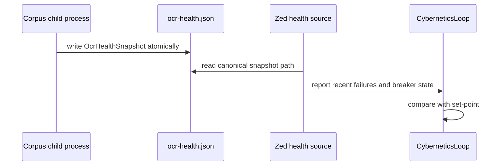
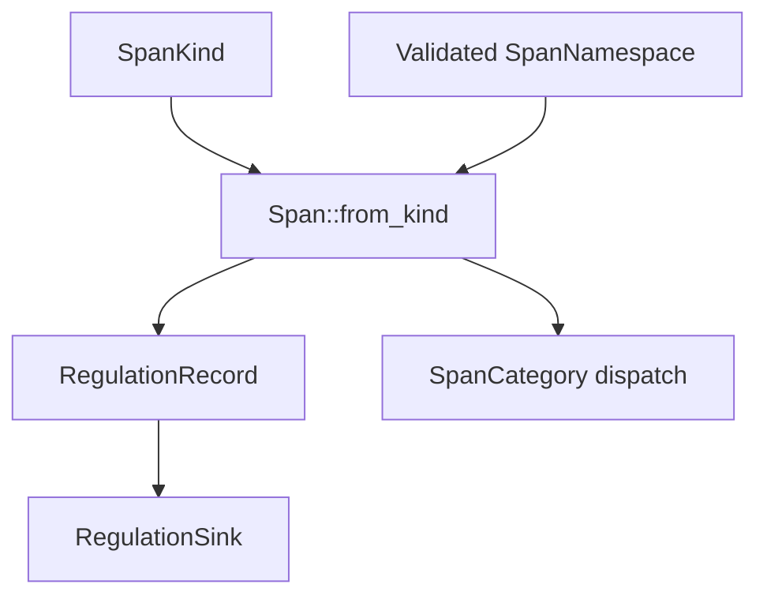

# hkask-types — Explanation

`hkask-types` owns the contracts that cross kask crate and process boundaries. It
keeps domain crates independent of Zed internals, storage implementations, and the
tool-port crate that already depends on these foundation types. This is the ports
and adapters pattern: consumers depend on stable contracts, while the composition
root supplies implementations.[^cockburn]

The crate forbids unsafe code and declares its complete module surface at
`kask/crates/hkask-types/src/hkask_types.rs:1-44`. Common cross-crate items and all
ports are re-exported at `kask/crates/hkask-types/src/hkask_types.rs:46-66`.

## Why boundaries are split by failure domain

The crate does not place every shared value in one undifferentiated module. Each
boundary has a contract shaped by how drift or failure would appear:

- `ports` defines object-safe inference, tool-dispatch, worktree-spawn, memory,
  embedding-error, and consolidation contracts
  (`kask/crates/hkask-types/src/ports.rs:7-23`).
- `event` and `regulation` define the typed observability substrate
  (`kask/crates/hkask-types/src/event.rs:14-28,298-327,399-511,536-552`;
  `kask/crates/hkask-types/src/regulation.rs:29-120`).
- `inference_ipc` defines the newline-delimited request/response protocol used by
  MCP child processes (`kask/crates/hkask-types/src/inference_ipc.rs:1-47,53-120,122-237`).
- `agent_paths` centralizes internal-data and user-artifact path resolution
  (`kask/crates/hkask-types/src/agent_paths.rs:12-26,63-154`).
- `media_limits`, `ocr_health`, `server_env`, and `process_global` encode shared
  resource, cross-process health, child-environment, and hook-slot invariants
  (`kask/crates/hkask-types/src/media_limits.rs:1-24`;
  `kask/crates/hkask-types/src/ocr_health.rs:1-71`;
  `kask/crates/hkask-types/src/server_env.rs:1-59`;
  `kask/crates/hkask-types/src/process_global.rs:1-77`).

A boundary type belongs here when several crates must agree on its wire shape or
invariant without importing one another's implementation.

## Why media limits reject instead of truncate

`media_limits` centralizes admission caps shared by media-facing callers. Its
contract requires callers to reject zero or over-cap work rather than silently
clamp or truncate it (`kask/crates/hkask-types/src/media_limits.rs:1-24`). Silent
truncation would turn a user request into a different request while still reporting
success; a shared constant makes the limit observable and consistent.

## Why OCR health is a file contract

The corpus MCP server is a child process, so its in-memory tracing does not enter
the host's Regulation ledger directly. `OcrHealthSnapshot` carries bounded silent-
failure timestamps, breaker state, and update time; `ocr_health_path()` resolves
one canonical shared file
(`kask/crates/hkask-types/src/ocr_health.rs:11-71`). The writer can update the file
atomically and the Zed-side reader can sense it on a Regulation tick without either
process depending on the other's implementation.

<!-- DIAGRAM_ALIGNMENT
id: DIAG-TYPES-008
verified_date: 2026-09-15
verified_against: kask/crates/hkask-types/src/ocr_health.rs:1-71; kask/crates/hkask-regulation/src/sensor_provider.rs:739-806
status: VERIFIED
-->

## Why `ServerEnv` and `ProcessGlobal` are types

`ServerEnv` makes the canonical MCP child-environment path visible in function
signatures. It wraps the composed map and exposes read/consume access, while its
documented construction path is `build_mcp_server_env`
(`kask/crates/hkask-types/src/server_env.rs:1-59`). This does not make canonical
construction type-system-private—the constructor crosses crates—but it makes a raw
map at a spawn boundary reviewable as a bypass.

`ProcessGlobal<T>` is the reusable re-settable hook slot. It stores
`Mutex<Option<T>>`, replaces or clears values through `set`, returns an owned clone
through `get`, and recovers poisoned locks
(`kask/crates/hkask-types/src/process_global.rs:35-77`). Clone-out-of-lock prevents
a caller from retaining the mutex across an await. This type is not for set-once
`OnceLock` startup hooks.

## Why the event substrate is shared

`RegulationRecord` is the audit event carried across loops and stores. `Span`
combines a validated `SpanNamespace` with a path; `SpanKind` supplies canonical
frequently-used pairs; `SpanCategory` supplies a typed dispatch classification;
`CyclePhase` identifies sense, compute, compare, or act
(`kask/crates/hkask-types/src/event.rs:14-28,298-358,399-511`).
`RegulationSink` is the persistence port at
`kask/crates/hkask-types/src/event.rs:536-552`.

<!-- DIAGRAM_ALIGNMENT
id: DIAG-TYPES-009
verified_date: 2026-09-15
verified_against: kask/crates/hkask-types/src/event.rs:14-28,59-75,280-358,399-511,536-552
status: VERIFIED
-->

The canonical namespace registry is private at
`kask/crates/hkask-types/src/event.rs:67-139`; construction validates names before
they become spans. The event surface includes inference circuit transition and
observed-recovery kinds at `kask/crates/hkask-types/src/event.rs:446-499`.

## Why IPC uses one request and one response envelope

`InferenceRequest` pairs a correlation ID, `InferenceMethod`, and
`InferenceParams`; `InferenceResponse` pairs the same ID with an untagged
`InferenceOutcome`
(`kask/crates/hkask-types/src/inference_ipc.rs:75-120,122-237`). Current methods
cover generation, messages, vision, embedding, model listing, governed tool
invocation, worktree-thread creation, and reranking. Current outcomes cover a
generation result, embeddings, model list, tool result, worktree thread, rerank
scores, or a typed error.

The protocol uses no separate batch envelope. Embedding already carries multiple
input texts in `InferenceParams::embed_texts`
(`kask/crates/hkask-types/src/inference_ipc.rs:131-135`), while each IPC envelope
retains one correlation identity.

## See also

- [How to extend a foundation boundary](./how-to.md)
- [hkask-types reference](./reference.md)
- [Architecture principles](../../architecture/core/PRINCIPLES.md)

---

[^cockburn]: Cockburn, A. (2005). *Hexagonal Architecture.* <https://alistair.cockburn.us/hexagonal-architecture/>.
