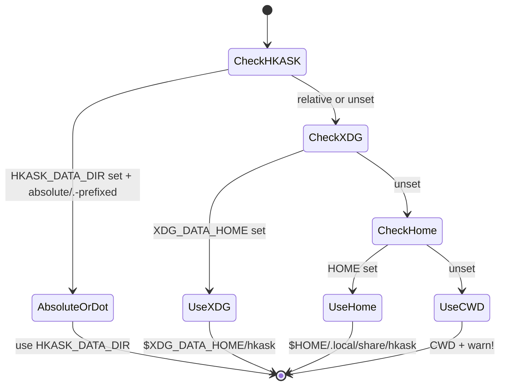

# hkask-types — Explanation

`hkask-types` exists to solve a boundary problem. hKask is compiled in-process
inside zed-kask, but the kask crates must not depend on zed's internal types,
on concrete storage backends, or on `hkask-capability` (which would create a
dependency cycle). The foundation crate defines the contracts that mediate
between these worlds: kask crates depend on abstractions, and `kask_bridge`,
`hkask-storage`, and `hkask-regulation` provide the
adapters. This is the hexagonal architecture pattern applied at the crate
boundary.[^cockburn]

## Source citations

| Symbol | Location |
|--------|----------|
| Crate root, `forbid(unsafe_code)`, module list | `kask/crates/hkask-types/src/hkask_types.rs:1,6` |
| `pub use ports::*` re-export | `kask/crates/hkask-types/src/hkask_types.rs:66` |
| Cycle-prevention note (`must NOT depend on hkask-capability`) | `kask/crates/hkask-types/Cargo.toml:13` |
| `resolve_data_dir` (single regulator) | `kask/crates/hkask-types/src/agent_paths.rs:62` |
| `resolve_under_data_dir` (delegates to regulator) | `kask/crates/hkask-types/src/agent_paths.rs:98` |
| `agent_db` (renamed from `agent_pod_db`) | `kask/crates/hkask-types/src/agent_paths.rs:146` |
| `sanitize_name` (path-traversal guard) | `kask/crates/hkask-types/src/agent_paths.rs:180` |
| `InferencePort` trait | `kask/crates/hkask-types/src/ports/inference_port.rs:212` |
| `MemoryPort` trait | `kask/crates/hkask-types/src/ports/memory_port.rs:113` |
| `RegulationSink` trait | `kask/crates/hkask-types/src/event.rs:839` |
| `ObservableSpan` trait | `kask/crates/hkask-types/src/observable_span.rs:55` |
| `SpanNamespace` (validated namespace) | `kask/crates/hkask-types/src/event.rs:101` |
| `CANONICAL_NAMESPACES` (single source of truth) | `kask/crates/hkask-types/src/event.rs:111` |
| `Id<T: IdKind>` sealed-marker pattern | `kask/crates/hkask-types/src/id/core.rs:13,20` |
| `WebID::for_agent_name` (canonical derivation) | `kask/crates/hkask-types/src/id/webid.rs:42` |
| `InfrastructureError` (no catch-all variant) | `kask/crates/hkask-types/src/error.rs:117` |
| `McpErrorKind::is_retryable` / `requires_intervention` | `kask/crates/hkask-types/src/error.rs:261,272` |
| `AnyJsonValue` (Ollama/Gemini strict-schema fix) | `kask/crates/hkask-types/src/tool_schema.rs:47` |

## Why the foundation crate is structured this way

The kask workspace compiles as a set of library crates. These crates need to
call LLM APIs, persist turns to memory, invoke tools, emit Regulation events,
and resolve per-agent storage paths. If the kask crates depended directly on
zed's `LanguageModel` or `ThreadMemoryPort`, the kask workspace would become
unbuildable outside zed-kask, and every zed internal change would break kask.
If they depended directly on `rusqlite` or `ed25519_dalek`, every transitive
consumer would inherit heavy native deps.

`hkask-types` breaks this coupling three ways:

1. **Port traits** (`ports/`) define *what* an infrastructure backend does
   without naming a backend. `InferencePort` (`inference_port.rs:212`) defines
   generation, streaming, embedding, and media. `MemoryPort`
   (`memory_port.rs:113`) defines turn ingestion and snippet recall. The kask
   crates depend on these traits; `kask_bridge` provides the concrete
   adapters that implement them against zed's types.
2. **Value types** (`crypto.rs`, `error.rs`, `visibility.rs`, `document.rs`,
   `corpus.rs`, `hmem_ontology.rs`) carry domain semantics with zero heavy
   deps. `Ed25519PublicKey` (`crypto.rs:14`) is a 32-byte newtype with no
   crypto library — conversion to/from `ed25519_dalek` lives in
   `hkask-keystore` where the crypto dep exists. `InfrastructureError`
   (`error.rs:117`) is `Clone + PartialEq + Eq + Serialize + Deserialize` so
   it can cross crate boundaries without dragging `rusqlite` (the `From<rusqlite::Error>` impl is behind the opt-in `sql` feature at `error.rs:202`).
3. **Path helpers** (`agent_paths.rs`) centralize the data-dir fallback chain
   in one regulator (`resolve_data_dir` at `agent_paths.rs:62`) so the four
   class directories (`agents/`, `mcp/`, `skills/`, `threads/`) cannot drift
   apart across helpers.

The crate forbids `unsafe` code (`hkask_types.rs:1`) and must not depend on
`hkask-capability` (`Cargo.toml:13`) — that would create a cycle, since
capability types need the foundation identifiers. Methods that need capability
tokens live as free functions or extension traits in crates that have the
capability dep.

## The single-regulator principle for paths

`resolve_data_dir` is the single regulator for the data-dir fallback chain:
`HKASK_DATA_DIR` (honored only when absolute or `.`-prefixed — a relative
value is treated as misconfig and falls through) → `$XDG_DATA_HOME/hkask` →
`$HOME/.local/share/hkask` → CWD with a `warn!`. `resolve_under_data_dir`
(`agent_paths.rs:98`) delegates to it rather than duplicating the chain. This
is a direct fix for F4: the two helpers previously duplicated the chain but
disagreed on whether to honor a relative `HKASK_DATA_DIR`, which could split
agent DBs across two trees.



<!-- DIAGRAM_ALIGNMENT
id: DIAG-TYPES-008
verified_date: 2026-08-13
verified_against: kask/crates/hkask-types/src/agent_paths.rs:62-88,98-100
status: VERIFIED
-->

`sanitize_name` (`agent_paths.rs:180`) is the path-traversal guard every
user-controlled path segment passes through. It replaces `/ \ : * ? " < > | ( )` and space with hyphens, collapses consecutive dashes, trims leading/trailing
dashes, and substitutes `"unnamed"` for names that sanitize to `.` or `..`.
`agent_db` (`agent_paths.rs:146`) produces `{name}.db` (e.g.
`agents/curator/curator.db`), not `pod.db` — the "pod" concept was deprecated
and the helper renamed.

## Why port traits use `Pin<Box<dyn Future>>` instead of `async_trait`

The `InferencePort` trait (`inference_port.rs:212`) returns
`Pin<Box<dyn Future<Output = ...> + Send + 'a>>` from every async method
rather than using the `async_trait` macro. The trait-level comment at
`inference_port.rs:65` states this is a deliberate object-safety choice:
`async_trait` desugars to `Pin<Box<dyn Future>>` anyway, but declaring it
explicitly keeps the trait object-safe without a macro dependency and lets
callers hold `Arc<dyn InferencePort>` directly. The blanket impl for
`Arc<dyn InferencePort>` at `inference_port.rs:441` delegates every method to
`self.as_ref()`, so consumers can hold a shared handle without paying for the
indirection at every call site.

When a return type grows complex, the crate extracts a named future alias —
`EmbedFuture` (`inference_port.rs:19`), `MediaFuture` (`inference_port.rs:26`),
`MemoryFuture` (`memory_port.rs:101`) — to stay under clippy's
`type_complexity` threshold. This is the established pattern for any new port
trait with a non-trivial async return.

## Why the Regulation event substrate is a shared observability layer

`RegulationRecord` (`event.rs:16`) is the cybernetic audit trail emitted by
all loops. It is not owned by any single loop — it is the shared observability
substrate that the Regulation loop senses and the Curator audits. The
`SpanNamespace` (`event.rs:101`) is constructed via `SpanNamespace::new()`
which validates against `CANONICAL_NAMESPACES` (`event.rs:111`), the single
source of truth for canonical Regulation spans. The `reg.*` prefix is
reserved: every `reg.*` tracing target MUST be registered. Performative
telemetry uses `hkask.*` targets (per PRINCIPLES §9.1); `SpanNamespace::new`
rejects them — they are observability logs, not loop variables.

`ObservableSpan` (`observable_span.rs:55`) is the trait typed span enums
implement to bridge into the validated namespace construction path. It offers
three emission paths: `emit()` (log-only), `emit_to(sink, ...)` (persist +
log, the primary path), and `to_event(...)` (produce a record without
persisting, for batching). This decouples domain span enums from the
monolithic `RegulationSpan` (`regulation.rs:108`) while keeping the canonical
namespace set as the single validator.

```mermaid
sequenceDiagram
    participant Loop as Regulation Loop
    participant Span as typed span enum
    participant Obs as ObservableSpan trait
    participant NS as SpanNamespace
    participant Sink as RegulationSink
    participant Archive as RegulationArchive

    Loop->>Span: construct variant
    Span->>Obs: as_str() → "reg.tool.web_search"
    Obs->>NS: SpanNamespace::parse(str)
    NS->>NS: validate against CANONICAL_NAMESPACES
    alt canonical
        NS-->>Obs: Some(SpanNamespace)
        Obs->>Obs: to_event(operation, observer, phase, observation)
        Obs->>Sink: persist(RegulationRecord)
        Sink->>Archive: write record
        Archive-->>Sink: Ok
        Obs->>Obs: emit(operation) — tracing log
    else non-canonical
        NS-->>Obs: None
        Obs->>Obs: emit(operation) — log-only fallback
    end
```

<!-- DIAGRAM_ALIGNMENT
id: DIAG-TYPES-009
verified_date: 2026-08-13
verified_against: kask/crates/hkask-types/src/observable_span.rs:55,67,81,104; kask/crates/hkask-types/src/event.rs:101,111,839; kask/crates/hkask-types/src/regulation.rs:108
status: VERIFIED
-->

## Why identifiers are a sealed phantom-generic newtype

`Id<T: IdKind>` (`id/core.rs:20`) wraps a `Uuid` with a phantom `T` marker.
The `IdKind` trait (`id/core.rs:13`) is sealed by a private `Sealed`
supertrait, so external crates cannot introduce new kinds. Each domain entity
gets a strongly typed alias (`TemplateID`, `BotID`, `HMemId`, `EventID`,
`GoalID`, `TaskId`, `PodID`, etc. — `id/core.rs:191-204`). This prevents
identifier confusion at compile time: you cannot pass a `BotID` where a
`TemplateID` is expected, even though both wrap a `Uuid`.

`WebID` (`id/webid.rs:9`) is the agent identifier. `for_agent_name`
(`id/webid.rs:42`) is the canonical agent-name → WebID derivation used across
CLI, API, REPL, and `AgentService` — it delegates to `from_persona`
(`id/webid.rs:58`), a UUID v5 derivation with a fixed namespace. Same agent
name → same WebID, deterministically. `redacted_display` (`id/webid.rs:96`)
shows only the first 8 hex chars for INFO-level logging, preventing full UUID
leakage in logs. `From<BotID> for WebID` (`id/webid.rs:121`) bridges the two
identifier types without re-deriving.

## Why the error taxonomy has no catch-all

`InfrastructureError` (`error.rs:117`) is `#[non_exhaustive]` and has no
`Other(String)` or `Internal(String)` variant — every variant is a distinct
recovery category (C5 design constraint). This forces downstream code to
pattern-match on the actual failure mode rather than collapsing everything
into a string. `McpErrorKind` (`error.rs:231`) follows the same discipline:
`is_retryable` (`error.rs:261`) returns true only for `Unavailable`,
`Timeout`, `RateLimited`; `requires_intervention` (`error.rs:272`) returns
true only for `PermissionDenied`, `FailedPrecondition`. These predicates let
the Regulation loop make automated retry vs. human-escalation decisions
without re-parsing error strings.

`DbError` (`error.rs:57`) was moved here from `hkask-database::types` to
break the storage/wallet-types/database circular dependency. It is a pure type
with no external deps beyond `thiserror` + `serde`, both already in
`hkask-types`. The `From<rusqlite::Error>` impl is behind the opt-in `sql`
feature (`error.rs:202`) so downstream crates without `rusqlite` can still
construct `InfrastructureError::database(String)` via the `database`
constructor (`error.rs:139`).

## Why `AnyJsonValue` exists

`schemars`'s `impl JsonSchema for serde_json::Value` returns the bare boolean
`true` (valid JSON Schema meaning "accept any value"). Ollama's Go API decodes
each tool's `parameters.properties` as `map[string]api.ToolProperty` — a
struct — and rejects boolean schemas with `400 cannot unmarshal bool into ...
of type api.ToolProperty`. Google Gemini's protobuf `Schema` has the same
class of failure. One `serde_json::Value`-typed field in any enabled tool's
schema makes Ollama fail the entire chat-completion request.

`AnyJsonValue` (`tool_schema.rs:47`) is a transparent `Value` wrapper whose
`JsonSchema` emits the empty object `{}` — equally permissive but
JSON-object-shaped so strict tool-schema decoders accept it. The wire value
is unchanged (any JSON); only the generated tool input schema differs. The
crate lives in `hkask-types` (rather than `hkask-mcp-server`) so pure domain
crates such as `hkask-condenser` can use it without pulling in
`hkask-mcp-server`'s heavy transitive deps. `find_boolean_schema_positions`
(`tool_schema.rs:116`) scans a generated schema for bare booleans in
schema-valued positions so MCP server tool-input tests can assert the result
is empty at CI before a future `serde_json::Value`-typed input breaks any
strict provider.

## See also

- [hkask-types Reference](./reference.md): class diagram of every port and
  companion type.
- [hkask-types Tutorial](./tutorial.md): reading the foundation crate.
- [hkask-types How-to](./how-to.md): adding a new path helper or port trait.
- [`kask/docs/architecture/zed-host-architecture-plan.md`](../../architecture/zed-host-architecture-plan.md):
  the D-seam integration surfaces that consume these port traits.
- [`kask/docs/architecture/core/PRINCIPLES.md`](../../architecture/core/PRINCIPLES.md):
  P4 (clear boundaries), P5.4 (dual-axis ontology), P9 (feedback loops) that
  the foundation crate enforces.

---

[^cockburn]: Cockburn, A. (2005). *Hexagonal Architecture.* <https://alistair.cockburn.us/hexagonal-architecture/>. The ports-and-adapters pattern: core logic depends on traits, infrastructure provides implementations, and the composition root wires them together.

[^owasp-llm]: OWASP Foundation. (2025). *OWASP Top 10 for LLM Applications.* <https://owasp.org/www-project-top-10-for-large-language-model-applications/>. LLM01 (Prompt Injection) and LLM06 (Sensitive Information Disclosure) define the threats the provider-side safety and refusal fallbacks mitigate.
