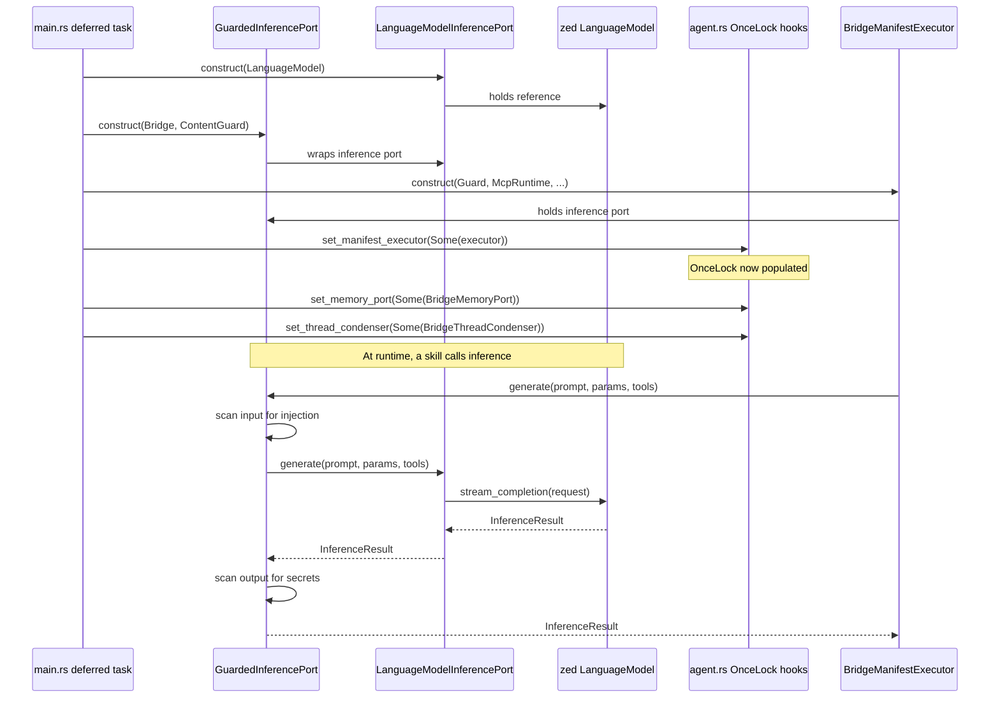

# hkask-types — Explanation

The port traits in `hkask-types` exist to solve a boundary problem. hKask is
compiled in-process inside zed-kask, but the kask crates must not depend on
zed's internal types. The port traits define the contract between the two
worlds: kask crates depend on abstractions, and `kask_bridge` provides the
adapters that implement those abstractions against zed's concrete types. This
is the hexagonal architecture pattern applied at the crate boundary.

## Source citations

| Symbol | Location |
|--------|----------|
| `InferencePort` trait | `kask/crates/hkask-types/src/ports/inference_port.rs:86` |
| `MemoryPort` trait | `kask/crates/hkask-types/src/ports/memory_port.rs:108` |
| `LanguageModelInferencePort` adapter | `kask/crates/kask_bridge/src/inference.rs:52` |
| `LanguageModelInferencePort` impl | `kask/crates/kask_bridge/src/inference.rs:281` |
| `BridgeMemoryPort` adapter | `kask/crates/kask_bridge/src/memory.rs:1615` |
| `BridgeMemoryPort` impl (zed side) | `kask/crates/kask_bridge/src/memory.rs:1625` |
| `GuardedInferencePort` | `kask/crates/hkask-guard/src/guarded_inference.rs:131` |
| `GuardedInferencePort` impl | `kask/crates/hkask-guard/src/guarded_inference.rs:168` |
| `BridgeManifestExecutor` | `kask/crates/kask_bridge/src/skill_executor.rs:30` |
| `McpRuntime` (implements `ToolPort`) | `kask/crates/hkask-mcp/src/runtime.rs:508` |
| `set_manifest_executor` hook | `crates/agent/src/agent.rs:2829` |
| `set_memory_port` hook | `crates/agent/src/agent.rs:2908` |
| `set_thread_condenser` hook | `crates/agent/src/agent.rs:3070` |
| Deferred-task wiring | `crates/zed/src/main.rs:1780` |

## Why port traits exist

The kask workspace compiles as a set of library crates. These crates need to
call LLM APIs, persist turns to memory, and invoke tools. If the kask crates
depended directly on zed's `LanguageModel` or `ThreadMemoryPort`, the kask
workspace would become unbuildable outside zed-kask, and every zed internal
change would break kask.

The port traits break this coupling. `InferencePort`
(`ports/inference_port.rs:86`) defines what an inference backend does:
generate completions from a prompt or message array. `MemoryPort`
(`ports/memory_port.rs:108`) defines what a memory backend does: ingest
turns and recall snippets. The kask crates depend on these traits. The
`kask_bridge` crate provides the concrete adapters that implement these
traits against zed's types.

This design follows the hexagonal architecture principle: core logic depends
on ports, infrastructure provides adapters, and the composition root wires
them together.[^cockburn]

## The composition root

The wiring happens in a deferred task in `crates/zed/src/main.rs`. The
deferred task runs after the zed user resolves and a default language model
becomes available. Before that point, the model-dependent hooks cannot be
wired because `LanguageModelRegistry::default_model()` returns `None`.

The sequence below shows how the port traits mediate between zed and kask
during the deferred-task wiring.

<!-- DIAGRAM_ALIGNMENT
id: DIAG-DIA-TYPES-002
verified_date: 2026-08-01
verified_against: kask/crates/kask_bridge/src/inference.rs:52,281; kask/crates/hkask-guard/src/guarded_inference.rs:131,168; kask/crates/kask_bridge/src/skill_executor.rs:30; crates/zed/src/main.rs:1780; crates/agent/src/agent.rs:2829
status: VERIFIED
-->

## The guard layer in the inference path

`GuardedInferencePort` (`hkask-guard/src/guarded_inference.rs:131`) wraps the
`LanguageModelInferencePort` adapter. It sits between the skill cascade and
zed's `LanguageModel`. Every inference call passes through the guard, which
scans the input for prompt injection and role override attempts before
forwarding, and scans the output for secret leakage before returning.

This placement is deliberate. The guard wraps the skill cascade path
(`ManifestExecutor`), not zed's direct chat path. Direct chat uses zed's own
`LanguageModel::stream_completion` with provider-side safety and a refusal
fallback. The `kask.guard.direct_chat_strategy` setting controls this; the
default is `cascade_only`, meaning the guard applies to skills but not to
direct chat.[^owasp-llm]

## The memory bridge

`BridgeMemoryPort` (`kask_bridge/src/memory.rs:1615`) adapts hKask's
`MemoryPort` trait to zed's `agent::ThreadMemoryPort` trait. The two traits
have different shapes: zed's trait is designed for the agent panel's thread
persistence, while hKask's trait is designed for episodic and semantic memory
consolidation.

The bridge translates between them. When a thread turn completes, the agent
calls `BridgeMemoryPort::ingest_turn`, which extracts the user prompt, agent
response, model, and title, then forwards them to the inner `MemoryPort`
(`RealMemoryPort`) via a background task. The full hKask memory stack
(SQLCipher, episodic and semantic consolidation, WebID mapping) lives behind
`RealMemoryPort`. When no DB path is configured, the memory port hook stays
`None` and the agent's thread ingest call site no-ops — there is no
`LoggingMemoryPort` placeholder.

## Why the wiring is deferred

The `set_manifest_executor`, `set_memory_port`, and `set_thread_condenser`
hooks use the `OnceLock` pattern (or `Mutex` for `set_memory_port`). They are
process-global and depend on `LanguageModelRegistry::default_model()` being
populated. At startup, before user authentication resolves, `default_model()`
returns `None`. Wiring these hooks synchronously at startup would leave them
unwired for the entire session when no model is configured at startup.

The deferred task in `main.rs` runs after the zed user resolves. It
constructs the `BridgeManifestExecutor` with the `GuardedInferencePort`, the
`McpRuntime` (which implements `ToolPort`), the A2A secret, and the registry
paths, then calls `agent::set_manifest_executor(Some(executor))` at
`main.rs:1780`. If the deferred task fails to find a model, the hooks remain
`None` and the `skill` tool returns a no-op envelope. This fail-closed
behavior is intentional: a missing model should not silently produce broken
skill output.

## See also

- [hkask-types Reference](./reference.md): class diagram of all 10 port
  traits and their implementors.
- [kask_bridge Explanation](../kask_bridge/explanation.md): the full D1–D10
  composition root wiring.
- [`kask/docs/architecture/zed-host-architecture-plan.md`](../../architecture/zed-host-architecture-plan.md):
  the D1–D10 integration seams.
- [`kask/docs/architecture/core/PRINCIPLES.md`](../../architecture/core/PRINCIPLES.md):
  P4 (OCAP boundaries) and P9 (feedback loops) that the guard layer enforces.

---

[^cockburn]: Cockburn, A. (2005). *Hexagonal Architecture.* <https://alistair.cockburn.us/hexagonal-architecture/>. The ports-and-adapters pattern: core logic depends on traits, infrastructure provides implementations, and the composition root wires them together.

[^owasp-llm]: OWASP Foundation. (2025). *OWASP Top 10 for LLM Applications.* <https://owasp.org/www-project-top-10-for-large-language-model-applications/>. LLM01 (Prompt Injection) and LLM06 (Sensitive Information Disclosure) define the threats that `GuardedInferencePort` mitigates.
