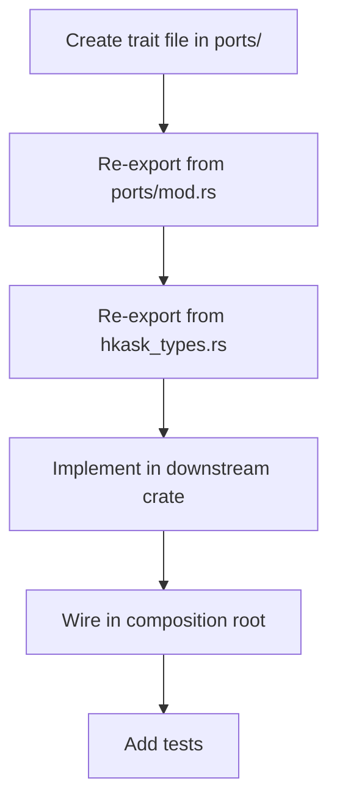

# hkask-types — How-to: Implement a New Port

This guide shows how to add a new port trait to `hkask-types` and implement
it in a downstream crate. The port trait pattern keeps kask decoupled from
its infrastructure backends.

## Source citations

| Symbol | Location |
|--------|----------|
| `InferencePort` trait (reference) | `kask/crates/hkask-types/src/ports/inference_port.rs:86` |
| `MemoryPort` trait (reference) | `kask/crates/hkask-types/src/ports/memory_port.rs:108` |
| `ports/mod.rs` (re-export pattern) | `kask/crates/hkask-types/src/ports/mod.rs` |
| `pub use ports::*` | `kask/crates/hkask-types/src/hkask_types.rs:71` |

## Procedure

<!-- DIAGRAM_ALIGNMENT
id: DIAG-DIA-TYPES-004
verified_date: 2026-08-01
verified_against: kask/crates/hkask-types/src/ports/inference_port.rs:86; kask/crates/hkask-types/src/ports/memory_port.rs:108; kask/crates/hkask-types/src/ports/mod.rs; kask/crates/hkask-types/src/hkask_types.rs:71
status: VERIFIED
-->

### Step 1: Create the trait file

Create `kask/crates/hkask-types/src/ports/<name>_port.rs`. Define a
`Send + Sync` trait. Use `Pin<Box<dyn Future + Send>>` for async return
types. Follow the pattern in `inference_port.rs:86`.

### Step 2: Re-export from ports/mod.rs

Add `pub mod <name>_port;` and `pub use <name>_port::*;` to
`kask/crates/hkask-types/src/ports/mod.rs`.

### Step 3: Re-export from crate root

The `pub use ports::*;` at `hkask_types.rs:71` automatically re-exports
the new trait. No change needed if you followed step 2.

### Step 4: Implement in a downstream crate

Create an adapter struct in `kask_bridge`, `hkask-storage`, or
`hkask-regulation` that implements the trait against a concrete backend.

### Step 5: Wire in the composition root

Construct the adapter in the deferred task in `main.rs` and pass it to the
consumer via a `set_*` hook or constructor parameter.

## See also

- [hkask-types Reference](./reference.md): class diagram of all 10 ports.
- [hkask-types Tutorial](./tutorial.md): understanding the port traits.
- [kask_bridge How-to](../kask_bridge/how-to.md): wiring a new kask hook.

---

[^cockburn]: Cockburn, A. (2005). *Hexagonal Architecture.* <https://alistair.cockburn.us/hexagonal-architecture/>. The ports-and-adapters pattern that this guide implements.
