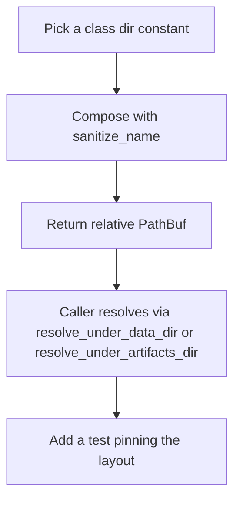
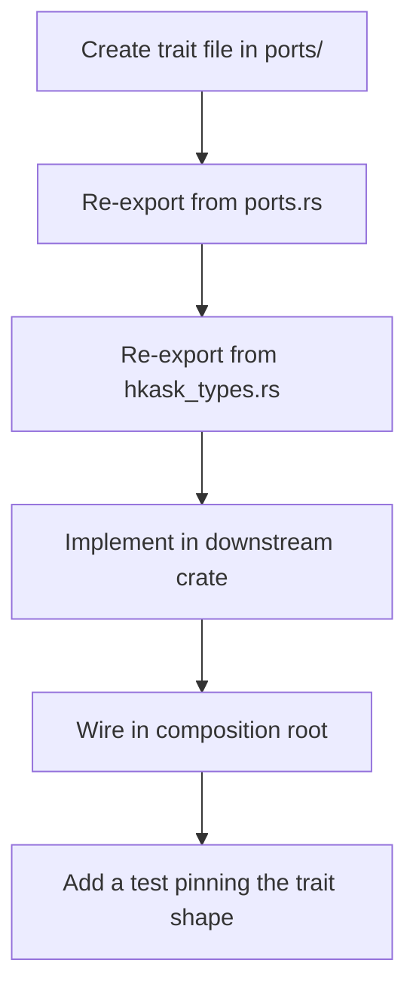

# hkask-types — How-to: Add a Path Helper or Port Trait

This guide shows how to extend `hkask-types` with a new filesystem path
helper or a new hexagonal port trait. Both flows keep kask decoupled from its
infrastructure backends and from zed's internal types.

## Source citations

| Symbol | Location |
|--------|----------|
| `AGENTS_DIR` (pub(crate)) / `MCP_DIR` / `SKILLS_DIR` / `DEFAULT_DB_PATH` constants | `kask/crates/hkask-types/src/agent_paths.rs:31,35,39,44` |
| `resolve_data_dir` (internal-data regulator) | `kask/crates/hkask-types/src/agent_paths.rs:63` |
| `resolve_under_data_dir` (delegates to regulator) | `kask/crates/hkask-types/src/agent_paths.rs:99` |
| `resolve_artifacts_dir` (user-artifacts regulator) | `kask/crates/hkask-types/src/agent_paths.rs:120` |
| `resolve_under_artifacts_dir` | `kask/crates/hkask-types/src/agent_paths.rs:152` |
| `agent_db` (renamed from `agent_pod_db`) | `kask/crates/hkask-types/src/agent_paths.rs:198` |
| `mcp_server_db` / `mcp_server_subdir` helpers | `kask/crates/hkask-types/src/agent_paths.rs:169,188` |
| `mcp_artifacts_subdir` (visible `{server}-mcp/{type}` route) | `kask/crates/hkask-types/src/agent_paths.rs:211` |
| `sanitize_name` (path-traversal guard) | `kask/crates/hkask-types/src/agent_paths.rs:209` |
| Layout-pinning tests | `kask/crates/hkask-types/src/agent_paths.rs:241-313` |
| `InferencePort` trait | `kask/crates/hkask-types/src/ports/inference_port.rs:147` |
| `MemoryPort` trait | `kask/crates/hkask-types/src/ports/memory_port.rs:111` |
| `ports.rs` re-export pattern | `kask/crates/hkask-types/src/ports.rs:13-24` |
| `pub use ports::*` crate-root re-export | `kask/crates/hkask-types/src/hkask_types.rs:60` |

## Procedure A: Add a path helper



<!-- DIAGRAM_ALIGNMENT
id: DIAG-TYPES-002
verified_date: 2026-08-28
verified_against: kask/crates/hkask-types/src/agent_paths.rs:157,167,182,198,209; kask/crates/hkask-types/src/agent_paths.rs:241-313
status: VERIFIED
-->

### Step A1: Pick the class directory and the root tree

Every persistent kask artifact lives under a class subdir of **one of the two
rooted trees** (`agent_paths.rs:12-26`): internal app data under
`resolve_data_dir()` (`agents/`, `mcp/`, `skills/`, `threads/`) or
user-facing artifacts under `resolve_artifacts_dir()`
(`{server}-mcp/{artifact-type}/` — companies reports/screens, portfolio
transactions, corpus cache, media generated). Reuse the existing
constants and helpers (`MCP_DIR` at `agent_paths.rs:35`, `SKILLS_DIR` at
`agent_paths.rs:39`; `mcp_server_db` / `mcp_server_subdir` for the hidden
tree, `mcp_artifacts_subdir` for the visible tree; `AGENTS_DIR` at
`agent_paths.rs:31` is `pub(crate)`) rather than introducing a new
top-level directory — a new class dir is an architecture decision, not a
helper addition.

### Step A2: Compose with sanitize_name

Every user-controlled segment of the path MUST pass through `sanitize_name`
(`agent_paths.rs:209`). This replaces filesystem-hostile characters with
hyphens, collapses consecutive dashes, trims leading/trailing dashes, and
substitutes `"unnamed"` for names that sanitize to `.` or `..`. Skipping
this step opens a path-traversal escape. Follow the shape of
`mcp_server_db` (`agent_paths.rs:167`):

```rust
pub fn mcp_server_db(server_id: &str, purpose: &str) -> PathBuf {
    PathBuf::from(MCP_DIR)
        .join(sanitize_name(server_id))
        .join(format!("{purpose}.db"))
}
```

### Step A3: Return a relative PathBuf

Path helpers return a *relative* path. The caller resolves it against the
appropriate root via `resolve_under_data_dir` (`agent_paths.rs:99`) or
`resolve_under_artifacts_dir` (`agent_paths.rs:152`), each of which delegates
to its single regulator so the env-var fallback chains cannot diverge. Do
not call `resolve_data_dir` or `resolve_artifacts_dir` inside the helper —
that splits responsibilities and re-introduces the F4 divergence the
single-regulator design was introduced to fix (the F4 history is recorded
at `agent_paths.rs:58-61,93-97`).

### Step A4: Add a test pinning the layout

Add a test in the `tests` module of `agent_paths.rs` (existing tests run from
`agent_paths.rs:241` onward). Assert the helper produces the expected
component count, lives under the right class dir, and sanitizes a hostile
name. The `mcp_server_db_follows_mcp_class_layout` test
(`agent_paths.rs:260-269`) and
`all_layout_helpers_resolve_under_one_root` (`agent_paths.rs:281-293`) are
the templates.

## Procedure B: Add a port trait



<!-- DIAGRAM_ALIGNMENT
id: DIAG-TYPES-003
verified_date: 2026-08-28
verified_against: kask/crates/hkask-types/src/ports.rs:7-24; kask/crates/hkask-types/src/ports/inference_port.rs:147,386; kask/crates/hkask-types/src/ports/memory_port.rs:111; kask/crates/hkask-types/src/hkask_types.rs:60
status: VERIFIED
-->

### Step B1: Create the trait file

Create `kask/crates/hkask-types/src/ports/<name>_port.rs`. Define a
`Send + Sync` trait. Use `Pin<Box<dyn Future + Send + 'a>>` for async return
types — do not use `async_trait`; the named-alias pattern
(`EmbedFuture` at `inference_port.rs:17`, `MediaFuture` at
`inference_port.rs:24`) keeps the trait object-safe without a macro
dependency and stays under clippy's `type_complexity` threshold.

### Step B2: Re-export from ports.rs

Add `pub mod <name>_port;` and a `pub use <name>_port::{...};` line to
`kask/crates/hkask-types/src/ports.rs`, following the existing cluster
re-exports at `ports.rs:13-24`.

### Step B3: Re-export from crate root

The `pub use ports::*;` at `hkask_types.rs:60` automatically re-exports the
new trait. If the trait has companion types used by ≥3 downstream crates,
add an explicit re-export in the "Essential re-exports" block
(`hkask_types.rs:40-58`) following the existing pattern.

### Step B4: Implement in a downstream crate

Create an adapter struct in `kask_bridge`, `hkask-storage`, or
`hkask-regulation` that implements the trait against a concrete backend. If
the trait is object-safe and callers will hold a shared handle, add a
blanket impl for `Arc<dyn Trait>` following the `InferencePort for
Arc<dyn InferencePort>` pattern at `inference_port.rs:386`.

### Step B5: Wire in the composition root

Construct the adapter in the deferred task in `main.rs` and pass it to the
consumer via a `set_*` hook or constructor parameter. Per the project rules,
a `OnceLock` hook must `log::warn!` on the `Err` branch of `set`; a `Mutex`
hook is re-settable and does not need it.

### Step B6: Add a test pinning the trait shape

Add a test in the new trait file asserting the trait is object-safe
(`fn assert_obj_safe(_: &dyn MyPort) {}`) and that the blanket `Arc` impl
delegates correctly. The `InferencePort for Arc<dyn InferencePort>` impl at
`inference_port.rs:386` is the reference shape.

## See also

- [hkask-types Reference](./reference.md): class diagram of every port and
  companion type.
- [hkask-types Tutorial](./tutorial.md): reading the foundation crate.
- [hkask-types Explanation](./explanation.md): why the foundation crate is
  structured this way.

---

[^cockburn]: Cockburn, A. (2005). *Hexagonal Architecture.* <https://alistair.cockburn.us/hexagonal-architecture/>. The ports-and-adapters pattern that this guide implements.
